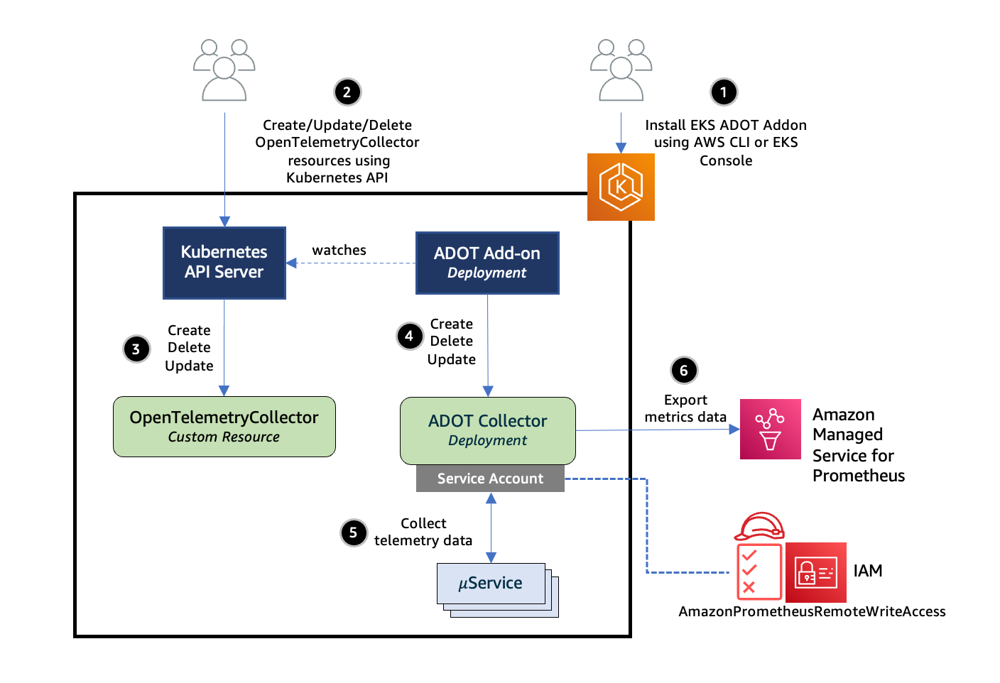
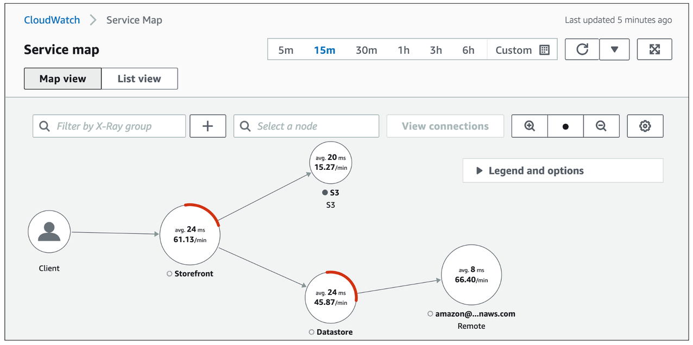

# Container Tracing with AWS X-Ray

In this section of Observability best practices guide, we will deep dive on to following topics related to Container Tracing with AWS X-Ray :

* Introduction to AWS X-Ray
* Traces collection using Amazon EKS add-ons for AWS Distro for OpenTelemetry
* Conclusion

### Introduction

[AWS X-Ray](https://docs.aws.amazon.com/xray/latest/devguide/aws-xray.html) is a service that collects data about requests that your application serves, and provides tools that you can use to view, filter, and gain insights into that data to identify issues and opportunities for optimization. For any traced request to your application, you can see detailed information not only about the request and response, but also about calls that your application makes to downstream AWS resources, microservices, databases, and web APIs.

Instrumenting your application involves sending trace data for incoming and outbound requests and other events within your application, along with metadata about each request. Many instrumentation scenarios require only configuration changes. For example, you can instrument all incoming HTTP requests and downstream calls to AWS services that your Java application makes. There are several SDKs, agents, and tools that can be used to instrument your application for X-Ray tracing. See [Instrumenting your application](https://docs.aws.amazon.com/xray/latest/devguide/xray-instrumenting-your-app.html) for more information.

We will learn about about containerized application tracing by collect traces from your Amazon EKS cluster using Amazon EKS add-ons for AWS Distro for OpenTelemetry. 

### Traces collection using Amazon EKS add-ons for AWS Distro for OpenTelemetry

[AWS X-Ray](https://aws.amazon.com/xray/) provides application-tracing functionality, giving deep insights into all microservices deployed. With X-Ray, every request can be traced as it flows through the involved microservices. This provides your DevOps teams the insights they need to understand how your services interact with their peers and enables them to analyze and debug issues much faster.

[AWS Distro for OpenTelemetry (ADOT)](https://aws-otel.github.io/docs/introduction) is a secure, AWS-supported distribution of the OpenTelemetry project. Users can instrument their applications just once and, using ADOT, send correlated metrics and traces to multiple monitoring solutions. Amazon EKS now allows users to enable ADOT as an add-on at any time after the cluster is up and running. The ADOT add-on includes the latest security patches and bug fixes and is validated by AWS to work with Amazon EKS.

The ADOT add-on is an implementation of a Kubernetes Operator, which is a software extension to Kubernetes that makes use of custom resources to manage applications and their components. The add-on watches for a custom resource named OpenTelemetryCollector and manages the lifecycle of an ADOT Collector based on the configuration settings specified in the custom resource.

The ADOT Collector has the concept of a pipeline that comprises three key types of components, namely, receiver, processor, and exporter. A [receiver](https://opentelemetry.io/docs/collector/configuration/#receivers) is how data gets into the collector. It accepts data in a specific format, translates it into the internal format, and passes it to [processors](https://opentelemetry.io/docs/collector/configuration/#processors) and [exporters](https://opentelemetry.io/docs/collector/configuration/#exporters) defined in the pipeline. It can be pull- or push-based. A processor is an optional component that is used to perform tasks such as batching, filtering, and transformations on data between being received and being exported. An exporter is used to determine which destination to send the metrics, logs, or traces to. The collector architecture allows multiple instances of such pipelines to be set up via a Kubernetes YAML manifest.

The following diagram illustrates an ADOT Collector configured with a traces pipeline, which sends telemetry data to AWS X-Ray. The traces pipeline comprises an instance of [AWS X-Ray Receiver](https://github.com/open-telemetry/opentelemetry-collector-contrib/tree/main/receiver/awsxrayreceiver) and [AWS X-Ray Exporter](https://github.com/open-telemetry/opentelemetry-collector-contrib/tree/main/exporter/awsxrayexporter) and sends traces to AWS X-Ray. 


*Figure: Traces collection using Amazon EKS add-ons for AWS Distro for OpenTelemetry.*

Let’s delve into the details of installing the ADOT add-on in an EKS cluster and then collect telemetry data from workloads. The following is a list of prerequisites needed before we can install the ADOT add-on.

* An EKS cluster supporting Kubernetes version 1.19 or higher. You may create the EKS cluster using one of the [approaches outlined here](https://docs.aws.amazon.com/eks/latest/userguide/create-cluster.html).
* [Certificate Manager](https://cert-manager.io/), if not already installed in the cluster. It can be installed with the default configuration as per [this documentation](https://cert-manager.io/docs/installation/).
* Kubernetes RBAC permissions specifically for EKS add-ons to install the ADOT add-on in your cluster. This can be done by applying the [settings in this YAML](https://amazon-eks.s3.amazonaws.com/docs/addons-otel-permissions.yaml) file to the cluster using a CLI tool such as kubectl.

You can check the list of add-ons enabled for different versions of EKS using the following command:

`aws eks describe-addon-versions`

The JSON output should list the ADOT add-on among others, as shown below. Note that when an EKS cluster is created, EKS add-ons does not install any add-ons on it.


```
{
   "addonName":"adot",
   "type":"observability",
   "addonVersions":[
      {
         "addonVersion":"v0.45.0-eksbuild.1",
         "architecture":[
            "amd64"
         ],
         "compatibilities":[
            {
               "clusterVersion":"1.22",
               "platformVersions":[
                  "*"
               ],
               "defaultVersion":true
            },
            {
               "clusterVersion":"1.21",
               "platformVersions":[
                  "*"
               ],
               "defaultVersion":true
            },
            {
               "clusterVersion":"1.20",
               "platformVersions":[
                  "*"
               ],
               "defaultVersion":true
            },
            {
               "clusterVersion":"1.19",
               "platformVersions":[
                  "*"
               ],
               "defaultVersion":true
            }
         ]
      }
   ]
}
```

Next, you can install the ADOT add-on with the following command :

`aws eks create-addon --addon-name adot --addon-version v0.45.0-eksbuild.1 --cluster-name $CLUSTER_NAME `

The version string must match the value of *addonVersion* field in the previously shown output. The output from a successful execution of this command looks as follows:

```
{
    "addon": {
        "addonName": "adot",
        "clusterName": "k8s-production-cluster",
        "status": "ACTIVE",
        "addonVersion": "v0.45.0-eksbuild.1",
        "health": {
            "issues": []
        },
        "addonArn": "arn:aws:eks:us-east-1:123456789000:addon/k8s-production-cluster/adot/f0bff97c-0647-ef6f-eecf-0b2a13f7491b",
        "createdAt": "2022-04-04T10:36:56.966000+05:30",
        "modifiedAt": "2022-04-04T10:38:09.142000+05:30",
        "tags": {}
    }
}
```

Wait until the add-on is in ACTIVE status before proceeding to the next step. The status of the add-on can be checked using the following command ;

`aws eks describe-addon --addon-name adot --cluster-name $CLUSTER_NAME`

#### Deploying the ADOT Collector

The ADOT add-on is an implementation of a Kubernetes Operator, which is a software extension to Kubernetes that makes use of custom resources to manage applications and their components. The add-on watches for a custom resource named OpenTelemetryCollector and manages the lifecycle of an ADOT Collector based on the configuration settings specified in the custom resource. The following figure shows an illustration of how this works.



*Figure: Deploying the ADOT Collector.*

Next, let’s take a look at how to deploy an ADOT Collector. The [YAML configuration file here](https://github.com/aws-observability/aws-o11y-recipes/blob/main/sandbox/eks-addon-adot/otel-collector-xray-prometheus-complete.yaml) defines an OpenTelemetryCollector custom resource. When deployed to an EKS cluster, this will trigger the ADOT add-on to provision an ADOT Collector that includes a traces and metrics pipelines with components, as shown in the first illustration above. The collector is launched into the `aws-otel-eks` namespace as a Kubernetes Deployment with the name `${custom-resource-name}-collector`. A ClusterIP service with the same name is launched as well. Let’s look into the individual components that make up the pipelines of this collector.

The AWS X-Ray Receiver in the traces pipeline accepts segments or spans in [X-Ray Segment format](https://docs.aws.amazon.com/xray/latest/devguide/xray-api-segmentdocuments.html), which enables it to process segments sent by microservices instrumented with X-Ray SDK. It is configured to listen for traffic on UDP port 2000 and is exposed as a Cluster IP service. Per this configuration, workloads that want to send trace data to this receiver should be configured with the environment variable `AWS_XRAY_DAEMON_ADDRESS` set to `observability-collector.aws-otel-eks:2000`. The exporter sends these segments directly to X-Ray using the [PutTraceSegments](https://docs.aws.amazon.com/xray/latest/api/API_PutTraceSegments.html) API.

ADOT Collector is configured to be launched under the identity of a Kubernetes service account named `aws-otel-collector`, which is granted these permissions using a ClusterRoleBinding and ClusterRole, also shown in the [configuration](https://github.com/aws-observability/aws-o11y-recipes/blob/main/sandbox/eks-addon-adot/otel-collector-xray-prometheus-complete.yaml). The exporters need IAM permissions to send data to X-Ray. This is done by associating the service account with an IAM role using the [IAM roles for service accounts](https://docs.aws.amazon.com/eks/latest/userguide/iam-roles-for-service-accounts.html) feature supported by EKS. The IAM role should be associated with the AWS-managed policies such as AWSXRayDaemonWriteAccess. The [helper script here](https://github.com/aws-observability/aws-o11y-recipes/blob/main/sandbox/eks-addon-adot/adot-irsa.sh) may be used, after setting the CLUSTER_NAME and REGION variables, to create an IAM role named `EKS-ADOT-ServiceAccount-Role` that is granted these permissions and is associated with the `aws-otel-collector` service account.

#### End-to-end test of traces collection

Let’s now put all this together and test traces collection from workloads deployed to an EKS cluster. The following illustration shows the setup employed for this test. It comprises a front-end service that exposes a set of REST APIs and interacts with S3 as well as a datastore service that, in turn, interacts with an instance of Aurora PostgreSQL database. The services are instrumented with X-Ray SDK. ADOT Collector is launched in Deployment mode by deploying an OpenTelemetryCollector custom resource using the YAML manifest that was discussed in the last section. Postman client is used as an external traffic generator, targeting the front-end service.


*Figure: End-to-end test of traces collection.*

The following image shows the service graph generated by X-Ray using the segment data captured from the services, with the average response latency for each segment.



Figure: CloudWatch Service Map console.*

Please check on [Traces pipeline with OTLP Receiver and AWS X-Ray Exporter sending traces to AWS X-Ray](https://github.com/aws-observability/aws-otel-community/blob/master/sample-configs/operator/collector-config-xray.yaml) for OpenTelemetryCollector custom resource definitions that pertain to traces pipeline configurations. Customers who want to use ADOT Collector in conjunction with AWS X-Ray may start with these configuration templates, replace the placeholder variables with values based on their target environments and quickly deploy the collector to their Amazon EKS clusters using EKS add-on for ADOT.


### Using EKS Blueprints to setup container tracing with AWS X-Ray

[EKS Blueprints](https://aws.amazon.com/blogs/containers/bootstrapping-clusters-with-eks-blueprints/) is a collection of Infrastructure as Code (IaC) modules that will help you configure and deploy consistent, batteries-included EKS clusters across accounts and regions. You can use EKS Blueprints to easily bootstrap an EKS cluster with [Amazon EKS add-ons](https://docs.aws.amazon.com/eks/latest/userguide/eks-add-ons.html) as well as a wide range of popular open-source add-ons, including Prometheus, Karpenter, Nginx, Traefik, AWS Load Balancer Controller, Container Insights, Fluent Bit, Keda, Argo CD, and more. EKS Blueprints is implemented in two popular IaC frameworks, [HashiCorp Terraform](https://github.com/aws-ia/terraform-aws-eks-blueprints) and [AWS Cloud Development Kit (AWS CDK)](https://github.com/aws-quickstart/cdk-eks-blueprints), which help you automate infrastructure deployments. 

As part of your Amazon EKS Cluster creation process using EKS Blueprints, you can setup AWS X-Ray as a Day 2 operational tooling to collect, aggregate, and summarize metrics and logs from containerized applications and micro-services to Amazon CloudWatch console.

## Conclusion

In this section of Observability best practices guide, we learned about using AWS X-Ray for container tracing your applications on Amazon EKS by traces collection using Amazon EKS add-ons for AWS Distro for OpenTelemetry. For further learning, please check on [Metrics and traces collection using Amazon EKS add-ons for AWS Distro for OpenTelemetry to Amazon Managed Service for Prometheus and Amazon CloudWatch.](https://aws.amazon.com/blogs/containers/metrics-and-traces-collection-using-amazon-eks-add-ons-for-aws-distro-for-opentelemetry/) Finally we talked in brief about how use EKS Blueprints as a vehicle to setup Container tracing using AWS X-Ray during the Amazon EKS cluster creation process. For further deep dive, we would highly recommend you to practice X-Ray Traces module under **** AWS native Observability category of AWS [One Observability Workshop](https://catalog.workshops.aws/observability/en-US).
