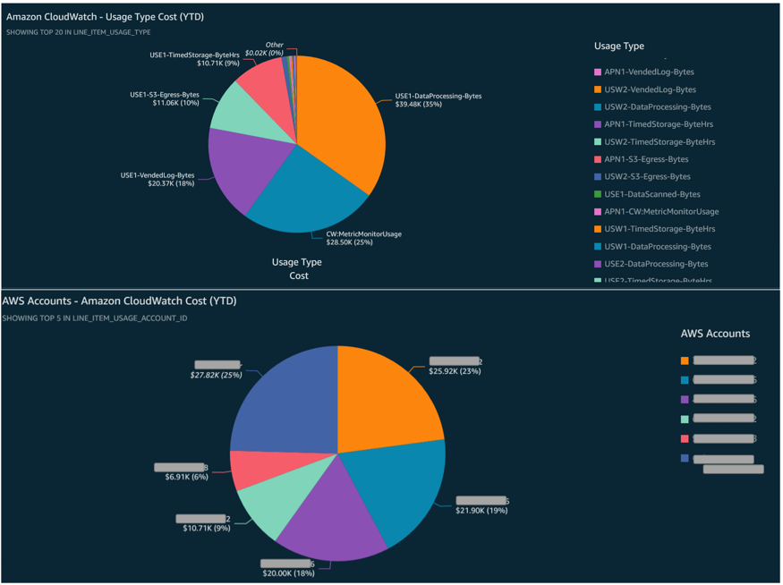

# Amazon CloudWatch

Amazon CloudWatch cost and usage visuals will allow you to gain insights into cost of individual AWS Accounts, AWS Regions, and all CloudWatch operations like GetMetricData, PutLogEvents, GetMetricStream, ListMetrics, MetricStorage, HourlyStorageMetering, and ListMetrics to name a few!  
  
To visualize and analyze the CloudWatch cost and usage data, you need to create a custom Athena view. An Amazon Athena [view][view] is a logical table and it creates a subset of columns from the original CUR table to simplify the querying of data.

1.	Before proceeding, make sure that you’ve created the CUR (step #1) and deployed the AWS Conformation Template (step #2) mentioned in the [Implementation overview][cid-implement].

2.	Now, Create a new Amazon Athena [view][view] by using the following query. This query fetches cost and usage of Amazon CloudWatch across all the AWS Accounts in your Organization.

        CREATE OR REPLACE VIEW "cloudwatch_cost" AS 
        SELECT
        line_item_usage_type
        , line_item_resource_id
        , line_item_operation
        , line_item_usage_account_id
        , month
        , year
        , "sum"(line_item_usage_amount) "Usage"
        , "sum"(line_item_unblended_cost) cost
        FROM
        database.tablename #replace database.tablename with your database and table name
        WHERE ("line_item_product_code" = 'AmazonCloudWatch')
        GROUP BY 1, 2, 3, 4, 5, 6

### Create Amazon QuickSight dashboard

Now, let’s create a QuickSight dashboard to visualize the cost and usage of Amazon CloudWatch.  

1.	On AWS Management Console, navigate to QuickSight service and then select your AWS Region from top right corner. Note that QuickSight Dataset should be in the same AWS Region as that of Amazon Athena table.
2.	Make sure that QuickSight can [access][access] Amazon S3 and AWS Athena.
3.	[Create QuickSight Dataset][create-dataset] by selecting the data-source as the Amazon Athena view that you created before. Use this procedure to [schedule refreshing][schedule-refresh] the Dataset on a daily basis.
4.	Create QuickSight [Analysis][analysis].
5.	Create QuickSight [Visuals][visuals] to meet your needs. 
6.	[Format][format] the Visual to meet your needs. 
7.	Now, you can [publish][publish] your dashboard from the Analysis.
8.	You can send the dashboard in [report][report] format to individuals or groups, either once or on a schedule.

The following **QuickSight dashboard** shows Amazon CloudWatch cost and usage across all AWS Accounts in your AWS Organizations along with CloudWatch operations like GetMetricData, PutLogEvents, GetMetricStream, ListMetrics, MetricStorage, HourlyStorageMetering, and ListMetrics to name a few.

With the preceding dashboard, you can now identify the cost of Amazon CloudWatch in the AWS accounts across your Organization. You can use other QuickSight [visual types][types] to build different dashboards to suit your requirements.

[view]: https://athena-in-action.workshop.aws/30-basics/303-create-view.html
[access]: https://docs.aws.amazon.com/quicksight/latest/user/accessing-data-sources.html
[create-dataset]: https://docs.aws.amazon.com/quicksight/latest/user/create-a-data-set-athena.html
[schedule-refresh]: https://docs.aws.amazon.com/quicksight/latest/user/refreshing-imported-data.html
[analysis]: https://docs.aws.amazon.com/quicksight/latest/user/creating-an-analysis.html
[visuals]: https://docs.aws.amazon.com/quicksight/latest/user/creating-a-visual.html
[format]: https://docs.aws.amazon.com/quicksight/latest/user/formatting-a-visual.html
[publish]: https://docs.aws.amazon.com/quicksight/latest/user/creating-a-dashboard.html
[report]: https://docs.aws.amazon.com/quicksight/latest/user/sending-reports.html
[types]: https://docs.aws.amazon.com/quicksight/latest/user/working-with-visual-types.html
[cid-implement]: http://127.0.0.1:8000/observability-best-practices/guides/cost-optimization/cost/#cloud-intelligence-dashboards