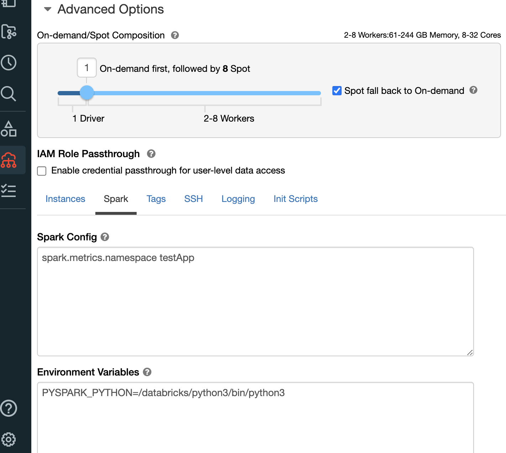

# Databricks Monitoring and Observability Best Practices in AWS

Databricks is a platform for managing data analytics and AI/ML workloads. This guide aim at supporting customers running [Databricks on AWS](https://aws.amazon.com/solutions/partners/databricks/) with monitoring these workloads using AWS Native services for observability or OpenSource Managed Services.

## Why monitor Databricks

Operation teams managing Databricks clusters benefit from having an integrated, customized dashboard to track workload status, errors, performance bottlenecks; alerting on unwanted behaviour, such as total resource usage over time, or percentual amount of errors; and centralized logging, for root cause analysis, as well as extracting additional customized metrics.

## What to monitor

Databricks run Apache Spark in its cluster instances, which has native features to expose metrics. These metrics will give information regarding drivers, workers, and the workloads being executed in the cluster.

The instances running Spark will have additional useful information about storage, CPU, memory, and networking. It´s important to understand what external factors could be affecting the performance of a Databricks cluster. In the case of clusters with numerous instances, understanding bottlenecks and general health is important as well.

## How to monitor

To install collectors and it's dependencies, Databricks init scripts will be needed. These are scripts that are runned in each instance of a Databricks cluster at boot time.

Databricks cluster permissions will also need permission to send metrics and logs using instance profiles.

Finally, it's a best practice to configure metrics namespace in Databricks cluster Spark configuration, replacing `testApp` with a proper reference to the cluster.


*Figure 1: example of metrics namespace Spark configuration*

## AWS Native

Check out the following recipe:
- [How to Monitor Databricks with Amazon CloudWatch](https://aws.amazon.com/blogs/mt/how-to-monitor-databricks-with-amazon-cloudwatch/)

## Open Source Software

Before start configuring Databricks, Amazon Managed Services for Prometheus (AMP) workspace and Amazon Managed Grafana (AMG) workspace should be provisioned, with the AMP datasource configured in AMG

- [Create AMP workspace]()
- [Create AMG workspace]()
- [Configure AMP datasource]()

Enable native Spark support for Prometheus. Note that it is available only from Spark 3.0. To do that, you need to add the following configuration to Spark via Databricks cluster Advanced Configurations:

```
spark.ui.prometheus.enabled true
```

Create an S3 bucket to store the init script that will install AWS Distro for OpenTelemetry (ADOT) Collector and it's dependencies.

Create an IAM Role granting permission for Databricks cluster instances to remote write metrics into AMP, and read access to the init script's S3 bucket. Configure this role's instance profile first in Databricks workspace, then into the Databricks cluster.

- [Create IAM role]()
- [Grant read access into S3 bucket]()
- 
- 

Create a configuration for ADOT and upload it to the S3 bucket. Here follows an example:

```yaml
receivers:
  prometheus:
    config:
      global:
        scrape_interval: 1m
        scrape_timeout: 10s

      scrape_configs:
      - job_name: databricks_prometheus_executors
        metrics_path: /metrics/executors/prometheus/
        sample_limit: 10000
        static_configs:
        - targets:
          - ${env:SPARK_LOCAL_IP:40001}
      - job_name: databricks_prometheus_applications
        metrics_path: /metrics/applications/prometheus/
        sample_limit: 10000
        static_configs:
        - targets:
          - ${env:SPARK_LOCAL_IP:40000}
      - job_name: databricks_prometheus_master
        metrics_path: /metrics/master/prometheus/
        sample_limit: 10000
        static_configs:
        - targets:
          - ${env:SPARK_LOCAL_IP:40000}
      - job_name: databricks_prometheus
        metrics_path: /metrics/prometheus/
        sample_limit: 10000
        static_configs:
        - targets:
          - ${env:SPARK_LOCAL_IP:40000}
          - ${env:SPARK_LOCAL_IP:40001}
      - job_name: databricks_node
        sample_limit: 10000
        static_configs:
        - targets:
          - ${env:SPARK_LOCAL_IP:9100}

extensions:
  sigv4auth:
    service: "aps"
    region: "${env:AMP_REGION}"

exporters:
  prometheusremotewrite:
    endpoint: "${env:AMP_REMOTE_WRITE_ENDPOINT}"
    auth:
      authenticator: sigv4auth

processors:
  metricstransform/databricks:
    transforms:
      - include: .*
        match_type: regexp
        action: update
        operations:
        - action: add_label
          new_label: databricks_cluster_id
          new_value: "${env:DB_CLUSTER_ID}"
        - action: add_label
          new_label: databricks_cluster_name
          new_value: "${env:DB_CLUSTER_NAME}"
        - action: add_label
          new_label: databricks_driver
          new_value: "${env:DB_IS_DRIVER}"
  metricstransform/databricksdriver:
    transforms:
      - include: ^metrics_app_([0-9]+_[0-9]+)_driver_(.*)$$
        match_type: regexp
        action: update
        new_name: $${2}
      - include: ^metrics_local_([0-9]+)_driver_(.*)$$
        match_type: regexp
        action: update
        new_name: $${2}

service:
  pipelines:
    metrics:
      receivers: [prometheus]
      processors: [metricstransform/databricks, metricstransform/databricksdriver]
      exporters: [prometheusremotewrite]

  extensions: [sigv4auth]

```

Create an init script to install ADOT and it's dependencies, and add some additional configurations to Spark monitoring.