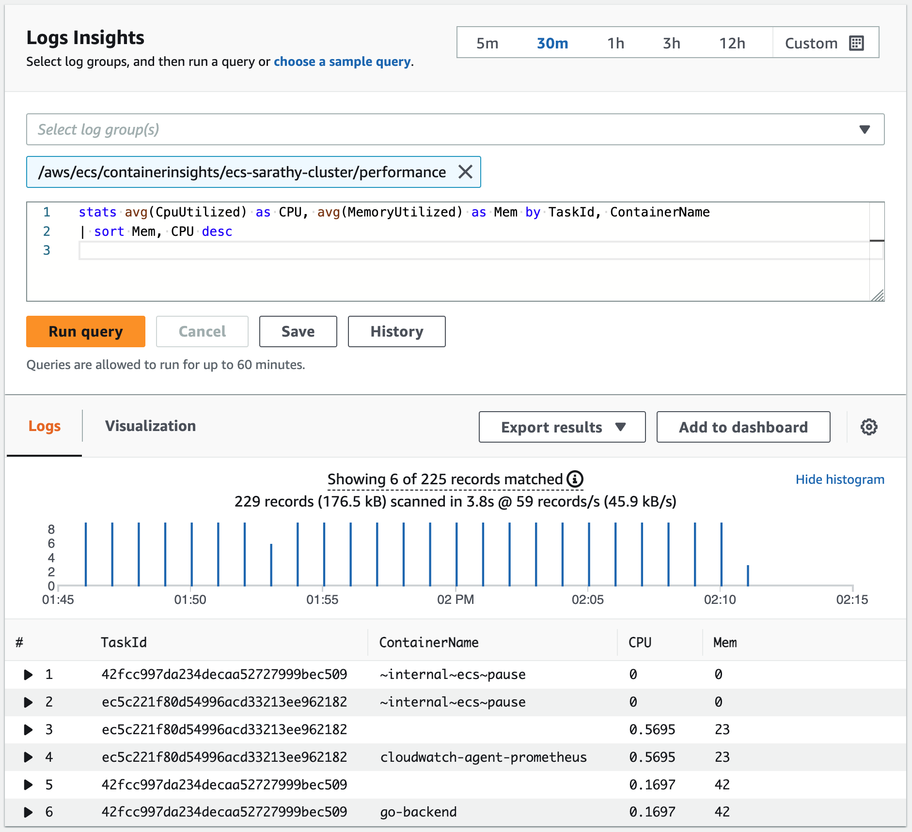

# Container Insights を使用したシステムメトリクスの収集

システムメトリクスは、サーバー上の物理コンポーネントである CPU、メモリ、ディスク、ネットワークインターフェイスなどの低レベルリソースに関するものです。
[CloudWatch Container Insights](https://docs.aws.amazon.com/AmazonCloudWatch/latest/monitoring/ContainerInsights.html) を使用して、Amazon ECS にデプロイされたコンテナ化されたアプリケーションからシステムメトリクスを収集、集約、要約できます。Container Insights は、コンテナの再起動失敗などの診断情報も提供し、問題を隔離して迅速に解決するのに役立ちます。これは、EC2 と Fargate 上にデプロイされた Amazon ECS クラスターで利用できます。

Container Insights は、[埋め込みメトリックフォーマット](https://docs.aws.amazon.com/AmazonCloudWatch/latest/monitoring/CloudWatch_Embedded_Metric_Format.html)を使用してパフォーマンスログイベントとしてデータを収集します。これらのパフォーマンスログイベントは、高基数データを大規模に取り込み保存できるように構造化された JSON スキーマを使用したエントリです。このデータから、CloudWatch は CloudWatch メトリクスとして、クラスター、ノード、サービス、タスクレベルで集計メトリクスを作成します。

!!! note
	Container Insights のメトリクスを CloudWatch に表示するには、Amazon ECS クラスターで Container Insights を有効にする必要があります。これは、アカウントレベルまたは個々のクラスターレベルで実行できます。アカウントレベルで有効にするには、次の AWS CLI コマンドを使用します: 

    ```
    aws ecs put-account-setting --name "containerInsights" --value "enabled
    ```

    個々のクラスターレベルで有効にするには、次の AWS CLI コマンドを使用します:

    ```
    aws ecs update-cluster-settings --cluster $CLUSTER_NAME --settings name=containerInsights,value=enabled
    ```

## クラスターレベルとサービスレベルのメトリクスの収集

デフォルトでは、Container Insights はタスク、サービス、クラスタの各レベルでメトリクスを収集します。
Amazon ECS エージェントは、EC2 コンテナインスタンス上の各タスク (EC2 上の ECS と Fargate 上の ECS の両方) のこれらのメトリクスを収集し、パフォーマンスログイベントとして CloudWatch に送信します。
クラスタにエージェントをデプロイする必要はありません。 
これらのメトリクスが抽出されるイベントログは、*/aws/ecs/containerinsights/$CLUSTER_NAME/performance* という名前の CloudWatch ロググループで収集されます。 
これらのイベントから抽出されるメトリクスの完全なリストは[ここで文書化されています](https://docs.aws.amazon.com/AmazonCloudWatch/latest/monitoring/Container-Insights-metrics-ECS.html)。
Container Insights が収集するメトリクスは、CloudWatch コンソールのナビゲーションページから *Container Insights* を選択し、ドロップダウンリストから *performance monitoring* を選択することで、CloudWatch コンソールで利用できる事前構築されたダッシュボードで簡単に表示できます。
また、CloudWatch コンソールの *Metrics* セクションでも表示できます。


!!! note
    Amazon EC2 インスタンス上で Amazon ECS を使用していて、Container Insights からネットワークとストレージのメトリクスを収集したい場合は、Amazon ECS エージェントバージョン 1.29 を含む AMI を使用してそのインスタンスを起動してください。
    
!!! warning
    Container Insights によって収集されたメトリクスは、カスタムメトリクスとして課金されます。CloudWatch の料金について詳しくは、[Amazon CloudWatch 料金](https://aws.amazon.com/cloudwatch/pricing/) を参照してください。

## インスタンスレベルのメトリクスの収集

CloudWatch エージェントを EC2 でホストされている Amazon ECS クラスターにデプロイすることで、クラスターからインスタンスレベルのメトリクスを収集できます。エージェントはデーモンサービスとしてデプロイされ、クラスター内の各 EC2 コンテナインスタンスからインスタンスレベルのメトリクスをパフォーマンスログイベントとして送信します。これらのイベントから抽出されるインスタンスレベルのメトリクスの完全なリストは[こちらで文書化されています](https://docs.aws.amazon.com/AmazonCloudWatch/latest/monitoring/Container-Insights-metrics-ECS.html)。

!!! info
    Amazon ECS クラスターに CloudWatch エージェントをデプロイしてインスタンスレベルのメトリクスを収集する手順は、[Amazon CloudWatch ユーザーガイド](https://docs.aws.amazon.com/AmazonCloudWatch/latest/monitoring/deploy-container-insights-ECS-instancelevel.html)に文書化されています。Fargate でホストされている Amazon ECS クラスターでは、このオプションは利用できないことに注意してください。

## ログインサイトを使用したパフォーマンスログイベントの分析

Container Insights は、埋め込みメトリック形式のパフォーマンスログイベントを使用してメトリクスを収集します。各ログイベントには、CPU やメモリなどのシステムリソース、タスクやサービスなどの ECS リソースで観測されたパフォーマンスデータが含まれている場合があります。Container Insights がクラスター、サービス、タスク、コンテナのレベルで Amazon ECS から収集するパフォーマンスログイベントの例は[こちらにリストされています](https://docs.aws.amazon.com/AmazonCloudWatch/latest/monitoring/Container-Insights-reference-performance-logs-ECS.html)。CloudWatch は、これらのログイベントのパフォーマンスデータの一部に基づいてのみメトリクスを生成します。しかし、これらのログイベントを使用して、CloudWatch Logs Insights クエリを使用したパフォーマンスデータのより深い分析を実行できます。

Logs Insights クエリを実行するためのユーザーインターフェースは、ナビゲーションページから *Logs Insights* を選択することで CloudWatch コンソールで利用できます。ロググループを選択すると、CloudWatch Logs Insights はそのロググループ内のパフォーマンスログイベントのフィールドを自動的に検出し、右側のパネルの *Discovered* フィールドに表示します。クエリの実行結果は、このロググループ内の時系列に沿ったログイベントの棒グラフとして表示されます。この棒グラフは、クエリと時間範囲に一致するロググループ内のイベントの分布を示しています。



!!! info
    コンテナレベルの CPU およびメモリ使用率メトリクスを表示するサンプル Logs Insights クエリを次に示します。
    
    ```
    stats avg(CpuUtilized) as CPU, avg(MemoryUtilized) as Mem by TaskId, ContainerName | sort Mem, CPU desc
    ```
