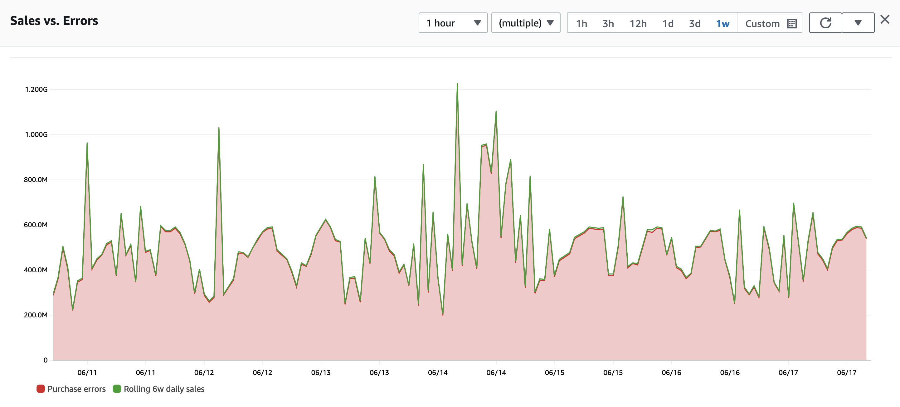

# ベストプラクティスの概要

オブザーバビリティは、成熟したツールランドスケープを持つ広範なトピックです。ただし、すべてのツールがすべてのソリューションに適しているわけではありません。オブザーバビリティの要件、構成、最終的なデプロイを円滑に進めるために、オブザーバビリティ戦略の意思決定プロセスに影響を与える 5 つの主要なベストプラクティスを要約しました。

## 重要なものを監視する

オブザーバビリティで最も重要なのは、サーバー、ネットワーク、アプリケーション、顧客ではありません。重要なのは、あなた、あなたのビジネス、プロジェクト、ユーザーにとって何が重要かです。

まず最初に、成功基準が何かを特定します。例えば、eコマースアプリケーションを運用している場合、成功の尺度は過去1時間の購入数です。非営利団体の場合、月間の目標に対する寄付金がそれにあたります。決済処理会社は取引処理時間を監視したい一方、大学は学生の出席を測定したいと考えるでしょう。 

!!! tip
	成功の指標は誰にとっても異なります! ここでは e コマースアプリケーションを例に説明していますが、プロジェクトによっては非常に異なる測定が行われる場合があります。しかし、アドバイスの本質は同じです。「良い」状態がどういう状態かを知り、それを測定することです。

アプリケーションの種類に関係なく、重要なメトリクスを特定する必要があります。次に、*Working Backwards*[^1] の考え方で、アプリケーションやインフラストラクチャの観点からそのメトリクスに影響を与える要因を特定します。 例えば、Web サーバーの高い CPU 使用率が顧客満足度を損ない、ひいては売上に影響する場合、CPU 使用率を監視することが重要です。

#### 目標を知り、それを測定しましょう!

重要なトップレベルの KPI を特定したら、次の仕事はそれらを追跡し測定する自動化された方法を用意することです。重要な成功要因は、ワークロードの運用を監視するのと同じシステムで行うことです。Eコマースのワークロードの例で言えば、次のことを意味します。

* 売上データを[*時系列*](https://en.wikipedia.org/wiki/Time_series)として公開する
* この同じシステムでユーザー登録を追跡する
* 顧客が Web ページにどのくらいの時間滞在するかを測定し、(再び)このデータを時系列にプッシュする

ほとんどのお客様はこのデータをすでに持っていますが、オブザーバビリティの観点から見ると必ずしも適切な場所にはありません。売上データやユーザー登録は通常、リレーショナルデータベースやビジネスインテリジェンスのレポーティングシステムに見つかります。また、訪問期間のデータはログや [リアルユーザーモニタリング](../tools/rum)から抽出できます。

メトリックデータの元の場所やフォーマットが何であれ、[*時系列*](https://en.wikipedia.org/wiki/Time_series)として維持されている必要があります。ビジネス、個人、学術、その他の目的のために最も重要なすべての主要メトリックは、他のオブザーバビリティデータ(時には*シグナル* または *テレメトリ* と呼ばれる)と相関付けるために、時系列フォーマットでなければなりません。

*図1: 時系列の例*

## コンテキストの伝播とツールの選択

ツールの選択は重要であり、運用と問題の修復の方法に深刻な影響を与えます。 しかし、サブオプティマルなツールを選択することよりもっと悪いのは、すべての基本的なシグナルタイプのツール化です。 たとえば、ワークロードから基本的な [ログ](../signals/logs) を収集するが、トランザクショントレースが欠落していると、ギャップが生じます。 その結果、アプリケーション全体の経験の断片的なビューになります。 すべての最新のオブザーバビリティのアプローチは、アプリケーショントレースで「点と点をつなぐ」ことに依存しています。

健全性と運用の完全な画像には、 [ログ](../signals/logs) 、 [メトリクス](../signals/metrics) 、 [トレース](../signals/traces) を収集し、相関、分析、[異常検出](../signals/anomalies) 、 [ダッシュボード](../tools/dashboards)、 [アラーム](../tools/alarms) などを実行するツールが必要です。

!!! info
	一部のオブザーバビリティソリューションには上記のものがすべて含まれているとは限りませんが、既存のシステムを拡張、拡張、または付加価値を与えることを目的としています。 すべてのケースで、ツールの相互運用性と拡張性は、オブザーバビリティプロジェクトを開始する際の重要な考慮事項です。

#### すべてのワークロードは異なりますが、共通のツールを使用することで結果をより速く得られます

すべてのワークロードで共通のツールセットを使用することには、運用の摩擦とトレーニングを削減するなどのメリットがあり、一般にツールやベンダーの数を減らすことを目指すべきです。これにより、既存の可観測性ソリューションを新しい環境やワークロードに迅速に展開でき、問題が発生したときの時間を解決まで短縮できます。

ツールは、基本的なインフラ、アプリケーション、Web サイト、その間のすべてのワークロードのすべてのティアを観察できるほど幅広いものである必要があります。単一のツールが不可能な場所では、オープンスタンダードでオープンソースであるため、最も幅広いクロスプラットフォーム統合の可能性を秘めたものを使用するのがベストプラクティスです。

#### 既存のツールとプロセスとの統合

車輪の再発明は避けましょう。「丸」という形状はすでに最適な形状です。データ サイロではなく、協調的でオープンなシステムを常に構築する必要があります。

* 既存の ID プロバイダー(Active Directory、SAML ベースの ID プロバイダーなど)と統合します。
* 既存の IT 障害追跡システム(JIRA、ServiceNow など)がある場合は、発生した問題をすばやく管理できるように統合します。  
* すでに導入している場合は、既存のワークロード管理ツールとエスカレーションツール(PagerDuty、OpsGenie など)を使用します。
* Ansible、SaltStack、CloudFormation、Terraform、CDK などのインフラストラクチャ アズ コード ツールはすべて優れたツールです。これらのツールを使用してオブザーバビリティとその他のすべてのものを管理し、今日使用している同じインフラストラクチャ アズ コード ツールでオブザーバビリティ ソリューションを構築します([Day One からのオブザーバビリティの組み込み](#include-observability-from-day-one) を参照)。

#### 自動化と機械学習を利用する

コンピュータはパターンを見つけるのが得意で、データがパターンに*従わない*場合も見つけることができます。モニタリングするデータポイントが数百、数千、あるいは数百万個ある場合、それらすべての正常なしきい値を理解することは不可能です。しかし、多くのオブザーバビリティソリューションには、データのベースラインを自動的に設定する異常検知や機械学習の機能があります。 

これを「正常な状態がどう見えるかを知る」と呼びます。ワークロードを十分に負荷テストしていれば、これらの正常なパフォーマンスメトリクスはすでにわかっている可能性がありますが、複雑な分散アプリケーションの場合、すべてのメトリクスに対してベースラインを作成することは大変です。ここで異常検知、自動化、機械学習が不可欠となります。

アプリケーションのヘルスベースラインとアラートを自動で管理するツールを活用することで、目標に集中し[モニタリングが必要なものをモニタリング](#monitor-what-matters)できます。

## ワークロードのすべてのティアからテレメトリを収集する

アプリケーションは孤立して存在せず、ネットワークインフラ、クラウドプロバイダー、インターネットサービスプロバイダー、SaaSパートナー、および統制内外の他のコンポーネントとの対話は、結果に影響を与える可能性があります。 ワークロード全体のホリスティックビューを持つことが重要です。

#### インテグレーションに焦点を当てる

計測する領域を 1 つ選ぶ必要がある場合、疑いなくコンポーネント間のインテグレーションが選択肢になります。これがオブザーバビリティのパワーが最も顕著に表れる場所です。原則として、1 つのコンポーネントまたはサービスが別のコンポーネントやサービスを呼び出すたびに、少なくとも次のデータポイントが測定されている必要があります。

1. リクエストとレスポンスの期間
2. レスポンスのステータス

そして、オブザーバビリティが必要とする統合的で全体的なビューを作成するには、収集されたシグナルにリクエストチェーン全体の[一意の識別子](../signals/traces)が含まれている必要があります。

#### エンドユーザー体験を忘れない

ワークロードの完全なビューを得るには、エンドユーザーがどのように体験しているかを含め、すべてのレイヤーで理解する必要があります。
ユーザー体験の劣化によって目標がリスクにさらされているときを測定、定量化、理解することは、空きディスク容量や CPU 使用率を監視することと同じくらい、あるいはそれ以上に重要です。

ワークロードが Web サイトやモバイルアプリなどのエンドユーザーと直接対話するものである場合、[リアルユーザーモニタリング](../tools/rum)は、ユーザーへの配信の「ラストワンマイル」だけでなく、実際にアプリケーションをどのように体験したかも監視します。
最終的に、ユーザーがサービスを実際に使用できない場合、可観測性の取り組みは意味がありません。

## データは力だが、些細なことにこだわるな

アプリケーションの規模によっては、シグナルを収集するコンポーネントが非常に多数あるかもしれません。そうしたシグナルの収集は重要で力になりますが、努力の対効果が薄れることもあります。このためベストプラクティスは、[重要なものをモニタリングする](#monitor-what-matters)ことから始め、これを使って重要なインテグレーションとクリティカルなコンポーネントをマッピングし、適切な詳細に焦点を当てることです。

## オブザーバビリティを Day One から取り入れる

セキュリティと同様に、オブザーバビリティは開発や運用の後付けであってはなりません。ベストプラクティスは、セキュリティと同様に、計画の早い段階でオブザーバビリティを取り入れることです。これにより、人々が作業できるモデルが作成され、アプリケーションの不透明な部分が減少します。[自動計測](../../tools/traces)がある場合でも、主要な開発作業が完了した後でトランザクショントレースを追加するには時間がかかります。この努力ははるかに大きなリターンをもたらします! しかし、開発サイクルの後半でこれを行うと、いくらかの再作業が必要になる可能性があります。

ワークロードに後からオブザーバビリティをボルト留めするのではなく、それを使用して作業を*加速*するのに役立ててください。適切な[ログ](../signals/logs)、[メトリクス](../signals/metrics)、[トレース](../signals/traces)の収集により、アプリケーション開発がより迅速になり、適切なプラクティスが育成され、今後の迅速な問題解決の基盤が築かれます。

[^1]: Amazon は、お客様とその成果にこだわる方法として、*Working Backwards* プロセスを広く使用しています。オブザーバビリティ ソリューションに取り組む人は誰でも、同じ方法で自分の目的から逆算することを強くおすすめします。*Working Backwards* の詳細は、[Werner Vogels のブログ](https://www.allthingsdistributed.com/2006/11/working_backwards.html)をご覧ください。
