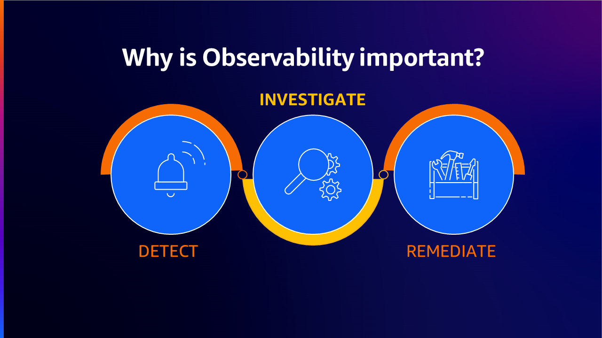
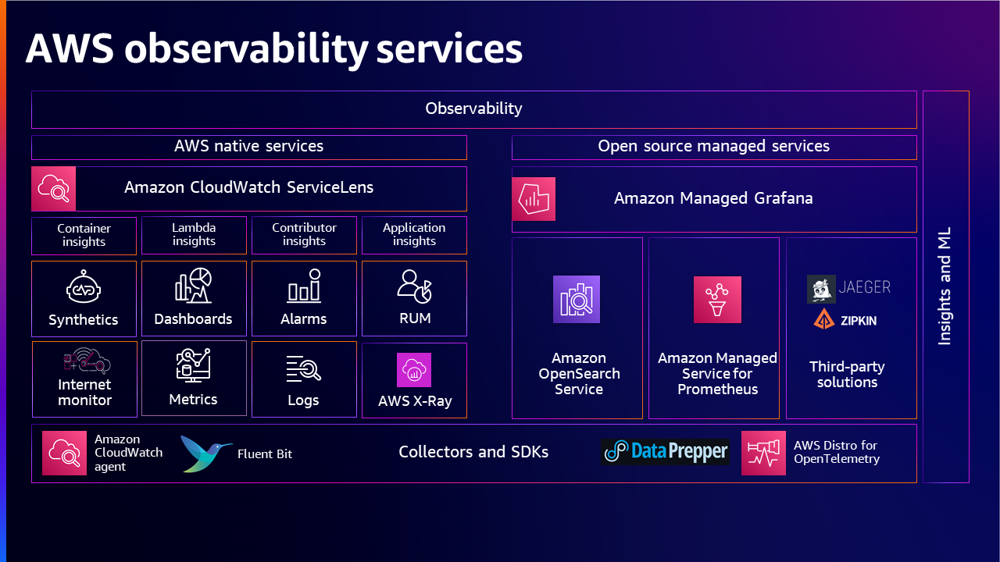

# AWS オブザーバビリティ成熟度モデル

## はじめに

オブザーバビリティの核となるのは、システムの外部出力を分析することによって、その内部状態を理解し洞察を得る能力です。この概念は、事前に定義されたメトリクスやイベントに焦点を当てる従来のモニタリングアプローチから、環境内のさまざまなコンポーネントによって生成されたデータの収集、分析、可視化を含む、よりホリスティックなアプローチへと進化してきました。システムは観察されない限り制御や最適化することができません。 効果的なオブザーバビリティ戦略により、チームは問題を迅速に特定および解決し、リソースの使用を最適化し、システムの全体的な健全性についての洞察を得ることができます。 オブザーバビリティは、操作上の可用性とワークロードの健全性の全体的な改善をもたらす問題を効率的に検出、調査、修復する能力を提供します。

モニタリングとオブザーバビリティの違いは、モニタリングはシステムが機能しているかどうかを伝えるのに対し、オブザーバビリティはシステムが機能していない理由を伝えることです。 モニタリングは通常反応的な測定であるのに対し、オブザーバビリティの目標は、主要業績評価指標(KPI)を積極的な方法で改善できるようにすることです。 継続的なモニタリングとオブザーバビリティは、クラウド環境における敏捷性を高め、顧客体験を改善し、リスクを軽減します。

## オブザーバビリティ成熟度モデル

オブザーバビリティ成熟度モデルは、ワークロードのオブザーバビリティと管理プロセスを最適化しようとする組織にとって不可欠なフレームワークです。このモデルは、ビジネスが現在の能力を評価し、改善の余地がある分野を特定し、最適なオブザーバビリティを実現するために適切なツールとプロセスに戦略的に投資するための包括的なロードマップを提供します。クラウドコンピューティング、マイクロサービス、短命で分散したシステムの時代において、オブザーバビリティはデジタルサービスの信頼性とパフォーマンスを確保する上で重要な要因となっています。オブザーバビリティの向上に構造化されたアプローチを提供することで、このモデルにより組織はシステムに対するより深い理解と制御力を獲得し、よりレジリエントで効率的、高パフォーマンスなビジネスの道を開くことができます。

## オブザーバビリティ成熟度モデルのステージ

組織がワークロードを拡大するにつれて、オブザーバビリティの成熟度モデルも成熟していくことが期待されます。しかし、オブザーバビリティの成熟度への道のりは、必ずしもワークロードの拡大とともに成長するとは限りません。目的は、組織の能力を拡大・成長させるにつれて、必要な成熟度レベルを達成できるように顧客を支援することです。

1. オブザーバビリティ成熟度モデルの最初のステージは、通常、組織の現在の状態に関する基本的な理解を確立することを含みます。これには、既存の監視ツールとプロセスの評価、および可視性や機能のギャップの特定が含まれます。このステージでは、組織は現在の機能を把握し、エンジニアリングサイクルの初期段階から改善のための現実的な目標を設定できます。

2.  次のステージでは、組織は高度なオブザーバビリティ戦略とサービスを採用することにより、より高度なアプローチに移行します。これには、プロアクティブなアラートの実装、異種システム間の相互作用に関する洞察を得るための分散トレーシングなどが含まれます。これにより、組織は可視性の向上の恩恵を受け始め、認知負荷を軽減し、トラブルシューティングをより効率的に行うことができます。

3.  事業がオブザーバビリティ成熟度モデルの3つ目のステージを進むにつれ、組織は自動修復、AI、機械学習技術などの追加機能を活用できます。これらは、異常検知と根本原因分析を自動化するために使用されます。これらの高度な機能により、組織は問題を検出するだけでなく、エンドユーザーに影響を与えたり、ビジネス操作を混乱させる前に修正措置を講じることができます。インシデント管理プラットフォームなどの他の重要なシステムとオブザーバビリティツールを統合することで、組織はインシデント対応プロセスを合理化し、問題を解決するためにかかる時間を最小限に抑えることができます。

4.  オブザーバビリティ成熟度モデルの最終ステージでは、監視とオブザーバビリティツールによって生成された膨大なデータを活用して、継続的な改善を推進します。これには、高度な分析を使用してワークロードパフォーマンスのパターンとトレンドを特定することが含まれます。また、この情報をエンジニアリングと運用プロセスにフィードバックして、リソース割り当て、アーキテクチャ、デプロイ戦略を最適化します。

### ステージ1: 基本的な監視 - テレメトリデータの収集

最小限として採用され、サイロ化された基本的な監視では、組織内のシステムやワークロードの全体を監視するために必要なものの戦略が定義されていません。ほとんどの場合、アプリケーションの所有者、ネットワーク運用センター (NOC)、クラウド運用チーム、DevOps チームなどの異なるチームが、監視ニーズに応じて異なるツールを使用するため、このアプローチは、環境全体のデバッグや最適化の観点からするとほとんど価値がありません。

通常、この段階のお客様は、ワークロードの監視について別々のソリューションを持っています。異なるチームは、ほとんどの場合、他のチームとの連携がないか限定的であるため、同じデータを異なる方法で収集しています。各チームは、取得したデータを使用して、自分たちが必要としているものを最適化しようとします。また、別のチームから取得したデータは形式が異なる可能性があるため、各チームは互いのデータを使用できません。このレベルでは、重要なワークロードを特定する計画を立て、オブザーバビリティの統一されたソリューションを目指し、メトリクスとログを定義することが重要な側面です。ワークロードが提供する基本的な[テレメトリ](https://docs.aws.amazon.com/wellarchitected/latest/operational-excellence-pillar/implement-observability.html)をキャプチャするように設計することは、その内部状態と[ワークロードの健全性](https://docs.aws.amazon.com/wellarchitected/latest/operational-excellence-pillar/utilizing-workload-observability.html)を理解する上で必要です。

成熟度レベルを向上させる基盤を構築するために、メトリクス、ログ、トレースの収集を通じたワークロードの計装と、適切な監視およびオブザーバビリティツールを使用した意味のあるインサイトの取得は、お客様が環境を制御および最適化するのに役立ちます。計装とは、環境からキーデータを測定、追跡、キャプチャすることで、ワークロードの動作とパフォーマンスを観察することができるようにすることを指します。例としては、エラー、成功または失敗したトランザクションなどのアプリケーションメトリクス、CPU やディスクリソースの利用率などのインフラストラクチャメトリクスがあります。

### ステージ2: 中級のモニタリング - テレメトリ分析とインサイト

このステージでは、オンプレミスやクラウドなど、さまざまな環境からのシグナルを収集することにおいて、組織がより明確になっていきます。メトリクス、ログ、トレースは可観測性の基盤を形成するため、これらのワークロードからの収集メカニズムを考案しました。ビジュアライゼーション、アラート戦略の作成、優先順位付けのための基準の明確な定義などができるようになっています。反応的で推測的ではなく、必要なアクションを起動するワークフローを持ち、関連チームはキャプチャした情報と過去の知識に基づいて分析とトラブルシューティングができるようになっています。このレベルの顧客は、伝統的または最新の高スケーラビリティ、分散、アジャイル、マイクロサービスアーキテクチャなどの環境の可観測性を実現するためのプラクティスを達成することに取り組んでいます。

ほとんどのケースでモニタリングはうまく機能しているようですが、組織は問題のデバッグに時間を費やすことが多く、結果として全体的な平均故障時間(MTTR)が一定期間にわたって一貫性がなく、実質的に改善されていません。また、問題をデバッグするための認知的な時間と労力が予想以上にかかっており、インシデント対応に長時間を要しています。運用を圧倒するデータオーバーロードの状況も多いです。ほとんどのエンタープライズが、次のステップがどこにあるかを認識せずに、このステージに捕らわれていることがわかります。組織を次のレベルに移行するために取ることができる具体的なアクションは以下のとおりです。
1) システムアーキテクチャの設計を定期的にレビューし、インパクトやダウンタイムを減らし、アラートを削減するためのポリシーやプラクティスを展開する。
2) アクション可能な[KPI](/observability-best-practices/ja/guides/operational/business/key-performance-indicators/)を定義し、アラート結果に価値のあるコンテキストを追加し、重要度/緊急度で分類し、エンジニアがより速く問題を解決できるように異なるツールとチームに送信することで、アラート疲労を防ぐ。

これらのアラートを定期的に分析し、一般的な繰り返しアラートの修復を自動化する。アラート結果を関連チームと共有し、運用とプロセス改善のフィードバックを提供する。

異なるエンティティを相関させ、システムの異なる部分間の依存関係を理解できるナレッジグラフを徐々に構築する計画を立てる。これにより、システムへの変更の影響を可視化し、潜在的な問題を予測および軽減することができます。

### ステージ3: 高度なオブザーバビリティ - 相関関係と異常検知

このステージでは、組織は多くの時間を費やすことなく、問題の根本原因を明確に理解できるようになります。問題が発生した場合、アラートはネットワーク運用センター (NOC) やクラウド運用チーム、DevOps チームなどの関連チームに十分なコンテキスト情報を提供します。監視チームは、メトリクス、ログ、トレースなどの信号の相関関係から、アラートを見てすぐに問題の根本原因を特定できます。トレースは、ツールで表示、フィルタリング、洞察を得るために使用できる、アプリケーションからのリクエストに関する収集データです。これにより、問題と最適化の機会を特定できます。アプリケーションのトレースされたリクエストは、リクエストとレスポンスについての詳細な情報だけでなく、アプリケーションが下流の AWS リソース、マイクロサービス、データベース、Web API への呼び出しについての詳細も提供します。監視チームはトレースを確認し、トレースがキャプチャされた対応するログイベントを見つけ、インフラストラクチャとアプリケーションからのメトリクスを確認することで、状況の 360° ビューを取得できます。

適切なチームが、問題を解決する修正を提供することで、直ちに修正措置を講じることができます。このシナリオでは、MTTR は非常に小さく、サービスレベル目標 (SLO) はグリーンで、エラーバジェットを通じたバーン率は許容できるものです。通常、このレベルの顧客は、モダンでアジャイルで高スケーラブルなマイクロサービス環境のためのオブザーバビリティの実践を達成しています。

このレベルの高度化と成熟度をオブザーバビリティ環境で達成している組織は多数あります。このステージでは、組織にとって、複雑なインフラストラクチャをサポートし、高可用性でシステムを運用し、アプリケーションの高いサービスレベルアベイラビリティ (SLA) を提供し、信頼できるインフラストラクチャを提供することでビジネスイノベーションを達成する能力をすでに与えています。顧客はまた、通常のパターンと一致しない異常値とアウトライアを監視するために異常検知器を使用し、近リアルタイムのアラートメカニズムを持っています。

ただし、このような組織のチームは、可能な限り先を行きたいと常に考えています。チームは、繰り返し発生する問題を理解し、ナレッジベースを作成して、将来発生する可能性のある問題を予測するためのシナリオに対してモデル化できるようにしたいと考えています。それが、未知の洞察を得る次のステージの成熟度モデルに顧客が移行するときです。そこに到達するためには、新しいツールが必要とされ、データの保存と利用のための新しいスキルと手法が特定される必要があります。人工知能 for IT 運用 (AIOps) を利用して、自動的に信号を相関付け、根本原因を特定し、過去に収集したデータを使用してトレーニングされたモデルに基づいて解決計画を作成するシステムを構築できます。

### ステージ4: 予測的オブザーバビリティ - 自動的かつ予測的な根本原因の特定

ここでは、オブザーバビリティデータは問題が発生した「後」にのみ使用されるのではなく、問題が発生する「前」のリアルタイムでデータを利用します。適切にトレーニングされたモデルを使用することで、問題の特定が予測的に行われ、解決がより簡単に達成されます。収集したシグナルを分析することで、モニタリングシステムは問題を自動的に洞察し、問題を解決するための解決オプションを提示できます。

オブザーバビリティソフトウェアベンダーはこの分野の機能を継続的に拡張しており、生成的 AI が一般的になったことでこの動きは加速しています。そのため、この成熟度レベルを達成したい組織は、容易に達成できます。このステージが成熟し形を整えると、お客様はオブザーバビリティサービスが自動的にダイナミックダッシュボードを作成できる状況が実現します。ダッシュボードには、発生した問題に関連する情報のみが含まれます。これにより、本当に重要でないデータのクエリと可視化に費やされる時間とコストが節約されます。生成的 AI(GenAI) と機械学習を実行するためのコンピューティングが日々民主化されているため、予測的モニタリング機能は、将来的に現在よりも一般的になる可能性があります。

AWS ネイティブおよびオープンソースのソリューションを使用した、データ収集、データ処理、データ洞察と分析のための包括的なオブザーバビリティポートフォリオの概要です。お客様は、エンドツーエンドのオブザーバビリティニーズに合わせて適切なソリューションを選択できます。

## AWS Well-Architected と Cloud Adoption Framework for Observability

組織は、[AWS Well-Architected](https://aws.amazon.com/architecture/well-architected/) と [Cloud Adoption Framework](https://docs.aws.amazon.com/whitepapers/latest/aws-caf-operations-perspective/observability.html) を活用して、オブザーバビリティ機能を強化し、クラウド環境を効果的に監視およびトラブルシューティングできます。

AWS Well-Architected と Cloud Adoption Framework for オブザーバビリティは、ワークロードの設計、デプロイ、運用のための体系的なアプローチを提供し、ベストプラクティスが確実に実践されるようにします。これにより、可用性、システムパフォーマンス、スケーラビリティ、信頼性が向上します。これらのフレームワークは、組織に標準的なプラクティスと規範的なガイダンスを提供することで、組織全体での協業、知識共有、一貫したソリューションの実装を容易にします。

効果的に活用するには、ホリスティックなクラウド環境の設計と運用のアプローチを提供する AWS Well-Architected フレームワークのキーコンポーネントであるピラー([運用上の優位性](https://docs.aws.amazon.com/wellarchitected/latest/framework/operational-excellence.html)、セキュリティ、[信頼性](https://docs.aws.amazon.com/wellarchitected/latest/framework/reliability.html)、[パフォーマンス効率](https://docs.aws.amazon.com/wellarchitected/latest/framework/performance-efficiency.html)、コスト最適化、サステナビリティ) を理解する必要があります。一方、Cloud Adoption Framework は、ビジネス、人、ガバナンス、プラットフォームなどの領域に焦点を当てたクラウド採用のための体系的なアプローチを提供します。これらのコンポーネントをオブザーバビリティ要件と整合させることで、組織は堅牢でスケーラブルなワークロードを構築できます。

AWS Well-Architected と Cloud Adoption Framework for オブザーバビリティの実装には、いくつかのステップが含まれます。まず、組織は現状を評価し、改善の余地がある領域を特定する必要があります。これは、これらのフレームワークに対してワークロードを評価する Observability Maturity Model アセスメントを実施することで実現できます。レビュー結果に基づき、組織はオブザーバビリティイニシアチブを優先順位付けして計画できます。これには、監視とロギングの要件の定義、適切な AWS サービスの選択、必要なインフラストラクチャとツールの実装が含まれます。最後に、組織はオブザーバビリティソリューションを継続的に監視および最適化する必要があり、これにより継続的な有効性が確保されます。

また、お客様は AWS Well-Architected フレームワークのベストプラクティスを使用してワークロードを文書化および測定するための AWS のサービスである [AWS Well-Architected Tool](https://aws.amazon.com/well-architected-tool/) を利用できます。このツールは、AWS Well-Architected フレームワークのピラーを通じてワークロードを一貫したプロセスで測定することで、意思決定を文書化し、ワークロードの改善に関する推奨事項を提供し、ワークロードをより信頼性が高く、安全で、効率的で、コスト効果の高いものに導きます。

## アセスメント

オブザーバビリティ成熟度モデルアセスメントを使用すると、現在のオブザーバビリティの状態を判断し、改善が必要な領域を特定することができます。各ステージのアセスメントでは、異なるチームにまたがる既存のモニタリングと管理の慣行を評価し、ギャップと改善領域を特定し、次のステージへの全体的な準備状況を判断することが不可欠です。成熟度アセスメントは、ビジネスプロセスの概要、ワークロードインベントリとツールの発見、現在の課題の特定、組織の優先事項と目的の理解から始まります。

このアセスメントは、既存のレイアウトのさらなる開発と最適化の基盤となる対象メトリクスと KPI を特定するのに役立ちます。オブザーバビリティ成熟度モデルのアセスメントは、ビジネスが現代のシステムの複雑で動的な性質に対処できるようにするうえで極めて重要な役割を果たします。システム障害やパフォーマンスの問題につながる可能性のある盲点や弱点を特定するのに役立ちます。

さらに、定期的なアセスメントにより、ビジネスは敏捷で適応性が高くなります。進化するテクノロジーやメソドロジーに追随できるようになり、システムが常に最高の効率と信頼性を維持できるようにします。

## オブザーバビリティ戦略の構築

組織が自身のオブザーバビリティ段階を特定したら、現在のプロセスとツールを最適化し、成熟度に向けて取り組みを開始する戦略の構築を開始する必要があります。組織は顧客に良い体験を提供したいと考えているため、顧客の要件から始め、そこから後戻りすることなく進めます。次に、ステークホルダーと連携します。なぜなら、ステークホルダーはこれらの要件をよく理解しているからです。オブザーバビリティ戦略を目指すには、組織はまずオブザーバビリティの目標を定義する必要があります。なぜなら、それらは全体的なビジネス目標と整合性が取れている必要があり、戦略を通じて組織が達成しようとしていることを明確に表現し、オブザーバビリティ計画の構築と実装のためのロードマップを提供する必要があるからです。

次に、組織はシステムパフォーマンスの洞察を提供する重要なメトリクス (KPI) を特定する必要があります。これらには、レイテンシやエラーレート、リソース利用率、取引量などが含まれます。メトリクスの選択は、ビジネスの性質とその特定のニーズに大きく依存することに注意することが重要です。 

重要なメトリクスが特定されたら、組織はデータ収集に必要なツールとテクノロジーを決定できます。ツールの選択は、組織の目標との整合性、既存システムとの統合の容易さ、コストの最適化、スケーラビリティの実現、顧客ニーズの満足、全体的な顧客体験の改善に基づく必要があります。

最後に、組織はオブザーバビリティを重視する文化を奨励する必要があります。これには、チームメンバーにオブザーバビリティの重要性についてトレーニングを行い、システムパフォーマンスを積極的に監視することを奨励し、継続的な学習と改善の文化を育成することが含まれます。この戦略は、収集、アクション、改善の連続的なプロセスの循環を生み出し、可能な限り最高の顧客体験を実現します。

要約すると、オブザーバビリティ戦略を構築するには、3つの主要な側面を考慮する必要があります。1) 何を収集する必要があるか 2) どのシステムとワークロードを観察する必要があるか 3) 問題が発生したときにどのように対応し、その問題を修正するためにどのようなメカニズムを設ける必要があるかです。

## まとめ

オブザーバビリティ成熟度モデルは、組織が現在の状態を評価し、ワークロードとインフラストラクチャの動作を理解、分析、対応する能力を向上させる方法を見出すためのロードマップとして機能します。 現在の機能を評価する構造化されたアプローチに従い、高度なモニタリング技術を採用し、データドリブンの洞察を活用することで、ビジネスはより高いレベルのオブザーバビリティを達成し、ワークロードとインフラストラクチャについてより適切な意思決定を下すことができます。 このモデルは、組織がさまざまな成熟度のレベルを進み、最終的に先取り的なオブザーバビリティのメリットを最大限に活用できる状態に到達するために開発する必要がある主要な機能とプラクティスの概要を示しています。

## 役立つリソース

- [AWS Observability ベストプラクティス](/observability-best-practices/ja/)
- [オブザーバビリティとは何か、なぜそれが重要なのか](https://aws.amazon.com/blogs/mt/what-is-observability-and-why-does-it-matter-part-1/)
- [オブザーバビリティ戦略の開発方法](https://aws.amazon.com/blogs/mt/how-to-develop-an-observability-strategy/)
- [AWS におけるアプリケーションの深層オブザーバビリティのためのガイダンス](https://aws.amazon.com/solutions/guidance/deep-application-observability-on-aws/)
- [Discovery が AWS のオブザーバビリティで運用効率を向上させた方法](https://www.youtube.com/watch?v=zm30JNYmxlY) - AWS re\:Invent 2022
- [オブザーバビリティ戦略の開発](https://www.youtube.com/watch?v=Ub3ATriFapQ) - AWS re\:Invent 2022  
- [AWS でのクラウドネイティブなオブザーバビリティの探求](https://www.youtube.com/watch?v=UW7aT25Mbng) - AWS バーチャルワークショップ
- [AWS のオブザーバビリティソリューションで可用性を向上](https://www.youtube.com/watch?v=_d_9xCfVBTM) - AWS re\:Invent 2020
- [Amazon におけるオブザーバビリティのベストプラクティス](https://www.youtube.com/watch?v=zZPzXEBW4P8) - AWS re\:Invent 2022
- [オブザーバビリティ: モダンアプリケーションのためのベストプラクティス](https://www.youtube.com/watch?v=YiegAlC_yyc) - AWS re\:Invent 2022
- [オープンソースの道でのオブザーバビリティ](https://www.youtube.com/watch?v=2IJPpdp9xU0) - AWS re\:Invent 2022
- [AIOps でオブザーバビリティ戦略を高める](https://www.youtube.com/watch?v=L4b_eDSAwfE)
- [Let’s Architect! 大規模システムの本番監視](https://aws.amazon.com/blogs/architecture/lets-architect-monitoring-production-systems-at-scale/)
- [AWS によるフルスタックのオブザーバビリティとアプリケーションモニタリング](https://www.youtube.com/watch?v=or7uFFyHIX0) - AWS Summit SF 2022
