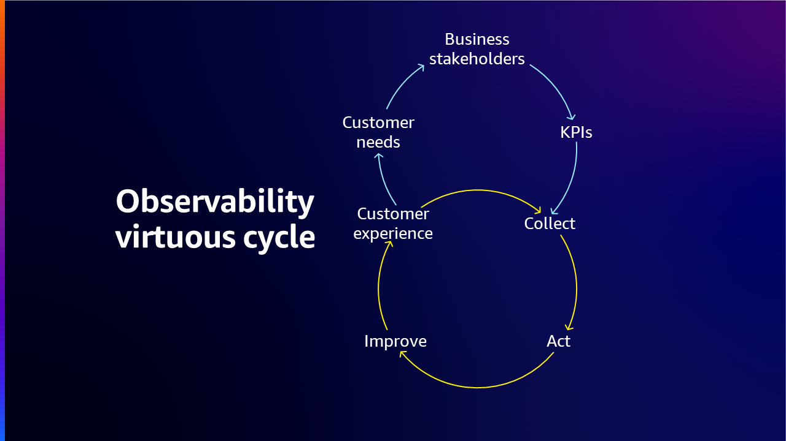

# AWS オブザーバビリティ成熟度モデル

## はじめに

オブザーバビリティの核となるのは、システムの外部出力を分析することによって、システムの内部状態を理解し洞察を得る能力です。この概念は、事前に定義されたメトリクスやイベントに焦点を当てる従来のモニタリングアプローチから、環境内のさまざまなコンポーネントによって生成されたデータの収集、分析、可視化を含む、よりホリスティックなアプローチへと進化してきました。システムは、観察されない限り制御や最適化することができません。効果的なオブザーバビリティ戦略により、チームは問題を迅速に特定および解決し、リソースの使用を最適化し、システムの全体的な健全性についての洞察を得ることができます。 オブザーバビリティは、操作上の可用性とワークロードの健全性を改善するのに役立つ問題を効率的に検出、調査、修復する機能を提供します。

モニタリングとオブザーバビリティの違いは、モニタリングはシステムが機能しているかどうかを伝えるのに対し、オブザーバビリティはシステムが機能していない理由を伝えることです。 モニタリングは通常反応的な対策であるのに対し、オブザーバビリティの目的は主要業績評価指標(KPI)を積極的な方法で改善できるようにすることです。 継続的なモニタリングとオブザーバビリティは、クラウド環境における敏捷性を高め、顧客体験を改善し、リスクを軽減します。

## オブザーバビリティ成熟度モデル

オブザーバビリティ成熟度モデルは、ワークロードのオブザーバビリティと管理プロセスを最適化しようとする組織にとって不可欠なフレームワークです。このモデルは、企業が現在の能力を評価し、改善の余地がある分野を特定し、最適なオブザーバビリティを実現するために戦略的に正しいツールとプロセスに投資するための包括的なロードマップを提供します。クラウドコンピューティング、マイクロサービス、短命で分散したシステムの時代に、オブザーバビリティはデジタルサービスの信頼性とパフォーマンスを確保する上で重要な要因となっています。オブザーバビリティを改善するための体系的なアプローチを提供することで、このモデルにより組織はシステムに対するより深い理解と制御力を獲得し、よりレジリエントで効率的、高パフォーマンスなビジネスの道を開くことができます。

## オブザーバビリティ成熟度モデルのステージ

組織がワークロードを拡大するにつれて、オブザーバビリティの成熟度モデルも成熟していくことが期待されます。しかし、オブザーバビリティの成熟度への道のりは、必ずしもワークロードの拡大とともに成長するとは限りません。目的は、組織の能力を拡大・成長させるにつれて、顧客が必要な成熟度レベルを達成できるよう支援することです。

1. オブザーバビリティ成熟度モデルの最初のステージは、通常、組織の現在の状態に関する基本的な理解を確立することを含みます。これには、既存のモニタリングツールとプロセスの評価、および可視性や機能のギャップの特定が含まれます。このステージでは、組織は現在の機能を把握し、エンジニアリングサイクルの初期段階から改善のための現実的な目標を設定できます。

2.  次のステージでは、組織は高度なオブザーバビリティ戦略とサービスを採用することにより、より高度なアプローチに移行します。これには、プロアクティブなアラートの実装、相互に関連のないシステム間の対話を理解するための分散トレーシングの実施が含まれ、組織は可視性の向上、認知負荷の軽減、効率的なトラブルシューティングのメリットを享受し始めることができます。

3.  ビジネスがオブザーバビリティ成熟度モデルの3番目のステージを進むにつれて、自動修復、AIや機械学習テクノロジーなどの追加機能を活用して、異常検知や根本原因分析を自動化することができます。これらの高度な機能により、組織は問題を検出するだけでなく、エンドユーザーに影響を与えたり、ビジネス操作を混乱させる前に修正アクションを実行することができます。インシデント管理プラットフォームなどの他の重要なシステムとオブザーバビリティツールを統合することで、組織はインシデント対応プロセスを合理化し、問題を解決するためにかかる時間を最小限に抑えることができます。

4.  オブザーバビリティ成熟度モデルの最終ステージでは、モニタリングとオブザーバビリティツールによって生成された膨大なデータを活用して、継続的な改善を推進します。これには、ワークロードパフォーマンスのパターンとトレンドを特定するための高度な分析の利用、ならびにこの情報をエンジニアリングと運用プロセスにフィードバックして、リソース割り当て、アーキテクチャ、デプロイ戦略を最適化することが含まれます。

### ステージ1: 基本的なモニタリング - テレメトリデータの収集

最小限のモニタリングとして採用され、サイロ化されている基本的なモニタリングには、組織内のシステムやワークロードの全体をモニタリングするために必要なものの戦略が定義されていません。ほとんどの場合、アプリケーションの所有者、ネットワーク運用センター (NOC)、CloudOps または DevOps チームなどの異なるチームが、モニタリングのニーズに応じて異なるツールを使用するため、このアプローチは、デバッグや環境の最適化についてほとんど価値がありません。

通常、この段階のお客様は、ワークロードのモニタリングについて異なるソリューションを持っています。ほとんどの場合、他のチームとのパートナーシップがないか制限されているため、異なるチームは同じデータを異なる方法で収集しています。各チームは、取得したデータを使用して自分たちが必要としているものを最適化しようとします。また、別のチームから取得したデータは形式が異なる可能性があるため、チーム間でデータを共有できません。重要なワークロードを特定する計画を立て、オブザーバビリティの統一ソリューションを目指し、メトリクスとログを定義することが、このレベルの重要な側面です。ワークロードの内部状態と[ワークロードの健全性](https://docs.aws.amazon.com/wellarchitected/latest/operational-excellence-pillar/utilizing-workload-observability.html)を理解するために、必要な[テレメトリ](https://docs.aws.amazon.com/wellarchitected/latest/operational-excellence-pillar/implement-observability.html)をキャプチャするようにワークロードを設計することが必要です。

成熟度レベルを向上させる基盤を構築するために、メトリクス、ログ、トレースの収集を通じたワークロードの計装と、適切なモニタリングおよびオブザーバビリティ ツールを使用した意味のあるインサイトの取得が、お客様の環境を制御および最適化するのに役立ちます。計装とは、環境からキーとなるデータを測定、追跡、キャプチャすることで、ワークロードの動作とパフォーマンスを観察することを指します。例としては、エラー、成功または失敗したトランザクションなどのアプリケーションメトリクス、CPU やディスクリソースの利用率などのインフラストラクチャメトリクスがあります。

### ステージ2: 中級レベルのモニタリング - テレメトリの分析とインサイト

このステージでは、オンプレミスやクラウドなど、さまざまな環境からのシグナルを収集することが組織的に明確になっていきます。メトリクス、ログ、トレースをワークロードから収集するメカニズムを考案し、これらはオブザーバビリティの基盤となる構造を形成します。ビジュアライゼーション、アラート戦略の作成、事前定義された基準に基づく問題の優先順位付けの機能も備えています。反応的で推測的ではなく、必要なアクションを呼び出すワークフローがあり、関連チームはキャプチャされた情報と過去の知識に基づいて分析とトラブルシューティングができます。このレベルの顧客は、従来型またはモダンな高スケーラブルで分散型のアジャイルとマイクロサービスアーキテクチャの環境のためのオブザーバビリティのベストプラクティスを達成することに取り組んでいます。

ほとんどのケースでモニタリングがうまく機能しているように見えても、組織は問題のデバッグにより多くの時間を費やすことが多く、その結果、全体的な平均修復時間 (MTTR) が一定期間にわたって一貫性がなく、あるいは意味のある改善が見られません。また、問題のデバッグに予想以上の認知的時間と労力がかかるため、インシデント対応に時間がかかります。運用を圧倒するデータオーバーロードの状況も多く見受けられます。ほとんどのエンタープライズが、次に進むべき道に気づかずにこのステージに捕らわれていることがわかります。組織を次のレベルに進めるために取ることができる具体的なアクションは以下のとおりです。

1. システムアーキテクチャの設計を定期的にレビューし、インパクトやダウンタイムを減らし、アラートを削減するためのポリシーやプラクティスを導入する。

2. アクション可能な [KPI](/observability-best-practices/ja/guides/operational/business/key-performance-indicators/) を定義し、アラート結果に価値のあるコンテキストを追加、重要度/緊急度で分類し、エンジニアがより速く問題を解決できるように異なるツールとチームに送信することでアラート疲労を防ぐ。

これらのアラートを定期的に分析し、一般的な繰り返しアラートの自動修復を行う。アラート結果を関連チームと共有し、運用とプロセス改善のフィードバックを提供する。

異なるエンティティを相関させ、システムの異なる部分間の依存関係を理解できるナレッジグラフを段階的に構築する計画を立てる。これにより、システムへの変更の影響を可視化し、潜在的な問題を予測および軽減するのに役立ちます。

### ステージ3: 高度なオブザーバビリティ - 相関関係と異常検知

このステージでは、組織は多くの時間を費やしてトラブルシューティングを行うことなく、問題の根本原因を明確に理解できるようになります。問題が発生した場合、アラートはネットワーク運用センター(NOC)やクラウド運用チーム、DevOps チームなどの関連チームに十分なコンテキスト情報を提供します。監視チームは、アラートを見て、メトリクス、ログ、トレースなどのシグナルの相関関係から直ちに問題の根本原因を特定できます。トレースは、ツールとともに使用して問題や最適化の機会を特定するために表示、フィルタリング、洞察を取得できるアプリケーションについてのリクエストに関するデータです。アプリケーションのトレースされたリクエストは、リクエストとレスポンスについてだけでなく、アプリケーションがダウンストリームの AWS リソース、マイクロサービス、データベース、Web API への呼び出しについても詳細な情報を提供します。360°の状況を得るために、インフラストラクチャとアプリケーションのメトリクスを見ることができます。

適切なチームは、問題を解決する修正を提供することで、すぐに修正措置を講じることができます。このシナリオでは、MTTR は非常に小さく、サービスレベル目標 (SLO) はグリーンであり、エラーバジェットを通じたバーンレートは許容できるものです。通常、このレベルにある顧客は、モダンでアジャイルな、高度にスケーラブルなマイクロサービス環境のオブザーバビリティのための実践を達成しています。

このレベルの高度化と成熟度をオブザーバビリティ環境で達成している組織は多数あります。このステージはすでに、複雑なインフラストラクチャをサポートし、高可用性でシステムを運用し、アプリケーションのより高いサービスレベルアベイラビリティ(SLA)を提供し、信頼できるインフラストラクチャを提供することでビジネスイノベーションを達成する機能を組織に提供しています。 顧客はまた、通常のパターンと一致しない異常値とアウトライアを監視するために異常検知を使用し、近リアルタイムのアラートメカニズムを持っています。

ただし、このような組織のチームは、可能な限り先を行きたいと考えています。 チームは、繰り返し発生する問題を理解し、将来発生する可能性のある問題を予測するためのシナリオに対してモデル化できる知識ベースを作成したいと考えています。 それは、顧客が成熟度モデルの次のステージに移行するときです。そこでは、未知のものへの洞察が得られます。 そこに到達するには、新しいツールが必要であり、データの保存と利用の方法に関する新しいスキルとテクニックを特定する必要があります。 過去に収集されたデータを使用してトレーニングされたモデルに基づいて、シグナルを自動的に相関付け、根本原因を特定し、解決計画を作成する人工知能 for IT 運用(AIOps) を利用できます。

### ステージ4: 予測的オブザーバビリティ - 自動的かつ予測的な根本原因の特定

ここでは、オブザーバビリティデータは問題が発生した「後」にのみ使用されるのではなく、問題が発生する「前」のリアルタイムでもデータを活用します。 適切にトレーニングされたモデルを使用することで、問題の特定が予測的に行われ、解決がより簡単に達成されます。 収集したシグナルを分析することで、モニタリングシステムは問題の洞察を自動的に提供し、問題を解決するための解決策を提示できます。

オブザーバビリティソフトウェアベンダーはこの分野の機能を継続的に拡張しており、ジェネラティブ AI が一般的になったことで、この成熟度レベルを達成しようとする組織が容易に達成できるようになっています。 このステージが成熟し形を整えると、お客様はオブザーバビリティサービスが自動的にダイナミックダッシュボードを作成できる状況を目の当たりにします。 ダッシュボードには、対処中の問題に関連する情報のみが含まれます。 これにより、本当に関係のないデータのクエリと可視化に費やす時間とコストが節約されます。 ジェネラティブ AI (GenAI) とマシンラーニングを実行するためのコンピューティングが日々民主化されているため、予測的なモニタリング機能が現在よりも将来的に一般的になることが予想されます。

AWS ネイティブおよびオープンソースのさまざまなソリューションを使用して、データの収集、データ処理、データの洞察と分析を行うことができるオブザーバビリティポートフォリオの概要を示し、エンドツーエンドのオブザーバビリティニーズに対して適切なソリューションを選択することでお客様が利用できる包括的な図を提供します。

## AWS Well-Architected とクラウドアドプションフレームワークによるオブザーバビリティ

組織は、[AWS Well-Architected](https://aws.amazon.com/architecture/well-architected/) と [Cloud Adoption Framework](https://docs.aws.amazon.com/whitepapers/latest/aws-caf-operations-perspective/observability.html) を活用して、オブザーバビリティ機能を強化し、クラウド環境を効果的に監視およびトラブルシューティングできます。

AWS Well-Architected と Cloud Adoption Framework for オブザーバビリティは、ワークロードの設計、デプロイ、運用のための体系的なアプローチを提供し、ベストプラクティスが遵守されるようにします。これにより、可用性、システムパフォーマンス、スケーラビリティ、信頼性が向上します。これらのフレームワークは、組織に標準化された一連のプラクティスと処方箋のガイダンスを提供することで、組織全体での協業、知識共有、一貫したソリューションの実装を容易にします。

効果的に活用するには、AWS Well-Architected フレームワークの柱(オペレーショナルエクセレンス、セキュリティ、信頼性、パフォーマンス効率、コスト最適化、サステナビリティ)と呼ばれる主要コンポーネントを理解する必要があります。これらは、クラウド環境の設計と運用のためのホリスティックなアプローチを提供します。一方、Cloud Adoption Framework は、ビジネス、人、ガバナンス、プラットフォームなどの領域に焦点を当てた、クラウドアドプションのための体系的なアプローチを提供します。これらのコンポーネントをオブザーバビリティ要件と整合させることで、組織は堅牢でスケーラブルなワークロードを構築できます。

AWS Well-Architected と Cloud Adoption Framework によるオブザーバビリティの実装には、いくつかのステップが含まれます。まず、組織は現状を評価し、改善が必要な領域を特定する必要があります。これは、これらのフレームワークに対してワークロードを評価する Observability Maturity Model アセスメントを実施することで行うことができます。レビュー結果に基づき、組織はオブザーバビリティイニシアチブを優先順位付けして計画できます。これには、監視とロギングの要件の定義、適切な AWS サービスの選択、必要なインフラストラクチャとツールの実装が含まれます。最後に、組織は継続的な有効性を確保するために、オブザーバビリティソリューションを継続的に監視および最適化する必要があります。

また、お客様は AWS Well-Architected Tool を利用できます。これは、AWS Well-Architected フレームワークのベストプラクティスを使用してワークロードを文書化および測定するための AWS のサービスです。このツールは、AWS Well-Architected フレームワークの柱を通じてワークロードを一貫したプロセスで測定することができ、意思決定を文書化し、ワークロードの改善に関する推奨事項を提供し、ワークロードをより信頼性が高く、安全で、効率的で、コスト効果の高いものに導くことができます。

## アセスメント

オブザーバビリティ成熟度モデルアセスメントを使用すると、現在のオブザーバビリティの状態を測定し、改善のための領域を特定することができます。 各ステージのアセスメントには、異なるチームにわたる既存のモニタリングと管理の慣行を評価し、ギャップと改善領域を特定し、次のステージへの全体的な準備状況を判断することが不可欠です。 成熟度アセスメントは、ビジネスプロセスの概要、ワークロードインベントリとツールの発見、現在の課題の特定、組織の優先事項と目的の理解から始まります。

このアセスメントは、さらなる開発と既存のレイアウトの最適化の基礎となる対象のメトリクスと KPI を特定するのに役立ちます。 オブザーバビリティ成熟度モデルのアセスメントは、ビジネスが現代のシステムの複雑で動的な性質に対処する準備ができていることを確認する上で重要な役割を果たします。 システム障害やパフォーマンスの問題につながる可能性のある盲点や弱点を特定するのに役立ちます。

さらに、定期的なアセスメントにより、ビジネスが機敏で適応性が高くなることが保証されます。 進化するテクノロジーやメソドロジーに追いつくことができるため、システムが常に最高の効率と信頼性を維持できるようになります。

## オブザーバビリティ戦略の構築

組織がオブザーバビリティの段階を特定したら、現在のプロセスとツールを最適化し、成熟度に向けて取り組みを開始する戦略の構築を開始する必要があります。組織は、顧客に素晴らしい体験を提供したいと考えているため、まず顧客の要件から始め、そこから戻っていきます。次に、ステークホルダーと連携します。なぜなら、ステークホルダーはこれらの要件を非常によく理解しているからです。オブザーバビリティ戦略を目指すにあたり、組織はまず、全体的なビジネス目標と整合性をとり、戦略を通じて組織が達成しようとしていることを明確に表現するオブザーバビリティ目標を定義する必要があります。これは、オブザーバビリティ計画の構築と実装のためのロードマップを提供します。

次に、組織はシステムパフォーマンスへの洞察を提供する重要なメトリクス (KPI) を特定する必要があります。これらには、レイテンシやエラーレート、リソース利用率、トランザクション量などが含まれます。メトリクスの選択は、ビジネスの性質とその特定のニーズに大きく依存することに注意することが重要です。

重要なメトリクスが特定されたら、組織はデータ収集に必要なツールとテクノロジーを決定できます。ツールの選択は、組織の目標との整合性、既存のシステムとの統合の容易さ、コストの最適化、スケーラビリティの達成、顧客ニーズの満足、全体的な顧客体験の改善に基づく必要があります。

最後に、組織はオブザーバビリティを重視する文化を奨励する必要があります。これには、オブザーバビリティの重要性についてメンバーを訓練し、システムパフォーマンスを積極的に監視することを奨励し、継続的な学習と改善の文化を育成することが含まれます。この戦略は、収集、アクション、改善の連続プロセスの循環を生み出し、可能な限り最高の顧客体験を実現します。

要約すると、オブザーバビリティ戦略を構築するには、3つの主要な側面を考慮する必要があります。1) 何を収集する必要があるか 2) どのシステムとワークロードを観察する必要があるか 3) 問題が発生したときにどのように対応し、その問題を修正するためにどのようなメカニズムを設ける必要があるかです。

## まとめ

オブザーバビリティ成熟度モデルは、組織が現在の状態を評価し、ワークロードとインフラストラクチャの動作を理解、分析、対応する能力を向上させる方法を探すためのロードマップとして機能します。現在の機能を評価する構造化されたアプローチに従い、高度なモニタリング技術を採用し、データドリブンの洞察を活用することで、ビジネスはより高いレベルのオブザーバビリティを達成し、ワークロードとインフラストラクチャに関するより適切な意思決定を下すことができます。このモデルは、組織が異なる成熟度のレベルを進み、最終的には先取り的なオブザーバビリティの利点を最大限に活用できる状態に到達するために開発する必要がある主要な機能と実践を概説しています。

## 役立つリソース

- [AWS Observability ベストプラクティス](/observability-best-practices/ja/)
- [オブザーバビリティとは何か、なぜそれが重要なのか](https://aws.amazon.com/blogs/mt/what-is-observability-and-why-does-it-matter-part-1/)
- [オブザーバビリティ戦略の開発方法](https://aws.amazon.com/blogs/mt/how-to-develop-an-observability-strategy/)
- [AWS における深層アプリケーションのオブザーバビリティのガイダンス](https://aws.amazon.com/solutions/guidance/deep-application-observability-on-aws/)
- [Discovery が AWS のオブザーバビリティで運用効率を向上させた方法](https://www.youtube.com/watch?v=zm30JNYmxlY) - AWS re\:Invent 2022
- [オブザーバビリティ戦略の開発](https://www.youtube.com/watch?v=Ub3ATriFapQ) - AWS re\:Invent 2022  
- [AWS でのクラウドネイティブなオブザーバビリティの探求](https://www.youtube.com/watch?v=UW7aT25Mbng) - AWS バーチャルワークショップ
- [AWS のオブザーバビリティソリューションで可用性を向上](https://www.youtube.com/watch?v=_d_9xCfVBTM) - AWS re\:Invent 2020
- [Amazon におけるオブザーバビリティのベストプラクティス](https://www.youtube.com/watch?v=zZPzXEBW4P8) - AWS re\:Invent 2022
- [オブザーバビリティ: モダンアプリケーションのためのベストプラクティス](https://www.youtube.com/watch?v=YiegAlC_yyc) - AWS re\:Invent 2022
- [オープンソースの道 - オブザーバビリティ](https://www.youtube.com/watch?v=2IJPpdp9xU0) - AWS re\:Invent 2022
- [AIOps でオブザーバビリティ戦略を向上](https://www.youtube.com/watch?v=L4b_eDSAwfE)
- [Let’s Architect! 大規模システムの本番監視](https://aws.amazon.com/blogs/architecture/lets-architect-monitoring-production-systems-at-scale/)
- [AWS によるフルスタックのオブザーバビリティとアプリケーションモニタリング](https://www.youtube.com/watch?v=or7uFFyHIX0) - AWS Summit SF 2022
