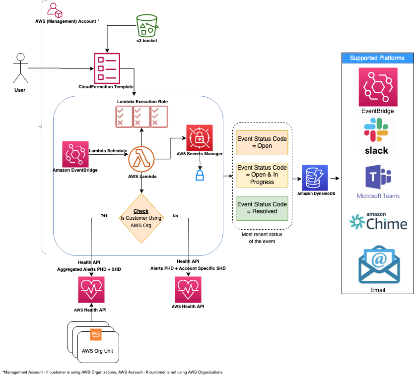
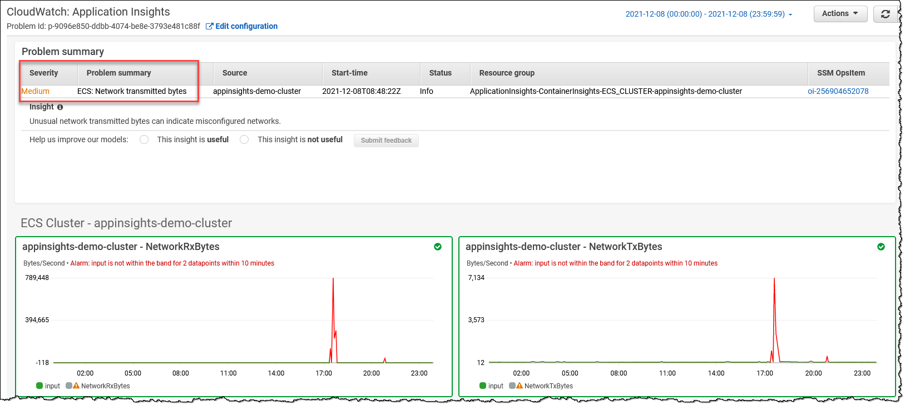

## 1.0 KPI(重要業績評価指標) の理解(「ゴールデンシグナル」)

組織では、ビジネスと運用の健全性やリスクに関する洞察を提供する重要業績評価指標(KPI) つまり「ゴールデンシグナル」を利用します。組織の異なる部門は、それぞれのアウトカムの測定に対応したユニークな KPI を持っています。たとえば、eコマースアプリケーションの製品チームは、カート注文を正常に処理できる能力をその KPI として追跡します。オンコール運用チームは、インシデントを検知するまでの平均時間(MTTD) を KPI として測定します。財務チームにとっては、予算内のリソースコストの KPI が重要です。

サービスレベルインジケーター (SLI)、サービスレベルオブジェクティブ (SLO)、サービスレベルアグリーメント (SLA) は、サービス信頼性管理の不可欠な要素です。このガイドでは、Amazon CloudWatch とその機能を使用して SLI、SLO、SLA を計算および監視するためのベストプラクティスを、明確かつ簡潔な例を用いて概説します。

- **SLI(サービスレベルインジケーター):** サービスのパフォーマンスを定量的に測定するもの。
- **SLO(サービスレベルオブジェクティブ):** SLI の目標値であり、望ましいパフォーマンスレベルを表す。  
- **SLA(サービスレベルアグリーメント):** サービスプロバイダーとその利用者の間の、期待されるサービスレベルについての契約。

一般的な SLI の例:

- 可用性: サービスが操作可能な時間の割合
- レイテンシ: リクエストを実行するのにかかる時間  
- エラーレート: 失敗したリクエストの割合

## 2.0 顧客およびステークホルダーの要件を発見する(下記のテンプレートを使用)

1. 最初の質問から始めます: 「与えられたワークロード(支払いポータル、EC サイトの注文受付、ユーザー登録、データレポート、サポートポータルなど)のビジネス価値またはビジネス上の問題点は何か」
2. ビジネス価値を、ユーザーエクスペリエンス(UX)、ビジネスエクスペリエンス(BX)、運用エクスペリエンス(OpsX)、セキュリティエクスペリエンス(SecX)、開発者エクスペリエンス(DevX)などのカテゴリーに分解する
3. 各カテゴリーのコアシグナル(重要指標)、つまり「ゴールデンシグナル」を導出する。UX と BX の上位シグナルが通常、ビジネスメトリクスを構成する

| ID	| 略称	| 顧客	| ビジネスニーズ	| 測定	| 情報ソース	| 望ましい状態とは	| アラート	| ダッシュボード	| レポート |
| ---	| ---	| ---	| ---	| ---	| ---	| ---	| ---	| ---	| --- |		
|M1	|例	|外部エンドユーザー	|ユーザーエクスペリエンス	|レスポンス時間(ページレイテンシ)	|ログ/トレース	|99.9% が 5 秒未満	|いいえ	|はい	|いいえ	|
|M2	|例	|ビジネス	|可用性	|成功した RPS(1 秒あたりのリクエスト数)	|ヘルスチェック	|5 分間のウィンドウで 85% 超	|はい	|はい	|はい	| 
|M3	|例	|セキュリティ	|コンプライアンス	|重要な非準拠リソース	|構成データ	|15 日以内に 10 未満	|いいえ	|はい	|はい	|
|M4	|例	|開発者	|敏捷性	|デプロイ時間	|デプロイログ	|常に 10 分未満	|はい	|いいえ	|はい	|
|M5	|例	|運用者	|キャパシティ	|キューの深さ	|アプリログ/メトリクス	|常に 10 未満	|はい	|はい	|はい	|

### 2.1 ゴールデンシグナル

|カテゴリ	|シグナル	|備考	|参照先	|
|---	|---	|---	|---	|  
|UX	|パフォーマンス(レイテンシー)	|テンプレートの M1 を参照	|ホワイトペーパー: [Availability and Beyond (Measuring latency)](https://docs.aws.amazon.com/whitepapers/latest/availability-and-beyond-improving-resilience/measuring-availability.html#latency)	|
|BX	|可用性	|テンプレートの M2 を参照	|ホワイトペーパー: [Availability and Beyond (Measuring availability)](https://docs.aws.amazon.com/whitepapers/latest/availability-and-beyond-improving-resilience/measuring-availability.html)	|  
|BX	|事業継続計画(BCP)	|定義された RTO/RPO に対する Amazon Resilience Hub (ARH) のレジリエンス スコア	|ドキュメント: [ARH ユーザーガイド(レジリエンス スコアの理解)](https://docs.aws.amazon.com/resilience-hub/latest/userguide/resil-score.html)	|
|SecX	|(非)コンプライアンス	|テンプレートの M3 を参照	|ドキュメント: [AWS Control Tower ユーザーガイド(コンソールのコンプライアンスステータス)](https://docs.aws.amazon.com/controltower/latest/userguide/compliance-statuses.html)	|  
|DevX	|アジリティ	|テンプレートの M4 を参照	|ドキュメント: [AWS 上の DevOps モニタリングダッシュボード(DevOps メトリクスリスト)](https://docs.aws.amazon.com/solutions/latest/devops-monitoring-dashboard-on-aws/devops-metrics-list.html)	|
|OpsX	|キャパシティ(クォータ)	|テンプレートの M5 を参照	|ドキュメント: [Amazon CloudWatch ユーザーガイド(サービスクォータの視覚化とアラームの設定)](https://docs.aws.amazon.com/AmazonCloudWatch/latest/monitoring/CloudWatch-Quotas-Visualize-Alarms.html)	|  
|OpsX	|予算の異常	|	|ドキュメント:<br/>1. [AWS 課金とコスト管理(AWS Cost Anomaly Detection)](https://docs.aws.amazon.com/cost-management/latest/userguide/getting-started-ad.html)<br/>2. [AWS Budgets](https://aws.amazon.com/aws-cost-management/aws-budgets/)	|

## 3.0 トップレベルガイダンス(TLG)

### 3.1 TLG 一般

1. ビジネスチーム、アーキテクチャチーム、セキュリティチームと協力して、ビジネス、コンプライアンス、ガバナンスの要件を精査し、それらがビジネスニーズを正確に反映していることを確認してください。これには、[リカバリ時点目標とリカバリ時間目標の設定](https://aws.amazon.com/blogs/mt/establishing-rpo-and-rto-targets-for-cloud-applications/)(RTO、RPO)が含まれます。[可用性の測定](https://docs.aws.amazon.com/whitepapers/latest/availability-and-beyond-improving-resilience/measuring-availability.html)やレイテンシーなどの要件を測定する方法を策定します(例: 可用性では、5 分間のウィンドウで少量の障害を許容できる)。

2. さまざまなビジネス機能の結果に合わせた目的別スキーマを使用した効果的な[タグ付け戦略](https://docs.aws.amazon.com/whitepapers/latest/tagging-best-practices/defining-and-publishing-a-tagging-schema.html)を構築します。これは特に、[運用可観測性](https://docs.aws.amazon.com/whitepapers/latest/tagging-best-practices/operational-observability.html)と[インシデント管理](https://docs.aws.amazon.com/whitepapers/latest/tagging-best-practices/incident-management.html)をカバーする必要があります。

3. 基準 KPI がないメトリクスの場合は、可能な限り[CloudWatch 異常検知](https://docs.aws.amazon.com/AmazonCloudWatch/latest/monitoring/CloudWatch_Anomaly_Detection.html)を利用した動的なアラームしきい値を設定します。これはベースラインを設定するための機械学習アルゴリズムを提供します。CW メトリクスを公開する AWS サービス(または Prometheus メトリクスなどの他のソース)を利用してアラームを設定する場合は、[複合アラーム](https://docs.aws.amazon.com/AmazonCloudWatch/latest/monitoring/Create_Composite_Alarm.html)の作成を検討して、アラームノイズを減らします。例: 可用性を示すビジネスメトリクス(成功したリクエストで追跡)とレイテンシーからなる複合アラームを、両方が重要なしきい値を下回った場合にアラームが発生するように設定すると、デプロイのバグを特定する決定的な指標になります。

4. (注) AWS ビジネスサポート以上が必要です。AWS は AWS Health サービスを使用して、Personal Health Dashboard でリソースに関連するイベントを公開しています。[AWS Health Aware (AHA)](https://aws.amazon.com/blogs/mt/aws-health-aware-customize-aws-health-alerts-for-organizational-and-personal-aws-accounts/) フレームワーク(AWS Health を使用)を利用して、AWS Organization 全体のアカウントから集約されたプロアクティブかつリアルタイムのアラートを管理アカウントなどの中央アカウントに取り込みます。これらのアラートは、Slack や ServiceNow、Jira などの好みのコミュニケーションプラットフォームに送信できます。


5. Amazon CloudWatch [Application Insights](https://docs.aws.amazon.com/AmazonCloudWatch/latest/monitoring/cloudwatch-application-insights.html) を利用して、リソースの最適なモニターを設定し、アプリケーションでの問題の兆候を継続的に分析します。また、モニタリング対象アプリケーションの潜在的な問題をすばやく特定/トラブルシューティングできる自動ダッシュボードも提供します。[Container Insights](https://docs.aws.amazon.com/AmazonCloudWatch/latest/monitoring/ContainerInsights.html) を利用すると、コンテナからメトリクスとログを集約し、CloudWatch Application Insights とシームレスに統合できます。


6. [AWS Resilience Hub](https://aws.amazon.com/resilience-hub/) を利用して、定義された RTO と RPO に対してアプリケーションを分析します。[AWS Fault Injection Simulator](https://aws.amazon.com/fis/) などのツールを使用した制御実験によって、可用性、レイテンシー、ビジネス継続性の要件が満たされていることを検証します。 さらに Well-Architected レビューやサービス固有の深掘りを行い、ワークロードが AWS のベストプラクティスに従ってビジネス要件を満たすように設計されていることを確認します。

7. 詳細については、[AWS Observability Best Practices](/observability-best-practices/ja/) ガイダンスの他のセクション、AWS Cloud Adoption Framework: [Operations Perspective](https://docs.aws.amazon.com/whitepapers/latest/aws-caf-operations-perspective/observability.html) ホワイトペーパー、AWS Well-Architected フレームワークの運用上の優位性のピラーのホワイトペーパーコンテンツ「[Understading workload health](https://docs.aws.amazon.com/wellarchitected/latest/operational-excellence-pillar/understanding-workload-health.html)」を参照してください。

### 3.2 ドメイン別 TLG (UX、BX などのビジネスメトリクスに重点)

以下に、CloudWatch(CW)(参照: [CloudWatch メトリクスのドキュメント](https://docs.aws.amazon.com/AmazonCloudWatch/latest/monitoring/aws-services-cloudwatch-metrics.html) を公開している AWS サービス)などのサービスを使用した適切な例を示します。

#### 3.2.1 Canary(シンセティックトランザクション)とリアルユーザーモニタリング(RUM)

* TLG: クライアント/顧客のエクスペリエンスを理解する最も簡単かつ効果的な方法の1つは、Canary(シンセティックトランザクション)を使用して顧客トラフィックをシミュレートすることで、サービスを定期的にプローブし、メトリクスを記録することです。

|AWS サービス |機能 |測定 |メトリクス |例 |備考 |
|--- |--- |--- |--- |--- |--- |
|CW |Synthetics |可用性 |**SuccessPercent** |(例: SuccessPercent > 90 または 1 分間の CW アノマリ検出)<br/>**[平日の毎朝 7 時から 8 時の間に実行される Canary の場合のメトリック数式(CloudWatchSynthetics):**<br/>`IF(((DAY(m1)&lt;6) AND (HOUR(m1)>7 AND HOUR(m1)&lt;8)),m1)` | |
| | | | | | |
|CW |Synthetics |可用性 |VisualMonitoringSuccessPercent |(例: 5 分間の VisualMonitoringSuccessPercent > 90 for UI スクリーンショットの比較)<br/>**[平日の毎朝 7 時から 8 時の間に実行される Canary の場合のメトリック数式(CloudWatchSynthetics):**<br/>`IF(((DAY(m1)&lt;6) AND (HOUR(m1)>7 AND HOUR(m1)&lt;8)),m1)` |顧客が Canary が事前に決められた UI スクリーンショットと一致することを期待している場合 |
| | | | | | |
|CW |RUM |応答時間 |Apdex スコア |(例: Apdex スコア:<br/>NavigationFrustratedCount &lt; 予想値'N') | |
| | | | | | |

#### 3.2.2 API フロントエンド

|AWS サービス |機能 |測定項目 |メトリック |例 |備考 |
|--- |--- |--- |--- |--- |--- |  
|CloudFront | |可用性 |総エラーレート |(例: [総エラーレート] &lt; 10 または 1 分間隔の CW アノマリ検出) |エラーレートとしての可用性 |
| | | | | | |
|CloudFront |(追加メトリックをオンにする必要があります) |パフォーマンス |キャッシュヒット率 |(例: キャッシュヒット率 &lt; 10、1 分間隔の CW アノマリ検出) | |
| | | | | | |  
|Route53 |ヘルスチェック |(クロスリージョン) 可用性 |HealthCheckPercentageHealthy |(例: [HealthCheckPercentageHealthy の最小値] > 90 または 1 分間隔の CW アノマリ検出) | |
| | | | | | |
|Route53 |ヘルスチェック |レイテンシー |TimeToFirstByte |(例: [p99 TimeToFirstByte] &lt; 100 ms または 1 分間隔の CW アノマリ検出) | | 
| | | | | | |
|API Gateway | |可用性 |Count |(例: [(4XXError + 5XXError) / Count) * 100] &lt; 10 または 1 分間隔の CW アノマリ検出) |リクエストの「放棄」の尺度としての可用性 |
| | | | | | |  
|API Gateway | |レイテンシー |レイテンシー(またはバックエンドレイテンシーを表す IntegrationLatency) |(例: p99 レイテンシー &lt; 1 秒または 1 分間隔の CW アノマリ検出) |p99 は p90 などの下位パーセンタイルよりも許容度が高い。(p50 は平均と同じ) |
| | | | | | |
|API Gateway | |パフォーマンス |CacheHitCount(および Misses) |(例: [CacheMissCount / (CacheHitCount + CacheMissCount) * 100] &lt; 10 または 1 分間隔の CW アノマリ検出) |キャッシュのミスを指標としたパフォーマンス |
| | | | | | | 
|Application Load Balancer (ALB) | |可用性 |RejectedConnectionCount |(例:[RejectedConnectionCount/(RejectedConnectionCount + RequestCount) * 100] &lt; 10、1 分間隔の CW アノマリ検出) |最大接続数超過によるリクエスト拒否の尺度としての可用性 | 
| | | | | | |
|Application Load Balancer (ALB) | |レイテンシー |TargetResponseTime |(例: p99 TargetResponseTime &lt; 1 秒または 1 分間隔の CW アノマリ検出) |p99 は p90 などの下位パーセンタイルよりも許容度が高い。(p50 は平均と同じ) |

#### 3.2.3 サーバーレス

|AWS サービス |機能 |測定 |メトリクス |例 |備考 |
|--- |--- |--- |--- |--- |--- |  
|S3 |リクエストメトリクス |可用性 |AllRequests |(例: [(4XXErrors + 5XXErrors) / AllRequests) * 100] &lt; 10 または1分間の期間のCW異常検知) |「放棄された」リクエストの可用性としての測定 |
| | | | | | |
|S3 |リクエストメトリクス |(全体的な)レイテンシー |TotalRequestLatency |(例: [p99 TotalRequestLatency] &lt; 100 ms または1分間の期間のCW異常検知) | |
| | | | | | | 
|DynamoDB (DDB) | |可用性 |ThrottledRequests |(例: [ThrottledRequests] &lt; 100 または1分間の期間のCW異常検知) |「スロットリングされた」リクエストの可用性としての測定 |  
| | | | | | |
|DynamoDB (DDB) | |レイテンシー |SuccessfulRequestLatency |(例: [p99 SuccessfulRequestLatency] &lt; 100 ms または1分間の期間のCW異常検知) | |
| | | | | | |
|Step Functions | |可用性 |ExecutionsFailed |(例: ExecutionsFailed = 0)<br/>**[例: メトリクス数式で m1 は ExecutionsFailed (ステップ関数の実行) UTC 時間: `IF(((DAY(m1)&lt;6 OR ** ** DAY(m1)==7) AND (HOUR(m1)>21 AND HOUR(m1)&lt;7)),m1)]` |平日の一日の業務操作としてステップ関数の完了を要求するビジネスフローを想定 (一日の業務開始時) |
| | | | | | |

#### 3.2.4 コンピューティングとコンテナー

|AWS サービス |機能 |測定 |メトリクス |例 |注意事項 |
|--- |--- |--- |--- |--- |--- |
|EKS |Prometheus メトリクス |可用性 |APIServer リクエスト成功率 |(例: [APIServer Request Success Ratio](https://raw.githubusercontent.com/aws-samples/amazon-cloudwatch-container-insights/latest/k8s-deployment-manifest-templates/deployment-mode/service/cwagent-prometheus/sample_cloudwatch_dashboards/kubernetes_api_server/cw_dashboard_kubernetes_api_server.json) のような Prometheus メトリクス) |詳細は、[EKS コントロールプレーンメトリクスのモニタリングに関するベストプラクティス](https://aws.github.io/aws-eks-best-practices/reliability/docs/controlplane/#monitor-control-plane-metrics) と [EKS の可観測性](https://docs.aws.amazon.com/eks/latest/userguide/eks-observe.html) を参照してください。 |
| | | | | | |
|EKS |Prometheus メトリクス |パフォーマンス |apiserver_request_duration_seconds, etcd_request_duration_seconds |apiserver_request_duration_seconds, etcd_request_duration_seconds | |
| | | | | | |  
|ECS | |可用性 |サービス実行中のタスク数 |サービス実行中のタスク数 |ECS CloudWatch メトリクスの[ドキュメント](https://docs.aws.amazon.com/AmazonECS/latest/developerguide/cloudwatch-metrics.html#cw_running_task_count) を参照 |
| | | | | | |
|ECS | |パフォーマンス |TargetResponseTime |(例: [p99 TargetResponseTime] &lt; 100 ms または 1 分間隔の CW アノマリ検出) |ECS CloudWatch メトリクスの[ドキュメント](https://docs.aws.amazon.com/AmazonECS/latest/developerguide/cloudwatch-metrics.html#cw_running_task_count) を参照 |  
| | | | | | |
|EC2 (.NET Core) |CW エージェント パフォーマンス カウンター |可用性 |(例: [ASP.NET Application Errors Total/Sec](https://docs.aws.amazon.com/AmazonCloudWatch/latest/monitoring/appinsights-metrics-ec2.html#appinsights-metrics-ec2-built-in) &lt; 'N') |(例: [ASP.NET Application Errors Total/Sec](https://docs.aws.amazon.com/AmazonCloudWatch/latest/monitoring/appinsights-metrics-ec2.html#appinsights-metrics-ec2-built-in) &lt; 'N') |EC2 CW Application Insights の[ドキュメント](https://docs.aws.amazon.com/AmazonCloudWatch/latest/monitoring/appinsights-metrics-ec2.html#appinsights-metrics-ec2-built-in) を参照 |
| | | | | | |

#### 3.2.5 データベース (RDS)

|AWS サービス |機能 |測定 |メトリクス |例 |備考 |
|--- |--- |--- |--- |--- |--- |
|RDS Aurora |Performance Insights (PI) |可用性 |平均アクティブセッション数 |(例: 1分間隔でのCW Anomaly Detection を用いた平均アクティブセッション数) |RDS Aurora CW PI [ドキュメント](https://docs.aws.amazon.com/AmazonRDS/latest/AuroraUserGuide/USER_PerfInsights.Overview.ActiveSessions.html#USER_PerfInsights.Overview.ActiveSessions.AAS) を参照 |
| | | | | | |
|RDS Aurora | |ディザスタリカバリ (DR) |AuroraGlobalDBRPOLag |(例: 1分間隔でAuroraGlobalDBRPOLag &lt; 30000 ms) |RDS Aurora CW [ドキュメント](https://docs.aws.amazon.com/AmazonRDS/latest/AuroraUserGuide/Aurora.AuroraMonitoring.Metrics.html) を参照 |  
| | | | | | |
|RDS Aurora | |パフォーマンス |コミットレイテンシ、バッファキャッシュヒット比率、DDLレイテンシ、DMLレイテンシ |(例: 1分間隔でのCW Anomaly Detection を用いたコミットレイテンシ) |RDS Aurora CW PI [ドキュメント](https://docs.aws.amazon.com/AmazonRDS/latest/AuroraUserGuide/USER_PerfInsights.Overview.ActiveSessions.html#USER_PerfInsights.Overview.ActiveSessions.AAS) を参照 |
| | | | | | | 
|RDS (MSSQL) |PI |パフォーマンス |SQL コンパイル数 |(例:<br/>5分間隔で SQL コンパイル数 > 'M') |RDS CW PI [ドキュメント](https://docs.aws.amazon.com/AmazonRDS/latest/UserGuide/USER_PerfInsights_Counters.html#USER_PerfInsights_Counters.SQLServer) を参照 |
| | | | | | |

## 4.0 Amazon CloudWatch とメトリック数式を使用した SLI、SLO、SLA の計算

### 4.1 Amazon CloudWatch と Metric Math

Amazon CloudWatch は、AWS リソースのためのモニタリングとオブザーバビリティサービスを提供します。Metric Math を使用すると、CloudWatch メトリクスデータを使用した計算を実行できるため、SLI、SLO、SLA の計算に理想的なツールです。

#### 4.1.1 詳細モニタリングの有効化

AWS リソースの詳細モニタリングを有効にすると、1 分間隔のデータを取得できるため、SLI の計算がより正確になります。

#### 4.1.2 名前空間とディメンションを使用したメトリクスの整理

名前空間とディメンションを使用して、メトリクスをカテゴリ化し、分析を容易にするためにフィルタリングします。 
例えば、名前空間を使用して、特定のサービスに関連するメトリクスをグループ化し、ディメンションを使用してそのサービスのさまざまなインスタンスを区別します。

### 4.2 メトリック数式を使用した SLI の計算

#### 4.2.1 可用性

可用性を計算するには、成功したリクエストの数をリクエストの総数で割ります。

```
availability = 100 * (successful_requests / total_requests)
```


**例:**

次のメトリクスを持つ API Gateway があるとします。
- `4XXError`: 4xx クライアントエラーの数  
- `5XXError`: 5xx サーバーエラーの数
- `Count`: リクエストの総数

Metric Math を使用して可用性を計算します。

```
availability = 100 * ((Count - 4XXError - 5XXError) / Count)
```

#### 4.2.2 レイテンシ

平均レイテンシを計算するには、CloudWatch が提供する `SampleCount` と `Sum` 統計を使用します。

```
average_latency = Sum / SampleCount
```


**例:**

次のメトリクスを持つ Lambda 関数があるとします。
- `Duration`: 関数の実行にかかった時間

Metric Math を使用して平均レイテンシを計算します。

```
average_latency = Duration.Sum / Duration.SampleCount
```

#### 4.2.3 エラーレート

エラーレートを計算するには、失敗したリクエスト数をリクエスト総数で割ります。

```
error_rate = 100 * (failed_requests / total_requests)
```

**例:**

前の API Gateway の例を使用:

```
error_rate = 100 * ((4XXError + 5XXError) / Count)
```

### 4.4 SLO の定義とモニタリング

#### 4.4.1 現実的な目標の設定

SLO の目標値は、ユーザーの期待と過去のパフォーマンスデータに基づいて定義します。 サービスの信頼性とリソース利用のバランスを保つために、達成可能な目標値を設定します。

#### 4.4.2 CloudWatch での SLO のモニタリング

SLI をモニタリングし、SLO のターゲットに近づいたり違反したときに通知する CloudWatch アラームを作成します。これにより、問題に先手を打ってサービスの信頼性を維持できます。

#### 4.4.3 SLO のレビューと調整

サービスが進化するにつれて SLO が関連性を保つように定期的にレビューしてください。必要に応じて目標値を調整し、利害関係者に変更を通知してください。

### 4.5 SLA の定義と測定

#### 4.5.1 現実的な目標の設定

歴史的なパフォーマンスデータとユーザーの期待に基づいて、SLA の目標を定義します。 サービスの信頼性とリソース利用のバランスを保つために、達成可能な目標を設定します。

#### 4.5.2 モニタリングとアラート

SLI をモニタリングし、SLA のターゲットに近づいたり超えたときに通知する CloudWatch アラームを設定します。これにより、問題に先手を打ってサービスの信頼性を維持できます。

#### 4.5.3 SLAの定期的な見直し

サービスが進化するにつれて、SLAが関連性を保つように定期的に見直してください。必要に応じて目標を調整し、ステークホルダーに変更を伝えてください。

### 4.6 特定期間における SLA または SLO パフォーマンスの測定

カレンダー月などの特定期間における SLA または SLO パフォーマンスを測定するには、カスタムの時間範囲を使用した CloudWatch メトリクスデータを利用します。

**例:**

99.9% の可用性を SLO ターゲットとする API Gateway があるとします。4 月の可用性を測定するには、次の Metric Math 式を使用します。

```
availability = 100 * ((Count - 4XXError - 5XXError) / Count)
```

次に、カスタムの時間範囲を使用して、CloudWatch メトリクスデータクエリを構成します。

- **開始時間:** `2023-04-01T00:00:00Z`
- **終了時間:** `2023-04-30T23:59:59Z` 
- **期間:** `2592000` (30 日間を秒数で表したもの)

最後に、 `AVG` 統計を使用して、その月における平均可用性を計算します。平均可用性が SLO ターゲット以上であれば、目標を達成したことになります。

## 5.0 まとめ

Key Performance Indicator(KPI) こと「ゴールデンシグナル」は、ビジネスとステークホルダーの要件に合わせる必要があります。Amazon CloudWatch とメトリックマスを使用して、サービス信頼性を管理するために SLI、SLO、SLA を計算することが不可欠です。 このガイドで概説されているベストプラクティスに従うことで、AWS リソースのパフォーマンスを効果的に監視および維持できます。詳細モニタリングを有効にし、名前空間とディメンションでメトリクスを整理し、SLI 計算にはメトリックマスを使用し、現実的な SLO と SLA の目標を設定し、CloudWatch アラームで監視とアラートのシステムを確立することを忘れないでください。 これらのベストプラクティスを適用することで、最適なサービスの信頼性、より良いリソース利用率、顧客満足度の向上を確保できます。
