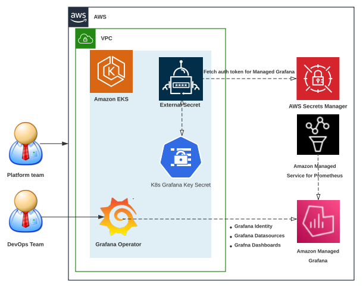

# Amazon Managed Grafana での GitOps と Grafana Operator の使用

## このガイドの使い方

このオブザーバビリティのベストプラクティスガイドは、Amazon Managed Grafana での Grafana リソースと Grafana ダッシュボードのライフサイクルを Kubernetes ネイティブの方法で作成および管理するために、Amazon EKS クラスター上で Kubernetes オペレータとして [grafana-operator](https://github.com/grafana-operator/grafana-operator#:~:text=The%20grafana%2Doperator%20is%20a,an%20easy%20and%20scalable%20way.) を使用したい開発者やアーキテクトを対象としています。

## はじめに

お客様は、Grafana をオープンソースの分析および監視ソリューションのためのオブザーバビリティプラットフォームとして使用しています。 
Amazon EKS でワークロードを実行しているお客様は、ワークロード重力に焦点を当て、Kubernetes ネイティブのコントローラーに依存して、Cloud リソースなどの外部リソースのデプロイとライフサイクル管理を委ねたいと考えていることがわかりました。 
お客様は、[Kubernetes 用 AWS コントローラー (ACK)](https://aws-controllers-k8s.github.io/community/docs/community/overview/) をインストールして、AWS サービスの作成、デプロイ、管理を行っていることがわかりました。 
最近では、多くのお客様が Prometheus と Grafana の実装をマネージドサービスに任せることを選択しており、AWS の場合、これらのサービスはワークロードの監視に [Amazon Managed Service for Prometheus](https://docs.aws.amazon.com/prometheus/?icmpid=docs_homepage_mgmtgov) と [Amazon Managed Grafana](https://docs.aws.amazon.com/grafana/?icmpid=docs_homepage_mgmtgov) です。

Grafana を使用する際にお客様が直面する一般的な課題の 1 つは、Kubernetes クラスタから Amazon Managed Grafana などの外部 Grafana インスタンスでの Grafana リソースと Grafana ダッシュボードの作成とライフサイクル管理です。 
お客様は、Git ベースのワークフローを使用したシステム全体のインフラストラクチャとアプリケーションのデプロイの完全な自動化と管理の方法を見つけることに課題を抱えています。これには、Amazon Managed Grafana での Grafana リソースの作成も含まれます。
このオブザーバビリティのベストプラクティスガイドでは、次のトピックに焦点を当てます。

* Grafana Operator の紹介 - Kubernetes クラスタから外部の Grafana インスタンスを管理するための Kubernetes Operator
* GitOps の紹介 - Git ベースのワークフローを使用したインフラストラクチャの自動作成と管理
* Amazon EKS での Grafana Operator を使用した Amazon Managed Grafana の管理
* Amazon EKS での Flux を使用した GitOps による Amazon Managed Grafana の管理

## Grafana Operator の概要

[grafana-operator](https://github.com/grafana-operator/grafana-operator#:~:text=The%20grafana%2Doperator%20is%20a,an%20easy%20and%20scalable%20way.) は、Kubernetes 内の Grafana インスタンスを管理するのに役立つ Kubernetes Operator です。Grafana Operator を使用すると、Grafana ダッシュボード、データソースなどを複数のインスタンス間で宣言的に管理および作成できるようになります。Grafana Operator は現在、Amazon Managed Grafana などの外部環境でホストされているダッシュボード、データソースなどのリソースの管理をサポートしています。これにより、[Flux](https://fluxcd.io/) などの CNCF プロジェクトを使用した GitOps メカニズムを利用して、Amazon EKS クラスタから Amazon Managed Grafana のリソースのライフサイクルを作成および管理できるようになります。

## GitOps の概要

### GitOps と Flux とは

GitOps は、デプロイ設定の真実の情報源として Git を利用するソフトウェア開発と運用の方法論です。アプリケーションやインフラストラクチャの目的の状態を Git リポジトリに保持し、変更を管理およびデプロイするために Git ベースのワークフローを利用することを含みます。GitOps は、システム全体を Git リポジトリで宣言的に記述するアプリケーションおよびインフラストラクチャのデプロイを管理する方法です。バージョン管理のベストプラクティス、イミュータブルなアーティファクト、自動化を活用して、複数の Kubernetes クラスタの状態を管理する能力を提供する運用モデルです。

Flux は、Kubernetes 上でのアプリケーションの自動デプロイを実現する GitOps ツールです。Git リポジトリの状態を継続的に監視し、変更をクラスタに適用することで機能します。Flux は、GitHub、GitLab、Bitbucket などの様々な Git プロバイダと統合されています。リポジトリに変更が加えられると、Flux がそれを自動的に検出し、クラスタを適切に更新します。

### Flux を使用するメリット

* **自動デプロイ**: Flux はデプロイプロセスを自動化し、手動のエラーを減らし、開発者が他のタスクに集中できるようにします。
* **Git ベースのワークフロー**: Flux は Git を真実の情報源として利用し、変更の追跡と巻き戻しを容易にします。
* **宣言的な構成**: Flux は Kubernetes のマニフェストを使用して、クラスタの望ましい状態を定義し、管理と変更の追跡を容易にします。

### Flux の採用における課題

* **カスタマイズの制限**: Flux は限られたカスタマイズのみをサポートしており、すべてのユースケースに適しているわけではありません。
* **学習曲線の急勾配**: Flux は新規ユーザーにとって学習曲線が急で、Kubernetes と Git の深い理解が必要です。

## Amazon Managed Grafana のリソースを管理するために Amazon EKS で Grafana Operator を使用する

前のセクションで説明したように、Grafana Operator を使用すると、Kubernetes ネイティブの方法で Amazon Managed Grafana のリソースのライフサイクルを作成および管理できます。 以下のアーキテクチャ図は、Kubernetes ネイティブの方法で Kubernetes クラスタをコントロールプレーンとして使用し、Grafana Operator を使って AMG で ID を設定し、データソースとして Amazon Managed Service for Prometheus を追加し、Amazon EKS クラスタから Amazon Managed Grafana にダッシュボードを作成するデモを示しています。

Kubernetes クラスタでオープンソースの Grafana Operator を使用して Amazon Managed Grafana を管理する方法の詳細なデモについては、[Using Open Source Grafana Operator on your Kubernetes cluster to manage Amazon Managed Grafana](https://aws.amazon.com/blogs/mt/using-open-source-grafana-operator-on-your-kubernetes-cluster-to-manage-amazon-managed-grafana/) を参照してください。

## Amazon Managed Grafana のリソースを管理するために Amazon EKS で Flux を使用した GitOps

上記で説明したように、Flux は Kubernetes 上のアプリケーションのデプロイを自動化します。 
Flux は、GitHub などの Git リポジトリの状態を継続的に監視し、リポジトリに変更が加えられると、それを自動的に検出してクラスタを適切に更新します。 
以下のアーキテクチャを参照してください。ここでは、Kubernetes クラスタから Grafana Operator を使用し、Flux を使用した GitOps メカニズムで、Kubernetes ネイティブの方法で Amazon Managed Grafana でデータソースとして Amazon Managed Service for Prometheus を追加し、ダッシュボードを作成する方法をデモンストレーションします。

One Observability ワークショップのモジュール「[Amazon Managed Grafana での GitOps](https://catalog.workshops.aws/observability/ja-JP/aws-managed-oss/gitops-with-amg)」を参照してください。このモジュールは、EKS クラスターに次のような必要な「Day 2」運用ツールを設定します。

* [External Secrets Operator](https://github.com/external-secrets/external-secrets/tree/main/deploy/charts/external-secrets) は、AWS Secrets Manager から Amazon Managed Grafana のシークレットを読み取るために正常にインストールされます
* [Prometheus Node Exporter](https://github.com/prometheus/node_exporter) は、メモリ、ディスク、CPU 使用率などのさまざまなマシンリソースを測定するために使用されます
* [Grafana Operator](https://github.com/grafana-operator/grafana-operator) は、Kubernetes ネイティブな方法で Kubernetes クラスタを使用して、Amazon Managed Grafana のリソースのライフサイクルを作成および管理できます
* [Flux](https://fluxcd.io/) は、GitOps メカニズムを使用して Kubernetes 上のアプリケーションのデプロイを自動化します

## 結論

Observability のベストプラクティスガイドのこのセクションでは、Amazon Managed Grafana での Grafana Operator と GitOps の利用について学びました。まず GitOps と Grafana Operator について学習しました。次に、Amazon EKS 上の Grafana Operator を使用して Amazon Managed Grafana のリソースを管理し、Amazon EKS 上の Flux を使用して GitOps で Amazon Managed Grafana のリソースを管理して AMG で ID を設定し、Kubernetes ネイティブの方法で Amazon Managed Grafana に AWS データソースを追加する方法に焦点を当てました。
