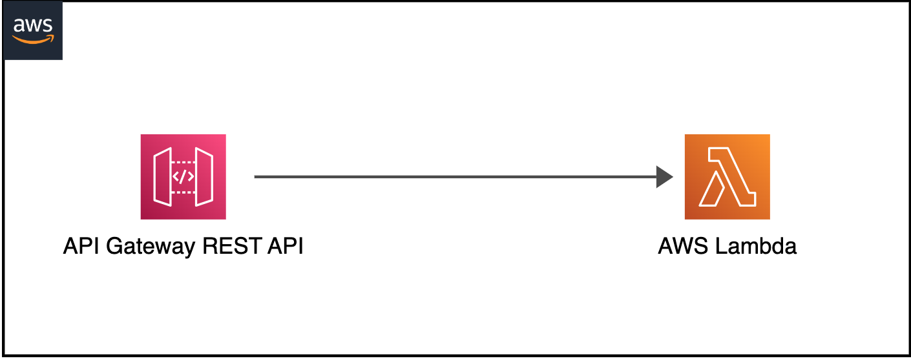

# Lambda ベースのサーバーレスアプリケーションのためのオブザーバビリティ

分散システムとサーバーレスコンピューティングの世界では、アプリケーションの信頼性とパフォーマンスを確保するために、オブザーバビリティを実現することが鍵となります。それは従来のモニタリングを超えたものです。Amazon CloudWatchやAWS X-RayなどのAWSのオブザーバビリティツールを利用することで、サーバーレスアプリケーションの洞察、トラブルシューティング、パフォーマンスの最適化が可能になります。このガイドでは、Lambdaベースのサーバーレスアプリケーションのオブザーバビリティを実装するために必要な概念、ツール、ベストプラクティスを学びます。

インフラストラクチャやアプリケーションのオブザーバビリティを実装する前に、主要な目的を決定することが第一歩です。目的としては、ユーザーエクスペリエンスの向上、開発者生産性の向上、サービスレベル目標(SLO)の達成、ビジネス収益の増加など、アプリケーションの種類に応じた具体的な目的が考えられます。したがって、これらの主要な目的を明確に定義し、その測定方法を確立する必要があります。そこから逆算して、オブザーバビリティ戦略を設計します。詳細は「[Monitor what matters](/observability-best-practices/ja/guides/#monitor-what-matters)」を参照してください。

## オブザーバビリティの柱

オブザーバビリティには3つの主要な柱があります。

* ログ: アプリケーションやシステム内で発生した障害、エラー、状態変化などの離散的なイベントのタイムスタンプ付き記録
* メトリクス: さまざまな時間間隔で測定された数値データ(時系列データ)。SLI(リクエストレート、エラーレート、持続時間、CPU% など)
* トレース: トレースは、複数のアプリケーションとシステム(通常はマイクロサービス)にまたがる単一ユーザーの移動を表します


AWS は、AWS Lambda アプリケーションの実行可能なインサイトを取得するためのロギング、メトリクスのモニタリング、トレーシングを容易にするために、ネイティブとオープンソースの両方のツールを提供しています。

## **ログ**

このオブザーバビリティのベストプラクティスガイドのセクションでは、次のトピックを深掘りします:

* 構造化されていないログと構造化されたログ
* CloudWatch Logs Insights
* ログの相関 ID
* Lambda Powertools を使用したコードサンプル
* CloudWatch ダッシュボードを使用したログの視覚化
* CloudWatch Logs の保持期間


ログは、アプリケーション内で発生した個々のイベントです。これらには、障害、エラー、実行パスなどのイベントが含まれます。ログは、構造化されていない形式、半構造化形式、構造化形式で記録できます。

### **構造化されていないログと構造化されたログ**

開発者はしばしば、`print` や `console.log` ステートメントを使用してアプリケーション内にシンプルなログメッセージから始めます。これらは大規模にプログラムで解析および分析することが困難であり、特に多数のログメッセージを異なるロググループ全体で生成できる AWS Lambda ベースのアプリケーションではそうです。その結果、これらのログを CloudWatch で統合することが困難になり、分析が難しくなります。ログで関連情報を見つけるには、テキストマッチまたは正規表現が必要になります。構造化されていないロギングの例を次に示します。

```
[2023-07-19T19:59:07Z]  INFO  Request started
[2023-07-19T19:59:07Z]  INFO  AccessDenied: Could not access resource
[2023-07-19T19:59:08Z]  INFO  Request finished
```

ご覧のとおり、ログメッセージに一貫した構造がないため、有用な洞察を取得することが困難です。また、コンテキスト情報を追加することも難しくなります。

一方、構造化ロギングは、ログをデータとしてではなくテキストとして扱うことを可能にする一貫したフォーマット(多くの場合は JSON)で情報を記録する方法です。これにより、クエリとフィルタリングが簡単になります。開発者は、ログをプログラムで効率的に保存、取得、および分析する機能を提供します。また、デバッグを容易にします。構造化ロギングは、ログレベルを介して異なる環境全体でログの詳細度を変更するためのよりシンプルな方法を提供します。**ロギングレベルに注意してください。** 過剰なロギングはコストの増加とアプリケーションスループットの低下を招きます。ロギングする前に、個人を特定できる情報が編集されていることを確認してください。構造化ロギングの例を次に示します。

```
{
   "correlationId": "9ac54d82-75e0-4f0d-ae3c-e84ca400b3bd",
   "requestId": "58d9c96e-ae9f-43db-a353-c48e7a70bfa8",
   "level": "INFO",
   "message": "AccessDenied",
   "function-name": "demo-observability-function",
   "cold-start": true
}
```


アプリケーションからのトランザクション、異なるコンポーネント間の相関 ID、ビジネスアウトカムに関する運用情報を発行するために、**CloudWatch ログへの構造化された集中ロギングを優先してください。**

### **CloudWatch Logs Insights**
JSON 形式のログのフィールドを自動的に検出できる CloudWatch Logs Insights を使用します。
さらに、JSON ログはアプリケーション固有のカスタムメタデータをログに記録して拡張でき、それを使用してログを検索、フィルタリング、集計できます。

### **ログの相関ID**

例えば、API Gateway からの HTTP リクエストの場合、相関 ID は `requestContext.requestId` パスに設定されます。この相関 ID は、Lambda Powertools を使用することで、下流の Lambda 関数内で簡単に抽出してログに記録できます。分散システムはしばしば、リクエストを処理するために複数のサービスやコンポーネントが連携しています。したがって、相関 ID をログに記録し、それを下流のシステムに渡すことが、エンドツーエンドのトレースとデバッグに不可欠です。相関 ID とは、リクエストの最初に割り当てられる一意の識別子です。リクエストがさまざまなサービスを通過するにつれて、相関 ID がログに含まれるため、リクエストの経路全体をトレースできます。AWS Lambda ログに相関 ID を手動で挿入するか、[AWS Lambda Powertools](https://docs.powertools.aws.dev/lambda/python/latest/core/logger/#setting-a-correlation-id) のようなツールを使用して、API Gateway から相関 ID を簡単に取得し、アプリケーションログとともに記録できます。例えば、HTTP リクエストの場合、相関 ID は API Gateway で開始され、Lambda 関数などのバックエンドサービスに渡される request-id になります。

### **Lambda Powertools を使用したコードサンプル**

ベストプラクティスとして、リクエストライフサイクルのできるだけ早い段階で相関IDを生成することをおすすめします。サーバレスアプリケーションのエントリーポイント、たとえば API Gateway やアプリケーションロードバランサーなどが適しています。UUID、リクエストID、または分散システム全体でリクエストを追跡できるその他の一意の属性を使用します。相関IDをカスタムヘッダー、本文、メタデータのいずれかとして、各リクエストとともに渡します。相関IDが下流のサービスのすべてのログエントリとトレースに含まれていることを確認してください。

Lambda 関数のログの一部として手動で相関 ID をキャプチャして含めるか、[AWS Lambda Powertools](https://docs.powertools.aws.dev/lambda/python/latest/core/logger/#setting-a-correlation-id) などのツールを使用できます。Lambda Powertools を使用すると、サポートされているアップストリームサービスの事前定義されたリクエスト [パスマッピング](https://github.com/aws-powertools/powertools-lambda-python/blob/08a0a7b68d2844d36c33ab8156640f4ea9632d0c/aws_lambda_powertools/logging/correlation_paths.py) から簡単に相関IDを取得し、アプリケーションログとともに自動的に追加できます。また、障害が発生した場合に簡単にデバッグして原因を特定し、元のリクエストに結び付けることができるように、すべてのエラーメッセージに相関 ID が追加されていることを確認してください。

以下のサーバレスアーキテクチャに対して、相関IDを用いた構造化ロギングのコードサンプルを見て、CloudWatch での表示方法を確認しましょう。



```
// Initializing Logger
Logger log = LogManager.getLogger();

// Uses @Logger annotation from Lambda Powertools, which takes optional parameter correlationIdPath to extract correlation Id from the API Gateway header and inserts correlation_id to the Lambda function logs in a structured format.
@Logging(correlationIdPath = "/headers/path-to-correlation-id")
public APIGatewayProxyResponseEvent handleRequest(final APIGatewayProxyRequestEvent input, final Context context) {
  ...
  // The log statement below will also have additional correlation_id
  log.info("Success")
  ...
}
```

この例では、Java ベースの Lambda 関数が Lambda Powertools ライブラリを使用して、API Gateway リクエストからの `correlation_id` をログに記録しています。

コードサンプルの CloudWatch ログの例:

```
{
   "level": "INFO",
   "message": "Success",
   "function-name": "demo-observability-function",
   "cold-start": true,
   "lambda_request_id": "52fdfc07-2182-154f-163f-5f0f9a621d72",
   "correlation_id": "<correlation_id_value>"
}_
```

</correlation_id_value>

### **CloudWatch ダッシュボードを使用したログの視覚化**

構造化 JSON 形式でデータをログに記録すると、[CloudWatch Logs Insights](https://docs.aws.amazon.com/AmazonCloudWatch/latest/logs/AnalyzingLogData.html) が JSON 出力の値を自動的に検出し、メッセージをフィールドとして解析します。CloudWatch Logs Insights は、ログストリームを検索およびフィルタリングするための SQL ライクなクエリ言語を提供します。glob と正規表現のパターンマッチングを使用して、複数のロググループに対してクエリを実行できます。さらに、カスタムクエリを作成して保存し、毎回再作成することなく再実行することもできます。


CloudWatch Logs Insights では、1つ以上の集計関数を使用したクエリから、折れ線グラフ、棒グラフ、積み上げ面グラフなどの視覚化を生成できます。これらの視覚化を簡単に CloudWatch ダッシュボードに追加できます。以下のサンプルダッシュボードは、Lambda 関数の実行時間のパーセンタイルレポートを示しています。このようなダッシュボードを使用することで、アプリケーションのパフォーマンスを改善する必要がある部分をすぐに把握できます。平均待ち時間は有用なメトリクスですが、**`平均待ち時間ではなく p99 を最適化することを目指すべきです。`**


ログを CloudWatch 以外の場所に送信するには、Lambda Extensions で [Lambda Telemetry API](https://docs.aws.amazon.com/lambda/latest/dg/telemetry-api.html) を使用できます。複数の[パートナーソリューション](https://docs.aws.amazon.com/lambda/latest/dg/extensions-api-partners.html)が、Lambda Telemetry API を利用し、システムとの統合を容易にする Lambda レイヤーを提供しています。

CloudWatch Logs Insights を最大限に活用するには、構造化ログとしてインジェストする必要があるデータを考えることが大切です。これにより、アプリケーションの正常性をより適切に監視できます。

### **CloudWatch Logs の保持期間**

デフォルトでは、Lambda 関数内の stdout に書き込まれたすべてのメッセージは、Amazon CloudWatch のログストリームに保存されます。Lambda 関数の実行ロールには、CloudWatch ログストリームの作成と、そのストリームへのログイベントの書き込み許可が必要です。CloudWatch はインジェストされたデータ量と使用されたストレージに応じて課金されることに注意することが重要です。したがって、ログ量を減らすことで、関連コストを最小限に抑えるのに役立ちます。**`デフォルトでは、CloudWatch ログは無期限に保持され、期限切れになりません。ログストレージコストを削減するために、ログの保持ポリシーを設定することをお勧めします`**。これをすべてのロググループに適用します。環境ごとに異なる保持ポリシーが必要な場合もあるでしょう。ログの保持は AWS コンソールで手動で設定できますが、一貫性とベストプラクティスを確保するために、インフラストラクチャ as コード(IaC)のデプロイの一部として設定する必要があります。以下は、Lambda 関数のログ保持を設定する方法を示すサンプルの CloudFormation テンプレートです:

```
Resources:
  Function:
    Type: AWS::Serverless::Function
    Properties:
      CodeUri: .
      Runtime: python3.8
      Handler: main.handler
      Tracing: Active

  # Explicit log group that refers to the Lambda function
  LogGroup:
    Type: AWS::Logs::LogGroup
    Properties:
      LogGroupName: !Sub "/aws/lambda/${Function}"
      # Explicit retention time
      RetentionInDays: 7
```

この例では、Lambda 関数と対応するロググループを作成しました。**`RetentionInDays`** プロパティは **7 日に設定されています**。つまり、このロググループのログは 7 日間保持され、その後自動的に削除されます。これにより、ログストレージコストを制御できます。

## **メトリクス**

オブザーバビリティのベストプラクティスガイドのこのセクションでは、次のトピックを深掘りします。

* ボックスから出荷されるメトリクスの監視とアラート
* カスタムメトリクスの公開
* 埋め込みメトリクスを使用したログからのメトリクスの自動生成
* CloudWatch Lambda Insights を使用したシステムレベルのメトリクスの監視
* CloudWatch アラームの作成

### **標準で提供されるメトリクスの監視とアラートの設定**

メトリクスとは、さまざまな時間間隔(時系列データ)で測定された数値データやサービスレベルインジケータ(リクエストレート、エラーレート、持続時間、CPU など)です。AWS サービスは、アプリケーションの運用状態を監視するのに役立つ、多数の標準のメトリクスを提供しています。アプリケーションに適用可能な主要なメトリクスを確立し、それらを使用してアプリケーションのパフォーマンスを監視してください。主要なメトリクスの例には、関数のエラー、キューの深さ、失敗したステートマシンの実行、API の応答時間などが含まれます。

標準で提供されるメトリクスに関する課題の 1 つは、CloudWatch ダッシュボードでそれらを分析する方法が分からないことです。たとえば、Concurrency を見るとき、最大値、平均値、パーセンタイルのどれを見ればいいのでしょうか。適切な統計情報の監視は、メトリクスごとに異なります。

ベストプラクティスとして、Lambda 関数の `ConcurrentExecutions` メトリクスでは、アカウントとリージョンの制限に近づいていないか、または該当する場合は Lambda の予約同時実行数の制限に近づいていないかを確認するために、`Count` 統計を確認してください。 イベントの処理に関数がかかる時間を示す `Duration` メトリクスの場合は、`Average` または `Max` の統計を確認してください。API のレイテンシを測定する場合は、API Gateway の `Latency` メトリクスの `Percentile` 統計を確認してください。P50、P90、P99 は、平均値よりもレイテンシを監視するためのはるかに優れた方法です。

監視するメトリクスが分かったら、これらの主要なメトリクスでアラートを設定し、アプリケーションのコンポーネントが不健全なときに通知を受け取れるようにしてください。 例:

* AWS Lambda の場合、Duration、Errors、Throttling、ConcurrentExecutions でアラートを設定します。 ストリームベースの呼び出しの場合は、IteratorAge でアラートを設定します。 非同期の呼び出しの場合は、DeadLetterErrors でアラートを設定します。
* Amazon API Gateway の場合、IntegrationLatency、Latency、5XXError、4XXError でアラートを設定します。  
* Amazon SQS の場合、ApproximateAgeOfOldestMessage、ApproximateNumberOfMessageVisible でアラートを設定します。
* AWS Step Functions の場合、ExecutionThrottled、ExecutionsFailed、ExecutionsTimedOut でアラートを設定します。

### **カスタムメトリクスの公開**

アプリケーションの目的とするビジネスおよび顧客成果に基づいて、重要業績評価指標(KPI)を特定します。KPI を評価して、アプリケーションの成功と運用状態を判断します。重要なメトリクスは、アプリケーションの種類によって異なりますが、訪問サイト、注文数、購入フライト、ページロード時間、ユニーク訪問者などが例として挙げられます。

CloudWatch メトリクス SDK の `putMetricData` API を呼び出すことで、カスタムメトリクスを CloudWatch に公開する方法があります。ただし、`putMetricData` API 呼び出しは同期的です。これにより、Lambda 関数の実行時間が長くなり、アプリケーション内の他の API 呼び出しを潜在的にブロックして、パフォーマンスのボトルネックを引き起こす可能性があります。また、Lambda 関数の実行時間が長くなると、コストが高くなります。さらに、CloudWatch に送信されるカスタムメトリクスの数と、API 呼び出し(PutMetricData API 呼び出しなど)の回数の両方に課金されます。

**カスタムメトリクスを公開するためのもっと効率的でコスト効果の高い方法は、** [CloudWatch Embedded Metrics Format](https://docs.aws.amazon.com/AmazonCloudWatch/latest/monitoring/CloudWatch_Embedded_Metric_Format.html)(EMF)です。CloudWatch Embedded Metric 形式を使用すると、CloudWatch ログに書き込まれるログとしてカスタムメトリクスを** `非同期的に` **生成できるため、アプリケーションのパフォーマンスが向上し、コストを下げることができます。EMF を使用すると、詳細なログイベントデータとともにカスタムメトリクスを埋め込み、CloudWatch がこれらのカスタムメトリクスを自動的に抽出するため、アウトオブザボックスのメトリクスのように可視化やアラームの設定ができます。埋め込みメトリクス形式でログを送信すると、[CloudWatch Logs Insights](https://docs.aws.amazon.com/AmazonCloudWatch/latest/logs/AnalyzingLogData.html) を使用してクエリでき、メトリクスのコストではなくクエリのコストのみを支払うことができます。

これを実現するには、[EMF 仕様](https://docs.aws.amazon.com/AmazonCloudWatch/latest/monitoring/CloudWatch_Embedded_Metric_Format_Specification.html) を使用してログを生成し、`PutLogEvents` API を使用して CloudWatch に送信します。プロセスを簡素化するために、**EMF 形式のメトリクスの作成をサポートする 2 つのクライアントライブラリが**あります。

* ローレベルのクライアントライブラリ ([aws-embedded-metrics](https://docs.aws.amazon.com/AmazonCloudWatch/latest/monitoring/CloudWatch_Embedded_Metric_Format_Libraries.html))
* Lambda Powertools の [Metrics](https://docs.powertools.aws.dev/lambda/java/core/metrics/)

### **[CloudWatch Lambda Insights](https://docs.aws.amazon.com/AmazonCloudWatch/latest/monitoring/Lambda-Insights.html) を使用してシステムレベルのメトリクスを監視する**

CloudWatch Lambda Insights は、CPU 時間、メモリ使用量、ディスク利用率、ネットワークパフォーマンスなどのシステムレベルのメトリクスを提供します。Lambda Insights は、**`コールドスタート`** や Lambda ワーカーのシャットダウンなどの診断情報も収集、集計、要約します。Lambda Insights は CloudWatch Lambda 拡張機能を利用しています。これは Lambda レイヤーとしてパッケージ化されています。有効にすると、システムレベルのメトリクスを収集し、その Lambda 関数の呼び出しごとに埋め込みメトリクス形式の単一のパフォーマンスログイベントを CloudWatch Logs に出力します。

!!! note
    CloudWatch Lambda Insights はデフォルトでは有効化されておらず、Lambda 関数ごとに有効化する必要があります。
    AWS コンソールまたはインフラストラクチャ as コード(IaC)を介して有効化できます。以下は、AWS サーバーレスアプリケーションモデル(SAM)を使用して有効化する例です。Lambda 関数に `LambdaInsightsExtension` 拡張レイヤーを追加し、Lambda 関数がログストリームを作成し、`PutLogEvents` API を呼び出してログを書き込めるアクセス許可を付与する `CloudWatchLambdaInsightsExecutionRolePolicy` 管理ポリシーも追加します。

```
// Add LambdaInsightsExtension Layer to your function resource
Resources:
  MyFunction:
    Type: AWS::Serverless::Function
    Properties:
      Layers:
        - !Sub "arn:aws:lambda:${AWS::Region}:580247275435:layer:LambdaInsightsExtension:14"
        
// Add IAM policy to enable Lambda function to write logs to CloudWatch
Resources:
  MyFunction:
    Type: AWS::Serverless::Function
    Properties:
      Policies:
        - `CloudWatchLambdaInsightsExecutionRolePolicy`
```

その後、CloudWatch コンソールの Lambda Insights でこれらのシステムレベルのパフォーマンスメトリクスを表示できます。


### **CloudWatch アラームの作成**
メトリクスが異常値を超えたときにアラートを出したり、自動的に修復アクションを実行することは、オブザーバビリティにとって非常に重要です。
Amazon [CloudWatch アラーム](https://docs.aws.amazon.com/ja_jp/AmazonCloudWatch/latest/monitoring/AlarmThatSendsEmail.html) を使用すると、アプリケーションとインフラストラクチャのメトリクスが静的または動的に設定されたしきい値を超えたときに、アラートを出したり修復アクションを自動化できます。

メトリクスのアラームを設定するには、一連のアクションをトリガーするしきい値を選択します。固定のしきい値を静的しきい値と呼びます。 
たとえば、Lambda 関数の `Throttles` メトリクスに対して、5 分間で 10% を超えた場合にアラームが作動するよう設定できます。 
これは、Lambda 関数がアカウントとリージョンの最大同時実行数に達した可能性があることを意味します。

サーバーレスアプリケーションでは、SNS(Simple Notification Service) を使用してアラートを送信するのが一般的です。 
これにより、ユーザーは電子メール、SMS、その他のチャネルを介してアラートを受信できます。 
さらに、Lambda 関数を SNS トピックにサブスクライブすることで、アラームが作動した原因となった問題を自動的に修復できます。

たとえば、Lambda 関数 A が SQS キューをポーリングしてダウンストリームサービスを呼び出しているとします。 
ダウンストリームサービスがダウンしていて応答がない場合、Lambda 関数は SQS からのポーリングを続け、ダウンストリームサービスへの呼び出しに失敗し続けます。 
これらのエラーを監視して SNS を使用して CloudWatch アラームを生成し、適切なチームに通知することができますが、SNS サブスクリプションを介して別の Lambda 関数 B を呼び出して、Lambda 関数 A のイベントソースマッピングを無効にし、ダウンストリームサービスが再起動するまで SQS キューのポーリングを停止することもできます。

個々のメトリクスに対してアラームを設定することは良いことですが、アプリケーションの運用状況とパフォーマンスをよりよく理解するためには複数のメトリクスを監視する必要がある場合もあります。
そのような場合は、 [メトリック数式](https://docs.aws.amazon.com/ja_jp/AmazonCloudWatch/latest/monitoring/using-metric-math.html) を使用して、複数のメトリクスに基づいてアラームを設定する必要があります。

たとえば、AWS Lambda のエラーを監視したいが、アラームをトリガーせずに少数のエラーを許容したい場合は、エラーレート式をパーセンテージの形式で作成できます。
つまり、ErrorRate = errors / invocation * 100 のようにしてから、設定された評価期間内で ErrorRate が 20% を超えた場合にアラートを送信するアラームを作成します。

## **トレーシング**

オブザーバビリティのベストプラクティスガイドのこのセクションでは、次のトピックを深掘りします。

* 分散トレーシングと AWS X-Ray の概要
* 適切なサンプリングルールの適用
* X-Ray SDK を使用した他のサービスとの対話のトレーシング
* X-Ray SDK を使用した統合サービスのトレーシングのコードサンプル

### 分散トレーシングと AWS X-Ray の概要

ほとんどのサーバーレスアプリケーションは、複数のマイクロサービスで構成されており、各マイクロサービスは複数の AWS サービスを利用しています。 サーバーレスアーキテクチャの性質上、分散トレーシングが不可欠です。 効果的なパフォーマンスモニタリングとエラートラッキングのために、ソース呼び出し元からすべての下流のサービスを経由するアプリケーションフロー全体のトランザクションをトレースすることが重要です。 個々のサービスのログを使用してこれを実現することは可能ですが、AWS X-Ray のようなトレーシングツールを使用する方がより高速で効率的です。 詳細については、[アプリケーションへの AWS X-Ray の実装](https://docs.aws.amazon.com/ja_jp/xray/latest/devguide/xray-instrumenting-your-app.html) を参照してください。

AWS X-Ray を使用すると、関連するマイクロサービスを介してリクエストをトレースできます。 X-Ray サービスマップを使用すると、さまざまなインテグレーションポイントを理解し、アプリケーションのパフォーマンス低下を特定できます。 ほんの数クリックで、アプリケーションのどのコンポーネントがエラー、スロットリング、レイテンシの問題を引き起こしているかをすばやく特定できます。 サービスグラフの下には、各マイクロサービスにかかった正確な時間も表示されます。


**`ベストプラクティスとして、ダウンストリーム呼び出しや監視が必要な特定の機能のためにコード内にカスタムサブセグメントを作成します`**。 たとえば、外部 HTTP API への呼び出しや SQL データベースクエリのためのサブセグメントを作成できます。

たとえば、ダウンストリームサービスへの呼び出しを行う関数のカスタムサブセグメントを作成するには、node.js で `captureAsyncFunc` 関数を使用します。

```
var AWSXRay = require('aws-xray-sdk');

app.use(AWSXRay.express.openSegment('MyApp'));

app.get('/', function (req, res) {
  var host = 'api.example.com';

  // start of the subsegment
  AWSXRay.captureAsyncFunc('send', function(subsegment) {
    sendRequest(host, function() {
      console.log('rendering!');
      res.render('index');

      // end of the subsegment
      subsegment.close();
    });
  });
});
```

この例では、アプリケーションは `sendRequest` 関数への呼び出し用に `send` という名前のカスタムサブセグメントを作成しています。 `captureAsyncFunc` はサブセグメントを渡し、非同期呼び出しが完了したときにコールバック関数内で閉じる必要があります。

### **適切なサンプリングルールを適用する**

AWS X-Ray SDK は、デフォルトではすべてのリクエストをトレースしません。高コストをかけずに、リクエストの代表的なサンプルを提供するために、保守的なサンプリングルールを適用します。ただし、ニーズに応じて、デフォルトのサンプリングルールをカスタマイズしたり、サンプリングを完全に無効にして、すべてのリクエストのトレースを開始することができます。

AWS X-Ray は監査やコンプライアンスのツールとして使用することを意図していないことに注意することが重要です。**「アプリケーションのタイプごとに異なるサンプリングレートを考慮する必要があります」**。たとえば、バックグラウンドのポーリングやヘルスチェックなどの高ボリュームの読み取り専用の呼び出しは、潜在的な問題を特定するのに十分なデータを提供しながら、より低いレートでサンプリングできます。**「環境ごとに異なるサンプリングレート」** も必要になる場合があります。たとえば、開発環境では、エラーやパフォーマンスの問題を簡単にトラブルシューティングできるように、すべてのリクエストをトレースしたい場合があります。一方、本番環境では、トレース数を少なくすることができます。**「広範囲なトレーシングはコストの増加につながる可能性があることにも留意する必要があります」**。サンプリングルールの詳細については、[_Configuring sampling rules in the X-Ray console_](https://docs.aws.amazon.com/xray/latest/devguide/xray-console-sampling.html) を参照してください。

### **X-Ray SDK を使用して他の AWS サービスとの対話をトレースする**

X-Ray トレースは、AWS Lambda や Amazon API Gateway などのサービスでは、クリック数回または IaC ツール上の数行で簡単に有効化できますが、他のサービスではコードへの計装が追加手順として必要です。[X-Ray と統合されている AWS サービスの完全なリストはこちら](https://docs.aws.amazon.com/xray/latest/devguide/xray-services.html)をご覧ください。

DynamoDB など X-Ray と統合されていないサービスへの呼び出しを計装するには、AWS SDK 呼び出しを AWS X-Ray SDK でラップすることでトレースをキャプチャできます。たとえば、node.js を使用する場合は、以下のコード例に従ってすべての AWS SDK 呼び出しをキャプチャできます:

### **X-Ray SDK を使用した統合サービスのトレースのためのコードサンプル**

```
//... FROM (old code)
const AWS = require('aws-sdk');

//... TO (new code)
const AWSXRay = require('aws-xray-sdk-core');
const AWS = AWSXRay.captureAWS(require('aws-sdk'));
...
```

!!! note
    個々のクライアントを計装するには、AWS SDK クライアントを `AWSXRay.captureAWSClient` の呼び出しでラップします。`captureAWS` と `captureAWSClient` を一緒に使用しないでください。これにより重複したトレースが発生します。

## **追加リソース**

[CloudWatch Logs Insights](https://docs.aws.amazon.com/AmazonCloudWatch/latest/logs/AnalyzingLogData.html)

[CloudWatch Lambda Insights](https://docs.aws.amazon.com/AmazonCloudWatch/latest/monitoring/Lambda-Insights.html)

[Embedded Metrics Library](https://github.com/awslabs/aws-embedded-metrics-java)

## 要約

この AWS Lambda ベースのサーバーレスアプリケーションのためのオブザーバビリティのベストプラクティスガイドでは、Amazon CloudWatch や AWS X-Ray などのネイティブ AWS サービスを使用したログ、メトリクス、トレースなどの重要な側面について説明しました。AWS Lambda Powertools ライブラリを使用して、アプリケーションに簡単にオブザーバビリティのベストプラクティスを追加することをおすすめします。これらのベストプラクティスを採用することで、サーバーレスアプリケーションの貴重な洞察を解き明かし、エラー検出とパフォーマンスの最適化をより迅速に行うことができます。

さらに深い潜水のために、AWS の [One Observability ワークショップ](https://catalog.workshops.aws/observability/ja-JP) の AWS ネイティブオブザーバビリティ モジュールを実践することを強くおすすめします。
