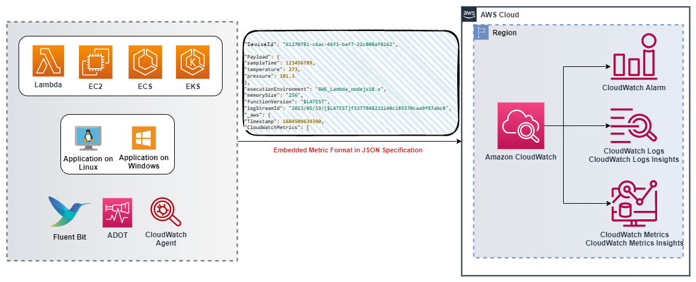

# CloudWatch Embedded Metric Format

## はじめに

CloudWatch Embedded Metric Format(EMF) を使用すると、ログの形式で複雑な高基数アプリケーションデータを Amazon CloudWatch にインジェストし、実行可能なメトリクスを生成できます。Embedded Metric Format を使用することで、複雑なアーキテクチャに依存したり、サードパーティのツールを使用したりすることなく、環境の洞察を得ることができます。この機能はすべての環境で使用できますが、AWS Lambda 関数や Amazon Elastic Container Service(Amazon ECS)、Amazon Elastic Kubernetes Service(Amazon EKS)、EC2 上の Kubernetes のコンテナなどの短期間で終了するリソースを使用するワークロードで特に役立ちます。Embedded Metric Format を使用することで、お客様はコードの計装やメンテナンスを行うことなく、カスタムメトリクスを簡単に作成でき、ログデータから強力な分析機能を得ることができます。

## 埋め込みメトリクスフォーマット(EMF)ログの仕組み

Amazon EC2、オンプレミスサーバー、Amazon Elastic Container Service(Amazon ECS)のコンテナ、Amazon Elastic Kubernetes Service(Amazon EKS)、EC2 上の Kubernetes などのコンピュート環境は、CloudWatch エージェントを通じて埋め込みメトリクスフォーマット(EMF)ログを生成し、Amazon CloudWatch に送信できます。

AWS Lambda では、カスタムコードの記述やネットワーク呼び出しのブロック、サードパーティソフトウェアに依存することなく、簡単にカスタムメトリクスを生成できるため、Amazon CloudWatch に埋め込みメトリクスフォーマット(EMF)ログを生成および取り込むことができます。

構造化ログを公開しつつ、[EMF 仕様](https://docs.aws.amazon.com/AmazonCloudWatch/latest/monitoring/CloudWatch_Embedded_Metric_Format_Specification.html)に合わせて非同期的に詳細なログイベントデータとともにカスタムメトリクスを埋め込む際に、特別なヘッダー宣言を提供する必要がありません。CloudWatch は自動的にカスタムメトリクスを抽出するため、リアルタイムのインシデント検知のためのビジュアライゼーションとアラームの設定が可能です。抽出されたメトリクスに関連付けられた詳細なログイベントと高基数コンテキストは、CloudWatch Logs Insights を使用してクエリできるため、運用イベントの根本原因について深い洞察を得ることができます。 

[Fluent Bit](https://docs.fluentbit.io/manual/pipeline/outputs/cloudwatch) の Amazon CloudWatch 出力プラグインを使用すると、[埋め込みメトリクスフォーマット](https://github.com/aws/aws-for-fluent-bit)(EMF) をサポートしたメトリクスとログデータを Amazon CloudWatch サービスに取り込むことができます。



## Embedded Metric Format(EMF)ログの使用時期

従来、モニタリングは3つのカテゴリに分類されてきました。1つ目のカテゴリは、アプリケーションのクラシックなヘルスチェックです。2つ目のカテゴリは「メトリクス」で、カウンター、タイマー、ゲージなどのモデルを使用してアプリケーションにインスツルメンテーションを適用するものです。3つ目のカテゴリは「ログ」で、アプリケーションの全体的な可観測性にとって不可欠なものです。ログは、アプリケーションの動作について継続的な情報を顧客に提供します。 現在、顧客はデータの粒度や豊富さを犠牲にすることなく、アプリケーションを観察する方法を大幅に改善することができます。それは、アプリケーションのすべてのインスツルメンテーションを統一し、簡素化しながら、Embedded Metric Format(EMF)ログを通じて信じられないほどの分析機能を得ることができるからです。

[Embedded Metric Format(EMF)ログ](https://aws.amazon.com/blogs/mt/enhancing-workload-observability-using-amazon-cloudwatch-embedded-metric-format/)は、EMFログの一部として高基数アプリケーションデータを生成できる環境に理想的です。これにより、メトリクスディメンションを増やすことなく、アプリケーションデータの一部とすることができます。 これにより、顧客は、メトリクスディメンションとして属性をすべて設定する必要がなくなり、CloudWatch Logs InsightsとCloudWatch Metrics Insightsを使用してEMFログをクエリすることで、アプリケーションデータをスライスおよびダイスできます。

[何百万ものテルコまたはIoTデバイスからのテレメトリデータを集約](https://aws.amazon.com/blogs/mt/how-bt-uses-amazon-cloudwatch-to-monitor-millions-of-devices/)する顧客は、デバイスのパフォーマンスと、デバイスが報告する一意のテレメトリにすばやく深掘り調査できる機能が必要です。 また、膨大なデータを掘り下げることなく、問題をより簡単かつ高速にトラブルシューティングできる必要があり、品質の高いサービスを提供する必要があります。 Embedded Metric Format(EMF)ログを使用することで、メトリクスとログを1つのエンティティに統合することで大規模な可観測性を実現し、コスト効率とパフォーマンスの向上によりトラブルシューティングを改善できます。

## 組み込みメトリクスフォーマット (EMF) ログの生成

組み込みメトリクスフォーマットログを生成および送信するために、次の方法が利用できます。

1. [CloudWatch](https://docs.aws.amazon.com/ja_jp/AmazonCloudWatch/latest/monitoring/CloudWatch_Embedded_Metric_Format_Generation_CloudWatch_Agent.html)、Fluent Bit、Firelensなどのエージェントを使用して、オープンソースのクライアントライブラリを使ってEMFログを生成および送信します。

   - EMFログを作成するために使用できる以下の言語でオープンソースのクライアントライブラリが利用可能です。
     - [Node.Js](https://github.com/awslabs/aws-embedded-metrics-node)
     - [Python](https://github.com/awslabs/aws-embedded-metrics-python)
     - [Java](https://github.com/awslabs/aws-embedded-metrics-java)
     - [C#](https://github.com/awslabs/aws-embedded-metrics-dotnet)
   - AWS Distro for OpenTelemetry(ADOT)を使用してEMFログを生成できます。ADOTは、Cloud Native Computing Foundation(CNCF)の一部であるOpenTelemetryプロジェクトの、セキュアで本番稼働可能なAWSサポート付きディストリビューションです。OpenTelemetryは、アプリケーションモニタリングのための分散トレース、ログ、メトリクスを収集するためのAPI、ライブラリ、エージェントを提供するオープンソースイニシアチブであり、ベンダー固有のフォーマット間の境界と制限を取り除きます。これには、OpenTelemetry準拠のデータソースと、 [CloudWatch EMF](https://aws-otel.github.io/docs/getting-started/cloudwatch-metrics#cloudwatch-emf-exporter-awsemf) ログで使用するために有効化された [ADOT Collector](https://github.com/open-telemetry/opentelemetry-collector-contrib/tree/main/exporter/awsemfexporter) の2つのコンポーネントが必要です。

2. [定義された仕様](https://docs.aws.amazon.com/ja_jp/AmazonCloudWatch/latest/monitoring/CloudWatch_Embedded_Metric_Format_Specification.html)に準拠するJSONフォーマットの手動構築ログを、[CloudWatchエージェント](https://docs.aws.amazon.com/ja_jp/AmazonCloudWatch/latest/monitoring/CloudWatch_Embedded_Metric_Format_Generation_CloudWatch_Agent.html) または [PutLogEvents API](https://docs.aws.amazon.com/ja_jp/AmazonCloudWatch/latest/monitoring/CloudWatch_Embedded_Metric_Format_Generation_PutLogEvents.html) を介してCloudWatchに送信できます。

## CloudWatch コンソールで Embedded Metric Format ログを表示する

メトリクスを抽出する Embedded Metric Format (EMF) ログを生成した後、お客様は [CloudWatch コンソールでそれらを表示](https://docs.aws.amazon.com/ja_jp/AmazonCloudWatch/latest/monitoring/CloudWatch_Embedded_Metric_Format_View.html) できます。Embedded メトリクスには、ログ生成時に指定されたディメンションがあります。クライアントライブラリを使用して生成された埋め込みメトリクスには、ServiceType、ServiceName、LogGroup がデフォルトのディメンションとして設定されます。

- **ServiceName**: サービスの名前は上書きされますが、サービスの名前を推測できないサービス(EC2 で実行されている Java プロセスなど)の場合、明示的に設定されていない限り、デフォルト値の Unknown が使用されます。

- **ServiceType**: サービスのタイプは上書きされますが、タイプを推測できないサービス(EC2 で実行されている Java プロセスなど)の場合、明示的に設定されていない限り、デフォルト値の Unknown が使用されます。

- **LogGroupName**: エージェントベースのプラットフォームの場合、お客様はオプションでメトリクスを配信する必要がある宛先ロググループを構成できます。この値はライブラリからエージェントに Embedded Metric ペイロードで渡されます。LogGroup が指定されていない場合、サービス名からデフォルト値が導出されます: -metrics

- **LogStreamName**: エージェントベースのプラットフォームの場合、お客様はオプションでメトリクスを配信する必要がある宛先ログストリームを構成できます。この値はライブラリからエージェントに Embedded Metric ペイロードで渡されます。LogStreamName が指定されていない場合、エージェントによってデフォルト値が導出されます(これはおそらくホスト名になります)。

- **NameSpace**: CloudWatch の名前空間をオーバーライドします。設定されていない場合、デフォルト値の aws-embedded-metrics が使用されます。

CloudWatch コンソールログの EMF ログのサンプルは次のようになります。

```json
2023-05-19T15:20:39.391Z 238196b6-c8da-4341-a4b7-0c322e0ef5bb INFO
{
    "LogGroup": "emfTestFunction",
    "ServiceName": "emfTestFunction",
    "ServiceType": "AWS::Lambda::Function",
    "Service": "Aggregator",
    "AccountId": "XXXXXXXXXXXX",
    "RequestId": "422b1569-16f6-4a03-b8f0-fe3fd9b100f8",
    "DeviceId": "61270781-c6ac-46f1-baf7-22c808af8162",
    "Payload": {
        "sampleTime": 123456789,
        "temperature": 273,
        "pressure": 101.3
    },
    "executionEnvironment": "AWS_Lambda_nodejs18.x",
    "memorySize": "256",
    "functionVersion": "$LATEST",
    "logStreamId": "2023/05/19/[$LATEST]f3377848231140c185570caa9f97abc8",
    "_aws": {
        "Timestamp": 1684509639390,
        "CloudWatchMetrics": [
            {
                "Dimensions": [
                    [
                        "LogGroup",
                        "ServiceName",
                        "ServiceType",
                        "Service"
                    ]
                ],
                "Metrics": [
                    {
                        "Name": "ProcessingLatency",
                        "Unit": "Milliseconds"
                    }
                ],
                "Namespace": "aws-embedded-metrics"
            }
        ]
    },
    "ProcessingLatency": 100
}
```

同じ EMF ログについて、抽出されたメトリクスは次のようになり、**CloudWatch Metrics** でクエリできます。


お客様は、**CloudWatch Logs Insights** を使用して、抽出されたメトリクスに関連付けられている詳細なログイベントをクエリし、運用イベントの根本原因について深い洞察を得ることができます。EMF ログからメトリクスを抽出する利点の 1 つは、お客様が一意のメトリクス(メトリクス名と一意のディメンションセット)とメトリクス値でログをフィルタリングし、集計されたメトリクス値に寄与したイベントのコンテキストを取得できることです。

上記で説明した同じ EMF ログについて、ProcessingLatency をメトリクスとして、Service をディメンションとして、影響を受けたリクエスト ID やデバイス ID を取得するサンプルクエリを、CloudWatch Logs Insights のサンプルクエリとして以下に示します。

```json
filter ProcessingLatency < 200 and Service = "Aggregator"
| fields @requestId, @ingestionTime, @DeviceId
```


## EMF ログで作成されたメトリクスのアラーム

[EMF によって生成されたメトリクスのアラーム](https://docs.aws.amazon.com/ja_jp/AmazonCloudWatch/latest/monitoring/CloudWatch_Embedded_Metric_Format_Alarms.html) の作成は、他のメトリクスのアラームの作成と同じパターンに従います。ここで注意すべき重要な点は、EMF メトリクスの生成はログのパブリッシング フローに依存していることです。これは、CloudWatch Logs が EMF ログを処理しメトリクスに変換するためです。したがって、アラームが評価される時間内にメトリクス データポイントが作成されるように、タイムリーにログをパブリッシュすることが重要です。

上記の同じ EMF ログを使用して、しきい値を使用した ProcessingLatency メトリクスをデータポイントとするアラームの例を作成し、以下に示します。


## EMF ログの最新機能

カスタマーは [PutLogEvents API](https://docs.aws.amazon.com/AmazonCloudWatch/latest/monitoring/CloudWatch_Embedded_Metric_Format_Generation_PutLogEvents.html) を使用して EMF ログを CloudWatch Logs に送信できます。オプションで HTTP ヘッダー `x-amzn-logs-format: json/emf` を含めることで、CloudWatch Logs にメトリクスを抽出するよう指示できましたが、これはもう必要ありません。

Amazon CloudWatch は、構造化ログから Embedded Metric Format (EMF) を使用して、最大 1 秒の粒度で[高解像度のメトリクス抽出](https://aws.amazon.com/about-aws/whats-new/2023/02/amazon-cloudwatch-high-resolution-metric-extraction-structured-logs/)をサポートしています。カスタマーは EMF 仕様ログ内にオプションの [StorageResolution](https://docs.aws.amazon.com/AmazonCloudWatch/latest/monitoring/cloudwatch_concepts.html#Resolution_definition) パラメータを指定できます。これに 1 または 60 (デフォルト) の値を設定することで、メトリクスの希望解像度 (秒単位) を示すことができます。カスタマーは標準解像度 (60 秒) と高解像度 (1 秒) の両方のメトリクスを EMF 経由で公開できるため、アプリケーションの正常性とパフォーマンスを詳細に可視化できます。

Amazon CloudWatch は、Embedded Metric Format (EMF) でのエラーの[可視性を強化](https://aws.amazon.com/about-aws/whats-new/2023/01/amazon-cloudwatch-enhanced-error-visibility-embedded-metric-format-emf/)しました。2 つのエラーメトリクス ([EMFValidationErrors と EMFParsingErrors](https://docs.aws.amazon.com/AmazonCloudWatch/latest/logs/CloudWatch-Logs-Monitoring-CloudWatch-Metrics.html)) が用意されています。この可視性の強化により、カスタマーは EMF を活用した際のエラーをすばやく特定して修正できるため、計装プロセスが簡素化されます。

現代のアプリケーションを管理する複雑さが増す中、カスタマーメトリクスを定義および分析する際の柔軟性がより必要とされています。そのため、メトリクスディメンションの最大数が 10 から 30 に増えました。カスタマーは [EMF ログを使用して最大 30 ディメンションのカスタムメトリクスを作成](https://aws.amazon.com/about-aws/whats-new/2022/08/amazon-cloudwatch-metrics-increases-throughput/)できます。

## 参考資料

- One Observability ワークショップの [AWS Lambda 関数での Embedded Metric Format](https://catalog.workshops.aws/observability/ja/aws-native/metrics/emf/clientlibrary) のサンプル (NodeJS ライブラリ使用)
- Serverless Observability ワークショップの [Embedded Metrics Format(EMF) を使用した非同期メトリクス](https://serverless-observability.workshop.aws/ja/030_cloudwatch/async_metrics_emf.html)
- [PutLogEvents API を使用した EMF ログの CloudWatch Logs への送信](https://catalog.workshops.aws/observability/ja/aws-native/metrics/emf/putlogevents) の Java コードサンプル
- ブログ記事: [Amazon CloudWatch 組み込みカスタムメトリクスでコスト削減と顧客重視を実現](https://aws.amazon.com/blogs/mt/lowering-costs-and-focusing-on-our-customers-with-amazon-cloudwatch-embedded-custom-metrics/)
