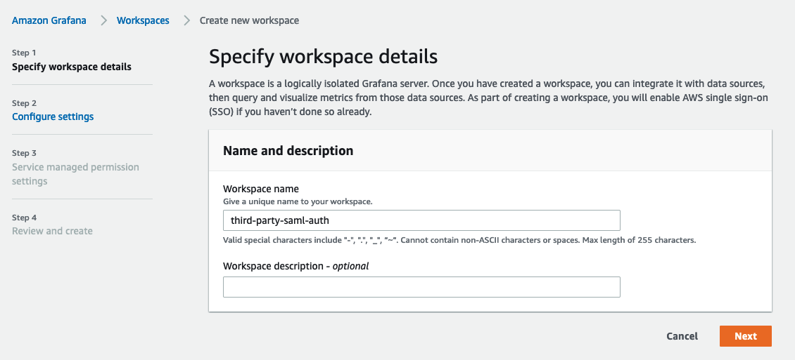
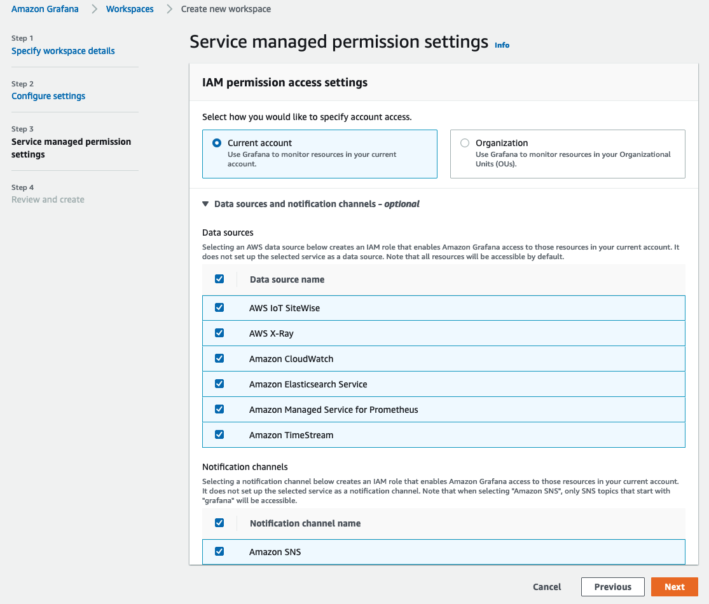
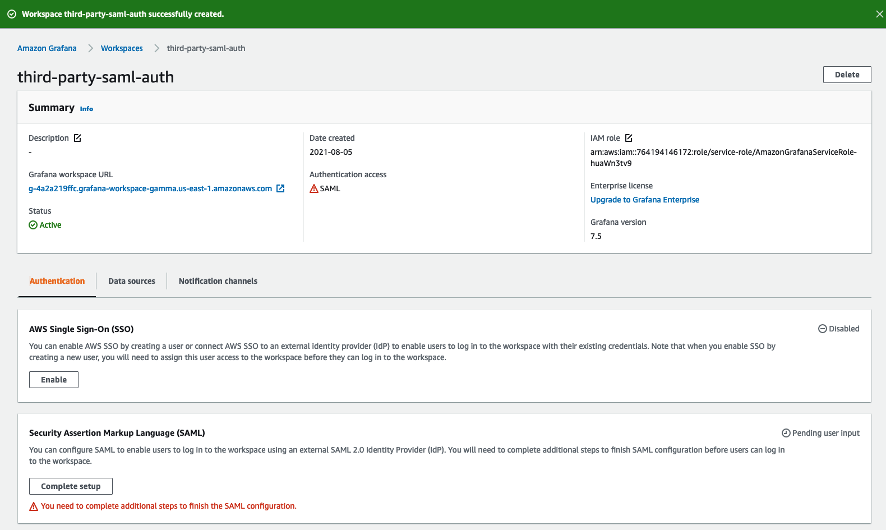
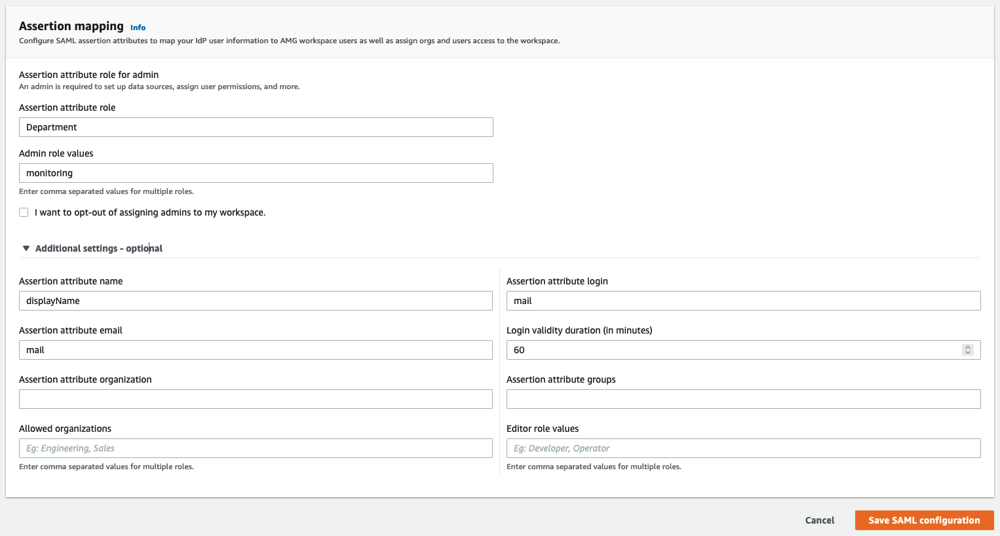

# SAMLを使用したAmazon Managed GrafanaでのGoogle Workspace認証の設定

このガイドでは、SAML 2.0プロトコルを使用して、Google WorkspaceをAmazon Managed GrafanaのIDプロバイダ(IdP)として設定する方法を説明します。

このガイドに従うには、[Amazon Managed Grafanaワークスペース][amg-ws]の作成に加えて、有料の[Google Workspace][google-workspaces]アカウントを作成する必要があります。

### Amazon Managed Grafana ワークスペースの作成

Amazon Managed Grafana コンソールにログインし、**Create workspace** をクリックします。次の画面で、
以下のようにワークスペース名を指定します。その後、**Next** をクリックします:

**Configure settings** ページで、ユーザーがログインするための SAML ベースのアイデンティティプロバイダを設定できるように、**Security Assertion Markup Language (SAML)**
オプションを選択します:

選択したいデータソースを選択し、**Next** をクリックします:

**Review and create** 画面で、**Create workspace** ボタンをクリックします: 

これにより、次のような新しい Amazon Managed Grafana ワークスペースが作成されます:

### Google ワークスペースの設定

Google ワークスペースにスーパーアドミンのアクセス許可でログインし、**アプリ**セクションの**Web およびモバイル アプリ**に移動します。そこで、**アプリの追加**をクリックし、**カスタム SAML アプリの追加**を選択します。以下のようにアプリの名前を付けます。**続行**をクリックします。

次の画面で、SAML メタデータファイルをダウンロードするために **メタデータのダウンロード** ボタンをクリックします。**続行**をクリックします。

次の画面では、ACS URL、エンティティ ID、開始 URL フィールドが表示されます。
これらのフィールドの値は、Amazon Managed Grafana コンソールから取得できます。

**名前 ID 形式**フィールドのドロップダウンから **E メール**を選択し、**名前 ID** フィールドで **基本情報 > プライマリ E メール**を選択します。

**続行**をクリックします。

**属性マッピング** 画面で、以下のスクリーンショットのように **Google ディレクトリ属性** と **アプリ属性** 間のマッピングを行います。

Google 認証経由でログインするユーザーが **Amazon Managed Grafana** で **管理者** 権限を持つためには、**部署** フィールドの値を ***monitoring*** に設定します。 これには任意のフィールドと値を選択できます。Google ワークスペース側で使用するものは何でも、Amazon Managed Grafana の SAML 設定でそれを反映するマッピングを行うことを確認してください。

### Amazon Managed Grafana に SAML メタデータをアップロードする

次に、Amazon Managed Grafana コンソールで、**Upload or copy/paste** オプションをクリックし、**Choose file** ボタンを選択して、Google ワークスペースから以前ダウンロードした SAML メタデータファイルをアップロードします。

**Assertion mapping** セクションで、**Assertion attribute role** フィールドに **Department** と入力し、**Admin role values** フィールドに **monitoring** と入力します。
これにより、**Department** が **monitoring** としてログインするユーザーは Grafana で **Admin** 権限を持ち、ダッシュボードやデータソースの作成などの管理者タスクを実行できるようになります。

以下のスクリーンショットに示すように、**Additional settings - optional** セクションの値を設定します。 **Save SAML configuration** をクリックします。

これで、Amazon Managed Grafana は Google ワークスペースを使用してユーザーを認証するように設定されました。

ユーザーがログインすると、次のように Google ログインページにリダイレクトされます。

資格情報を入力すると、以下のスクリーンショットのように Grafana にログインされます。

ご覧のとおり、ユーザーは Google ワークスペース認証を使用して Grafana に正常にログインできました。

[google-workspaces]: https://workspace.google.com/
[amg-ws]: https://docs.aws.amazon.com/grafana/latest/userguide/getting-started-with-AMG.html#AMG-getting-started-workspace
