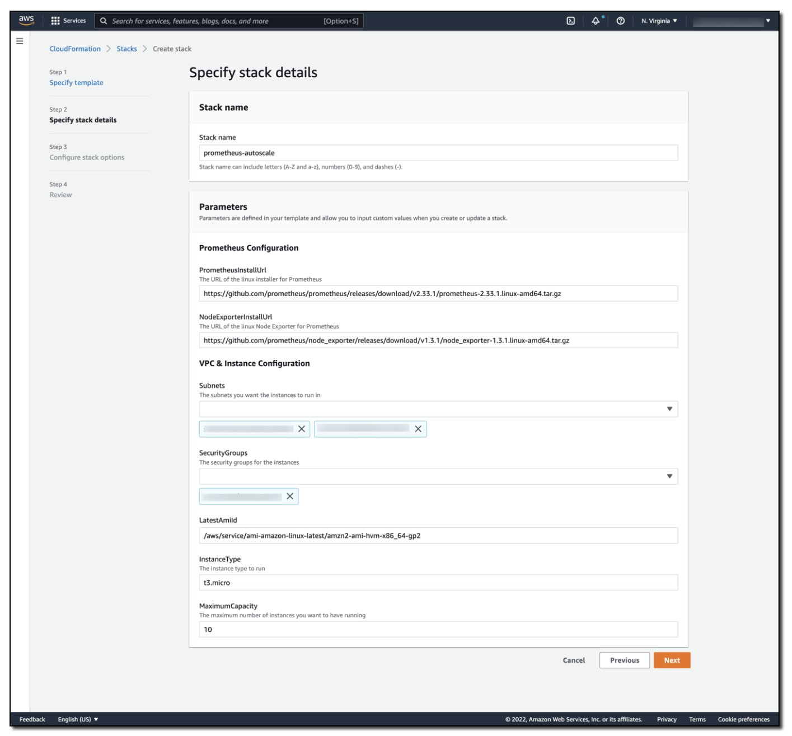

# Amazon Managed Service for Prometheus とアラートマネージャーを使用した Amazon EC2 の自動スケーリング

お客様は、既存の Prometheus ワークロードをクラウドに移行し、クラウドが提供するすべての機能を利用したいと考えています。AWS には Amazon [EC2 Auto Scaling](https://aws.amazon.com/ec2/autoscaling/) のようなサービスがあり、これにより CPU やメモリ利用率などのメトリクスに基づいて [Amazon Elastic Compute Cloud (Amazon EC2)](https://aws.amazon.com/pm/ec2/) インスタンスをスケールアウトできます。Prometheus メトリクスを使用するアプリケーションは、モニタリングスタックを置き換える必要なく、EC2 Auto Scaling と簡単に統合できます。この投稿では、[Amazon Managed Service for Prometheus アラートマネージャー](https://aws.amazon.com/prometheus/) と連携するように Amazon EC2 Auto Scaling を設定する方法を説明します。このアプローチにより、Prometheus ベースのワークロードをクラウドに移行しながら、自動スケーリングなどのサービスを活用できます。

Amazon Managed Service for Prometheus は、[PromQL](https://prometheus.io/docs/prometheus/latest/querying/basics/) を使用する[アラートルール](https://docs.aws.amazon.com/prometheus/latest/userguide/AMP-Ruler.html)をサポートしています。[Prometheus アラートルールのドキュメント](https://prometheus.io/docs/prometheus/latest/configuration/alerting_rules/) には、有効なアラートルールの構文と例が記載されています。同様に、Prometheus アラートマネージャーのドキュメントには、有効なアラートマネージャー構成の [構文](https://prometheus.io/docs/prometheus/latest/configuration/template_reference/) と [例](https://prometheus.io/docs/prometheus/latest/configuration/template_examples/) が参照されています。

## ソリューションの概要

まず、Amazon EC2 Auto Scaling の [Auto Scaling グループ](https://docs.aws.amazon.com/ja_jp/autoscaling/ec2/userguide/auto-scaling-groups.html) という概念を簡単に確認しましょう。これは Amazon EC2 インスタンスの論理的なコレクションです。Auto Scaling グループは、事前定義された起動テンプレートに基づいて EC2 インスタンスを起動できます。[起動テンプレート](https://docs.aws.amazon.com/ja_jp/AWSEC2/latest/UserGuide/ec2-launch-templates.html) には、AMI ID、インスタンスタイプ、ネットワーク設定、[AWS Identity and Access Management (IAM)](https://aws.amazon.com/jp/iam/) インスタンスプロファイルなど、Amazon EC2 インスタンスの起動に使用される情報が含まれています。

Amazon EC2 Auto Scaling グループには、[最小サイズ、最大サイズ、および希望容量](https://docs.aws.amazon.com/ja_jp/autoscaling/ec2/userguide/what-is-amazon-ec2-auto-scaling.html) の概念があります。 Amazon EC2 Auto Scaling が Auto Scaling グループの現在の実行容量が希望容量よりも上または下回っていることを検出すると、必要に応じて自動的にスケールアウトまたはスケールインします。 このスケーリングアプローチにより、ワークロード内でのエラスティシティを利用しながら、容量とコストの両方を制限することができます。

このソリューションをデモンストレーションするために、2つの Amazon EC2 インスタンスを含む Amazon EC2 Auto Scaling グループを作成しました。 これらのインスタンスは、[インスタンスメトリクスをリモートライト](https://docs.aws.amazon.com/ja_jp/prometheus/latest/userguide/AMP-onboard-ingest-metrics-remote-write-EC2.html) して Amazon Managed Service for Prometheus ワークスペースに書き込みます。 Auto Scaling グループの最小サイズを 2 に設定して高可用性を維持し、グループの最大サイズを 10 に設定してコストを抑えています。 トラフィックがこのソリューションに多くヒットするにつれて、負荷に対応するために自動的に追加の Amazon EC2 インスタンスが追加されます。これは、Amazon EC2 Auto Scaling グループの最大サイズまでです。 負荷が減少すると、Amazon EC2 Auto Scaling グループがグループの最小サイズに達するまで、それらの Amazon EC2 インスタンスが終了されます。 このアプローチにより、クラウドのエラスティシティを利用することでパフォーマンスの高いアプリケーションを実現できます。

より多くのリソースをスクレイピングするにつれて、単一の Prometheus サーバーの機能をすぐに圧倒する可能性があることに注意してください。 ワークロードと線形に Prometheus サーバーをスケーリングすることで、この状況を回避できます。 このアプローチにより、必要な粒度でメトリックデータを収集できることが保証されます。

Prometheus ワークロードの Auto Scaling をサポートするために、次のルールを使用して Amazon Managed Service for Prometheus ワークスペースを作成しました。

` YAML `
```
groups:
- name: example
  rules:
  - alert: HostHighCpuLoad
    expr: 100 - (avg(rate(node_cpu_seconds_total{mode="idle"}[2m])) * 100) > 60
    for: 5m
    labels:
      severity: warning
      event_type: scale_up
    annotations:
      summary: Host high CPU load (instance {{ $labels.instance }})
      description: "CPU load is > 60%\n  VALUE = {{ $value }}\n  LABELS = {{ $labels }}"
  - alert: HostLowCpuLoad
    expr: 100 - (avg(rate(node_cpu_seconds_total{mode="idle"}[2m])) * 100) < 30
    for: 5m
    labels:
      severity: warning
      event_type: scale_down
    annotations:
      summary: Host low CPU load (instance {{ $labels.instance }})
      description: "CPU load is < 30%\n  VALUE = {{ $value }}\n  LABELS = {{ $labels }}"

```

このルールセットは、`HostHighCpuLoad` と `HostLowCpuLoad` ルールを作成します。 これらのアラートは、5 分間の CPU 使用率が 60% を超えるか 30% 未満の場合にトリガーされます。

アラートが発生した後、アラートマネージャーはメッセージを Amazon SNS トピックに転送し、`alert_type` (アラート名) と `event_type` (scale_down または scale_up) を渡します。

` YAML `
```
alertmanager_config: |
  route: 
    receiver: default_receiver
    repeat_interval: 5m
        
  receivers:
    - name: default_receiver
      sns_configs:
        - topic_arn: <ARN OF SNS TOPIC GOES HERE>
          send_resolved: false
          sigv4:
            region: us-east-1
          message: |
            alert_type: {{ .CommonLabels.alertname }}
            event_type: {{ .CommonLabels.event_type }}

```

[Lambda](https://aws.amazon.com/jp/lambda/) 関数が Amazon SNS トピックにサブスクライブされています。 Lambda 関数には、Amazon SNS メッセージを検査して `scale_up` または `scale_down` イベントが発生する必要があるかどうかを判断するロジックを記述しました。 次に、Lambda 関数は Amazon EC2 Auto Scaling グループの希望容量を増減します。 Amazon EC2 Auto Scaling グループは容量の変更要求を検出し、Amazon EC2 インスタンスを呼び出すか解放します。

Auto Scaling をサポートする Lambda コードは次のとおりです。

` Python `
```
import json
import boto3
import os

def lambda_handler(event, context):
    print(event)
    msg = event['Records'][0]['Sns']['Message']
    
    scale_type = ''
    if msg.find('scale_up') > -1:
        scale_type = 'scale_up'
    else:
        scale_type = 'scale_down'
    
    get_desired_instance_count(scale_type)
    
def get_desired_instance_count(scale_type):
    
    client = boto3.client('autoscaling')
    asg_name = os.environ['ASG_NAME']
    response = client.describe_auto_scaling_groups(AutoScalingGroupNames=[ asg_name])

    minSize = response['AutoScalingGroups'][0]['MinSize']
    maxSize = response['AutoScalingGroups'][0]['MaxSize']
    desiredCapacity = response['AutoScalingGroups'][0]['DesiredCapacity']
    
    if scale_type == "scale_up":
        desiredCapacity = min(desiredCapacity+1, maxSize)
    if scale_type == "scale_down":
        desiredCapacity = max(desiredCapacity - 1, minSize)
    
    print('Scale type: {}; new capacity: {}'.format(scale_type, desiredCapacity))
    response = client.set_desired_capacity(AutoScalingGroupName=asg_name, DesiredCapacity=desiredCapacity, HonorCooldown=False)

```

完全なアーキテクチャは、次の図で確認できます。


</sns>

## ソリューションのテスト

このソリューションを自動プロビジョニングするための AWS CloudFormation テンプレートを起動できます。

スタックの前提条件:

* [Amazon Virtual Private Cloud (Amazon VPC)](https://aws.amazon.com/vpc/)
* アウトバウンドトラフィックを許可する AWS セキュリティグループ

Download Launch Stack Template リンクを選択してテンプレートをダウンロードし、アカウントで設定してください。設定プロセスの一環として、Amazon EC2 インスタンスに関連付けるサブネットとセキュリティグループを指定する必要があります。詳細については、次の図を参照してください。

[## テンプレートのダウンロードとスタックの起動](https://prometheus-autoscale.s3.amazonaws.com/prometheus-autoscale.template)



これは CloudFormation スタックの詳細画面で、スタック名が prometheus-autoscale に設定されています。スタックパラメータには、Prometheus の Linux インストーラーの URL、Prometheus 用 Linux Node Exporter の URL、ソリューションで使用されるサブネットとセキュリティグループ、使用する AMI とインスタンスタイプ、Amazon EC2 オートスケーリンググループの最大容量が含まれます。

スタックのデプロイには約 8 分かかります。完了すると、作成された Amazon EC2 オートスケーリンググループで実行されている 2 つの Amazon EC2 インスタンスがデプロイされていることがわかります。このソリューションが Amazon Managed Service for Prometheus アラートマネージャーによって自動スケーリングすることを検証するには、[AWS Systems Manager Run Command](https://docs.aws.amazon.com/ja_jp/systems-manager/latest/userguide/execute-remote-commands.html) と [AWSFIS-Run-CPU-Stress オートメーションドキュメント](https://docs.aws.amazon.com/ja_jp/fis/latest/userguide/actions-ssm-agent.html#awsfis-run-cpu-stress) を使用して Amazon EC2 インスタンスに負荷をかけます。

Amazon EC2 オートスケーリンググループの CPU にストレスがかかると、アラートマネージャーがこれらのアラートを発行し、Lambda 関数がオートスケーリンググループをスケールアップするよう応答します。 CPU 消費が減少すると、Amazon Managed Service for Prometheus ワークスペースの低 CPU アラートが発生し、アラートマネージャーがアラートを Amazon SNS トピックに発行し、Lambda 関数がオートスケーリンググループをスケールダウンして対応します。これは次の図のようにデモンストレーションされます。


Grafana ダッシュボードには、CPU が 100% にスパイクしたことを示すラインがあります。 CPU は高いですが、インスタンス数が 2 から 10 にステップアップしたことを示すもう 1 つのラインがあります。 CPU が減少すると、インスタンス数はゆっくりと 2 に戻ります。

## コスト

Amazon Managed Service for Prometheus は、取り込まれたメトリクス、保存されたメトリクス、クエリされたメトリクスに基づいて課金されます。 最新の価格と価格の例については、[Amazon Managed Service for Prometheus の価格ページ](https://aws.amazon.com/prometheus/pricing/)を参照してください。

Amazon SNS は、月間の API リクエストの数に基づいて課金されます。 Amazon SNS と Lambda 間のメッセージ配信は無料ですが、Amazon SNS と Lambda 間で転送されたデータ量については課金されます。 最新の Amazon SNS の価格の詳細は、[こちら](https://aws.amazon.com/sns/pricing/)をご覧ください。

Lambda は、関数の実行時間と関数へのリクエスト数に基づいて課金されます。 最新の AWS Lambda の価格の詳細は、[こちら](https://aws.amazon.com/lambda/pricing/)をご覧ください。

[Amazon EC2 Auto Scaling を使用することについて](https://aws.amazon.com/ec2/autoscaling/pricing/)追加料金はかかりません。

## まとめ

Amazon Managed Service for Prometheus、アラートマネージャー、Amazon SNS、Lambda を使用することで、Amazon EC2 Auto Scaling グループのスケーリングアクティビティを制御できます。この投稿のソリューションは、Amazon EC2 Auto Scaling を利用しながら、既存の Prometheus ワークロードを AWS に移行する方法を示しています。アプリケーションへの負荷が増加すると、デマンドに合わせてシームレスにスケールアウトします。 

この例では、Amazon EC2 Auto Scaling グループは CPU に基づいてスケールしましたが、ワークロードからの Prometheus メトリクスについて同様のアプローチを取ることができます。このアプローチにより、スケーリングアクションを細かく制御できるため、最もビジネス価値の高いメトリクスでワークロードをスケールできることが保証されます。

過去のブログ投稿では、[Amazon Managed Service for Prometheus アラートマネージャーを使用して PagerDuty でアラートを受信する方法](https://aws.amazon.com/blogs/mt/using-amazon-managed-service-for-prometheus-alert-manager-to-receive-alerts-with-pagerduty/)や、[Amazon Managed Service for Prometheus を Slack と統合する方法](https://aws.amazon.com/blogs/mt/how-to-integrate-amazon-managed-service-for-prometheus-with-slack/)も示しました。これらのソリューションは、ワークスペースからのアラートを、あなたにとって最も有用な方法で受信する方法を示しています。

次のステップとして、Amazon Managed Service for Prometheus の[独自のルール構成ファイルの作成方法](https://docs.aws.amazon.com/prometheus/latest/userguide/AMP-rules-upload.html)や、[アラートレシーバーの設定方法](https://docs.aws.amazon.com/prometheus/latest/userguide/AMP-alertmanager-receiver.html)を参照してください。また、アラートマネージャー内で使用できるアラートルールの良い例として、[Awesome Prometheus alerts](https://awesome-prometheus-alerts.grep.to/alertmanager) をチェックアウトしてください。
