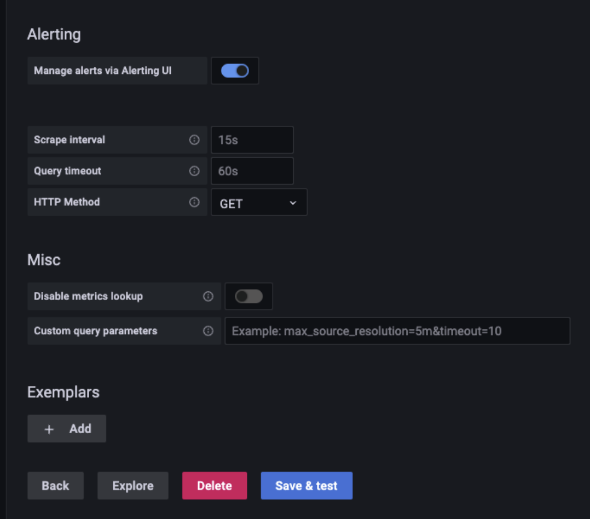

# Amazon EKS Observability Accelerator のご紹介

オブザーバビリティは、あらゆるアプリケーションにとって重要であり、システムの動作とパフォーマンスを理解する上で欠かせません。パフォーマンスの低下や中断を検出して修正するのに時間と労力がかかります。お客様は設定ファイルの作成とアプリケーションのエンドツーエンド監視の実現に多くの時間を費やしています。AWS の [CloudFormation](https://docs.aws.amazon.com/cloudformation/index.html)、[Terraform](https://www.terraform.io/)、[Ansible](https://www.ansible.com/) などのインフラストラクチャ as コード (IaC) ツールは、管理者と開発者が設定ファイルを使用してインフラストラクチャをインスタンス化できるようにすることで、手動作業を軽減します。

[Amazon Elastic Kubernetes Service(Amazon EKS)](https://docs.aws.amazon.com/eks/index.html) は、スケールアウトしたコンテナ化アプリケーションのデプロイと管理を可能にする強力で拡張性の高いコンテナオーケストレーションテクノロジーです。幅広いツールと設計オプションからアプリケーションのニーズを満たす [Amazon EKS](https://docs.aws.amazon.com/eks/index.html) クラスタを構築するのにかなりの時間がかかる場合があります。オブザーバビリティの実装はあらゆるアプリケーションのパフォーマンス分析に不可欠ですが、これにより状況はさらに面倒になります。 

お客様からは、Amazon EKS 上でのさまざまなオープンソースツールの統合例と、特定のアプリケーション要件のベストプラクティスを組み込んだオブザーバビリティソリューションの構成例を要望されています。2022年5月17日に、AWS は EKS Observability Accelerator を発表しました。これは、Terraform モジュールを使用して、特定のワークロード向けの Amazon EKS クラスタ上に目的構築型のオブザーバビリティソリューションを構成およびデプロイするために使用されます。お客様はこのソリューションを使用して、[Amazon Managed Service for Prometheus](https://docs.aws.amazon.com/prometheus/)、[AWS Distro for OpenTelemetry](https://aws.amazon.com/otel/?otel-blogs.sort-by=item.additionalFields.createdDate&otel-blogs.sort-order=desc)、[Amazon Managed Grafana](https://aws.amazon.com/grafana/) を 1 つのコマンドで開始し、アプリケーションの監視をすぐに始めることができます。

Terraform モジュールは、次のワークロードの Amazon EKS クラスタでのオブザーバビリティの有効化を可能にするために構築されています。

* Java/JMX
* NGINX  
* Memcached
* HAProxy

AWS は今後もさらに多くのワークロードの例を追加していきます。

この記事では、[EKS Observability Accelerator](https://github.com/aws-ia/terraform-aws-eks-blueprints/tree/main/examples/observability) を使用して Amazon EKS クラスタを構築し、特定のワークロードを監視するための意見主導型のオブザーバビリティコンポーネントを構成する手順を説明します。ここでは Java/JMX アプリケーションを使用します。

## 前提条件

このソリューションを進める前に、前提条件を満たしてください。

* [Terraform のインストール](https://learn.hashicorp.com/tutorials/terraform/install-cli)
* [Kubectl のインストール](https://docs.aws.amazon.com/eks/latest/userguide/install-kubectl.html)
* [docker のインストール](https://docs.aws.amazon.com/AmazonECS/latest/developerguide/create-container-image.html#:~:text=the%20Docker%20CLI.-,Installing%20Docker%20on%20Amazon%20Linux%202,-Create%20a%20Docker)
* [AWS Command Line Interface (AWS CLI) バージョン 2](https://docs.aws.amazon.com/cli/latest/userguide/install-cliv2.html)
* [jq](https://stedolan.github.io/jq/download/)
* [AWS アカウント](https://aws.amazon.com/)
* [AWS CLI で資格情報を設定](https://docs.aws.amazon.com/cli/latest/userguide/cli-configure-files.html#:~:text=refreshes%20the%20credentials.-,Set%20and%20view%20configuration%20settings,-There%20are%20several)
* [既存の Amazon Managed Grafana ワークスペース](https://aws.amazon.com/blogs/mt/amazon-managed-grafana-getting-started/)

## デプロイ手順

自分が Kubernetes オペレーターで、組織の Kubernetes 環境のプロビジョニングを担当していることを想像してください。 チームからの要件は多様であり、Kubernetes 環境のプロビジョニングとそれらの構成の取り込みにかなりの時間を費やす必要があります。 新しいリクエストが来るたびに時計がリセットされるので、車輪の再発明が続きます。

これを簡素化し、作業時間を短縮するために、[EKS Blueprints](https://github.com/aws-ia/terraform-aws-eks-blueprints) を考案しました。 EKS Blueprints は、お客様が Amazon EKS を採用し、一般的なワークロードのデプロイを開始するのをより簡単かつ迅速にすることを目的とした Terraform モジュールのコレクションです。 これはオープンソースであり、ワークロードのデプロイと運用に必要な運用ソフトウェアで完全にブートストラップされた完全な Amazon EKS クラスターを構成および管理するために誰でも使用できます。

EKS Blueprints リポジトリには、Amazon EKS Observability Accelerator モジュールが含まれています。 これを使用して、Amazon EKS クラスターにデプロイされた Java/JMX アプリケーションの可観測性を構成します。

### ステップ 1: リポジトリのクローン

まず、EKS ブループリントが含まれるリポジトリをクローンします。

```
git clone https://github.com/aws-ia/terraform-aws-eks-blueprints.git
```

### ステップ 2: Grafana API キーの生成

Terraform モジュールをデプロイする前に、Grafana API キーを作成し、ダッシュボードのデプロイにキーを使用するように Terraform 変数ファイルを構成します。 既存の Amazon Managed Grafana ワークスペースを使用し、API キーを構成するにはワークスペースの URL にログインする必要があります。

キーの作成手順は次のとおりです。

* SAML/SSO 資格情報を使用して、Amazon Managed Grafana ワークスペースにログインします。
* 左側のコントロールパネルにカーソルを合わせ、歯車アイコンの下の API キータブを選択します。


* [Add API key] をクリックし、名前フィールドに名前を入力して、ロールを [Admin] に設定します。
* [Time to live] フィールドに有効期間を入力します。 サポートされている単位は、s,m,h,d,w,M,y です。


* [Add] をクリックします
* API キーをコピーして安全な場所に保管します。次のステップでこのキーを使用します。


### ステップ 3: 環境の設定

次に、EKS クラスター、AWS OTEL Operator、Amazon Managed Service for Prometheus をプロビジョニングするための Terraform モジュールをデプロイするように環境を設定します。

Terraform モジュールのデプロイには、以下のステップが含まれます。

* **Plan**: Terraform plan は実行計画を作成し、インフラストラクチャの変更をプレビューします。 
* **Apply**: Terraform はプランのアクションを実行し、環境を変更します。

次に、変数ファイルを作成するか、環境変数を設定することによって、環境を設定します。

「.tfvars」ファイルは、「-var」フラグや環境変数を使用する代替手段です。このファイルは、スクリプトで使用される変数値を定義します。

このブログ投稿の場合、~/terraform-aws-eks-blueprints/examples/observability/adot-amp-grafana-for-java の下に「dev.tfvars」というファイルを新規作成します。

dev.tfvars ファイルを、対応する Grafana ワークスペースエンドポイントと Grafana API キーで編集することを確認してください。また、設定をカスタマイズしたい場合は、必要な変数を dev.tfvars ファイルに追加してください。

```
cd ~/terraform-aws-eks-blueprints/examples/observability/adot-amp-grafana-for-java
```

```
vi dev.tfvars
```

```
grafana_endpoint=”<Your Grafana workspace endpoint>"
grafana_api_key=”Your Grafana API Key>"
```

!!! note
API_KEY – 作成したキーです
Grafana_Endpoint – Grafana ワークスペースの URL です。

「https://」を含めることを確認してください。さもないと、Terraform モジュールは失敗します。

</your>

### ステップ 4: Terraform モジュールのデプロイ

最初のステップは、terraform init コマンドを使用してワーキングディレクトリを初期化することです。これにより、Terraform 設定ファイルを含むワーキングディレクトリが初期化されます。このコマンドは、新しい Terraform 設定の記述やバージョン管理から既存の設定のクローン後に実行されます。

```
terraform init
```

このコマンドは、Terraform での現在のワーキングディレクトリの使用準備を整えるための初期化ステップを実行します。初期化が完了すると、次の通知が表示されるはずです。


さらに、terraform validate コマンドを実行して、ディレクトリ内の設定ファイルを評価できます。Validate は、提供された変数や既存の状態に関係なく、構文が有効で内部的に一貫しているかどうかを検証するチェックを実行します。

```
terraform validate
```


次のステップは、terraform plan コマンドを実行して実行計画を作成することです。これにより、Terraform インフラストラクチャの変更をプレビューできます。デフォルトでは、terraform が計画を作成するときに以下を行います。

* 既存のリモートオブジェクトの現在の状態を読み取って、Terraform 状態が最新であることを確認します。
* 現在の設定と初期状態を比較し、差分を報告します。
* リモートオブジェクトを設定と一致させるために適用する必要があると思われる変更アクションのセットを提案します。

plan コマンドだけでは提案された変更は実行されません。したがって、このコマンドを使用して、提案された変更が期待したものと一致するかどうかを確認したり、チームと広くレビューするために変更を共有できます。

```
terraform plan -var-file=./dev.tfvars
```


最後に、`terraform apply` コマンドを実行してリソースをプロビジョニングします。これには約 20 分かかります。このコマンドは以下のリソースをデプロイします。

```
terraform apply -var-file=./dev.tfvars -auto-approve
```


1. `aws001-preprod-dev-eks` という名前の Amazon EKS クラスターを作成します
2. `amp-ws-aws001-preprod-dev-eks` という名前の Amazon Managed Service for Prometheus ワークスペースを作成します
3. `opentelemetry-operator-system, adot-collector-java` という名前の Kubernetes 名前空間を作成します
4. Java/JMX ワークロードのメトリクスを収集するように構成された設定で、名前空間に AWS ADOT コレクターをデプロイします
5. 既存の Amazon Managed Grafana ワークスペースで Java/JMX メトリクスを可視化するダッシュボードを構築し、Amazon Managed Service for Prometheus ワークスペースをデータソースとして構成します

EKS クラスターのプロビジョニング後、Amazon EKS クラスターエンドポイントを kubeconfig に追加し、リソースが正常にプロビジョニングされたことを確認します。

```
aws eks --region $AWS_REGION update-kubeconfig --name aws001-preprod-dev-eks
```

次のコマンドを実行して、Amazon Managed Service for Prometheus ワークスペースと ADOT コレクターの作成を確認します。

```
aws amp list-workspaces | jq -r '.workspaces[] | select(.alias=="amp-ws-aws001-preprod-dev-eks").workspaceId'
```

クラスターからすべての Pod を一覧表示

```
kubectl get pods -A
```


設定ページに移動し、デフォルトのデータソースを確認することで、Amazon Managed Grafana と Amazon Managed Prometheus 間の接続を確認できるはずです。


* `amp` という名前のデータソースを選択します
* 下にスクロールして `Save & test` を選択します



次のような成功メッセージが表示されるはずです


### ステップ 5: サンプル Java/JMX アプリケーションのデプロイ

サンプルの Java/JMX アプリケーションをデプロイし、JMX メトリクスのスクレイピングを開始します。
このサンプルアプリケーションは、JVM メモリプール、JVM メモリ使用量、スレッドなどの JMX メトリクスを生成し、Prometheus 形式でエクスポートします。
最終的に可視化するために、広範囲のメトリクスを取得するロードジェネレータと不良ロードジェネレータをデプロイします。

EKS Observability アクセラレータは、AWS OTEL オペレータのデプロイメントのメトリクスを収集します。
ADOT エクスポータは、これらのメトリクスを Amazon Managed Service for Prometheus ワークスペースにインジェストします。

AWS OpenTelemetry コレクタのリポジトリから例を再利用します。

```
# Switch to home directory

cd ~/

#Clone the git repository

git clone https://github.com/aws-observability/aws-otel-test-framework.git

#Setup environment variables
export AWS_ACCOUNT_ID=`aws sts get-caller-identity --query Account --output text`

#Login to registry
aws ecr get-login-password --region $AWS_REGION | docker login --username AWS --password-stdin $AWS_ACCOUNT_ID.dkr.ecr.$AWS_REGION.amazonaws.com

#Create ECR Repository
aws ecr create-repository --repository-name prometheus-sample-tomcat-jmx \
--image-scanning-configuration scanOnPush=true \
--region $AWS_REGION

#Build Docker image and push to ECR

cd ~/aws-otel-test-framework/sample-apps/jmx

docker build -t $AWS_ACCOUNT_ID.dkr.ecr.$AWS_REGION.amazonaws.com/prometheus-sample-tomcat-jmx:latest .

docker push $AWS_ACCOUNT_ID.dkr.ecr.$AWS_REGION.amazonaws.com/prometheus-sample-tomcat-jmx:latest

#Deploy the sample application

export SAMPLE_TRAFFIC_NAMESPACE=javajmx-sample

curl https://raw.githubusercontent.com/aws-observability/aws-otel-test-framework/terraform/sample-apps/jmx/examples/prometheus-metrics-sample.yaml > metrics-sample.yaml

sed -e "s/{{aws_account_id}}/$AWS_ACCOUNT_ID/g" metrics-sample.yaml -i
sed -e "s/{{region}}/$AWS_REGION/g" metrics-sample.yaml -i
sed -e "s/{{namespace}}/$SAMPLE_TRAFFIC_NAMESPACE/g" metrics-sample.yaml -i

kubectl apply -f metrics-sample.yaml

#Verify the application

kubectl get pods -n $SAMPLE_TRAFFIC_NAMESPACE
```


### ステップ 6: Amazon Managed Grafana で JMX メトリクスを視覚化する

AWS ADOT オペレータによって収集された JMX メトリクスを視覚化するには、Grafana ワークスペースにログインします。

* [ダッシュボード]を選択し、[管理]を選択します  


* [Observability]フォルダを選択し、[EKS Accelerator – Observability – Java/JMX]という名前のダッシュボードを選択します


Terraform モジュールは、Amazon Managed Service for Prometheus ワークスペースをデフォルトのデータソースとして追加し、メトリクスを視覚化するためのカスタムダッシュボードを作成しました。


NGINX、HAProxy、Memcached のサンプルアプリケーションもデプロイできます。

## クリーンアップ

以下のコマンドを実行して、Terraform モジュールによってプロビジョニングされたリソースを削除します。

```
terraform destroy -var-file=./dev.tfvars -auto-approve
```

## 結論

お客様は現在、EKS Observability Acceleratorを利用して、意見atedなEKSクラスタをデプロイし、リソースを手動でデプロイしたり、エージェントを設定したりすることなく、特定のワークロードのためのオブザーバビリティを構成することができます。さらに、このソリューションはAmazon Managed PrometheusワークスペースをAmazon Managed Grafanaと接続し、アラートと通知を設定するための拡張性を提供します。
