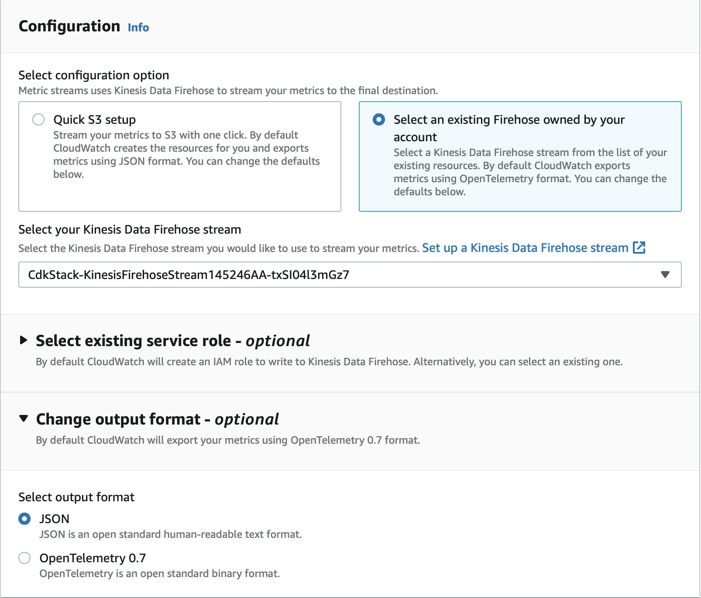

# CloudWatch メトリクスストリームを Firehose と AWS Lambda 経由で Amazon Managed Service for Prometheus にエクスポートする

このレシピでは、[CloudWatch メトリクスストリーム](https://console.aws.amazon.com/cloudwatch/home#metric-streams:streamsList) を計装し、[Kinesis Data Firehose](https://aws.amazon.com/kinesis/data-firehose/) と [AWS Lambda](https://aws.amazon.com/lambda) を使用してメトリクスを [Amazon Managed Service for Prometheus (AMP)](https://aws.amazon.com/prometheus/) にインジェストする方法を示します。

[AWS Cloud Development Kit (CDK)](https://aws.amazon.com/cdk/) を使用して、Firehose デリバリーストリーム、Lambda、S3 バケットを作成するスタックを設定し、完全なシナリオをデモンストレーションします。

!!! note
    このガイドの完了には約 30 分かかります。

## インフラストラクチャ
このレシピのインフラストラクチャを設定します。

CloudWatch メトリクスストリームを使用すると、ストリーミングメトリクスデータを HTTP エンドポイントや [S3 バケット](https://aws.amazon.com/jp/s3) に転送できます。

### 前提条件

* AWS CLI がインストールされ、環境に[構成](https://docs.aws.amazon.com/ja_jp/cli/latest/userguide/cli-chap-configure.html)されていること。
* [AWS CDK TypeScript](https://docs.aws.amazon.com/ja_jp/cdk/latest/guide/work-with-cdk-typescript.html) がインストールされていること。
* Node.js と Go がインストールされていること。  
* [リポジトリ](https://github.com/aws-observability/observability-best-practices/)がローカルマシンにクローンされていること。このプロジェクトのコードは `/sandbox/CWMetricStreamExporter` の下にある。

### AMP ワークスペースの作成

このレシピのデモアプリケーションは、AMP の上で実行されます。
次のコマンドを使用して AMP ワークスペースを作成します。

```
aws amp create-workspace --alias prometheus-demo-recipe
```

次のコマンドでワークスペースが作成されたことを確認します。
```
aws amp list-workspaces
```

!!! info
    詳細は、[AMP スタートガイド](https://docs.aws.amazon.com/prometheus/latest/userguide/AMP-getting-started.html)をご覧ください。

### 依存関係のインストール

aws-o11y-recipes リポジトリのルートから、次のコマンドを使用して CWMetricStreamExporter ディレクトリに移動します。

```
cd sandbox/CWMetricStreamExporter
```

これからは、このディレクトリがリポジトリのルートと見なされます。

次のコマンドを使用して `/cdk` ディレクトリに移動します。

```
cd cdk
```

次のコマンドを使用して CDK の依存関係をインストールします。

```
npm install
```

リポジトリのルートに戻った後、次のコマンドを使用して `/lambda` ディレクトリに移動します。

```
cd lambda
```

`/lambda` フォルダ内で、次のコマンドを使用して Go の依存関係をインストールします。

```
go get
```

すべての依存関係がインストールされました。

### 設定ファイルの変更

リポジトリのルートで、`config.yaml` を開き、 `{workspace}` を新しく作成したワークスペース ID に置き換え、AMP ワークスペースがあるリージョンを変更して、AMP ワークスペースの URL を変更します。

例えば、次のように変更します。

```
AMP:
    remote_write_url: "https://aps-workspaces.us-east-2.amazonaws.com/workspaces/{workspaceId}/api/v1/remote_write"
    region: us-east-2
```

Firehose デリバリーストリームと S3 バケットの名前を好きなように変更します。

### スタックのデプロイ

`config.yaml` が AMP ワークスペース ID で変更されたら、CloudFormation にスタックをデプロイする時間です。
CDK と Lambda コードをビルドするには、リポジトリのルートで次のコマンドを実行します:

```
npm run build
```

このビルド手順により、Go Lambda バイナリがビルドされ、CDK が CloudFormation にデプロイされます。

スタックをデプロイするために、次の IAM の変更を受け入れます:


次のコマンドを実行して、スタックが作成されたことを確認します:

```
aws cloudformation list-stacks
```

`CDK Stack` という名前のスタックが作成されているはずです。

## CloudWatch ストリームの作成

例えば `https://console.aws.amazon.com/cloudwatch/home?region=us-east-1#metric-streams:streamsList` のように CloudWatch コンソールに移動し、「メトリクスストリームの作成」をクリックします。

必要なメトリクスを選択します。名前空間のすべてのメトリクスまたは選択した名前空間からのみを選択できます。 

CDK によって作成された既存の Firehose を使用して、メトリクスストリームを構成します。
出力形式を OpenTelemetry 0.7 の代わりに JSON に変更します。
メトリクスストリーム名を好みの名前に変更し、「メトリクスストリームの作成」をクリックします。



Lambda 関数の呼び出しを確認するには、[Lambda コンソール](https://console.aws.amazon.com/lambda/home)に移動し、関数 `KinesisMessageHandler` をクリックします。 `Monitor` タブと `Logs` サブタブをクリックし、`Recent Invocations` の下に Lambda 関数がトリガーされたエントリが表示されるはずです。

!!! note
    Monitor タブに呼び出しが表示されるまでに最大 5 分かかる場合があります。

以上です!おめでとうございます。メトリクスが CloudWatch から Amazon Managed Service for Prometheus にストリーミングされるようになりました。

## クリーンアップ

まず、CloudFormation スタックを削除します。

```
cd cdk
cdk destroy
```

AMP ワークスペースを削除します。

```
aws amp delete-workspace --workspace-id \
    `aws amp list-workspaces --alias prometheus-sample-app --query 'workspaces[0].workspaceId' --output text`
```

最後に、コンソールからメトリクスストリームを削除してください。
