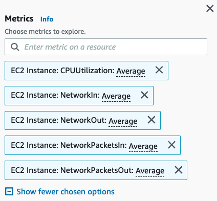
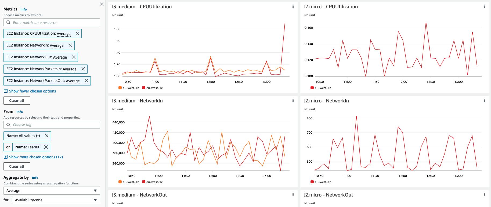

# リソースタグでフィルタリングしたメトリクスを集計および可視化するために Amazon CloudWatch メトリクスエクスプローラーを使用する

このレシピでは、メトリクスエクスプローラーを使用してリソースタグとリソースプロパティでメトリクスをフィルタリング、集計、および可視化する方法を示します。 - [タグとプロパティによってリソースを監視するためにメトリクスエクスプローラーを使用する][metrics-explorer]。

メトリクスエクスプローラーで可視化を作成する方法はいくつかあります。このチュートリアルでは、単純に AWS コンソールを利用します。

!!! note
    このガイドは約 5 分で完了します。

## 前提条件

* AWS アカウントへのアクセス権
* AWS コンソール経由での Amazon CloudWatch メトリクスエクスプローラへのアクセス権
* 関連リソースに対してリソースタグが設定されていること

## メトリクスエクスプローラーによるタグベースのクエリと視覚化

* CloudWatch コンソールを開きます

* **Metrics** の下の **Explorer** メニューをクリックします

* **Generic templates** または **Service based templates** リストからテンプレートを選択できます。この例では **EC2 Instances by type** テンプレートを使用します

* 探索したいメトリクスを選択します。不要なものは削除し、表示したい他のメトリクスを追加します

* **From** の下で、探しているリソースタグまたはリソースプロパティを選択します。以下の例では、<b>Name: TeamX</b> タグが付いた異なる EC2 インスタンスの CPU およびネットワーク関連メトリクスの数を示しています

* **Aggregated by** の下で時系列を集計関数を使用して結合できることに注意してください。以下の例では、<b>TeamX</b> メトリクスが <b>Availability Zone</b> 別に集計されています

あるいは、<b>Team</b> タグで <b>TeamX</b> と <b>TeamY</b> を集計したり、ニーズに合った他の構成を選択することもできます

## 動的なビジュアライゼーション
<b>From</b>、<b>Aggregated by</b>、<b>Split by</b> の各オプションを使用することで、結果のビジュアライゼーションを簡単にカスタマイズできます。
メトリクスエクスプローラーのビジュアライゼーションは動的なので、新しくタグ付けされたリソースはエクスプローラーウィジェットに自動的に表示されます。

## 参考情報

メトリクスエクスプローラの詳細については、以下の記事を参照してください。
https://docs.aws.amazon.com/ja_jp/AmazonCloudWatch/latest/monitoring/CloudWatch-Metrics-Explorer.html

[metrics-explorer]: https://docs.aws.amazon.com/ja_jp/AmazonCloudWatch/latest/monitoring/CloudWatch-Metrics-Explorer.html
