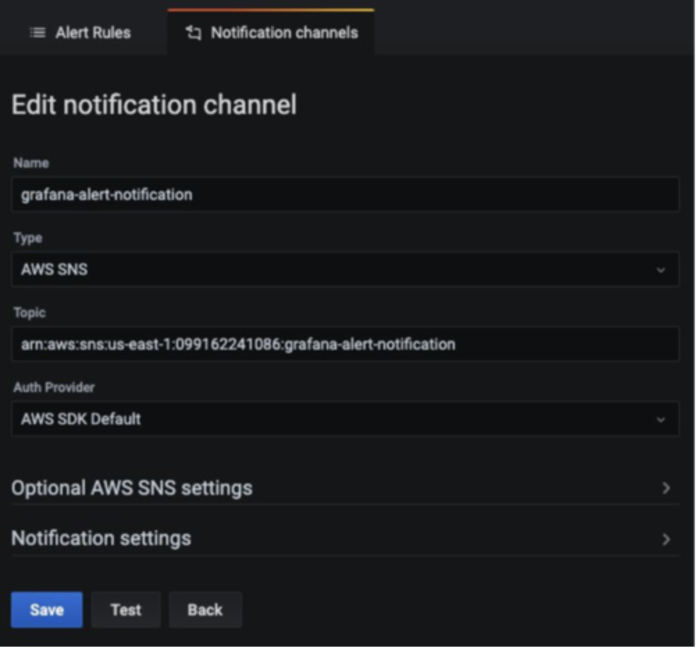
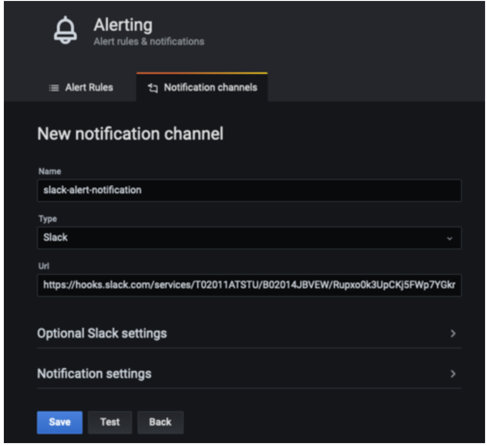

# Amazon Managed Grafana を使用したハイブリッド環境のモニタリング

このレシピでは、Azure Cloud 環境からのメトリクスを [Amazon Managed Service for Grafana](https://aws.amazon.com/grafana/) (AMG) で可視化し、AMG でアラート通知を作成して [Amazon Simple Notification Service](https://docs.aws.amazon.com/sns/latest/dg/welcome.html) と Slack に送信する方法を示します。

実装の一環として、AMG ワークスペースを作成し、データ ソースとして Azure Monitor プラグインを構成し、Grafana ダッシュボードを構成します。Amazon SNS と Slack の 2 つの通知チャネルを作成します。また、AMG ダッシュボードでアラートを構成して、通知チャネルに送信します。

!!! note
    このガイドの完了には約 30 分かかります。

## インフラストラクチャ
このレシピのインフラストラクチャを設定するセクションです。

### 前提条件

* AWS CLI がインストールされ、環境に構成されています。
  * インストールガイド: https://docs.aws.amazon.com/ja_jp/cli/latest/userguide/cli-chap-install.html
  * 構成ガイド: https://docs.aws.amazon.com/ja_jp/cli/latest/userguide/cli-chap-configure.html
* [AWS SSO](https://docs.aws.amazon.com/ja_jp/singlesignon/latest/userguide/step1.html) を有効にする必要があります。

### アーキテクチャ

まず、Azure Monitor からのメトリクスを可視化するための AMG ワークスペースを作成します。[Amazon Managed Service for Grafana の概要](https://aws.amazon.com/blogs/mt/amazon-managed-grafana-getting-started/) のブログ記事の手順に従ってください。ワークスペースの作成後、Grafana ワークスペースへのアクセスを、個々のユーザーまたはユーザーグループに割り当てることができます。デフォルトでは、ユーザーのユーザータイプは viewer です。ユーザーロールに基づいて、ユーザータイプを変更します。 

!!! 注意
    ワークスペース内の少なくとも 1 人のユーザーに Admin ロールを割り当てる必要があります。

図 1 では、ユーザー名が grafana-admin です。ユーザータイプは Admin です。[Data sources] タブで、必要なデータソースを選択します。構成を確認し、[Create workspace] を選択します。


### データソースとカスタムダッシュボードの構成

次に、データソースの下で、Azure 環境からメトリクスをクエリおよび可視化を開始するために、Azure Monitor プラグインを構成します。 データソースを追加するには、[データソース] を選択します。


[データ ソースの追加] で、Azure Monitor を検索して、Azure 環境のアプリ登録コンソールからパラメータを構成します。


Azure Monitor プラグインを構成するには、ディレクトリ (テナント) ID とアプリケーション (クライアント) ID が必要です。 手順については、Azure AD アプリケーションとサービス プリンシパルの作成に関する[記事](https://docs.microsoft.com/en-us/azure/active-directory/develop/howto-create-service-principal-portal) を参照してください。 これは、アプリの登録方法と、Grafana がデータをクエリするアクセス権を付与する方法を説明しています。


データ ソースが構成されたら、Azure メトリクスを分析するためにカスタム ダッシュボードをインポートします。 左側のペインで + アイコンを選択し、[インポート] を選択します。

[grafana.com 経由でインポート] で、ダッシュボード ID 10532 を入力します。


これにより、Azure Monitor メトリクスの分析を開始できる Azure Virtual Machine ダッシュボードがインポートされます。 マイセットアップでは、Azure 環境で仮想マシンが実行されています。


### AMG で通知チャネルを設定する

このセクションでは、2 つの通知チャネルを設定してからアラートを送信します。

次のコマンドを使用して、grafana-notification という名前の SNS トピックを作成し、メールアドレスをサブスクライブします。

```
aws sns create-topic --name grafana-notification
aws sns subscribe --topic-arn arn:aws:sns:<region>:<account-id>:grafana-notification --protocol email --notification-endpoint <email-id>

```

左側のパネルで、新しい通知チャネルを追加するためにベルのアイコンを選択します。
grafana-notification 通知チャネルを設定します。[通知チャネルの編集] で、[タイプ] に AWS SNS を選択します。[トピック] には、作成した SNS トピックの ARN を使用します。[認証プロバイダー] にはワークスペースの IAM ロールを選択します。



</email-id></account-id></region>

### Slack 通知チャネル
Slack 通知チャネルを設定するには、Slack ワークスペースを新規作成するか、既存のものを使用します。[Incoming Webhooks を使用したメッセージの送信](https://api.slack.com/messaging/webhooks) に記載されているように Incoming Webhooks を有効にします。

ワークスペースの設定が完了したら、Grafana ダッシュボードで使用される webhook URL が取得できるはずです。



### AMGでアラートを設定する

メトリクスがしきい値を超えたときにGrafanaアラートを設定できます。 AMGを使用すると、ダッシュボードでアラートを評価する頻度と通知を送信する方法を設定できます。 この例では、Azure仮想マシンのCPU使用率に対してアラートを設定します。 使用率がしきい値を超えると、AMGが両方のチャネルに通知を送信するように設定します。

ダッシュボードで、ドロップダウンからCPU使用率を選択し、編集を選択します。 グラフパネルの[アラート]タブで、アラートルールを評価する頻度と、アラートが状態を変更して通知を開始するために満たされなければならない条件を設定します。

次の構成では、CPU使用率が50%を超えるとアラートが作成されます。 通知はgrafana-alert-notificationとslack-alert-notificationチャネルに送信されます。


これで、Azure仮想マシンにサインインして、stressなどのツールを使用してストレステストを開始できます。 CPU使用率がしきい値を超えると、両方のチャネルで通知を受信します。

適切なしきい値でCPU使用率のアラートを設定して、Slackチャネルに送信されるアラートをシミュレートします。

## まとめ

このレシピでは、AMG ワークスペースのデプロイ方法、通知チャネルの設定方法、Azure Cloud からのメトリクスの収集方法、AMG ダッシュボードでのアラートの設定方法を示しました。AMG はフルマネージドのサーバレスソリューションであるため、ビジネスを変革するアプリケーションに時間を費やし、Grafana の管理の重荷を AWS に任せることができます。
