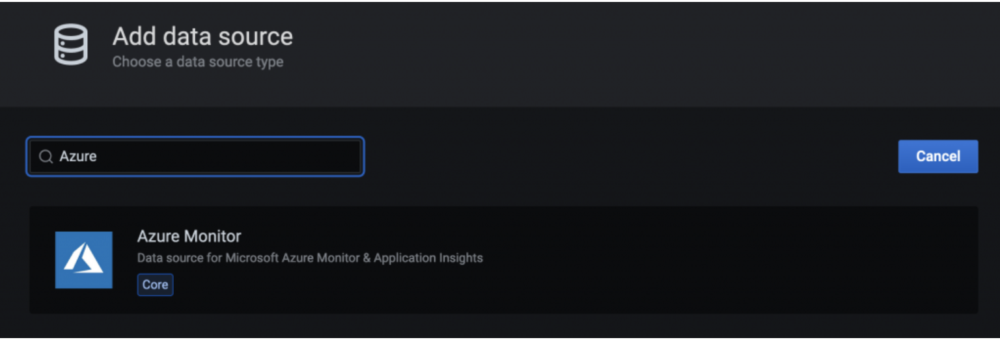
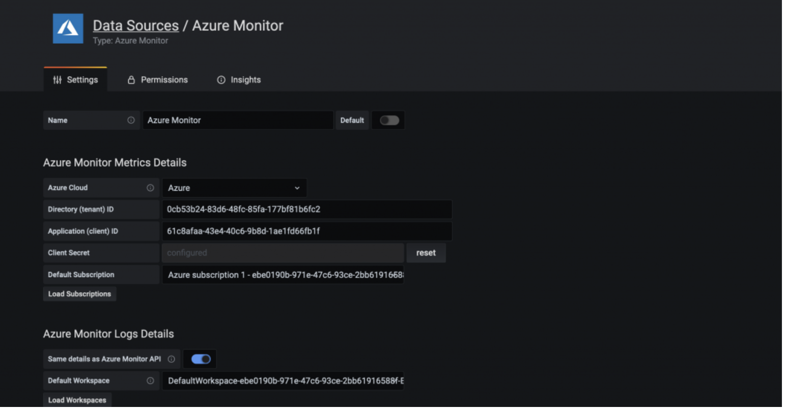
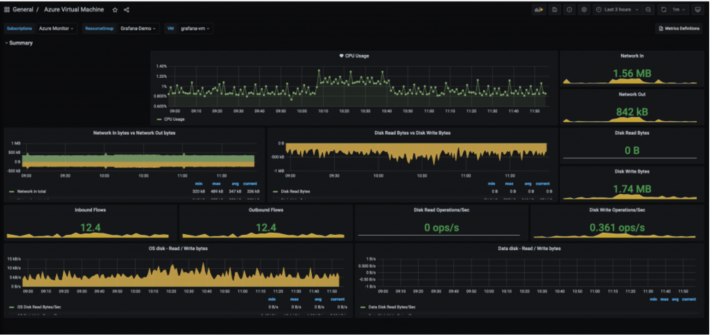
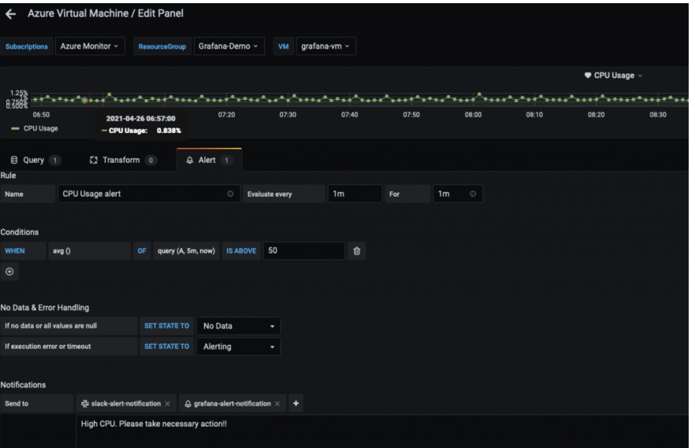

# Amazon Managed Service for Grafana を使用したハイブリッド環境のモニタリング

このレシピでは、Azure Cloud 環境のメトリクスを [Amazon Managed Service for Grafana](https://aws.amazon.com/grafana/) (AMG) で可視化し、AMG でアラート通知を作成して [Amazon Simple Notification Service](https://docs.aws.amazon.com/sns/latest/dg/welcome.html) と Slack に送信する方法を示します。

実装の一環として、AMG ワークスペースを作成し、Azure Monitor プラグインを AMG のデータソースとして構成し、Grafana ダッシュボードを構成します。 Amazon SNS と Slack の 2 つの通知チャネルを作成します。また、アラート通知を送信するために、AMG ダッシュボードでアラートを構成します。

!!! note
    このガイドの完了には約 30 分かかります。

## インフラストラクチャ
このレシピのインフラストラクチャを設定するセクションです。

### 前提条件

* AWS CLI がインストールされ、環境に構成されています。
    * インストールガイド: https://docs.aws.amazon.com/ja_jp/cli/latest/userguide/cli-chap-install.html
    * 構成ガイド: https://docs.aws.amazon.com/ja_jp/cli/latest/userguide/cli-chap-configure.html
* [AWS SSO](https://docs.aws.amazon.com/ja_jp/singlesignon/latest/userguide/step1.html) を有効にする必要があります。

### アーキテクチャ

まず、Azure Monitor からのメトリクスを可視化するための AMG ワークスペースを作成します。[Amazon Managed Service for Grafana の概要](https://aws.amazon.com/blogs/mt/amazon-managed-grafana-getting-started/)のブログ記事の手順に従ってください。ワークスペースを作成したら、Grafana ワークスペースへのアクセスを個々のユーザーまたはユーザーグループに割り当てることができます。デフォルトでは、ユーザーのユーザータイプは viewer です。ユーザーロールに基づいてユーザータイプを変更します。 

!!! 注意
    ワークスペース内の少なくとも 1 人のユーザーには、Admin ロールを割り当てる必要があります。

図 1 では、ユーザー名は grafana-admin です。ユーザータイプは Admin です。Data sources タブで、必要なデータソースを選択します。構成を確認し、Create workspace を選択します。


### データソースとカスタムダッシュボードの構成

次に、データソースの下で、Azure Monitor プラグインを構成して、Azure 環境からメトリクスをクエリおよび可視化を開始します。 データソースを追加するには、[データソース] を選択します。


[データソースの追加] で、Azure Monitor を検索して、Azure 環境のアプリ登録コンソールからパラメータを構成します。


Azure Monitor プラグインを構成するには、ディレクトリ (テナント) ID とアプリケーション (クライアント) ID が必要です。 構成方法については、Azure AD アプリケーションとサービス プリンシパルの作成に関する[記事](https://docs.microsoft.com/en-us/azure/active-directory/develop/howto-create-service-principal-portal) を参照してください。 これは、アプリの登録方法と、Grafana がデータにアクセスできるようにする方法について説明しています。



データソースが構成されたら、カスタムダッシュボードをインポートして、Azure メトリクスを分析します。 左側のペインで、+ アイコンを選択し、[インポート] を選択します。

[grafana.com 経由でインポート] で、ダッシュボード ID 10532 を入力します。


これにより、Azure Virtual Machine ダッシュボードがインポートされ、Azure Monitor メトリクスの分析を開始できます。 私のセットアップでは、Azure 環境で仮想マシンが実行されています。



### AMG で通知チャネルを設定する

このセクションでは、2 つの通知チャネルを設定し、アラートを送信します。

grafana-notification という名前の SNS トピックを作成し、メールアドレスをサブスクライブするには、次のコマンドを使用します。

```
aws sns create-topic --name grafana-notification
aws sns subscribe --topic-arn arn:aws:sns:<region>:<account-id>:grafana-notification --protocol email --notification-endpoint <email-id>

```

左側のパネルで、新しい通知チャネルを追加するためにベルのアイコンを選択します。 
次に、grafana-notification 通知チャネルを設定します。[Edit notification channel] で、[Type] については [AWS SNS] を選択します。[Topic] には、作成した SNS トピックの ARN を使用します。[Auth Provider] にはワークスペース IAM ロールを選択します。


</email-id></account-id></region>

### Slack 通知チャネル
Slack 通知チャネルを設定するには、Slack ワークスペースを新規作成するか、既存のワークスペースを使用します。[Incoming Webhooks を使用したメッセージ送信](https://api.slack.com/messaging/webhooks) に記載されているように、Incoming Webhooks を有効にします。

ワークスペースの設定が完了すると、Grafana ダッシュボードで使用される webhook URL が取得できるようになります。


### AMG でアラートを設定する

メトリクスがしきい値を超えたときに Grafana アラートを設定できます。AMG では、ダッシュボードでアラートを評価する頻度と通知を送信する方法を設定できます。この例では、Azure の仮想マシンの CPU 使用率に対するアラートを設定します。使用率がしきい値を超えると、AMG が両方のチャネルに通知を送信するように設定します。

ダッシュボードで CPU 使用率をドロップダウンから選択し、[編集] を選択します。グラフパネルの [アラート] タブで、アラートルールを評価する頻度と、アラートが状態を変更して通知を開始する条件を設定します。

次の設定では、CPU 使用率が 50% を超えるとアラートが作成されます。grafana-alert-notification と slack-alert-notification チャネルに通知が送信されます。



これで Azure の仮想マシンにサインインし、stress などのツールを使用してストレステストを開始できます。CPU 使用率がしきい値を超えると、両方のチャネルで通知を受信します。

適切なしきい値で CPU 使用率のアラートを設定し、Slack チャネルに送信されるアラートをシミュレートします。

## まとめ

このレシピでは、AMG ワークスペースのデプロイ方法、通知チャネルの設定方法、Azure Cloud からのメトリクスの収集方法、AMG ダッシュボードでのアラートの設定方法を示しました。AMG は、完全マネージドのサーバレスソリューションであるため、ビジネスを変革するアプリケーションに時間を費やし、Grafana の管理の重荷を AWS に任せることができます。
