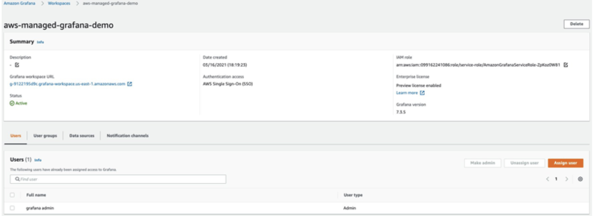
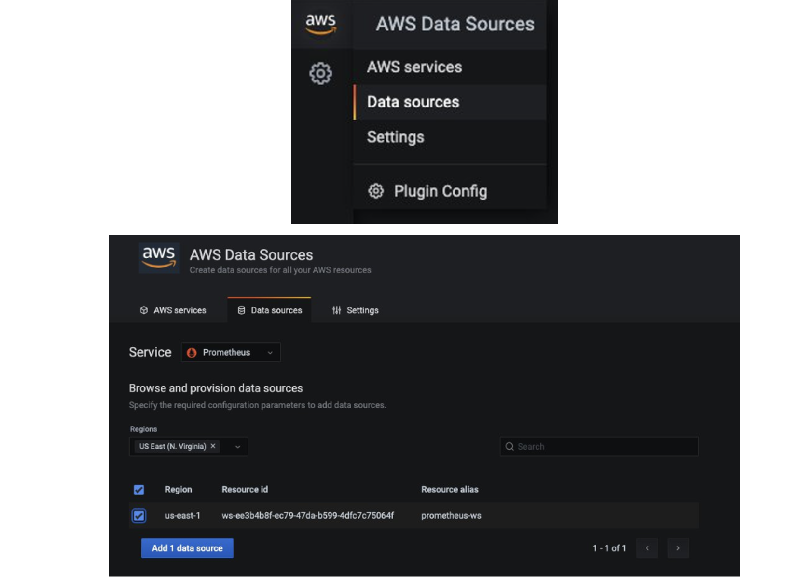
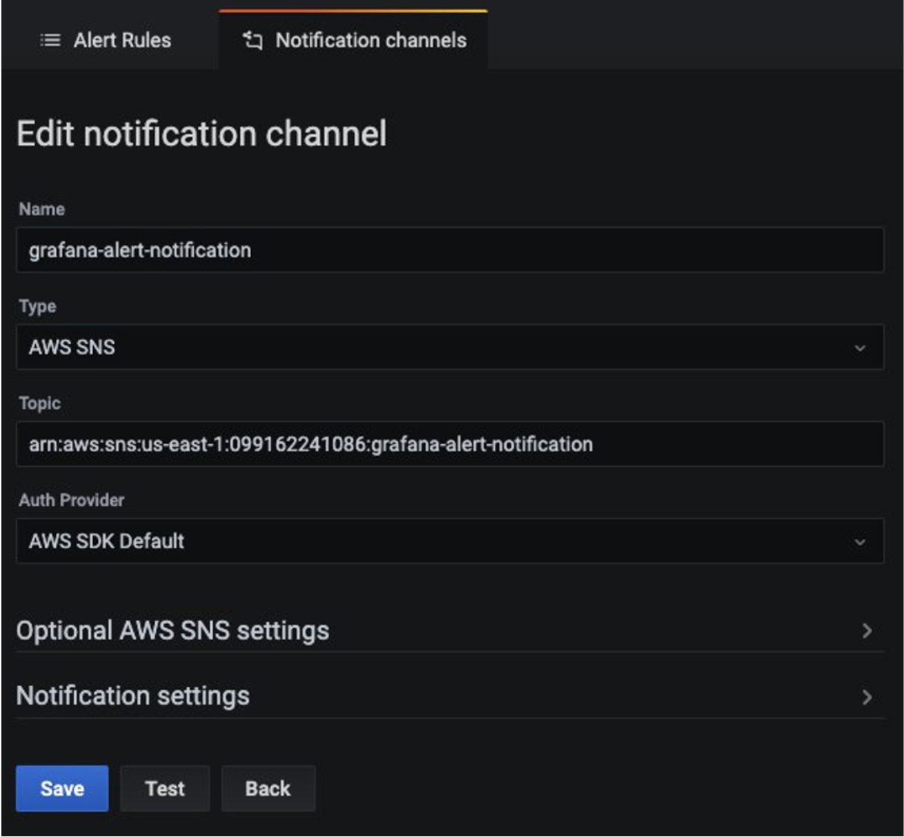
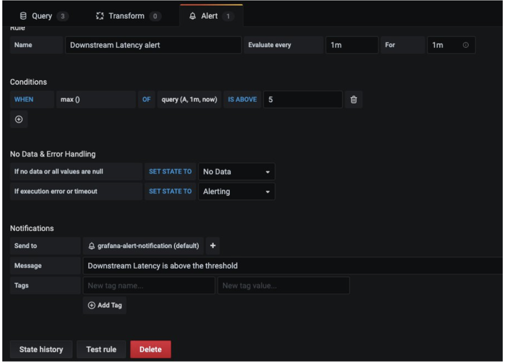

# Amazon Managed Service for Prometheus を使用した EKS 上に構成された App Mesh 環境の監視

このレシピでは、[Amazon Elastic Kubernetes Service](https://aws.amazon.com/eks/) (EKS) クラスター上の [App Mesh](https://docs.aws.amazon.com/app-mesh/) Envoy メトリクスを [Amazon Managed Service for Prometheus](https://aws.amazon.com/prometheus/) (AMP) に取り込み、[Amazon Managed Grafana](https://aws.amazon.com/grafana/) (AMG) でカスタムダッシュボードを作成して、マイクロサービスの健全性とパフォーマンスを監視する方法を示します。

実装の一環として、AMP ワークスペースを作成し、Kubernetes 用 App Mesh コントローラーをインストールして、Envoy コンテナを Pod に注入します。EKS クラスターに構成された [Grafana Agent](https://github.com/grafana/agent) を使用して Envoy メトリクスを収集し、AMP に書き込みます。最後に、AMG ワークスペースを作成し、データソースとして AMP を構成し、カスタムダッシュボードを作成します。

!!! 注意
    このガイドの完了には約 45 分かかります。

## インフラストラクチャ
このレシピのインフラストラクチャを設定します。

### アーキテクチャ


Grafana エージェントは、Envoy メトリクスをスクレイプし、AMP のリモートライトエンドポイントを介してそれらを AMP にインジェストするように構成されています。

!!! info
    AMP 用の Prometheus リモートライトエクスポータの詳細については、
    [Prometheus Remote Write Exporter for AMP の概要](https://aws-otel.github.io/docs/getting-started/prometheus-remote-write-exporter)をご覧ください。

### 前提条件

* AWS CLI がインストールされ、環境に[構成](https://docs.aws.amazon.com/cli/latest/userguide/cli-chap-configure.html)されている必要があります。
* 環境に [eksctl](https://docs.aws.amazon.com/eks/latest/userguide/eksctl.html) コマンドをインストールする必要があります。
* 環境に [kubectl](https://docs.aws.amazon.com/eks/latest/userguide/install-kubectl.html) をインストールする必要があります。
* [Docker](https://docs.docker.com/get-docker/) が環境にインストールされている必要があります。
* AWS アカウントに AMP ワークスペースが構成されている必要があります。
* [Helm](https://www.eksworkshop.com/beginner/060_helm/helm_intro/install/index.html) をインストールする必要があります。 
* [AWS SSO](https://docs.aws.amazon.com/singlesignon/latest/userguide/step1.html) を有効にする必要があります。

### EKS クラスターのセットアップ

まず、サンプルアプリケーションを実行するために App Mesh で有効化された EKS クラスターを作成します。
`eksctl` CLI を使用して、[eks-cluster-config.yaml](./servicemesh-monitoring-ampamg/eks-cluster-config.yaml) を使ってクラスターをデプロイします。
このテンプレートは、EKS で新しいクラスターを作成します。

テンプレートファイルを編集し、AMP で利用できるリージョンのいずれかを設定してください:

* `us-east-1`
* `us-east-2`
* `us-west-2`
* `eu-central-1`
* `eu-west-1`

セッションでこのリージョンを上書きするようにしてください。例えば、Bash シェルで次のように実行します:

```
export AWS_REGION=eu-west-1
```

次のコマンドを使用してクラスターを作成します: 

```
eksctl create cluster -f eks-cluster-config.yaml
```
これにより、`AMP-EKS-CLUSTER` という名前の EKS クラスターと、EKS 用 App Mesh コントローラーが使用する `appmesh-controller` という名前のサービスアカウントが作成されます。

### App Mesh Controller のインストール

次に、以下のコマンドを実行して [App Mesh Controller](https://docs.aws.amazon.com/app-mesh/latest/userguide/getting-started-kubernetes.html) をインストールし、Custom Resource Definitions (CRDs) を設定します。

```
helm repo add eks https://aws.github.io/eks-charts
```

```
helm upgrade -i appmesh-controller eks/appmesh-controller \
     --namespace appmesh-system \
     --set region=${AWS_REGION} \
     --set serviceAccount.create=false \
     --set serviceAccount.name=appmesh-controller
```

### AMP のセットアップ
AMP ワークスペースは、Envoy から収集された Prometheus メトリクスを取り込むために使用されます。
ワークスペースは、テナント専用の論理 Cortex サーバーです。ワークスペースは、更新、一覧表示、
説明、削除などの管理へのアクセス制御と、メトリクスの取り込みとクエリを細かく制御することができます。

AWS CLI を使用してワークスペースを作成します。

```
aws amp create-workspace --alias AMP-APPMESH --region $AWS_REGION
```

必要な Helm リポジトリを追加します。

```
helm repo add prometheus-community https://prometheus-community.github.io/helm-charts && \
helm repo add kube-state-metrics https://kubernetes.github.io/kube-state-metrics 
```

AMP の詳細については、[AMP の概要](https://docs.aws.amazon.com/prometheus/latest/userguide/AMP-getting-started.html) ガイドをご覧ください。

### メトリクスのスクレイピングと取り込み

AMP は、Kubernetes クラスター内のコンテナ化ワークロードから直接運用メトリクスをスクレイピングしません。
このタスクを実行するには、Prometheus サーバーまたは 
[AWS Distro for OpenTelemetry Collector](https://github.com/aws-observability/aws-otel-collector)
や Grafana エージェントなどの OpenTelemetry エージェントをデプロイおよび管理する必要があります。
このレシピでは、Grafana エージェントを設定して Envoy メトリクスをスクレイプし、AMP と AMG を使用して分析するプロセスを紹介します。

#### Grafana Agent の設定

Grafana Agent は、完全な Prometheus サーバーを実行する軽量な代替手段です。
Prometheus Exporter の検出とスクレイピング、およびメトリクスの Prometheus 互換バックエンドへの送信に必要な部分を保持します。
Grafana Agent には、AWS Identity and Access Management(IAM)認証の AWS Signature Version 4(Sigv4)のネイティブサポートも含まれています。

ここでは、Prometheus メトリクスを AMP に送信するための IAM ロールを設定する手順を説明します。
EKS クラスターに Grafana Agent をインストールし、メトリクスを AMP に転送します。

#### アクセス許可の設定
Grafana Agent は、EKS クラスターで実行されているコンテナ化されたワークロードから運用メトリクスをスクレイピングし、それらを AMP に送信します。AMP に送信されるデータは、マネージドサービスの各クライアントリクエストを認証および認可するために、Sigv4 を使用して有効な AWS 資格情報で署名する必要があります。

Grafana Agent は、Kubernetes のサービスアカウントの ID で実行するために EKS クラスターにデプロイできます。
サービスアカウントの IAM ロール (IRSA) を使用すると、Kubernetes のサービスアカウントに IAM ロールを関連付けて、そのサービスアカウントを使用するすべての Pod に IAM アクセス許可を提供できます。

IRSA の設定を次のように準備します。

```
kubectl create namespace grafana-agent

export WORKSPACE=$(aws amp list-workspaces | jq -r '.workspaces[] | select(.alias=="AMP-APPMESH").workspaceId')
export ROLE_ARN=$(aws iam get-role --role-name EKS-GrafanaAgent-AMP-ServiceAccount-Role --query Role.Arn --output text)
export NAMESPACE="grafana-agent"
export REMOTE_WRITE_URL="https://aps-workspaces.$AWS_REGION.amazonaws.com/workspaces/$WORKSPACE/api/v1/remote_write"
```

次の手順を自動化するために、[gca-permissions.sh](./servicemesh-monitoring-ampamg/gca-permissions.sh) シェルスクリプトを使用できます(プレースホルダー変数 `YOUR_EKS_CLUSTER_NAME` を EKS クラスターの名前に置き換えてください)。

* AMP ワークスペースへのリモートライトアクセス許可を持つ IAM ポリシーを使用して、`EKS-GrafanaAgent-AMP-ServiceAccount-Role` という名前の IAM ロールを作成します。
* `grafana-agent` 名前空間の下に、IAM ロールに関連付けられた `grafana-agent` という名前の Kubernetes サービスアカウントを作成します。
* IAM ロールと Amazon EKS クラスターでホストされている OIDC プロバイダーの間に信頼関係を作成します。

`gca-permissions.sh` スクリプトを実行するには、`kubectl` と `eksctl` の CLI ツールが必要です。
これらは Amazon EKS クラスターにアクセスするように設定する必要があります。

次に、Envoy メトリクスを抽出するスクレイプ設定を含むマニフェストファイル [grafana-agent.yaml](./servicemesh-monitoring-ampamg/grafana-agent.yaml) を作成し、Grafana Agent をデプロイします。

!!! 注意
    記事作成時点では、このソリューションはデーモンセットのサポートがない Fargate 上の EKS では機能しません。

この例では、`grafana-agent` という名前のデーモンセットと、`grafana-agent-deployment` という名前のデプロイメントをデプロイします。 `grafana-agent` デーモンセットは、クラスター上のポッドからメトリクスを収集し、`grafana-agent-deployment` デプロイメントは、EKS コントロールプレーンなど、クラスター外に存在するサービスからメトリクスを収集します。

```
kubectl apply -f grafana-agent.yaml
```
`grafana-agent` がデプロイされると、メトリクスを収集して、指定された AMP ワークスペースにインジェストします。次に、EKS クラスターにサンプルアプリケーションをデプロイして、メトリクスの分析を開始します。

## サンプルアプリケーション

アプリケーションをインストールし、Envoy コンテナを注入するには、Kubernetes 用の AppMesh コントローラーを使用します。

まず、例のリポジトリをクローンしてベースアプリケーションをインストールします。

```
git clone https://github.com/aws/aws-app-mesh-examples.git
```

次にリソースをクラスタに適用します。

```
kubectl apply -f aws-app-mesh-examples/examples/apps/djapp/1_base_application
```

ポッドのステータスを確認し、実行されていることを確認します。

```
$ kubectl -n prod get all

NAME                            READY   STATUS    RESTARTS   AGE
pod/dj-cb77484d7-gx9vk          1/1     Running   0          6m8s
pod/jazz-v1-6b6b6dd4fc-xxj9s    1/1     Running   0          6m8s
pod/metal-v1-584b9ccd88-kj7kf   1/1     Running   0          6m8s
```

次に App Mesh コントローラーをインストールし、デプロイメントをメッシュ化します。

```
kubectl apply -f aws-app-mesh-examples/examples/apps/djapp/2_meshed_application/
kubectl rollout restart deployment -n prod dj jazz-v1 metal-v1
```

これで、各 Pod で 2 つのコンテナが実行されているはずです。

```
$ kubectl -n prod get all
NAME                        READY   STATUS    RESTARTS   AGE
dj-7948b69dff-z6djf         2/2     Running   0          57s
jazz-v1-7cdc4fc4fc-wzc5d    2/2     Running   0          57s
metal-v1-7f499bb988-qtx7k   2/2     Running   0          57s
```

5 分間トラフィックを生成し、後で AMG で可視化します。

```
dj_pod=`kubectl get pod -n prod --no-headers -l app=dj -o jsonpath='{.items[*].metadata.name}'`

loop_counter=0
while [ $loop_counter -le 300 ] ; do \
kubectl exec -n prod -it $dj_pod  -c dj \
-- curl jazz.prod.svc.cluster.local:9080 ; echo ; loop_counter=$[$loop_counter+1] ; \
done
```

### AMG ワークスペースの作成

AMG ワークスペースの作成については、[Getting Started with AMG](https://aws.amazon.com/blogs/mt/amazon-managed-grafana-getting-started/) ブログ記事の手順に従ってください。
ダッシュボードへのユーザーアクセスを許可するには、AWS SSO を有効にする必要があります。ワークスペースの作成後、Grafana ワークスペースへのアクセスを個々のユーザーまたはユーザーグループに割り当てることができます。
デフォルトでは、ユーザーのユーザータイプは viewer です。ユーザーロールに基づいてユーザータイプを変更します。データソースとして AMP ワークスペースを追加し、ダッシュボードの作成を開始します。

この例では、ユーザー名は `grafana-admin` で、ユーザータイプは `Admin` です。
必要なデータソースを選択します。構成を確認し、`Create workspace` を選択します。



### AMG のデータソースを設定する
AMP を AMG のデータソースとして設定するには、`Data sources` セクションで `Configure in Grafana` を選択します。これにより、ブラウザで Grafana ワークスペースが起動します。
ブラウザで Grafana ワークスペースの URL を手動で起動することもできます。



スクリーンショットからわかるように、ダウンストリームレイテンシ、接続、レスポンスコードなどの Envoy メトリクスを表示できます。
示されているフィルタを使用して、特定のアプリケーションの Envoy メトリクスをドリルダウンできます。

### AMG ダッシュボードの設定

データソースが設定されたら、Envoy メトリクスを分析するためにカスタムダッシュボードをインポートします。
これには事前定義されたダッシュボードを使用するので、以下に示すように `Import` を選択し、
ID `11022` を入力します。これにより、Envoy Global ダッシュボードがインポートされるので、
Envoy メトリクスの分析を開始できます。


### AMG でアラートを設定する

メトリクスが意図したしきい値を超えたときに、Grafana アラートを設定できます。
AMG では、ダッシュボードでアラートを評価する頻度と通知を送信する方法を設定できます。
アラートルールを作成する前に、通知チャネルを作成する必要があります。

この例では、通知チャネルとして Amazon SNS を設定します。
SNS トピックには `grafana` というプレフィックスが必要です。これは、デフォルトの [サービス管理権限](https://docs.aws.amazon.com/grafana/latest/userguide/AMG-manage-permissions.html#AMG-service-managed-account) を使用している場合、通知がトピックに正常に発行されるためです。

`grafana-notification` という名前の SNS トピックを作成するには、次のコマンドを使用します:

```
aws sns create-topic --name grafana-notification
```

メールアドレスを介してサブスクライブします。以下のコマンドで、リージョンとアカウント ID を指定することを確認してください: 

```
aws sns subscribe \
    --topic-arn arn:aws:sns:<region>:<account-id>:grafana-notification \
	--protocol email \
	--notification-endpoint <email-id>
```

次に、Grafana ダッシュボードから新しい通知チャネルを追加します。
grafana-notification という名前の新しい通知チャネルを設定します。
Type にはドロップダウンから AWS SNS を使用します。
Topic には、作成した SNS トピックの ARN を使用します。
Auth provider は AWS SDK Default を選択します。



次に、ダウンストリームレイテンシが 1 分間で 5 ミリ秒を超えた場合のアラートを設定します。
ダッシュボードで、ドロップダウンから Downstream latency を選択し、Edit を選択します。
グラフパネルの Alert タブで、アラートルールを評価する頻度と、アラートが状態を変更して通知を開始する条件を設定します。

次の設定では、ダウンストリームレイテンシがしきい値を超えた場合にアラートが作成され、設定された grafana-alert-notification チャネルを介して SNS トピックに通知が送信されます。



</email-id></account-id></region>

## クリーンアップ

1. リソースとクラスタを削除します。
```
kubectl delete all --all
eksctl delete cluster --name AMP-EKS-CLUSTER
```
2. AMP ワークスペースを削除します。 
```
aws amp delete-workspace --workspace-id `aws amp list-workspaces --alias prometheus-sample-app --query 'workspaces[0].workspaceId' --output text`
```
3. amp-iamproxy-ingest-role IAM ロールを削除します。
```
aws delete-role --role-name amp-iamproxy-ingest-role
```
4. コンソールから AMG ワークスペースを削除します。
