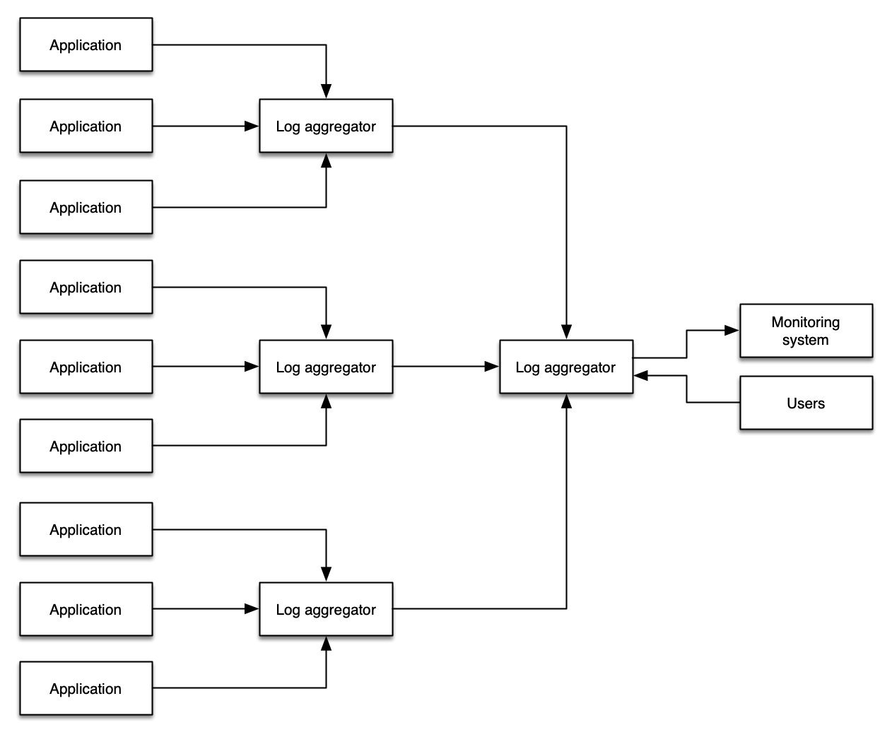

# ログ

ログは、1 行以上のイベントまたはアプリケーションの正常性に関する詳細を表す、アプリケーションまたはアプライアンスによって送信される一連のメッセージです。通常、ログはファイルに配信されますが、時に分析や集計を実行するコレクタに送信されることもあります。ログデータをメガバイト/日からテラバイト/時間までのあらゆるボリュームで生成、取り込み、管理することを目的とした、多機能のログアグリゲーター、フレームワーク、製品がたくさんあります。

ログは一度に 1 つのアプリケーションから発行され、通常その *1 つのアプリケーション* の範囲に関連しています。ただし、開発者はログを任意の複雑さとニュアンスを持たせることができます。ここでは、複数のアプリケーションやサービスからのイベントで構成され、サービス間のレスポンス待ち時間、サービス障害、リクエストパラメータなどのコンテキストを含む[トレース](../../signals/traces)とは基本的に異なるシグナルとしてログを考えます。

ログデータは一定期間にわたって集計することもできます。たとえば、統計情報(過去 1 分間に処理されたリクエスト数など)の形式にすることができます。構造化されているか非構造化であるかに関わらず、冗長であったり、任意の言語で書かれていることがあります。

ログの主なユースケースは次のとおりです。

* イベントのステータスと期間などの詳細を記述する
* そのイベントに関連するエラーや警告(スタックトレース、タイムアウトなど) 
* アプリケーションの起動、開始、シャットダウンメッセージ

!!! note
	ログは不変であることを目的としており、多くのログ管理システムにはログデータの変更を防止し、変更の試みを検出するメカニズムが含まれています。

ログの要件に関わらず、特定したベストプラクティスは次のとおりです。

## 構造化ログが成功の鍵

多くのシステムは、半構造化形式でログを出力します。 たとえば、Apache Web サーバーは、各行が単一の Web リクエストに関連する次のようなログを書き込む場合があります。

	192.168.2.20 - - [28/Jul/2006:10:27:10 -0300] "GET /cgi-bin/try/ HTTP/1.0" 200 3395
	127.0.0.1 - - [28/Jul/2006:10:22:04 -0300] "GET / HTTP/1.0" 200 2216

一方、Java のスタックトレースは、複数行にまたがり、構造化されていない単一のイベントである可能性があります。

	Exception in thread "main" java.lang.NullPointerException
        at com.example.myproject.Book.getTitle(Book.java:16)
        at com.example.myproject.Author.getBookTitles(Author.java:25)
        at com.example.myproject.Bootstrap.main(Bootstrap.java:14)

Python のエラーログイベントは次のようになる場合があります。

	Traceback (most recent call last):
	  File "e.py", line 7, in <module>
	    raise TypeError("Again !?!")
	TypeError: Again !?!

これら 3 つの例のうち、人間とログ集計システムの両方で簡単に解析できるのは最初の例のみです。 構造化ログを使用することで、ログデータを迅速かつ効果的に処理し、人間とマシンの両方に即座に必要なデータを提供することができます。

最も一般的に理解されているログ形式は JSON であり、イベントの各コンポーネントがキー/値のペアとして表されます。 JSON では、上記の Python の例は次のように書き換えることができます。

	{
		"level": "ERROR",
		"file": "e.py",
		"line": 7,
		"error": "TypeError(\"Again !?!\")"
	}

構造化ログを使用することで、データをあるログシステムから別のログシステムに簡単に転送できるようになり、開発が簡素化され、運用上の診断がより迅速に(エラーも少なく)行えるようになります。 また、JSON を使用することで、実際のデータとともにログメッセージのスキーマが埋め込まれるため、高度なログ分析システムがメッセージを自動的にインデックスできるようになります。

</module>

## ログレベルを適切に使用する

ログには、*レベル* を持つものと、一連のイベントから成るものの 2 種類があります。レベルを持つものでは、これらは成功したログ戦略にとって極めて重要なコンポーネントです。ログレベルはフレームワークによって若干異なりますが、概して次の構造に従います。

| レベル | 説明 |
| ----- | ----------- |
| `DEBUG` | アプリケーションのデバッグに最も役立つ詳細な情報イベント。これらは通常、開発者にとって価値があり、非常に詳細です。 |
| `INFO` | アプリケーションの進捗を粗く示す情報メッセージ。 |
| `WARN` | アプリケーションへのリスクを示す、潜在的に有害な状況。これらはアプリケーションでアラームをトリガーできます。 | 
| `ERROR` | アプリケーションの実行を継続できる可能性のあるエラーイベント。これらは注意が必要なアラームをトリガーする可能性が高いです。 |
| `FATAL` | おそらくアプリケーションの異常終了を引き起こすであろう非常に重大なエラーイベント。 |

!!! info
	明示的なレベルがない暗黙的なログは、`INFO` と見なされる可能性がありますが、この動作はアプリケーションによって異なる場合があります。

その他の一般的なログレベルには、ニーズ、プログラミング言語、フレームワークに応じて、`CRITICAL` と `NONE` があります。`ALL` と `NONE` も一般的ですが、すべてのアプリケーションスタックで見つかるわけではありません。

ログレベルは、環境の健全性について監視および可観測性ソリューションに通知するための重要な要素であり、ログデータは論理値を使用してこのデータを簡単に表現できる必要があります。

!!! tip
	`WARN` で大量のデータをログに記録すると、価値の低いデータで監視システムが溢れ、メッセージの大量に紛れ込んで重要なデータが失われてしまう可能性があります。

!!! success
	標準化されたログレベル戦略を使用することで、自動化が容易になり、開発者が問題の根本原因をすばやく特定できるようになります。 

!!! warning
	ログレベルの標準的なアプローチがないと、[ログのフィルタリング](#filter-logs-close-to-the-source)は大きな課題となります。

## ログをできるだけソース近くでフィルタリングする

可能であれば、ログのボリュームをできるだけソース近くで減らしてください。このベストプラクティスを守る理由は次のとおりです。

* ログの取り込みには常に時間、コスト、リソースがかかります。
* ダウンストリームのシステムから機密データ(個人を特定できるデータなど)をフィルタリングすることで、データ漏洩からのリスクエクスポージャーを減らすことができます。
* ダウンストリームのシステムは、データのソースと同じ運用上の関心事を持っているとは限りません。たとえば、アプリケーションからの `INFO` ログは、`CRITICAL` や `FATAL` メッセージを監視する監視・アラートシステムにとっては興味のないものである可能性があります。
* ログシステムやネットワークが不要なストレスやトラフィックにさらされる必要はありません。  

!!! success
	ソース近くでログをフィルタリングすることでコストを下げ、データ露出のリスクを減らし、各コンポーネントを[重要事項](../../guides/#monitor-what-matters)に集中させることができます。

!!! tip
	アーキテクチャによっては、インフラストラクチャ as コード(IaC)を使用して、アプリケーションと環境の両方への変更を1つの操作でデプロイすることをお勧めします。このアプローチにより、アプリケーションと同じ厳格さと扱いでログフィルタパターンをデプロイできます。

## 二重インジェストのアンチパターンを避ける

管理者がしばしば追求するパターンは、すべてのログデータを1つのシステムにコピーし、すべてのログを1つの場所からクエリできるようにすることです。これにはいくつかの手動ワークフロー上の利点がありますが、このパターンはコスト、複雑さ、障害点、運用上のオーバーヘッドを増やします。

!!! success
	可能な限り、[ログレベル](#use-log-levels-appropriately)と[ログフィルタリング](#filter-logs-close-to-the-source)の組み合わせを使用して、環境からのログデータの大量伝播を避けてください。

!!! info 
	規制要件を満たしたり、ログを安全な場所に保存したり、否認防止をしたり、その他の目的を達成するために、[ログ出荷](https://en.wikipedia.org/wiki/Log_shipping)が必要な組織やワークロードがあります。これはログデータを再インジェストする一般的なユースケースです。[ログレベル](#use-log-levels-appropriately)と[ログフィルタリング](#filter-logs-close-to-the-source) を適切に適用することで、これらのログアーカイブに入る不要なデータ量を減らすことができることに注意してください。

## ログからメトリックデータを収集する

ログには収集を待っている[メトリクス](../../signals/metrics/)が含まれています。自分で書いていない ISV ソリューションやアプリケーションでさえ、全体的なワークロードの健全性について意味のある洞察を抽出できる貴重なデータをログに出力します。一般的な例としては以下があります。

* データベースの遅いクエリ時間
* Web サーバーのアップタイム  
* トランザクション処理時間
* 時間経過とともに`ERROR` または `WARNING` イベントのカウント
* アップグレード可能なパッケージの生のカウント

!!! tip
	このデータは、静的なログファイルにロックされているとあまり役に立ちません。ベストプラクティスは、キーメトリックデータを特定し、それをメトリックシステムにパブリッシュすることで、他のシグナルと相関付けることができます。

## `stdout` にログを記録する

可能であれば、アプリケーションはファイルやソケットなどの固定された場所ではなく、`stdout` にログを記録する必要があります。これにより、ログエージェントが自身のオブザーバビリティソリューションに適したルールに基づいてログイベントを収集およびルーティングできるようになります。すべてのアプリケーションで実現できるわけではありませんが、これがコンテナ化ワークロードにおけるベストプラクティスです。 

!!! note
	アプリケーションはロギングの慣行において汎用的でシンプルである必要があり、ロギングソリューションとの結合度を低く保つ必要がありますが、ログデータの送信には依然として `stdout` からファイルへのデータ送信に [ログコレクター](../../tools/logs/) が必要です。重要な概念は、アプリケーションとビジネスロジックがロギングインフラストラクチャに依存しないようにすることです。つまり、懸念事項を分離するように努める必要があります。

!!! success
	アプリケーションとログ管理をデカップリングすることで、コード変更を必要とせずにソリューションの適応と進化が可能になり、環境への変更による[ブラスト半径](../../faq/#what-is-a-blast-radius)の最小化が実現します。
