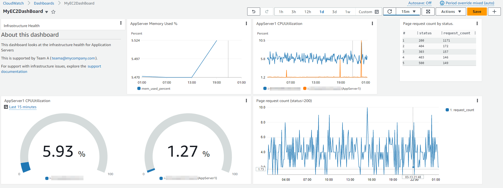
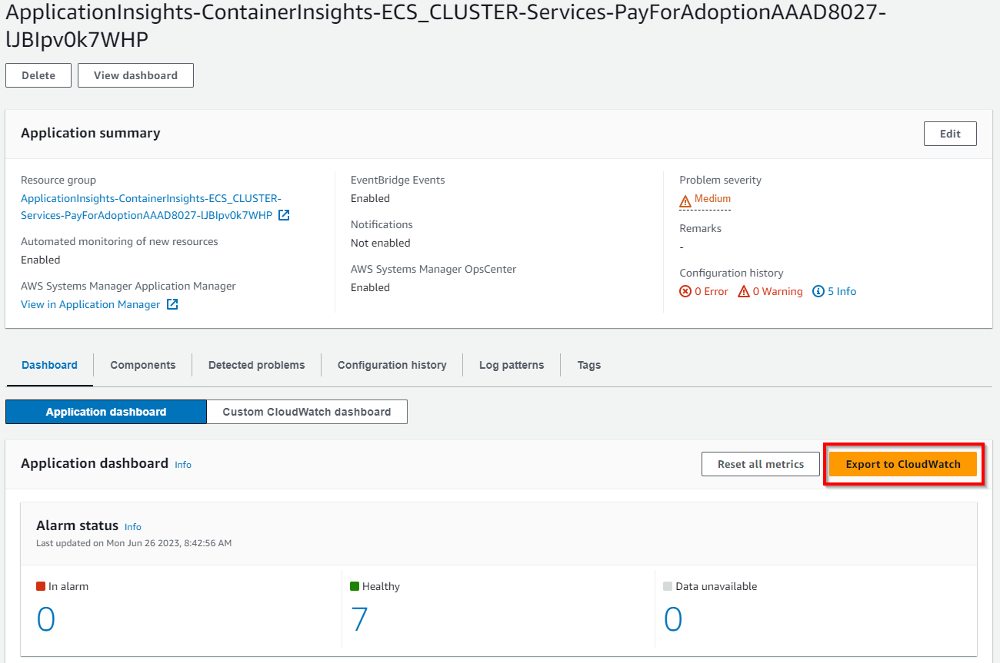
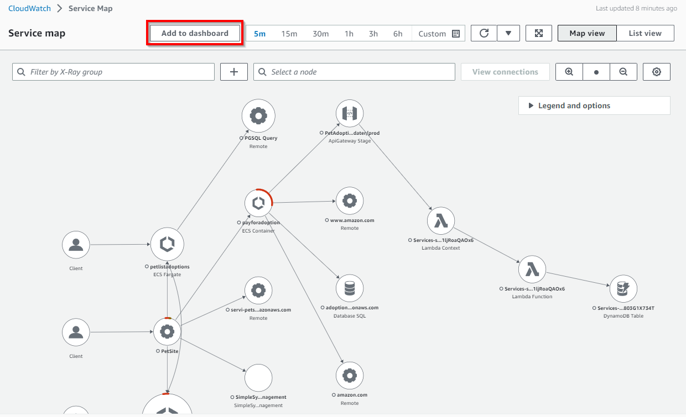
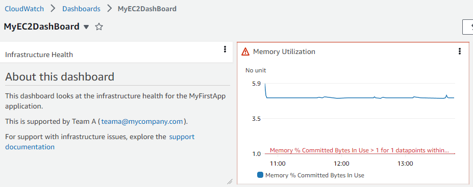

# CloudWatch ダッシュボード

## はじめに

AWS アカウント内のリソースのインベントリの詳細、リソースのパフォーマンスとヘルスチェックを知ることは、安定したリソース管理にとって重要です。Amazon CloudWatch ダッシュボードは、CloudWatch コンソールのカスタマイズ可能なホームページで、クロスアカウントまたは異なるリージョンに分散しているリソースであっても、1 つのビューで監視できます。

[Amazon CloudWatch ダッシュボード](https://docs.aws.amazon.com/AmazonCloudWatch/latest/monitoring/CloudWatch_Dashboards.html) を使用すると、再利用可能なグラフを作成し、クラウドリソースとアプリケーションを統合ビューで視覚化できます。CloudWatch ダッシュボードを通じて、お客様はメトリクスとログデータを統合ビューで並べてグラフ化し、コンテキストをすばやく把握して、問題の診断から根本原因の理解へ移行し、平均復旧時間 (MTTR) を短縮できます。たとえば、CPU 使用率やメモリなどの主要メトリクスの現在の利用状況を、割り当てられた容量と比較して視覚化できます。また、特定のメトリクスのログパターンを相関付けて、パフォーマンスと運用上の問題をアラートできます。CloudWatch ダッシュボードは、アラームの現在のステータスを表示して、すばやく視覚化し注意を促すこともできます。CloudWatch ダッシュボードの共有により、表示されたダッシュボード情報を組織内外のチームやステークホルダーと簡単に共有できます。

## ウィジェット

#### デフォルトウィジェット

ウィジェットは、AWS 環境のリソースとアプリケーションメトリクス、ログの詳細なリアルタイム情報を表示する CloudWatch ダッシュボードの構成要素です。 カスタマーは、必要に応じてウィジェットを追加、削除、並べ替え、サイズ変更することで、ダッシュボードを希望の体験にカスタマイズできます。

ダッシュボードに追加できるグラフの種類には、折れ線グラフ、数値、ゲージ、積み上げ面グラフ、棒グラフ、円グラフがあります。

**折れ線グラフ、数値、ゲージ、積み上げ面グラフ、棒グラフ、円グラフ**などの**グラフ**タイプのデフォルトウィジェットと、**テキスト、アラームステータス、ログテーブル、エクスプローラー**などの他のウィジェットも、メトリクスやログデータを追加してダッシュボードを構築するために選択できます。


**その他の参考資料:**

- AWS Observability ワークショップの [Metric Number Widgets](https://catalog.workshops.aws/observability/ja/aws-native/dashboards/metrics-number)
- AWS Observability ワークショップの [Text Widgets](https://catalog.workshops.aws/observability/ja/aws-native/dashboards/text-widget)  
- AWS Observability ワークショップの [Alarm Widgets](https://catalog.workshops.aws/observability/ja/aws-native/dashboards/alarm-widgets)
- ドキュメントの [Creating and working with widgets on CloudWatch dashboards](https://docs.aws.amazon.com/AmazonCloudWatch/latest/monitoring/create-and-work-with-widgets.html)

#### カスタムウィジェット

お客様は、CloudWatch ダッシュボードで[カスタムウィジェットを追加](https://docs.aws.amazon.com/ja_jp/AmazonCloudWatch/latest/monitoring/create-and-work-with-widgets.html)して、カスタムビジュアライゼーションを体験したり、複数のソースからの情報を表示したり、ボタンなどのカスタムコントロールを追加して、CloudWatch ダッシュボードで直接アクションを実行することもできます。カスタムウィジェットは、Lambda 関数に完全にサーバーレスで動作するため、コンテンツ、レイアウト、インタラクションを完全に制御できます。カスタムウィジェットは、複雑な Web フレームワークを学習する必要なく、ダッシュボード上にカスタムデータビューやツールを簡単に構築できる方法です。Lambda でコードを記述し、HTML を作成できれば、便利なカスタムウィジェットを作成できます。

  

**その他の参考資料:**  

- AWS Observability ワークショップの[カスタムウィジェット](https://catalog.workshops.aws/observability/ja-JP/aws-native/dashboards/custom-widgets)
- GitHub の [CloudWatch カスタムウィジェットサンプル](https://github.com/aws-samples/cloudwatch-custom-widgets-samples#what-are-custom-widgets)
- ブログ: [Amazon CloudWatch ダッシュボードのカスタムウィジェットを使用する](https://aws.amazon.com/jp/blogs/news/introducing-amazon-cloudwatch-dashboards-custom-widgets/)

## 自動ダッシュボード

自動ダッシュボードは、Amazon CloudWatch の下にあるすべての AWS リソースの健全性とパフォーマンスの集約されたビューを提供する、すべての AWS パブリックリージョンで利用できます。これにより、お客様はモニタリングの開始、メトリクスとアラームのリソースベースのビュー、パフォーマンスの問題の根本原因の特定が容易になります。自動ダッシュボードは、AWS サービス推奨の [ベストプラクティス](https://docs.aws.amazon.com/prescriptive-guidance/latest/implementing-logging-monitoring-cloudwatch/cloudwatch-dashboards-visualizations.html) で構築されており、リソースを意識したままで、重要なパフォーマンスメトリクスの最新の状態を動的に反映するように更新されます。サービスの自動ダッシュボードには、サービスのすべての標準的な CloudWatch メトリクスが表示され、各サービスメトリクスで使用されているすべてのリソースのグラフが描画されるため、アカウント間で利用率の高い低いリソースを特定し、コストの最適化に役立てることができます。


**その他の参考資料:**

- AWS Observability ワークショップの [自動ダッシュボード](https://catalog.workshops.aws/observability/ja-JP/aws-native/dashboards/autogen-dashboard)
- YouTube の [Amazon CloudWatch ダッシュボードを使用した AWS リソースの監視](https://www.youtube.com/watch?v=I7EFLChc07M)

#### 自動ダッシュボードのコンテナインサイト

[CloudWatch Container Insights](https://docs.aws.amazon.com/AmazonCloudWatch/latest/monitoring/ContainerInsights.html) は、コンテナ化されたアプリケーションとマイクロサービスからメトリクスとログを収集、集約、要約します。Container Insights は、Amazon Elastic Container Service(Amazon ECS)、Amazon Elastic Kubernetes Service(Amazon EKS)、および Amazon EC2 上の Kubernetes プラットフォームで利用できます。Container Insights は、Amazon ECS と Amazon EKS の両方で Fargate 上にデプロイされたクラスターからのメトリクスの収集をサポートしています。CloudWatch は CPU、メモリ、ディスク、ネットワークなど、多くのリソースのメトリクスを自動的に収集するとともに、コンテナの再起動失敗などの診断情報も提供し、問題を隔離して迅速に解決するのに役立ちます。

CloudWatch は、[埋め込みメトリクスフォーマット](https://aws-observability.github.io/observability-best-practices/guides/signal-collection/emf/)を使用した CloudWatch メトリクスとして、クラスター、ノード、Pod、タスク、サービスレベルで集計メトリクスを作成します。これは、構造化 JSON スキーマを使用したパフォーマンスログイベントで、高基数データを大規模にインジェストおよび保存できるようにします。Container Insights が収集するメトリクスは、[CloudWatch の自動ダッシュボード](https://docs.aws.amazon.com/prescriptive-guidance/latest/implementing-logging-monitoring-cloudwatch/cloudwatch-dashboards-visualizations.html#use-automatic-dashboards)で利用でき、CloudWatch コンソールのメトリクスセクションでも表示できます。


#### 自動ダッシュボードのLambda Insights

[CloudWatch Lambda Insights](https://docs.aws.amazon.com/lambda/latest/dg/monitoring-insights.html) は、AWS Lambda などのサーバーレスアプリケーションのためのモニタリングとトラブルシューティングのソリューションで、Lambda 関数の動的な[自動ダッシュボード](https://docs.aws.amazon.com/prescriptive-guidance/latest/implementing-logging-monitoring-cloudwatch/cloudwatch-dashboards-visualizations.html#use-automatic-dashboards)を作成します。また、CPU 時間、メモリ、ディスク、ネットワークなどのシステムレベルのメトリクスと、コールドスタートや Lambda ワーカーのシャットダウンなどの診断情報を収集、集計、要約して、Lambda 関数の問題を隔離し、迅速に解決するのに役立ちます。 [Lambda Insights](https://docs.aws.amazon.com/AmazonCloudWatch/latest/monitoring/Lambda-Insights.html) は、関数レベルでレイヤーとして提供される Lambda 拡張機能で、有効にすると[埋め込みメトリックフォーマット](https://aws-observability.github.io/observability-best-practices/guides/signal-collection/emf/)を使用してログイベントからメトリクスを抽出し、エージェントは必要ありません。


## カスタムダッシュボード

お客様は、さまざまなウィジェットを使用して、必要に応じてカスタマイズできる、追加のダッシュボードをいくつでも[カスタムダッシュボード](https://docs.aws.amazon.com/ja_jp/AmazonCloudWatch/latest/monitoring/create_dashboard.html)として作成できます。ダッシュボードはクロスリージョンおよびクロスアカウントでの表示が可能で、お気に入りリストに追加することもできます。



お客様は、コンソールページのナビゲーションペインから簡単にアクセスできるように、CloudWatch コンソールの[お気に入りリスト](https://docs.aws.amazon.com/ja_jp/AmazonCloudWatch/latest/monitoring/add-dashboard-to-favorites.html)に自動またはカスタムダッシュボードを追加できます。

**その他の参考資料:**

- AWS Observability ワークショップの [CloudWatch ダッシュボード](https://catalog.workshops.aws/observability/ja-JP/aws-native/dashboards/create)
- AWS Well-Architected ラボのパフォーマンス効率のための [CloudWatch ダッシュボードを使用したモニタリング](https://www.wellarchitectedlabs.com/performance-efficiency/100_labs/100_monitoring_windows_ec2_cloudwatch/)

#### CloudWatch ダッシュボードへの Contributor Insights の追加

CloudWatch は、[Contributor Insights](https://docs.aws.amazon.com/AmazonCloudWatch/latest/monitoring/ContributorInsights.html) を提供しており、これによりログデータを分析し、投稿者データを表示する時系列を作成できます。ここでは、上位 N 人の投稿者、投稿者の総数、投稿者の利用状況に関するメトリクスを確認できます。これにより、頻繁に投稿しているユーザーや、システムパフォーマンスに影響を与えているものが誰かまたは何かを特定することができます。たとえば、顧客は問題のあるホストを見つけたり、最もトラフィックの多いネットワークユーザーを特定したり、最も多くのエラーを生成している URL を見つけることができます。

Contributor Insights レポートは、CloudWatch コンソールの[新規または既存のダッシュボード](https://docs.aws.amazon.com/AmazonCloudWatch/latest/monitoring/ContributorInsights-ViewReports.html)に追加できます。


#### CloudWatch ダッシュボードへの Application Insights の追加

[CloudWatch Application Insights](https://docs.aws.amazon.com/AmazonCloudWatch/latest/monitoring/cloudwatch-application-insights.html) は、AWS でホストされているアプリケーションと、それらの基盤となる AWS リソースの可観測性を容易にします。これにより、アプリケーションの正常性に関する可視性が向上し、アプリケーションの問題をトラブルシューティングするのにかかる平均修理時間 (MTTR) を短縮するのに役立ちます。Application Insights は、監視対象のアプリケーションで発生し得る問題を示す自動ダッシュボードを提供し、お客様がアプリケーションとインフラストラクチャで発生している問題をすばやく特定できるよう支援します。

以下に示すように、Application Insights 内の「Export to CloudWatch」オプションは、CloudWatch コンソールにダッシュボードを追加します。これにより、お客様は重要なアプリケーションを簡単に監視して洞察を得ることができます。



#### CloudWatch ダッシュボードへのサービスマップの追加

[CloudWatch ServiceLens](https://docs.aws.amazon.com/ja_jp/AmazonCloudWatch/latest/monitoring/ServiceLens.html) は、トレース、メトリクス、ログ、アラーム、その他のリソースヘルス情報を 1 か所に統合することで、サービスとアプリケーションの可観測性を向上させます。ServiceLens は CloudWatch と AWS X-Ray を統合して、アプリケーションのエンドツーエンドのビューを提供し、パフォーマンスのボトルネックをより効率的に特定し、影響を受けるユーザーを特定するのに役立ちます。[サービスマップ](https://docs.aws.amazon.com/ja_jp/AmazonCloudWatch/latest/monitoring/servicelens_service_map.html) は、サービスのエンドポイントとリソースをノードとして表示し、各ノードとその接続のトラフィック、レイテンシ、エラーを強調表示します。表示される各ノードは、そのサービスの一部に関連付けられた相関メトリクス、ログ、トレースについて詳細な洞察を提供します。

以下に示すように、サービスマップ内の「ダッシュボードに追加」オプションは、CloudWatch コンソールの新しいダッシュボードまたは既存のダッシュボードを追加し、顧客がアプリケーションを簡単にトレースして洞察を得るのに役立ちます。



#### CloudWatch ダッシュボードへのメトリクスエクスプローラーの追加

CloudWatch の[メトリクスエクスプローラー](https://docs.aws.amazon.com/ja_jp/AmazonCloudWatch/latest/monitoring/CloudWatch-Metrics-Explorer.html) は、タグとリソースプロパティに基づいてメトリクスをフィルタリング、集計、可視化することで、AWS サービスの可観測性を強化できるタグベースのツールです。 メトリクスエクスプローラーでは、柔軟で動的なトラブルシューティングが可能で、ユーザーは一度に複数のグラフを作成し、これらのグラフを使用してアプリケーションのヘルスダッシュボードを構築できます。 メトリクスエクスプローラーの可視化は動的なので、メトリクスエクスプローラーウィジェットを作成して CloudWatch ダッシュボードに追加した後に、一致するリソースが作成されると、新しいリソースが自動的にエクスプローラーウィジェットに表示されます。

以下に示すメトリクスエクスプローラー内の「[ダッシュボードに追加](https://docs.aws.amazon.com/ja_jp/AmazonCloudWatch/latest/monitoring/add_metrics_explorer_dashboard.html)」オプションを使用すると、新しいダッシュボードを作成したり、CloudWatch コンソールの既存のダッシュボードに追加したりして、AWS サービスとリソースのさらなるグラフ分析が容易になります。


## CloudWatch ダッシュボードを使用して視覚化するもの

お客様は、リージョンとアカウントをまたいでワークロードとアプリケーションを監視するために、アカウントレベルとアプリケーションレベルのダッシュボードを作成できます。 お客様は、サービス固有のメトリクスをあらかじめ設定したサービスレベルのダッシュボードである CloudWatch の自動ダッシュボードからすぐに開始できます。 アプリケーションまたはワークロードに関連し重要な主要なメトリクスとリソースに焦点を当てた、アプリケーションおよびワークロード固有のダッシュボードを作成することをおすすめします。

#### メトリクスデータの可視化

メトリクスデータは、**Line、Number、Gauge、Stacked area、Bar、Pie** などのグラフウィジェットを通じて、CloudWatch ダッシュボードに追加できます。これは、**Average、Minimum、Maximum、Sum、SampleCount** などのメトリクスの統計をサポートしています。[統計](https://docs.aws.amazon.com/ja_jp/AmazonCloudWatch/latest/monitoring/Statistics-definitions.html) とは、特定の期間にわたって集計されたメトリクスデータです。


[メトリクス数式](https://docs.aws.amazon.com/ja_jp/AmazonCloudWatch/latest/monitoring/using-metric-math.html) を使用すると、複数の CloudWatch メトリクスをクエリし、これらのメトリクスに基づいて新しい時系列を作成できます。 お客様は、結果の時系列を CloudWatch コンソール上に可視化したり、ダッシュボードに追加したりできます。 お客様は、[GetMetricDataAPI](https://docs.aws.amazon.com/ja_jp/AmazonCloudWatch/latest/APIReference/API_GetMetricData.html) 操作を使用して、プログラムでメトリクス数式を実行することもできます。

**その他の参考文献:**

- [CloudWatch を使用した IoT フリートのモニタリング](https://aws.amazon.com/jp/blogs/news/monitoring-your-iot-fleet-using-cloudwatch/)

#### ログデータの視覚化

顧客は、CloudWatch ダッシュボードでバー チャート、折れ線グラフ、積み上げ面グラフを使用して、[ログデータの視覚化](https://docs.aws.amazon.com/AmazonCloudWatch/latest/logs/CWL_Insights-Visualizing-Log-Data.html)を実現できます。これにより、パターンをより効率的に特定できます。CloudWatch Logs Insights は、stats 関数と 1 つ以上の集計関数を使用したクエリについて、バー チャートを生成します。クエリが [bin() 関数](https://docs.aws.amazon.com/AmazonCloudWatch/latest/logs/CWL_Insights-Visualizing-Log-Data.html#CWL_Insights-Visualizing-ByFields)を使用して、時間経過とともに 1 つのフィールドでデータをグループ化している場合は、視覚化に折れ線グラフと積み上げ面グラフを使用できます。

クエリに status 関数の 1 つ以上の集計が含まれている場合、またはクエリが bin() 関数を使用して 1 つのフィールドでデータをグループ化している場合は、[時系列データ](https://docs.aws.amazon.com/AmazonCloudWatch/latest/logs/CWL_Insights-Visualizing-Log-Data.html#CWL_Insights-Visualizing-TimeSeries) を視覚化できます。

stats 関数として count() を使用したサンプルクエリを以下に示します。

```java
filter @message like /GET/
| parse @message '_ - - _ "GET _ HTTP/1.0" .*.*.*' as ip, timestamp, page, status, responseTime, bytes
| stats count() as request_count by status
```

上記のクエリについて、CloudWatch Logs Insights に結果が以下のように表示されます。


パイチャートとしてのクエリ結果の視覚化を以下に示します。


**その他の参考資料:**

- AWS Observability ワークショップの CloudWatch ダッシュボードでの[ログ結果の表示](https://catalog.workshops.aws/observability/en-US/aws-native/logs/logsinsights/displayformats)
- [Amazon CloudWatch ダッシュボードで AWS WAF ログを視覚化する](https://aws.amazon.com/blogs/security/visualize-aws-waf-logs-with-an-amazon-cloudwatch-dashboard/)

#### アラームの視覚化

CloudWatch のメトリクスアラームは、1つのメトリクスまたは CloudWatch メトリクスに基づく数式の結果を監視します。アラームは、期間にわたるメトリクスまたは式の値としきい値との相対的な比較に基づいて、1つ以上のアクションを実行します。 [CloudWatch ダッシュボード](https://docs.aws.amazon.com/ja_jp/AmazonCloudWatch/latest/monitoring/add_remove_alarm_dashboard.html) には、ウィジェット内の単一のアラームとともに追加でき、アラームのメトリクスのグラフとアラームのステータスが表示されます。 また、CloudWatch ダッシュボードにアラームステータスウィジェットを追加して、グリッド内の複数のアラームのステータスを表示することもできます。 アラーム名と現在のステータスのみが表示され、グラフは表示されません。

CloudWatch ダッシュボード内のアラームウィジェットでキャプチャされたサンプルメトリクスアラームステータスを以下に示します。



## クロスアカウント&クロスリージョン

複数の AWS アカウントを持つお客様は、[CloudWatch クロスアカウント](https://docs.aws.amazon.com/ja_jp/AmazonCloudWatch/latest/monitoring/cloudwatch_crossaccount_dashboard.html) オブザーバビリティを設定し、中央のモニタリングアカウントでリッチなクロスアカウントダッシュボードを作成できます。これにより、アカウントの境界なくメトリクス、ログ、トレースをシームレスに検索、可視化、分析できます。

お客様は、複数の AWS アカウントとリージョンからの CloudWatch データを 1 つのダッシュボードにまとめた[クロスアカウント クロスリージョン](https://docs.aws.amazon.com/ja_jp/AmazonCloudWatch/latest/monitoring/cloudwatch_xaxr_dashboard.html) ダッシュボードも作成できます。この高レベルなダッシュボードから、アプリケーション全体の統合ビューを取得でき、アカウントのサインイン/サインアウトやリージョンの切り替えなしに、より具体的なダッシュボードにドリルダウンすることもできます。

**その他の参考資料:**

- [中央の Amazon CloudWatch ダッシュボードで新しいクロスアカウント Amazon EC2 インスタンスを自動追加する方法](https://aws.amazon.com/jp/blogs/news/how-to-auto-add-new-cross-account-amazon-ec2-instances-in-a-central-amazon-cloudwatch-dashboard/)
- [マルチアカウント Amazon CloudWatch ダッシュボードのデプロイ](https://aws.amazon.com/jp/blogs/news/deploy-multi-account-amazon-cloudwatch-dashboards/)
- YouTube の[クロスアカウントとクロスリージョンダッシュボードの作成](https://www.youtube.com/watch?v=eIUZdaqColg)

## ダッシュボードの共有

CloudWatch ダッシュボードは、チーム内のメンバー、ステークホルダー、AWS アカウントへの直接アクセス権がない組織外の人と共有できます。これらの[共有ダッシュボード](https://docs.aws.amazon.com/ja_jp/AmazonCloudWatch/latest/monitoring/cloudwatch-dashboard-sharing.html)は、チームエリアの大型スクリーン、監視センターやネットワーク運用センター (NOC) に表示したり、Wiki や公開 Web ページに埋め込むこともできます。

ダッシュボードを共有して簡単かつ安全にするために、3つの方法があります。

- ダッシュボードを[一般公開](https://docs.aws.amazon.com/ja_jp/AmazonCloudWatch/latest/monitoring/cloudwatch-dashboard-sharing.html#share-cloudwatch-dashboard-public)して、リンクを持っているすべてのユーザーがダッシュボードを表示できるようにする。
- ダッシュボードを、ダッシュボードを表示できる特定のメールアドレスの[ユーザーに共有](https://docs.aws.amazon.com/ja_jp/AmazonCloudWatch/latest/monitoring/cloudwatch-dashboard-sharing.html#share-cloudwatch-dashboard-email-addresses)する。これらのユーザーは、ダッシュボードを表示するために独自のパスワードを作成します。  
- [シングルサインオン(SSO)](https://docs.aws.amazon.com/ja_jp/AmazonCloudWatch/latest/monitoring/cloudwatch-dashboard-sharing.html#share-cloudwatch-dashboards-setup-SSO) プロバイダを使用して、AWS アカウント内のユーザーとダッシュボードを共有します。

**ダッシュボードを一般公開で共有する際の注意点**

ダッシュボードに機密情報が含まれている場合、CloudWatch ダッシュボードを一般公開で共有することは推奨されません。可能な限り、ダッシュボード共有の際にはユーザー名/パスワードまたはシングルサインオン(SSO) による認証を利用することをおすすめします。

ダッシュボードが一般公開されると、CloudWatch はダッシュボードをホストする Web ページへのリンクを生成します。Web ページを表示しているすべてのユーザーも、一般公開されているダッシュボードの内容を確認できます。この Web ページはリンク経由で一時的な認証情報を提供するため、共有しているダッシュボードのアラームとコントリビューター インサイトルールに対する API 呼び出し、および共有しているダッシュボードに表示されていなくてもアカウント内のすべてのメトリクスとすべての EC2 インスタンスの名前とタグが表示されます。この情報を一般公開で利用できるようにすることが適切かどうかを検討することをおすすめします。  

Web ページへのダッシュボードの一般公開の共有を有効にすると、アカウントに次の Amazon Cognito リソースが作成されることに注意してください: Cognito ユーザープール、Cognito アプリケーションクライアント、Cognito ID プール、IAM ロール。

**認証情報(ユーザー名とパスワードで保護されたダッシュボード)を使用してダッシュボードを共有する際の注意点**

ダッシュボードに、ダッシュボードを共有しているユーザーと共有したくない機密情報が含まれている場合、CloudWatch ダッシュボードの共有は推奨されません。  

ダッシュボードの共有が有効になると、CloudWatch はダッシュボードをホストする Web ページへのリンクを生成します。上記で指定したユーザーには、共有しているダッシュボードのアラームとコントリビューター インサイトルールへの CloudWatch 読み取り専用アクセス権限が付与されます。また、共有しているダッシュボードに表示されていなくても、アカウント内のすべてのメトリクスとすべての EC2 インスタンスの名前とタグが表示されます。この情報をダッシュボード共有ユーザーが利用できるようにすることが適切かどうかを検討することをおすすめします。

Web ページへのアクセス用にダッシュボードの共有を有効にすると、アカウントに次の Amazon Cognito リソースが作成されることに注意してください: Cognito ユーザープール、Cognito ユーザー、Cognito アプリケーションクライアント、Cognito ID プール、IAM ロール。

**SSO プロバイダを使用したダッシュボードの共有に関する注意点**

シングルサインオン(SSO) を使用して CloudWatch ダッシュボードを共有すると、選択した SSO プロバイダに登録されているユーザーに、共有されているアカウントのすべてのダッシュボードへのアクセス権限が付与されます。また、この方法でダッシュボードの共有を無効にすると、すべてのダッシュボードが自動的に共有解除されます。

**その他の参考資料:**  

- AWS Observability ワークショップの[ダッシュボードの共有](https://catalog.workshops.aws/observability/ja-JP/aws-native/dashboards/sharingdashboard)
- ブログ: [AWS Single Sign-On を使用して Amazon CloudWatch ダッシュボードを誰でも共有](https://aws.amazon.com/jp/blogs/news/share-your-amazon-cloudwatch-dashboards-with-anyone-using-aws-single-sign-on/)  
- ブログ: [Amazon CloudWatch ダッシュボードの共有による監視情報の伝達](https://aws.amazon.com/jp/blogs/news/communicate-monitoring-information-by-sharing-amazon-cloudwatch-dashboards/)

## ライブデータ

CloudWatch ダッシュボードには、ワークロードからのメトリクスが定期的にパブリッシュされている場合、[ライブデータ](https://docs.aws.amazon.com/ja_jp/AmazonCloudWatch/latest/monitoring/cloudwatch-live-data.html) がメトリックウィジェットを通じて表示されます。ダッシュボード全体または個々のウィジェットでライブデータを有効にすることができます。

ライブデータが **オフ** になっている場合、過去 1 分以上の集計期間を持つデータポイントのみが表示されます。たとえば、5 分の期間を使用している場合、12:35 のデータポイントは 12:35 から 12:40 に集計され、12:41 に表示されます。

ライブデータが **オン** になっている場合、対応する集計インターバルでデータがパブリッシュされるとすぐに、最新のデータポイントが表示されます。表示を更新するたびに、その集計期間内で新しいデータがパブリッシュされるため、最新のデータポイントが変更される場合があります。

## アニメーションダッシュボード

[アニメーションダッシュボード](https://docs.aws.amazon.com/AmazonCloudWatch/latest/monitoring/cloudwatch-animated-dashboard.html) は、時間経過とともにキャプチャされた CloudWatch メトリクスデータを再生します。これにより、トレンドを確認したり、プレゼンテーションを行ったり、イシューが発生した後で分析したりするのに役立ちます。ダッシュボードのアニメーションウィジェットには、折れ線ウィジェット、積み上げエリアウィジェット、数値ウィジェット、メトリクスエクスプローラウィジェットが含まれます。円グラフ、棒グラフ、テキストウィジェット、ログウィジェットはダッシュボードに表示されますが、アニメーション化されません。

## CloudWatch ダッシュボードの API/CLI サポート

お客様は、AWS Management Console を通じて CloudWatch ダッシュボードにアクセスすることに加え、API、AWS コマンドラインインターフェース(CLI)、AWS SDK を介してサービスにアクセスすることもできます。ダッシュボードの CloudWatch API は、AWS CLI を通じて自動化したり、ソフトウェア/製品と統合したりするのに役立ちます。そのおかげで、リソースやアプリケーションの管理や運用に費やす時間を短縮できます。

- [ListDashboards](https://docs.aws.amazon.com/AmazonCloudWatch/latest/APIReference/API_ListDashboards.html): アカウントのダッシュボードのリストを返します  
- [GetDashboard](https://docs.aws.amazon.com/AmazonCloudWatch/latest/APIReference/API_GetDashboard.html): 指定したダッシュボードの詳細を表示します
- [DeleteDashboards](https://docs.aws.amazon.com/AmazonCloudWatch/latest/APIReference/API_DeleteDashboards.html): 指定したすべてのダッシュボードを削除します  
- [PutDashboard](https://docs.aws.amazon.com/AmazonCloudWatch/latest/APIReference/API_PutDashboard.html): ダッシュボードが存在しない場合は作成し、存在する場合は更新します。ダッシュボードを更新すると、内容全体がここで指定したものに置き換えられます

ダッシュボード本体の構造と構文の CloudWatch API リファレンスは[こちら](https://docs.aws.amazon.com/AmazonCloudWatch/latest/APIReference/CloudWatch-Dashboard-Body-Structure.html)

AWS Command Line Interface(AWS CLI)は、コマンドラインシェルで AWS サービスと対話できるオープンソースツールです。これは、ターミナルプログラムのコマンドプロンプトから、ブラウザベースの AWS Management Console と同等の機能を実現します。

CLI サポート:

- [list-dashboards](https://docs.aws.amazon.com/cli/latest/reference/cloudwatch/list-dashboards.html)
- [get-dashboard](https://docs.aws.amazon.com/cli/latest/reference/cloudwatch/get-dashboard.html) 
- [delete-dashboards](https://docs.aws.amazon.com/cli/latest/reference/cloudwatch/delete-dashboards.html)
- [put-dashboard](https://docs.aws.amazon.com/cli/latest/reference/cloudwatch/put-dashboard.html)

**追加リファレンス:** [CloudWatch ダッシュボードと AWS CLI](https://catalog.workshops.aws/observability/ja/aws-native/dashboards/createcli) に関する AWS Observability ワークショップ

## CloudWatch ダッシュボードの自動化

CloudWatch ダッシュボードの自動作成のために、お客様は CloudFormation や Terraform のようなインフラストラクチャーアズコード(IaC)ツールを使用できます。これらのツールは、お客様がそれらのリソースの管理に費やす時間を減らし、AWS で実行されるアプリケーションに集中できるように、AWS リソースのセットアップを支援します。

[AWS CloudFormation](https://docs.aws.amazon.com/AWSCloudFormation/latest/UserGuide/aws-resource-cloudwatch-dashboard.html) はテンプレートを通じてダッシュボードの作成をサポートしています。AWS::CloudWatch::Dashboard リソースは Amazon CloudWatch ダッシュボードを指定します。

[Terraform](https://registry.terraform.io/providers/hashicorp/aws/latest/docs/resources/cloudwatch_dashboard) にも IaC 自動化を通じて CloudWatch ダッシュボードを作成するためのモジュールがあります。

必要なウィジェットを使用して手動でダッシュボードを作成することは簡単です。ただし、コンテンツが Auto Scaling グループのスケールアウトとスケールインイベント中に作成または削除される EC2 インスタンスなどの動的な情報に基づいている場合、リソースソースを更新するためのいくらかの労力が必要になる場合があります。 自動的に [Amazon EventBridge と AWS Lambda を使用して Amazon CloudWatch ダッシュボードを作成および更新する](https://aws.amazon.com/blogs/mt/update-your-amazon-cloudwatch-dashboards-automatically-using-amazon-eventbridge-and-aws-lambda/) 方法について知りたい場合は、ブログ記事を参照してください。

**追加の参考ブログ:**

- [Amazon EBS ボリュームの KPI のための Amazon CloudWatch ダッシュボード作成の自動化](https://aws.amazon.com/blogs/storage/automating-amazon-cloudwatch-dashboard-creation-for-amazon-ebs-volume-kpis/)
- [AWS Systems Manager と Ansible での Amazon CloudWatch アラームとダッシュボードの自動作成](https://aws.amazon.com/blogs/mt/automate-creation-of-amazon-cloudwatch-alarms-and-dashboards-with-aws-systems-manager-and-ansible/)
- [AWS CDK を使用した AWS Outposts 用自動 Amazon CloudWatch ダッシュボードのデプロイ](https://aws.amazon.com/blogs/compute/deploying-an-automated-amazon-cloudwatch-dashboard-for-aws-outposts-using-aws-cdk/)

[CloudWatch ダッシュボード](https://aws.amazon.com/cloudwatch/faqs/#Dashboards) に関する**製品 FAQ**
