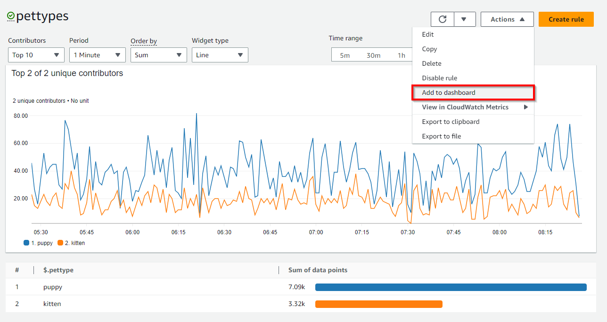
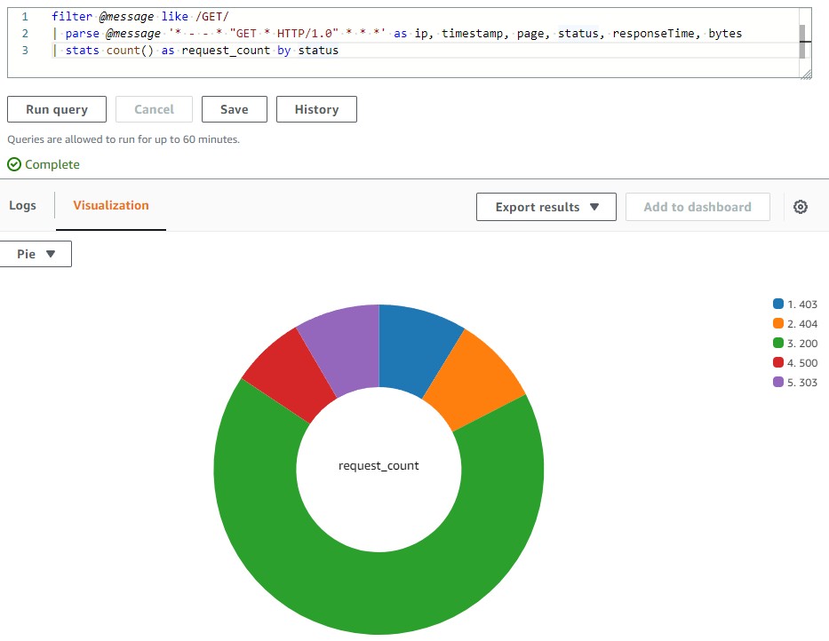

# CloudWatch ダッシュボード

## はじめに

AWS アカウント内のリソースのインベントリの詳細、リソースのパフォーマンスとヘルスチェックを知ることは、安定したリソース管理にとって重要です。Amazon CloudWatch ダッシュボードは、CloudWatch コンソール内のカスタマイズ可能なホームページで、クロスアカウントまたは異なるリージョンに分散しているリソースであっても、1 つのビューでリソースを監視するために使用できます。

[Amazon CloudWatch ダッシュボード](https://docs.aws.amazon.com/ja_jp/AmazonCloudWatch/latest/monitoring/CloudWatch_Dashboards.html) を使用すると、お客様は再利用可能なグラフを作成し、統合されたビューでクラウドリソースとアプリケーションを視覚化できます。CloudWatch ダッシュボードを通じて、お客様はメトリクスとログデータを統合ビューで並べてグラフ化し、素早くコンテキストを把握して、問題の診断から根本原因の理解へと移行できます。また、平均復旧時間 (MTTR) を短縮できます。たとえば、お客様は CPU 使用率やメモリなどの主要メトリクスの現在の利用状況を可視化し、割り当てられた容量と比較できます。お客様はまた、特定のメトリクスのログパターンを相関付けて、パフォーマンスと運用上の問題をアラートできます。CloudWatch ダッシュボードは、アラームの現在のステータスを表示することで、すばやく視覚化して注意を促し、アクションを起こせます。CloudWatch ダッシュボードの共有により、ダッシュボードで表示される情報を組織内外のチームやステークホルダーと簡単に共有できます。

## ウィジェット

#### デフォルトウィジェット

ウィジェットは、AWS 環境のリソースやアプリケーションメトリクス、ログの重要な情報やリアルタイムの詳細を表示する CloudWatch ダッシュボードの構成要素です。 お客様は、必要に応じてウィジェットを追加、削除、並べ替え、サイズ変更することで、ダッシュボードを希望の体験にカスタマイズできます。

ダッシュボードに追加できるグラフの種類には、折れ線グラフ、数値、ゲージ、積み上げ面グラフ、棒グラフ、円グラフがあります。

**Line、Number、Gauge、Stacked area、Bar、Pie** のような**グラフ**タイプのデフォルト ウィジェットと、**Text、Alarm Status、Logs table、Explorer** のようなその他のウィジェットがあり、お客様はこれらを選択してメトリクスやログデータを追加し、ダッシュボードを構築できます。


**その他の参考資料:**

- AWS Observability ワークショップの [Metric Number Widgets](https://catalog.workshops.aws/observability/ja-JP/aws-native/dashboards/metrics-number)
- AWS Observability ワークショップの [Text Widgets](https://catalog.workshops.aws/observability/ja-JP/aws-native/dashboards/text-widget) 
- AWS Observability ワークショップの [Alarm Widgets](https://catalog.workshops.aws/observability/ja-JP/aws-native/dashboards/alarm-widgets)
- ドキュメントの [Creating and working with widgets on CloudWatch dashboards](https://docs.aws.amazon.com/AmazonCloudWatch/latest/monitoring/create-and-work-with-widgets.html)

#### カスタムウィジェット

お客様は、[カスタムウィジェットを追加](https://docs.aws.amazon.com/ja_jp/AmazonCloudWatch/latest/monitoring/create-and-work-with-widgets.html)して、CloudWatch ダッシュボードでカスタムの視覚化、複数のソースからの情報の表示、ボタンなどのカスタムコントロールを追加し、CloudWatch ダッシュボードで直接アクションを実行することもできます。カスタムウィジェットは Lambda 関数で完全にサーバーレスで動作するため、コンテンツ、レイアウト、インタラクションを完全に制御できます。カスタムウィジェットは、ダッシュボード上にカスタムデータビューやツールを構築する簡単な方法であり、複雑な Web フレームワークを学習する必要はありません。Lambda でコードを記述し、HTML を作成できるのであれば、便利なカスタムウィジェットを作成できます。


**その他の参考資料:**

- オブザーバビリティワークショップの[カスタムウィジェット](https://catalog.workshops.aws/observability/ja-JP/aws-native/dashboards/custom-widgets)
- GitHub の [CloudWatch カスタムウィジェットサンプル](https://github.com/aws-samples/cloudwatch-custom-widgets-samples#what-are-custom-widgets)
- ブログ: [Amazon CloudWatch ダッシュボードのカスタムウィジェットの使用](https://aws.amazon.com/jp/blogs/news/introducing-amazon-cloudwatch-dashboards-custom-widgets/)

## 自動ダッシュボード

自動ダッシュボードは、Amazon CloudWatch の下にあるすべての AWS リソースの正常性とパフォーマンスの集約されたビューを提供する、すべての AWS パブリックリージョンで利用できます。これにより、お客様はモニタリングの開始、メトリクスとアラームのリソースベースのビュー、パフォーマンスの問題の根本原因を理解するためのドリルダウンが容易になります。自動ダッシュボードは、AWS サービス推奨の [ベストプラクティス](https://docs.aws.amazon.com/prescriptive-guidance/latest/implementing-logging-monitoring-cloudwatch/cloudwatch-dashboards-visualizations.html) で事前構築されており、リソースを意識したままで、重要なパフォーマンスメトリクスの最新の状態を反映するように動的に更新されます。自動サービスダッシュボードは、サービスのすべての標準的な CloudWatch メトリクスを表示し、サービスメトリクスごとに使用されるすべてのリソースをグラフ化し、アカウント間で異常なリソースをすばやく特定して、高いまたは低い利用率のリソースを特定し、コストの最適化に役立てることができます。


**その他の参考資料:**  

- AWS Observability ワークショップの[自動ダッシュボード](https://catalog.workshops.aws/observability/ja-JP/aws-native/dashboards/autogen-dashboard)
- YouTube の [Amazon CloudWatch ダッシュボードを使用した AWS リソースのモニタリング](https://www.youtube.com/watch?v=I7EFLChc07M)

#### 自動ダッシュボードのコンテナインサイト

[CloudWatch Container Insights](https://docs.aws.amazon.com/AmazonCloudWatch/latest/monitoring/ContainerInsights.html) は、コンテナ化されたアプリケーションやマイクロサービスからメトリクスとログを収集、集約、要約します。Container Insights は、Amazon Elastic Container Service(Amazon ECS)、Amazon Elastic Kubernetes Service(Amazon EKS)、および Amazon EC2 上の Kubernetes プラットフォームで利用できます。Container Insights は、Amazon ECS と Amazon EKS の両方で Fargate にデプロイされたクラスタからのメトリクスの収集をサポートしています。CloudWatch は CPU、メモリ、ディスク、ネットワークなど、多くのリソースのメトリクスを自動的に収集するとともに、コンテナの再起動失敗などの診断情報も提供し、問題を隔離して迅速に解決するのに役立ちます。

CloudWatch は、[組み込みメトリクスフォーマット](/observability-best-practices/ja/guides/signal-collection/emf/)を使用した CloudWatch メトリクスとして、クラスター、ノード、Pod、タスク、サービスレベルで集約メトリクスを作成します。これは、構造化された JSON スキーマを使用するパフォーマンスログイベントで、高基数データを大規模にインジェストおよび保存できるようになります。Container Insights が収集するメトリクスは、[CloudWatch の自動ダッシュボード](https://docs.aws.amazon.com/prescriptive-guidance/latest/implementing-logging-monitoring-cloudwatch/cloudwatch-dashboards-visualizations.html#use-automatic-dashboards)で利用できるほか、CloudWatch コンソールのメトリクスセクションでも表示できます。


#### 自動ダッシュボードのLambda Insights

[CloudWatch Lambda Insights](https://docs.aws.amazon.com/lambda/latest/dg/monitoring-insights.html) は、Lambda 関数などのサーバレスアプリケーションの監視とトラブルシューティングのソリューションであり、Lambda 関数の[自動ダッシュボード](https://docs.aws.amazon.com/prescriptive-guidance/latest/implementing-logging-monitoring-cloudwatch/cloudwatch-dashboards-visualizations.html#use-automatic-dashboards)を動的に作成します。また、CPU 時間、メモリ、ディスク、ネットワークなどのシステムレベルのメトリクスと、コールドスタートや Lambda ワーカーのシャットダウンなどの診断情報を収集、集約、要約して、Lambda 関数の問題を隔離し、迅速に解決するのに役立ちます。 [Lambda Insights](https://docs.aws.amazon.com/AmazonCloudWatch/latest/monitoring/Lambda-Insights.html) は、関数レベルでレイヤーとして提供される Lambda 拡張機能で、有効にすると[埋め込みメトリクスフォーマット](/observability-best-practices/ja/guides/signal-collection/emf/)を使用してログイベントからメトリクスを抽出し、エージェントは必要ありません。


## カスタムダッシュボード

お客様は、さまざまなウィジェットを使用して必要な数の追加のダッシュボードを[カスタムダッシュボード](https://docs.aws.amazon.com/ja_jp/AmazonCloudWatch/latest/monitoring/create_dashboard.html)として作成し、カスタマイズすることもできます。ダッシュボードはクロスリージョンとクロスアカウントの表示に設定でき、お気に入りリストに追加できます。


お客様は、CloudWatch コンソールのナビゲーションペインから簡単にアクセスできるように、[お気に入りリスト](https://docs.aws.amazon.com/ja_jp/AmazonCloudWatch/latest/monitoring/add-dashboard-to-favorites.html)に自動またはカスタムのダッシュボードを追加できます。

**その他の参考資料:**

- AWS Observability ワークショップの [CloudWatch ダッシュボード](https://catalog.workshops.aws/observability/ja-JP/aws-native/dashboards/create)
- AWS Well-Architected ラボのパフォーマンス効率の [CloudWatch ダッシュボードを使用したモニタリング](https://www.wellarchitectedlabs.com/performance-efficiency/100_labs/100_monitoring_windows_ec2_cloudwatch/)

#### CloudWatch ダッシュボードへの Contributor Insights の追加

CloudWatch は、[Contributor Insights](https://docs.aws.amazon.com/ja_jp/AmazonCloudWatch/latest/monitoring/ContributorInsights.html) を提供しており、これを使用するとログデータを分析し、トップ N のコントリビューター、ユニーク コントリビューターの総数、使用状況に関するメトリクスを表示する時系列データを作成できます。これにより、トップトーカーの特定や、システム パフォーマンスに影響を与えているものが何であるかを理解することができます。たとえば、顧客は不適切なホストを見つけ出したり、最も重いネットワーク ユーザーを特定したり、最も多くのエラーを生成している URL を見つけ出したりすることができます。

Contributor Insights レポートは、CloudWatch コンソールの[新規または既存のダッシュボード](https://docs.aws.amazon.com/ja_jp/AmazonCloudWatch/latest/monitoring/ContributorInsights-ViewReports.html)に追加できます。



#### CloudWatch ダッシュボードへの Application Insights の追加

[CloudWatch Application Insights](https://docs.aws.amazon.com/AmazonCloudWatch/latest/monitoring/cloudwatch-application-insights.html) は、AWS でホストされているアプリケーションとその基盤となる AWS リソースの可観測性を容易にします。これにより、アプリケーションの正常性に関する可視性が向上し、アプリケーションの問題をトラブルシューティングするための平均修理時間 (MTTR) を短縮するのに役立ちます。Application Insights は、監視対象のアプリケーションで発生し得る問題を示す自動ダッシュボードを提供し、お客様がアプリケーションとインフラストラクチャの進行中の問題をすばやく特定できるよう支援します。

以下に示す Application Insights 内の「Export to CloudWatch」オプションは、CloudWatch コンソールにダッシュボードを追加します。これにより、お客様は重要なアプリケーションを簡単に監視して洞察を得ることができます。


#### CloudWatch ダッシュボードへのサービスマップの追加

[CloudWatch ServiceLens](https://docs.aws.amazon.com/AmazonCloudWatch/latest/monitoring/ServiceLens.html) は、トレース、メトリクス、ログ、アラーム、その他のリソースヘルス情報を 1 か所に統合することで、サービスとアプリケーションの可観測性を向上させます。ServiceLens は CloudWatch と AWS X-Ray を統合して、パフォーマンスのボトルネックを効率的に特定し、影響を受けるユーザーを識別するのに役立つアプリケーションのエンドツーエンドビューを提供します。[サービスマップ](https://docs.aws.amazon.com/AmazonCloudWatch/latest/monitoring/servicelens_service_map.html) は、サービスのエンドポイントとリソースをノードとして表示し、各ノードとその接続のトラフィック、レイテンシ、エラーを強調表示します。表示される各ノードは、そのサービスの部分に関連する相関メトリクス、ログ、トレースについて詳細な洞察を提供します。

以下に示すように、サービスマップ内の「ダッシュボードに追加」オプションは、新しいダッシュボードを追加するか、CloudWatch コンソールの既存のダッシュボードに追加し、アプリケーションのトレースを簡単に行って洞察を得るのに役立ちます。


#### CloudWatch ダッシュボードへのメトリクスエクスプローラーの追加

CloudWatch の[メトリクスエクスプローラー](https://docs.aws.amazon.com/ja_jp/AmazonCloudWatch/latest/monitoring/CloudWatch-Metrics-Explorer.html) は、タグとリソースプロパティに基づいてメトリクスをフィルタリング、集計、可視化することで、AWS サービスの可観測性を強化するタグベースのツールです。メトリクスエクスプローラーは柔軟で動的なトラブルシューティング体験を提供します。これにより、お客様は複数のグラフを同時に作成し、これらのグラフを使用してアプリケーションのヘルスダッシュボードを構築できます。メトリクスエクスプローラーの可視化は動的なので、メトリクスエクスプローラーウィジェットを作成して CloudWatch ダッシュボードに追加した後に、マッチするリソースが作成されると、新しいリソースが自動的にエクスプローラーウィジェットに表示されます。

以下に示すように、メトリクスエクスプローラー内の「[ダッシュボードに追加](https://docs.aws.amazon.com/ja_jp/AmazonCloudWatch/latest/monitoring/add_metrics_explorer_dashboard.html)」オプションは、新しいダッシュボードを追加するか、CloudWatch コンソールの既存のダッシュボードに追加します。これにより、お客様は AWS サービスとリソースのより多くのグラフインサイトを取得できるようになります。


## CloudWatch ダッシュボードを使用して可視化するもの

お客様は、リージョンとアカウントをまたいでワークロードとアプリケーションを監視するために、アカウントレベルとアプリケーションレベルのダッシュボードを作成できます。 お客様は、サービス固有のメトリクスで事前構成されたサービスレベルのダッシュボードである CloudWatch 自動ダッシュボードからすぐに開始できます。 本番環境のアプリケーションやワークロードに関連し重要なキーメトリクスとリソースに焦点を当てた、アプリケーションおよびワークロード固有のダッシュボードを作成することをおすすめします。

#### メトリクスデータの可視化

メトリクスデータは、**Line、Number、Gauge、Stacked area、Bar、Pie** などのグラフウィジェットを介して CloudWatch ダッシュボードに追加できます。これは、メトリクスの**Average、Minimum、Maximum、Sum、SampleCount** などの統計によってサポートされています。[統計](https://docs.aws.amazon.com/ja_jp/AmazonCloudWatch/latest/monitoring/Statistics-definitions.html) は、指定された期間にわたるメトリクスデータの集計です。


[Metric Math](https://docs.aws.amazon.com/ja_jp/AmazonCloudWatch/latest/monitoring/using-metric-math.html) を使用すると、複数の CloudWatch メトリクスをクエリし、これらのメトリクスに基づいて数式を使用して新しい時系列を作成できます。 顧客は、結果の時系列を CloudWatch コンソールで視覚化し、ダッシュボードに追加できます。 また、[GetMetricDataAPI](https://docs.aws.amazon.com/ja_jp/AmazonCloudWatch/latest/APIReference/API_GetMetricData.html) 操作を使用してプログラムでメトリクス数式を実行することもできます。

**その他の参考資料:** 

- [CloudWatch を使用した IoT フリートのモニタリング](https://aws.amazon.com/jp/blogs/iot/monitoring-your-iot-fleet-using-cloudwatch/)

#### ログデータの視覚化

顧客は、CloudWatch ダッシュボードでバーチャート、折れ線グラフ、スタックエリアチャートを使用して、[ログデータの視覚化](https://docs.aws.amazon.com/ja_jp/AmazonCloudWatch/latest/logs/CWL_Insights-Visualizing-Log-Data.html)を実現できます。これにより、パターンを効率的に特定できます。CloudWatch Logs Insights は、stats 関数と 1 つ以上の集計関数を使用したクエリの視覚化を生成し、バーチャートを作成できます。クエリが時間とともに 1 つのフィールドで[データをグループ化](https://docs.aws.amazon.com/ja_jp/AmazonCloudWatch/latest/logs/CWL_Insights-Visualizing-Log-Data.html#CWL_Insights-Visualizing-ByFields)する bin() 関数を使用している場合、折れ線グラフとスタックエリアチャートを使用して視覚化できます。

クエリにステータス関数の 1 つ以上の集計、または bin() 関数を使用して 1 つのフィールドでデータをグループ化している場合は、[時系列データ](https://docs.aws.amazon.com/ja_jp/AmazonCloudWatch/latest/logs/CWL_Insights-Visualizing-Log-Data.html#CWL_Insights-Visualizing-TimeSeries) を視覚化できます。

stats 関数として count() を使用したサンプルクエリを以下に示します。

```java
filter @message like /GET/
| parse @message '_ - - _ "GET _ HTTP/1.0" .*.*.*' as ip, timestamp, page, status, responseTime, bytes
| stats count() as request_count by status
```

上記のクエリでは、CloudWatch Logs Insights で結果が次のように表示されます。


クエリ結果のパイチャートとしての視覚化を以下に示します。



**その他の参考資料:**

- AWS Observability ワークショップの CloudWatch ダッシュボードでの[ログ結果の表示](https://catalog.workshops.aws/observability/ja-JP/aws-native/logs/logsinsights/displayformats)
- [Amazon CloudWatch ダッシュボードで AWS WAF ログを視覚化する](https://aws.amazon.com/jp/blogs/news/visualize-aws-waf-logs-with-an-amazon-cloudwatch-dashboard/)

#### アラームの視覚化

CloudWatch のメトリクスアラームは、1 つのメトリクスまたは CloudWatch メトリクスに基づく数式の結果を監視します。アラームは、期間におけるメトリクスまたは式の値をしきい値と比較した結果に基づいて、1つ以上のアクションを実行します。[CloudWatch ダッシュボード](https://docs.aws.amazon.com/ja_jp/AmazonCloudWatch/latest/monitoring/add_remove_alarm_dashboard.html) には、ウィジェット内の単一のアラームとともに追加できます。これは、アラームのメトリクスのグラフとアラームのステータスを表示します。また、CloudWatch ダッシュボードにアラームステータスウィジェットを追加して、グリッド内の複数のアラームのステータスを表示することもできます。アラーム名と現在のステータスのみが表示され、グラフは表示されません。

CloudWatch ダッシュボード内のアラームウィジェットでキャプチャされたサンプルメトリクスアラームステータスを以下に示します。


## クロスアカウントとクロスリージョン

複数の AWS アカウントを持つお客様は、[クロスアカウント CloudWatch](https://docs.aws.amazon.com/ja_jp/AmazonCloudWatch/latest/monitoring/cloudwatch_crossaccount_dashboard.html) オブザーバビリティを設定し、中央のモニタリングアカウントで、アカウントの境界線なしにメトリクス、ログ、トレースをシームレスに検索、可視化、分析できる、豊富なクロスアカウント ダッシュボードを作成できます。

お客様はまた、複数の AWS アカウントとリージョンからの CloudWatch データを 1 つのダッシュボードに要約する、[クロスアカウント クロスリージョン](https://docs.aws.amazon.com/ja_jp/AmazonCloudWatch/latest/monitoring/cloudwatch_xaxr_dashboard.html) ダッシュボードも作成できます。この高レベルのダッシュボードから、お客様はアプリケーション全体の統合されたビューを取得でき、アカウントのサインイン/サインアウトやリージョンの切り替えを行うことなく、より具体的なダッシュボードにドリルダウンすることもできます。

**その他の参考文献:**

- [中央の Amazon CloudWatch ダッシュボードで、新しいクロスアカウント Amazon EC2 インスタンスを自動的に追加する方法](https://aws.amazon.com/jp/blogs/news/how-to-auto-add-new-cross-account-amazon-ec2-instances-in-a-central-amazon-cloudwatch-dashboard/)
- [マルチアカウント Amazon CloudWatch ダッシュボードのデプロイ](https://aws.amazon.com/jp/blogs/news/deploy-multi-account-amazon-cloudwatch-dashboards/)
- YouTube の [クロスアカウントとクロスリージョン CloudWatch ダッシュボードの作成](https://www.youtube.com/watch?v=eIUZdaqColg)

## ダッシュボードの共有

CloudWatch ダッシュボードは、チーム間の人々、ステークホルダー、および AWS アカウントへの直接アクセス権がない組織外の人々と共有できます。これらの[共有ダッシュボード](https://docs.aws.amazon.com/ja_jp/AmazonCloudWatch/latest/monitoring/cloudwatch-dashboard-sharing.html)は、チームエリアの大画面、監視やネットワーク運用センター (NOC) で表示したり、Wiki や公開 Web ページに埋め込むことができます。

ダッシュボードを共有して簡単かつ安全にするために、3 つの方法があります。

- ダッシュボードを[一般公開で共有](https://docs.aws.amazon.com/ja_jp/AmazonCloudWatch/latest/monitoring/cloudwatch-dashboard-sharing.html#share-cloudwatch-dashboard-public)すると、リンクを持つ誰でもダッシュボードを表示できます。
- ダッシュボードを、ダッシュボードを表示できる人々の[特定のメールアドレスに共有](https://docs.aws.amazon.com/ja_jp/AmazonCloudWatch/latest/monitoring/cloudwatch-dashboard-sharing.html#share-cloudwatch-dashboard-email-addresses)することができます。 これらのユーザーはそれぞれ、ダッシュボードを表示するために入力する独自のパスワードを作成します。
- ダッシュボードは、[シングルサインオン (SSO) プロバイダー](https://docs.aws.amazon.com/ja_jp/AmazonCloudWatch/latest/monitoring/cloudwatch-dashboard-sharing.html#share-cloudwatch-dashboards-setup-SSO) を介したアクセスで AWS アカウント内で共有できます。

**ダッシュボードを一般公開で共有する際の注意点**

ダッシュボードに機密情報や秘密情報が含まれている場合、CloudWatch ダッシュボードの一般公開共有は推奨されません。 可能であれば、ダッシュボード共有時にはユーザー名/パスワードまたはシングルサインオン (SSO) を使用した認証を利用することをおすすめします。

ダッシュボードが一般公開されると、CloudWatch はダッシュボードをホストする Web ページへのリンクを生成します。 Web ページを表示しているすべてのユーザーが、公開共有ダッシュボードの内容も表示できるようになります。 この Web ページは、共有するダッシュボード内のアラームとコントリビューターの洞察ルールをクエリする API を呼び出し、アカウント内のすべてのメトリクス、EC2 インスタンスの名前とタグに一時的な資格情報を提供するリンクを提供します。これらは、共有するダッシュボードには表示されていない可能性があります。 この情報を一般公開で利用できるようにすることが適切かどうかを検討することをお勧めします。

Web ページへのダッシュボードの一般公開共有を有効にすると、アカウントに次の Amazon Cognito リソースが作成されることに注意してください: Cognito ユーザープール、Cognito アプリクライアント、Cognito ID プール、IAM ロール。

**資格情報(ユーザー名とパスワードで保護されたダッシュボード)を使用してダッシュボードを共有する際の注意点**

ダッシュボードに共有相手のユーザーと共有したくない機密情報や秘密情報が含まれている場合、CloudWatch ダッシュボードの共有は推奨されません。

ダッシュボードの共有が有効になると、CloudWatch はダッシュボードをホストする Web ページへのリンクを生成します。 上記で指定したユーザーには、共有するダッシュボード内のアラームとコントリビューターの洞察ルールへの CloudWatch 読み取り専用アクセス権限が付与されます。また、共有するダッシュボードに表示されていなくても、アカウント内のすべてのメトリクス、EC2 インスタンスの名前とタグが付与されます。 この情報を共有しているユーザーが利用できるようにすることが適切かどうかを検討することをお勧めします。  

Web ページへのアクセスのために指定したユーザーとのダッシュボードの共有を有効にすると、アカウントに次の Amazon Cognito リソースが作成されることに注意してください: Cognito ユーザープール、Cognito ユーザー、Cognito アプリクライアント、Cognito ID プール、IAM ロール。

**SSO プロバイダーを使用したダッシュボードの共有に関する注意事項**

シングルサインオン (SSO) を使用して CloudWatch ダッシュボードが共有されると、選択した SSO プロバイダーに登録されているユーザーに、共有されているアカウントのすべてのダッシュボードへのアクセス権限が付与されます。 また、この方法でのダッシュボードの共有が無効になると、すべてのダッシュボードが自動的に共有解除されます。

**その他の参考文献:**

- AWS Observability ワークショップの[ダッシュボードの共有](https://catalog.workshops.aws/observability/ja-JP/aws-native/dashboards/sharingdashboard)
- ブログ: [AWS Single Sign-On を使用して Amazon CloudWatch ダッシュボードを誰でも共有](https://aws.amazon.com/jp/blogs/news/share-your-amazon-cloudwatch-dashboards-with-anyone-using-aws-single-sign-on/)  
- ブログ: [Amazon CloudWatch ダッシュボードの共有による監視情報の伝達](https://aws.amazon.com/jp/blogs/news/communicate-monitoring-information-by-sharing-amazon-cloudwatch-dashboards/)

## リアルタイムデータ

ダッシュボードには、ワークロードからのメトリクスが定期的に公開されている場合、メトリクスウィジェットを介して[リアルタイムデータ](https://docs.aws.amazon.com/ja_jp/AmazonCloudWatch/latest/monitoring/cloudwatch-live-data.html)も表示されます。お客様はダッシュボード全体または個々のウィジェットでリアルタイムデータを有効に選択できます。

リアルタイムデータが **オフ** になっている場合、少なくとも1分前の集計期間のデータポイントのみが表示されます。 たとえば、5分の期間を使用している場合、12:35のデータポイントは12:35から12:40に集計され、12:41に表示されます。

リアルタイムデータが **オン** になっている場合、対応する集計インターバルでデータが公開されるとすぐに、最新のデータポイントが表示されます。 表示を更新するたびに、その集計期間内で新しいデータが公開されるにつれて、最新のデータポイントが変更される場合があります。

## アニメーションダッシュボード

[アニメーションダッシュボード](https://docs.aws.amazon.com/ja_jp/AmazonCloudWatch/latest/monitoring/cloudwatch-animated-dashboard.html) は、時間経過とともにキャプチャされた CloudWatch メトリクスデータを再生します。これにより、トレンドの確認、プレゼンテーションの作成、問題発生後の分析が容易になります。アニメーション化されるダッシュボードウィジェットには、ラインウィジェット、スタックエリアウィジェット、数値ウィジェット、メトリクスエクスプローラウィジェットが含まれます。パイグラフ、バーチャート、テキストウィジェット、ログウィジェットはダッシュボードに表示されますが、アニメーション化されません。

## CloudWatch ダッシュボードの API/CLI サポート

AWS Management Console を通じて CloudWatch ダッシュボードにアクセスする以外に、お客様は API、AWS コマンドラインインターフェース(CLI)、AWS SDK を通じてもサービスにアクセスできます。ダッシュボードの CloudWatch API は、AWS CLI を通じて自動化したり、ソフトウェア/製品と統合するのに役立ちます。その結果、リソースとアプリケーションの管理や運用に費やす時間を短縮できます。

- [ListDashboards](https://docs.aws.amazon.com/AmazonCloudWatch/latest/APIReference/API_ListDashboards.html): アカウントのダッシュボードのリストを返します
- [GetDashboard](https://docs.aws.amazon.com/AmazonCloudWatch/latest/APIReference/API_GetDashboard.html): 指定したダッシュボードの詳細を表示します
- [DeleteDashboards](https://docs.aws.amazon.com/AmazonCloudWatch/latest/APIReference/API_DeleteDashboards.html): 指定したすべてのダッシュボードを削除します
- [PutDashboard](https://docs.aws.amazon.com/AmazonCloudWatch/latest/APIReference/API_PutDashboard.html): ダッシュボードがまだ存在しない場合は作成し、既存のダッシュボードの場合は更新します。ダッシュボードを更新すると、内容全体がここで指定したものに置き換えられます

ダッシュボード本体の構造と構文の CloudWatch API リファレンスは[こちら](https://docs.aws.amazon.com/AmazonCloudWatch/latest/APIReference/CloudWatch-Dashboard-Body-Structure.html)

AWS Command Line Interface (AWS CLI) は、コマンドラインシェルで AWS サービスと対話できるオープンソースツールです。これは、ブラウザベースの AWS Management Console が提供する機能と同等の機能を実装しています。

CLI サポート:

- [list-dashboards](https://docs.aws.amazon.com/cli/latest/reference/cloudwatch/list-dashboards.html)
- [get-dashboard](https://docs.aws.amazon.com/cli/latest/reference/cloudwatch/get-dashboard.html) 
- [delete-dashboards](https://docs.aws.amazon.com/cli/latest/reference/cloudwatch/delete-dashboards.html)
- [put-dashboard](https://docs.aws.amazon.com/cli/latest/reference/cloudwatch/put-dashboard.html)

**その他のリファレンス:** AWS Observability ワークショップの [CloudWatch ダッシュボードと AWS CLI](https://catalog.workshops.aws/observability/en-US/aws-native/dashboards/createcli)

## CloudWatch ダッシュボードの自動化

CloudWatch ダッシュボードの自動作成のために、お客様は CloudFormation や Terraform のようなインフラストラクチャーアズコード(IaC)ツールを使用できます。これらのツールは、AWS で実行されるアプリケーションに集中できるように、それらのリソースの管理に費やす時間を短縮するのに役立ちます。

[AWS CloudFormation](https://docs.aws.amazon.com/AWSCloudFormation/latest/UserGuide/aws-resource-cloudwatch-dashboard.html) は、テンプレートを通じてダッシュボードの作成をサポートしています。AWS::CloudWatch::Dashboard リソースは、Amazon CloudWatch ダッシュボードを指定します。

[Terraform](https://registry.terraform.io/providers/hashicorp/aws/latest/docs/resources/cloudwatch_dashboard) にも、IaC 自動化を通じて CloudWatch ダッシュボードを作成するためのモジュールがあります。

必要なウィジェットを使用してダッシュボードを手動で作成することは簡単です。ただし、Auto Scaling グループのスケールアウトとスケールインイベント中に作成または削除される EC2 インスタンスなど、動的な情報に基づいているコンテンツの場合、リソースソースを更新するためのいくらかの労力が必要になる場合があります。 自動的に [Amazon EventBridge と AWS Lambda を使用して Amazon CloudWatch ダッシュボードを作成および更新する方法](https://aws.amazon.com/blogs/mt/update-your-amazon-cloudwatch-dashboards-automatically-using-amazon-eventbridge-and-aws-lambda/) について知りたい場合は、ブログ記事を参照してください。

**追加の参考ブログ:**

- [Automating Amazon CloudWatch dashboard creation for Amazon EBS volume KPIs](https://aws.amazon.com/blogs/storage/automating-amazon-cloudwatch-dashboard-creation-for-amazon-ebs-volume-kpis/)
- [Automate creation of Amazon CloudWatch alarms and dashboards with AWS Systems Manager and Ansible](https://aws.amazon.com/blogs/mt/automate-creation-of-amazon-cloudwatch-alarms-and-dashboards-with-aws-systems-manager-and-ansible/)
- [Deploying an automated Amazon CloudWatch dashboard for AWS Outposts using AWS CDK](https://aws.amazon.com/blogs/compute/deploying-an-automated-amazon-cloudwatch-dashboard-for-aws-outposts-using-aws-cdk/)

CloudWatch ダッシュボードに関する[製品 FAQ](https://aws.amazon.com/cloudwatch/faqs/#Dashboards)
