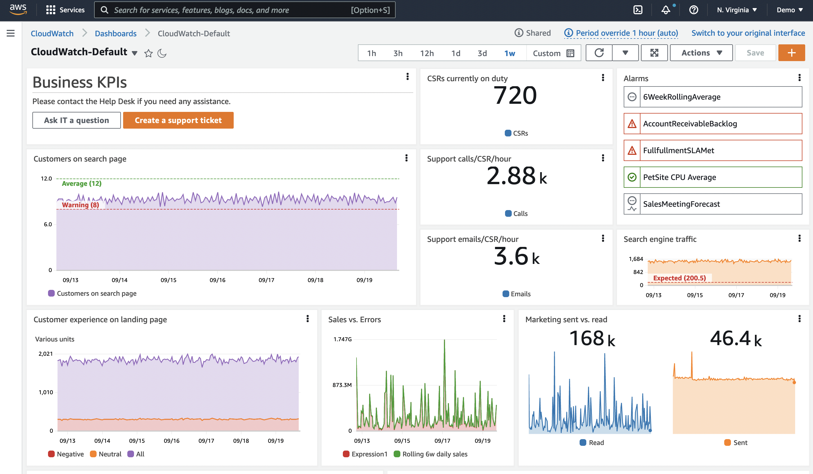

# ダッシュボード

ダッシュボードは、オブザーバビリティソリューションの重要な部分です。データのキュレーションされたビジュアライゼーションを生成できます。データの履歴を確認したり、関連するその他のデータとともに確認したりすることができます。また、コンテキストを提供することもできます。全体像を理解するのに役立ちます。

多くの場合、人々はデータを収集し、アラームを作成して、そこで止まってしまいます。しかし、アラームはある瞬間の状態を示すだけで、通常は単一のメトリクス、または少量のデータについてのみ示します。ダッシュボードは時間経過とともに動作を確認するのに役立ちます。



## 実践的な例: 高CPU用のアラームを考える

インスタンスやアプリケーションのCPU使用率が望ましい値よりも高くなっていることがわかっています。
対応が必要なのか、そしてその緊急度はどの程度なのか判断するために、次のような点を確認することが役立ちます。

* このインスタンスやアプリケーションにおける通常のCPU使用率はどの程度か
* スパイクなのか、CPU使用率が徐々に上昇しているトレンドなのか
* パフォーマンスに影響が出ているか。まだ出ていなければ、影響が出始めるまでどの程度時間があるか
* このようなことが定期的に起こっているか。そして、通常、自動的に回復することがあるか

### データの履歴を確認する

ここで、CPU の時系列チャートを含むダッシュボードを考えてみましょう。この単一のメトリクスからでも、スパイクなのか上昇傾向なのかがわかります。また、上昇の速度もわかるので、対応の優先順位を決定することができます。

### ワークフローへの影響を確認する

しかし、このマシンは何をしているのでしょうか? 全体的なコンテキストの中で、どの程度重要なのでしょうか? ここで、レスポンスタイム、スループット、エラー、その他の測定値など、ワークフローのパフォーマンスの視覚化を追加したとします。 これにより、高い CPU 使用率が、このインスタンスがサポートしているワークフローやユーザーに影響を与えているかどうかを確認できます。

### アラームの履歴を確認する

過去1ヶ月間にアラームが発生した頻度を示す視覚化を追加し、さらに過去を遡ってこの発生が定期的なものかどうかを確認することを検討してください。
例えば、バックアップジョブがスパイクを引き起こしているのでしょうか。
再発のパターンを知ることで、根本的な問題を理解し、アラームの再発を完全に停止するための長期的な判断を下すのに役立ちます。

### コンテキストを追加する

最後に、ダッシュボードにコンテキストを追加します。このダッシュボードが存在する理由の簡単な説明、関連するワークフロー、問題が発生したときの対処法、ドキュメントへのリンク、および連絡先を含めます。

!!! info
    これで*ストーリー*ができあがり、ダッシュボードのユーザーが状況を把握し、影響を理解し、適切なデータドリブンの意思決定を行うのに役立ちます。これには、実行すべきアクションとその緊急性の判断が含まれます。

### 一度にすべてを可視化しようとしない

アラームの疲労についてよく話します。明確なアクションと優先順位がない状態でアラームが多すぎると、チームが過負荷になり非効率につながる可能性があります。アラームは、重要でアクション可能なものに設定する必要があります。

ダッシュボードはここでより柔軟です。同じように注意を要求するわけではないので、まだ重要性がわからないものや探索を支援するものを可視化する自由度が高くなります。それでも過剰は禁物です! 良いものでも過剰はすべてを損なう可能性があります。

ダッシュボードは、あなたにとって重要なものの全体像を提供する必要があります。取り込むデータを決定するのと同じように、ダッシュボードについてもあなたにとって何が重要かを考える必要があります。
ダッシュボードの場合、次のことを考えてください。

* 誰がこれを見るのか
    * その人の背景と知識は何か 
	* どの程度のコンテキストが必要か
* どのような疑問に答えようとしているのか
* このデータを見た結果として、どのようなアクションを取るのか

!!! tip
    ダッシュボードのストーリーは何にすべきか、どの程度含めるべきか、判断しづらいことがよくあります。そこで、ダッシュボードの設計をどこから始めればいいでしょうか。*KPI駆動*か*インシデント駆動*の2つのアプローチが考えられます。

#### ダッシュボードの設計: KPI 主導

これを理解する1つの方法は、KPI から逆算することです。これは通常、非常にユーザー主導のアプローチです。
[レイアウト](#layout) では、通常、上から下に作業を進め、ダッシュボードを下に移動したり、下位のダッシュボードに移動したりするにつれて、詳細について得ることができます。

まず、**KPI を理解する**ことが重要です。それらが何を意味しているかを理解することで、どのように視覚化したいかを決定するのに役立ちます。
多くの KPI は単一の数字として示されます。たとえば、特定のワークフローを正常に完了した顧客の割合と、その完了に要した時間はどうなっているでしょうか。しかし、どの期間についてでしょうか? 1週間の平均であれば KPI を満たしていても、この期間内で基準を超えている時期がある可能性があります。こうした違反は重要なのでしょうか。顧客体験に影響しているでしょうか。影響している場合は、異なる期間と時系列チャートを使用して KPI を確認することを検討するかもしれません。おそらくすべての人が詳細を確認する必要があるわけではないので、KPI の内訳を別のダッシュボードに移動し、別の対象者用にすることもできます。

次に、**それらの KPI に影響を与えるものは何か**を特定します。それらのアクションが発生するためには、どのようなワークフローが実行されている必要がありますか? これらを測定できますか?

主要コンポーネントを特定し、パフォーマンスの視覚化を追加します。KPI が基準を超えた場合、ワークフローのどこに主な影響があるかをすぐに確認できる必要があります。

そして、さらに掘り下げることができます。これらのワークフローのパフォーマンスに影響を与えるものは何でしょうか。対象者を考慮しながら、深さのレベルを決定してください。

KPI が注文数である電子商取引システムを例に考えてみましょう。
注文を行うには、ユーザーが以下のアクションを実行できる必要があります: 商品を検索し、カートに追加し、配送詳細を入力し、注文を支払う。
これらの各ワークフローについて、主要コンポーネントが機能していることを確認することを検討できます。たとえば、RUM や Synthetics を使用してアクションの成功とユーザーへの影響に関するデータを取得します。各アクションのスループット、レイテンシ、失敗したアクションの割合などを測定し、パフォーマンスが期待どおりであるか確認することもできます。基盤となるインフラストラクチャの測定を行い、パフォーマンスに影響を与えているものを確認することもできます。

ただし、すべての情報を同じダッシュボードに置くべきではありません。再度、ユーザーの対象を考慮してください。

!!! success
    ドリルダウンを可能にし、適切なコンテキストを適切なユーザーに提供するダッシュボードのレイヤーを作成します。

#### ダッシュボードの設計: インシデント駆動

多くの人にとって、インシデントの解決はオブザーバビリティの重要なドライバーです。ユーザーやオブザーバビリティのアラームから問題が通知され、迅速に修正と潜在的な原因特定が必要です。

!!! success
    最近のインシデントから確認を始めましょう。共通のパターンはありますか? 会社にとって最も影響の大きいものはどれですか? 繰り返し発生するものは?

この場合、重要度を理解し、根本原因を特定し、インシデントを修正しようとする人々のためのダッシュボードを設計しています。

特定のインシデントを思い出してください。

* インシデントが報告されたとおりに検証するにはどうしましたか?
    * 何をチェックしましたか? エンドポイント? エラー?
* 影響度を理解し、問題の優先順位を判断するにはどうしましたか?
* 問題の原因を調べるために何を確認しましたか?

ここでは、[Synthetics](../../tools/synthetics/) によるエンドポイントとワークフローの定期的なベースラインとテスト、[RUM](../../tools/rum/) による実際の顧客体験で、Application Performance Monitoring (APM) が役立ちます。このデータを使用して、影響を受けているワークフローとその程度をすばやく可視化できます。

時間経過に伴うエラー数と上位エラー数を示す視覚化により、適切な領域に焦点を当て、エラーコードと理由の詳細を示すことができます。ここではログデータと動的なエラーコードと理由の視覚化を使用することが多いです。

できるだけ早く詳細に辿り着けるようにフィルタリングやドリルダウン機能があると大変便利です。過度なオーバーヘッドなくこれを実装する方法を考えてください。たとえば、フィルタで詳細に迫れる単一のダッシュボードなどです。

### レイアウト

ダッシュボードのレイアウトも重要です。

!!! success
    通常、ユーザーが最も重要だと考えるビジュアライゼーションは、ページの左上またはナビゲーションの*始まり*に配置することが望ましいでしょう。

レイアウトを使用してストーリーを伝えるのに役立てることができます。例えば、上から下へのレイアウトを使用して、スクロールを下げるほど詳細が表示されるようにすることができます。または、左右の表示が役立つ場合もあり、左側に上位サービス、右側に依存関係を配置するなどが考えられます。

### 動的コンテンツの作成

ほとんどのワークロードは、需要に応じて拡大縮小するように設計されているため、ダッシュボードもこれを考慮する必要があります。 
たとえば、インスタンスをオートスケーリンググループに置いている場合、特定の負荷に達すると、追加のインスタンスが追加されます。

!!! success
    ID で特定のインスタンスからのデータを示すダッシュボードは、それらの新しいインスタンスからのデータが表示されることはありません。 
リソースとデータにメタデータを追加することで、特定のメタデータ値を持つすべてのインスタンスをキャプチャするように視覚化を作成できます。 
このようにすると、実際の状態を反映できます。

動的な視覚化の別の例は、現在発生している上位 10 のエラーと、最近の履歴でのそれらの動作を見つける能力です。 
テーブルやチャートを、発生する可能性のあるエラーの知識なしに表示できるようにする必要があります。

### 原因よりもまず症状を考える

症状を観察するとき、ユーザーやシステムへの影響を考えています。多くの根本的な原因が同じ症状を引き起こす可能性があります。これにより、未知の問題を含む、より多くの問題をキャプチャできます。原因を理解するにつれて、下位レベルのダッシュボードは、これらの問題を迅速に診断および修正するのに役立つように、より具体的になる場合があります。

!!! tip
    先週ユーザーに影響を与えた特定の JavaScript エラーをキャプチャするのではなく、*そのワークフローへの影響*をキャプチャし、最近の履歴における JavaScript エラーの上位カウント、または最近の履歴で劇的に増加したものを表示してください。

### 上位/下位 N を使用する

ほとんどの場合、同時に*すべての*運用メトリクスを可視化する必要はありません。大規模な EC2 インスタンスのフリートがその良い例です。数百台のサーバーから成るファーム全体のディスク IOPS や CPU 使用率を同時に表示する必要や価値はありません。これは、メトリクスの掘り下げに時間を費やすことになり、最高(または最低)のパフォーマンスのリソースが見えにくくなるという逆効果を生むことがあります。 

!!! success
    ダッシュボードを使用して、任意のメトリクスの上位10個または20個を表示し、これが明らかにする[症状](#think-about-symptoms-first-over-causes)に焦点を当ててください。

[CloudWatch メトリクス](../../tools/metrics/) を使用すると、任意の時系列の上位 N を検索できます。たとえば、次のクエリは CPU 使用率が最も高い上位 20 の EC2 インスタンスを返します。

```
SORT(SEARCH('{AWS/EC2,InstanceId} MetricName="CPUUtilization"', 'Average', 300), SUM, DESC, 10)
```

このアプローチ、または [CloudWatch メトリクスインサイト](https://docs.aws.amazon.com/ja_jp/AmazonCloudWatch/latest/monitoring/query_with_cloudwatch-metrics-insights.html) で似たようなことを行い、ダッシュボードのパフォーマンスの高い/低いメトリクスを特定してください。

### 閾値を用いた KPI の視覚的表示

KPI には警告やエラーの閾値を設定し、ダッシュボード上で水平アノテーションを使用してこれを視覚的に表示できます。これはウィジェット上に高水準マークとして表示されます。これを視覚的に表示することで、ビジネスの成果やインフラが危険な状態にある兆候を人間のオペレーターに早期に警告することができます。


!!! success
    水平アノテーションは、洗練されたダッシュボードの重要な一部です。

### コンテキストの重要性

人はデータを誤解しやすいものです。背景や現在のコンテキストが、データの見方に影響を与えます。

だから、ダッシュボード内に*テキスト*を含めることが大切です。このデータは何のためのものなのか、対象者は誰なのか。意味するところは何なのか。アプリケーションのドキュメントへのリンク、サポート担当者、トラブルシューティングドキュメントへのリンクを含めてください。テキストディスプレイを使用して、ダッシュボードの表示を分割することもできます。左右のコンテキストを設定するために左側に配置します。完全な水平ディスプレイとして使用して、ダッシュボードを垂直に分割します。 

!!! success
    IT サポート、オンコール運用担当者、ビジネスオーナーへのリンクを用意することで、イシューが発生したときに支援を得られるパスを各チームに提供できます。

!!! tip
    ダッシュボードにとって、チケットシステムへのハイパーリンクを追加することも、非常に有用なことです。
