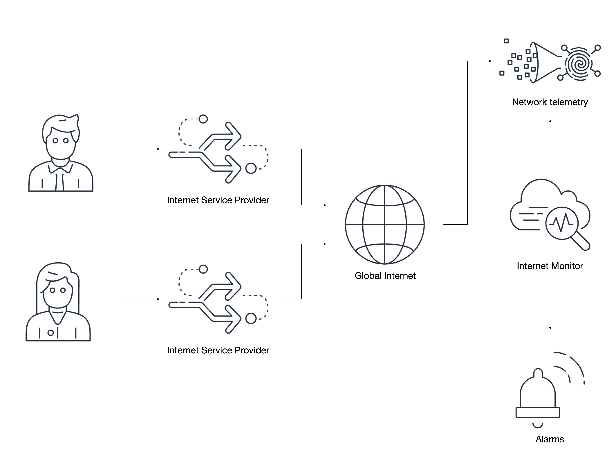

# インターネットモニター

!!! warning
	この記事を書いている時点では、[インターネットモニター](https://aws.amazon.com/blogs/aws/cloudwatch-internet-monitor-end-to-end-visibility-into-internet-performance-for-your-applications/) は CloudWatch コンソールの**プレビュー**版で利用できます。 一般提供される機能の範囲は、今日体験しているものから変更される可能性があります。

[ワークロードのすべてのティアからテレメトリを収集する](../../guides/#collect-telemetry-from-all-tiers-of-your-workload) ことはベストプラクティスであり、課題となりえます。 しかし、ワークロードのティアとは何でしょうか? ある人にとっては、Web、アプリケーション、データベースサーバーである可能性があります。 他の人は、ワークロードをフロントエンドとバックエンドとして見る可能性があります。 Webアプリケーションを運用している人は、[リアルユーザーモニタリング](../../tools/rum)(RUM)を使用して、エンドユーザーが経験するこれらのアプリの正常性を観察できます。

しかし、クライアントとデータセンターまたはクラウドサービスプロバイダー間のトラフィックはどうでしょうか? Webページとして提供されないアプリケーションの場合、RUMを使用できません。



インターネットモニターはネットワークレベルで機能し、観測されたトラフィックの正常性を [AWS の既存の知識](https://docs.aws.amazon.com/AmazonCloudWatch/latest/monitoring/CloudWatch-IM-inside-internet-monitor.html) と相関させて評価します。 要するに、パフォーマンスまたは可用性の問題が発生しているインターネットサービスプロバイダー (ISP) が **あり**、アプリケーションのトラフィックがクライアント/サーバー通信にこの ISP を使用している場合、インターネットモニターはこのワークロードへの影響を事前に通知できます。 さらに、選択したホスティングリージョンと [CloudFront](https://aws.amazon.com/cloudfront/) のコンテンツデリバリーネットワーク[^1] としての使用に基づいて推奨事項を行うことができます。

!!! tip 
	インターネットモニターは、ワークロードが通過するネットワークからのトラフィックのみを評価します。 たとえば、別の国の ISP に問題が発生していても、ユーザーがそのキャリアを使用していない場合、その問題の可視性はありません。

## インターネットを介して通信するアプリケーションのモニターを作成する

Internet Monitor の動作は、CloudFront ディストリビューションや VPC への影響を受けた ISP からのトラフィックを監視することです。これにより、制御できないネットワークの問題が原因で発生するビジネスの問題を緩和するために、アプリケーションの動作、ルーティング、ユーザーへの通知に関する判断を下すことができます。


!!! success
	インターネットを介して通信するトラフィックを監視するモニターのみを作成してください。プライベートネットワーク([RFC1918](https://www.arin.net/reference/research/statistics/address_filters/))内の 2 つのホスト間などのプライベートトラフィックは、Internet Monitor を使用して監視できません。
	
!!! success
	該当する場合は、モバイルアプリケーションからのトラフィックを優先してください。プロバイダー間をローミングしている顧客や、遠隔地にいる顧客は、異なるエクスペリエンスや予期しないエクスペリエンスを受ける可能性があり、そのことを認識しておく必要があります。

## EventBridge と CloudWatch を通じたアクションの有効化

観測された問題は、ソースが `aws.internetmonitor` として識別される[スキーマ](https://docs.aws.amazon.com/AmazonCloudWatch/latest/monitoring/CloudWatch-IM-EventBridge-integration.html)を使用して [EventBridge](https://aws.amazon.com/eventbridge/) を介して公開されます。EventBridge を使用すると、チケット管理システムで自動的に問題を作成したり、サポートチームに通知したり、ワークロードを変更して特定のシナリオを緩和する自動化をトリガーしたりすることができます。

```json
{
  "source": ["aws.internetmonitor"]
}
```

同様に、観測された都市、国、メトロ、サブディビジョンのトラフィックの詳細が [CloudWatch Logs](../../tools/logs) で利用できます。これにより、影響を受ける顧客に地域の問題について事前に通知するなど、高度にターゲットを絞ったアクションを作成できます。単一のプロバイダーの国レベルの観測の例を次に示します。

```json
{
    "version": 1,
    "timestamp": 1669659900,
    "clientLocation": {
        "latitude": 0,
        "longitude": 0,
        "country": "United States",
        "subdivision": "",
        "metro": "",
        "city": "",
        "countryCode": "US",
        "subdivisionCode": "",
        "asn": 00000,
        "networkName": "MY-AWESOME-ASN"
    },
    "serviceLocation": "us-east-1",
    "percentageOfTotalTraffic": 0.36,
    "bytesIn": 23,
    "bytesOut": 0,
    "clientConnectionCount": 0,
    "internetHealth": {
        "availability": {
            "experienceScore": 100,
            "percentageOfTotalTrafficImpacted": 0,
            "percentageOfClientLocationImpacted": 0
        },
        "performance": {
            "experienceScore": 100,
            "percentageOfTotalTrafficImpacted": 0,
            "percentageOfClientLocationImpacted": 0,
            "roundTripTime": {
                "p50": 71,
                "p90": 72,
                "p95": 73
            }
        }
    },
    "trafficInsights": {
        "timeToFirstByte": {
            "currentExperience": {
                "serviceName": "VPC",
                "serviceLocation": "us-east-1",
                "value": 48
            },
            "ec2": {
                "serviceName": "EC2",
                "serviceLocation": "us-east-1",
                "value": 48
            }
        }
    }
}
```

!!! success
	`percentageOfTotalTraffic` などの値から、顧客がワークロードにアクセスする場所に関する強力な洞察を得ることができ、高度な分析に使用できます。

!!! warning
	Internet Monitor によって作成されたロググループには、デフォルトで期限切れにならない保持期間が設定されていることに注意してください。AWS は顧客の同意なくデータを削除しないため、ニーズに合った保持期間を設定する必要があります。

!!! success
	各モニターは少なくとも 10 個の個別の CloudWatch メトリクスを作成します。これらは、他の運用メトリクスと同様に[アラーム](../../tools/alarms)の作成に使用する必要があります。

## トラフィック最適化の提案を利用する

Internet Monitor には、お客様に最高のエクスペリエンスを提供するためにワークロードを最適な場所に配置する助言を行うトラフィック最適化の提案機能があります。グローバルなワークロードやグローバルなお客様を持つワークロードの場合、この機能は特に価値があります。


!!! success
	トラフィック最適化の提案ビューの現在の TTFB 値、予測 TTFB 値、最低 TTFB 値に注意を払ってください。これらの値は、そうでない場合観測が難しい、潜在的にエンドユーザーエクスペリエンスが悪いことを示している可能性があります。
	
[^1]: この新機能についてのローンチブログは [https://aws.amazon.com/blogs/aws/cloudwatch-internet-monitor-end-to-end-visibility-into-internet-performance-for-your-applications/](https://aws.amazon.com/blogs/aws/cloudwatch-internet-monitor-end-to-end-visibility-into-internet-performance-for-your-applications/) を参照してください。
