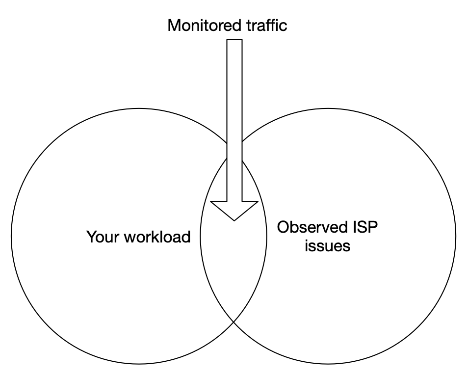

# インターネットモニター

!!! warning
	この記事を書いている時点では、[インターネットモニター](https://aws.amazon.com/blogs/aws/cloudwatch-internet-monitor-end-to-end-visibility-into-internet-performance-for-your-applications/) は CloudWatch コンソールの**プレビュー**で利用できます。 一般提供の機能範囲は、今日体験しているものから変更される可能性があります。

[ワークロードのすべてのティアからテレメトリを収集する](../../guides/#collect-telemetry-from-all-tiers-of-your-workload)ことはベストプラクティスであり、課題となり得ることです。 しかし、ワークロードのティアとは何でしょうか。 ある人にとっては、ウェブ、アプリケーション、データベースサーバーである可能性があります。 他の人は、ワークロードをフロントエンドとバックエンドとして見るかもしれません。 そして、ウェブアプリケーションを運用している人は、[リアルユーザーモニタリング](../../tools/rum)(RUM)を使用して、エンドユーザーが経験するこれらのアプリの正常性を観察できます。

しかし、クライアントとデータセンターまたはクラウドサービスプロバイダー間のトラフィックはどうでしょうか。 そして、ウェブページとして提供されないために RUM を使用できないアプリケーションはどうでしょうか。


インターネットモニターはネットワークレベルで機能し、観測されたトラフィックの正常性を [AWS の既存の知識](https://docs.aws.amazon.com/AmazonCloudWatch/latest/monitoring/CloudWatch-IM-inside-internet-monitor.html)と関連付けて評価します。 既知のインターネットの問題。 つまり、パフォーマンスまたは可用性の問題があるインターネットサービスプロバイダー (ISP) が**あり**、アプリケーションのトラフィックがこの ISP を使用してクライアント/サーバー間の通信を行っている場合、インターネットモニターはワークロードへのこの影響について事前に通知できます。 さらに、選択したホスティングリージョンと [CloudFront](https://aws.amazon.com/cloudfront/) をコンテンツデリバリーネットワーク[^1] として使用することに基づいて、推奨事項を提示できます。 

!!! tip
	インターネットモニターは、ワークロードが通過するネットワークのトラフィックのみを評価します。 たとえば、別の国の ISP に問題が発生していても、ユーザーがそのキャリアを使用していない場合、その問題の可視性はありません。

## インターネットを介して通信するアプリケーションのモニターを作成する

Internet Monitor の動作は、CloudFront ディストリビューションや、影響を受けた ISP から VPC へのトラフィックを監視することです。これにより、ビジネス上の問題が発生した場合でも、アプリケーションの動作、ルーティング、ユーザーへの通知を決定し、ネットワークの問題の影響を緩和できます。



!!! success
	インターネットを介して通信するトラフィックを監視するモニターのみを作成してください。プライベートネットワーク内 ([RFC1918](https://www.arin.net/reference/research/statistics/address_filters/)) の 2 つのホスト間のようなプライベートトラフィックは、Internet Monitor で監視できません。
	
!!! success
	該当する場合はモバイルアプリケーションからのトラフィックを優先してください。プロバイダー間をローミングしたり、地理的に離れた場所にいるユーザーは、予期しない体験をする可能性があるため、その状況を認識しておく必要があります。

## EventBridge と CloudWatch を通じたアクションの有効化

観測された問題は、ソースが `aws.internetmonitor` として識別される[スキーマ](https://docs.aws.amazon.com/AmazonCloudWatch/latest/monitoring/CloudWatch-IM-EventBridge-integration.html)を使用して [EventBridge](https://aws.amazon.com/eventbridge/) を介して公開されます。EventBridge を使用して、チケット管理システムで自動的に問題を作成したり、サポートチームに通知したり、特定のシナリオを軽減するためにワークロードを変更する自動化をトリガーしたりできます。

```json
{
  "source": ["aws.internetmonitor"]
}
```

同様に、観測された都市、国、メトロ、サブディビジョンのトラフィックの詳細が [CloudWatch Logs](../../tools/logs) で利用できます。これにより、影響を受ける顧客に地域的な問題について積極的に通知できる、高度にターゲットを絞ったアクションを作成できます。単一のプロバイダーの国レベルの観測の例を次に示します。

```json
{
    "version": 1,
    "timestamp": 1669659900,
    "clientLocation": {
        "latitude": 0,
        "longitude": 0,
        "country": "United States",
        "subdivision": "",
        "metro": "",
        "city": "",
        "countryCode": "US",
        "subdivisionCode": "",
        "asn": 00000,
        "networkName": "MY-AWESOME-ASN"
    },
    "serviceLocation": "us-east-1",
    "percentageOfTotalTraffic": 0.36,
    "bytesIn": 23,
    "bytesOut": 0,
    "clientConnectionCount": 0,
    "internetHealth": {
        "availability": {
            "experienceScore": 100,
            "percentageOfTotalTrafficImpacted": 0,
            "percentageOfClientLocationImpacted": 0
        },
        "performance": {
            "experienceScore": 100,
            "percentageOfTotalTrafficImpacted": 0,
            "percentageOfClientLocationImpacted": 0,
            "roundTripTime": {
                "p50": 71,
                "p90": 72,
                "p95": 73
            }
        }
    },
    "trafficInsights": {
        "timeToFirstByte": {
            "currentExperience": {
                "serviceName": "VPC",
                "serviceLocation": "us-east-1",
                "value": 48
            },
            "ec2": {
                "serviceName": "EC2",
                "serviceLocation": "us-east-1",
                "value": 48
            }
        }
    }
}
```

!!! success
	`percentageOfTotalTraffic` のような値は、顧客がワークロードにアクセスする場所についての強力な洞察を明らかにし、高度な分析に使用できます。
	
!!! warning
	Internet Monitor によって作成されたロググループには、デフォルトで*期限切れにならない* 保持期間が設定されていることに注意してください。AWS はお客様の同意なくデータを削除しないため、ニーズに合った保持期間を設定する必要があります。
	
!!! success
	各モニターは少なくとも 10 個の個別の CloudWatch メトリクスを作成します。これらは、他の運用メトリクスと同様に [アラーム](../../tools/alarms) の作成に使用する必要があります。

## トラフィック最適化の提案を利用する

Internet Monitor には、ワークロードを最適な場所に配置することで、最高の顧客体験を実現できるようにアドバイスしてくれるトラフィック最適化の提案機能があります。グローバルなワークロードやグローバルな顧客を対象とする場合、この機能は特に価値があります。


!!! success
	トラフィック最適化の提案ビューの現在の TTFB (Time to First Byte)値、予測 TTFB 値、最低 TTFB 値に注意を払ってください。これらは、そうでない場合観測が難しい、潜在的に不良なエンドユーザー体験を示している可能性があります。
	
[^1]: この新機能のローンチブログは [https://aws.amazon.com/blogs/aws/cloudwatch-internet-monitor-end-to-end-visibility-into-internet-performance-for-your-applications/](https://aws.amazon.com/blogs/aws/cloudwatch-internet-monitor-end-to-end-visibility-into-internet-performance-for-your-applications/) を参照してください。
