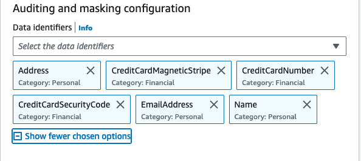

# CloudWatch Logs のデータ保護ポリシー (SLG/EDU 用)

ログデータは一般的に有益ですが、医療保険の相互運用性と説明責任に関する法律 (HIPAA)、一般データ保護規則 (GDPR)、支払カード業界データセキュリティ基準 (PCI-DSS)、連邦リスクおよび認定管理プログラム (FedRAMP) などの厳格な規制を持つ組織にとっては、マスキングが有用です。

CloudWatch Logs の[データ保護ポリシー](https://docs.aws.amazon.com/ja_jp/AmazonCloudWatch/latest/logs/cloudwatch-logs-data-protection-policies.html) を使用すると、お客様はログデータをスキャンして機密データを検出し、検出された機密データをマスクするデータ保護ポリシーを定義および適用できます。

これらのポリシーは、パターンマッチングと機械学習モデルを利用して機密データを検出し、アカウントの CloudWatch ロググループにインジェストされたイベントに表示されるデータを監査およびマスクするのに役立ちます。

機密データの選択に使用される技術と基準を [マッチングデータ識別子](https://docs.aws.amazon.com/ja_jp/AmazonCloudWatch/latest/logs/cloudwatch-logs-data-protection-policies.html) と呼びます。 これらのマネージドデータ識別子を使用することで、CloudWatch Logs は次のものを検出できます:

- プライベートキーや AWS シークレットアクセスキーなどの資格情報
- IP アドレスや MAC アドレスなどのデバイス識別子  
- 銀行口座番号、クレジットカード番号、クレジットカード検証コードなどの金融情報
- 健康保険カード番号 (EHIC) や個人健康番号などの保護された健康情報 (PHI)
- 運転免許証、社会保障番号、納税者番号などの個人を特定できる情報 (PII)

!!! important
    機密データは、ロググループにインジェストされると検出されてマスクされます。 データ保護ポリシーを設定しても、その時点より前にロググループにインジェストされたログイベントはマスクされません。

上記で言及したデータタイプのいくつかを詳しく説明し、例を見ていきましょう。

## データ型

### 資格情報

資格情報は、あなたが誰であるか、リクエストしたリソースにアクセスする権限があるかを確認するために使用される機密データ型です。AWS は、これらの資格情報(プライベートキーやシークレットアクセスキーなど)を使用して、リクエストを認証および認可します。

CloudWatch Logs データ保護ポリシーを使用すると、選択したデータ識別子に一致する機密データがマスクされます(セクションの最後にマスクされた例を示します)。


!!! Tip
    データ分類のベストプラクティスは、組織、法的、コンプライアンス基準を満たす明確に定義されたデータ分類ティアと要件から始まります。

    ベストプラクティスとして、組織のデータガバナンスポリシーに準拠したコンプライアンスを実装するために、データ分類フレームワークに基づいて AWS リソースにタグを付けます。


!!! Tip
   ログイベントに機密データが含まれないようにするには、ベストプラクティスとして、コード内で最初に除外し、必要な情報のみを記録することです。

### 金融情報

PCI DSS(Payment Card Industry Data Security Standard) で定義されているように、銀行口座、ルーティング番号、デビットカードとクレジットカードの番号、クレジットカードの磁気ストライプデータは、機密性の高い金融情報と見なされます。

機密データを検出するために、CloudWatch Logs はデータ保護ポリシーを設定した後、ロググループが位置する地域に関係なく、指定したデータ識別子をスキャンします。


!!! info
    金融データタイプとデータ識別子の完全なリストは[こちら](https://docs.aws.amazon.com/AmazonCloudWatch/latest/logs/protect-sensitive-log-data-types-financial.html)をご確認ください

### 個人健康情報(PHI)

PHI には、保険や請求情報、診断データ、医療記録やデータセットなどの臨床ケアデータ、画像や検査結果などの研究室結果など、広範囲にわたる個人を特定できる健康および健康関連データが含まれます。

CloudWatch Logs は、選択したロググループから健康情報をスキャンおよび検出し、そのデータをマスクします。


!!! info
    [phi データタイプとデータ識別子の完全なリスト](https://docs.aws.amazon.com/AmazonCloudWatch/latest/logs/protect-sensitive-log-data-types-health.html) をご確認ください

### 個人を特定できる情報(PII)

PII は、個人を特定できる個人データへのテキスト参照です。PII の例には、住所、銀行口座番号、電話番号があります。



!!! info
    [pii データタイプとデータ識別子の完全なリスト](https://docs.aws.amazon.com/AmazonCloudWatch/latest/logs/protect-sensitive-log-data-types-pii.html) をご確認ください

## マスクされたログ

データ保護ポリシーを設定したロググループに移動すると、データ保護が `On` になっており、コンソールに機密データのカウントも表示されていることがわかります。


`View in Log Insights` をクリックすると、Log Insights コンソールに移動します。ログストリームのログイベントを確認するために、以下のクエリを実行すると、すべてのログのリストが表示されます。

```
fields @timestamp, @message
| sort @timestamp desc
| limit 20
```

クエリを展開すると、以下のようにマスクされた結果が表示されます。


!!! important
    データ保護ポリシーを作成すると、デフォルトで選択したデータ識別子と一致する機密データがマスクされます。 `logs:Unmask` IAM アクセス許可を持つユーザーのみがマスクされていないデータを表示できます。


!!! Tip
    CloudWatch の機密データへのアクセス管理と制限には、[AWS IAM and Access Management(IAM)](https://docs.aws.amazon.com/AmazonCloudWatch/latest/monitoring/auth-and-access-control-cw.html) を利用してください。


!!! Tip
    クラウド環境の定期的なモニタリングと監査は、機密データを保護するうえで同様に重要です。アプリケーションが大量のデータを生成する場合、手動による監査が困難になるため、過剰な量のデータをログに記録しないことをおすすめします。 こちらの AWS 推奨ガイダンスをご覧ください。[ロギングのベストプラクティス](https://docs.aws.amazon.com/prescriptive-guidance/latest/logging-monitoring-for-application-owners/logging-best-practices.html)


!!! Tip
    CloudWatch Logs では、ロググループデータは常に暗号化されています。 または、[AWS Key Management Service](https://docs.aws.amazon.com/AmazonCloudWatch/latest/logs/encrypt-log-data-kms.html) を使用してログデータを暗号化することもできます。


!!! Tip
    回復力とスケーラビリティのために、CloudWatch アラームを設定し、AWS Amazon EventBridge と AWS Systems Manager を使用して自動修復を行ってください。


[^1]: 機密データを保護する方法については、AWS ブログの [Protect Sensitive Data with Amazon CloudWatch Logs](https://aws.amazon.com/blogs/aws/protect-sensitive-data-with-amazon-cloudwatch-logs/) から始めてください。
