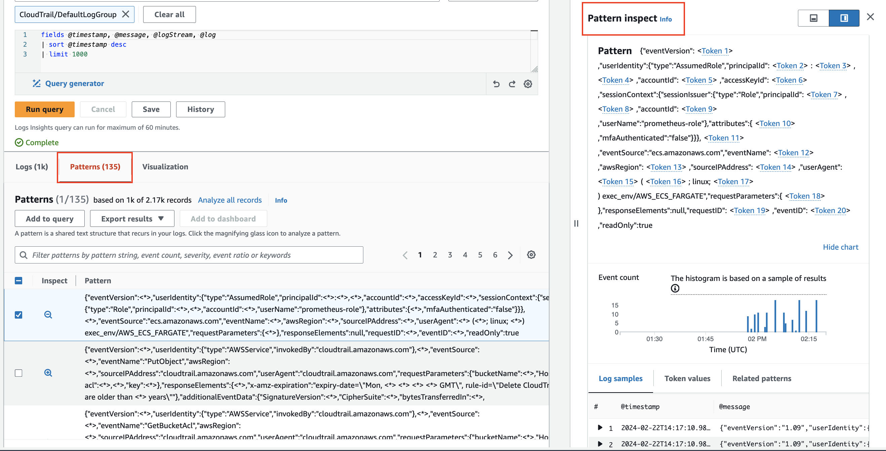
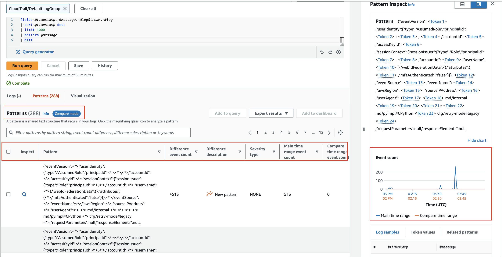

# ログ記録

ログツールの選択は、データ送信、フィルタリング、保持、キャプチャ、およびデータを生成するアプリケーションとの統合に対する要件に関連しています。
オブザーバビリティのために Amazon Web Services を使用する場合(オンプレミスでホストしているか、別のクラウド環境でホストしているかに関係なく)、[CloudWatch エージェント](https://docs.aws.amazon.com/ja_jp/AmazonCloudWatch/latest/monitoring/Install-CloudWatch-Agent.html) や [Fluentd](https://www.fluentd.org/) などの別のツールを利用して、分析のためのログデータを送信できます。

ここでは、ログ記録のための CloudWatch エージェントの実装に関するベストプラクティスと、AWS コンソールまたは API での CloudWatch Logs の使用について詳しく説明します。

!!! info
	CloudWatch エージェントは、[メトリクスデータ](../../signals/metrics/) を CloudWatch に配信するためにも使用できます。実装の詳細については、[メトリクス](../../tools/metrics/) ページを参照してください。OpenTelemetry や X-Ray クライアント SDK からの[トレース](../../signals/traces.md) を収集し、[AWS X-Ray](../../tools/xray.md) に送信するためにも使用できます。

## CloudWatch エージェントによるログの収集

### 転送

[クラウドファーストのアプローチ](../../faq#what-is-a-cloud-first-approach)でオブザーバビリティを実現する場合、原則として、ログを取得するためにマシンにログインする必要がある場合は、アンチパターンが存在していることになります。ワークロードは、ログ分析システムに対して、リアルタイムに近い形でログデータをマシンの外部に出力する必要があります。イベント発生から転送までのレイテンシは、ワークロードに障害が発生した場合に、その時点の情報が失われる可能性を表しています。

アーキテクトとして、ログデータの許容可能な損失を判断し、これに合わせて CloudWatch エージェントの [`force_flush_interval`](https://docs.aws.amazon.com/AmazonCloudWatch/latest/monitoring/CloudWatch-Agent-Configuration-File-Details.html#CloudWatch-Agent-Configuration-File-Logssection) を調整する必要があります。

`force_flush_interval` は、バッファサイズに達した場合を除き、一定の間隔でログデータをデータプレーンに送信するようエージェントに指示します。バッファサイズに達した場合は、すべてのバッファされたログを直ちに送信します。

!!! tip
	エッジデバイスは、低レイテンシーの AWS 内ワークロードとは要件が大きく異なる場合があり、`force_flush_interval` の設定を長くする必要があるかもしれません。例えば、低帯域幅のインターネット接続を使用している IoT デバイスの場合、ログのフラッシュは 15 分ごとに実行するだけで十分な場合があります。 

!!! success
	コンテナ化されたステートレスなワークロードや EC2 フリートは、ログフラッシュの要件に特に敏感である可能性があります。いつでもスケールインできるステートレスな Kubernetes アプリケーションや EC2 フリートを考えてみましょう。これらのリソースが突然終了したときにログの損失が発生する可能性があり、将来的にマシンからログを抽出する方法がなくなります。これらのシナリオでは、通常、標準の `force_flush_interval` が適していますが、必要に応じて低くすることもできます。

### ロググループ

CloudWatch Logs では、アプリケーションに論理的に適用されるログのコレクションは、単一の[ロググループ](https://docs.aws.amazon.com/ja_jp/AmazonCloudWatch/latest/logs/CloudWatchLogsConcepts.html)に配信する必要があります。そのロググループ内では、ログストリームを作成するソースシステム間で*共通性*がある必要があります。

LAMP スタックを考えてみましょう。Apache、MySQL、PHP アプリケーション、ホスティング Linux オペレーティングシステムからのログは、それぞれ別個のロググループに属します。

このグループ化は重要であり、同じ保持期間、暗号化キー、メトリックフィルター、サブスクリプションフィルター、Contributor Insights ルールをグループで扱えるようになります。

!!! success
	ロググループ内のログストリーム数に制限はありません。また、CloudWatch Logs Insights クエリー1つでアプリケーションのすべてのログを検索できます。Kubernetes サービスの各 Pod や、EC2 フリートの各インスタンスごとに個別のログストリームを持つのが一般的なパターンです。
	
!!! success
	ロググループのデフォルトの保持期間は*無期限*です。ベストプラクティスは、ロググループを作成するタイミングで保持期間を設定することです。
	
	これを CloudWatch コンソールでいつでも設定できますが、ベストプラクティスは、インフラストラクチャ as コード(CloudFormation、Cloud Development Kit など)を使用したロググループ作成時に同時に設定するか、CloudWatch エージェント構成内の `retention_in_days` 設定を使用することです。
	
	いずれのアプローチも、ログの保持期間をプロアクティブに設定し、プロジェクトのデータ保持要件に合わせて設定できます。
	
!!! success 
	ロググループデータは、CloudWatch Logs で常に暗号化されます。デフォルトでは、CloudWatch Logs は保管中のログデータに対して`サーバーサイド`の暗号化を使用します。代替として、この暗号化に AWS Key Management Service を使用できます。 [AWS KMS を使用した暗号化](https://docs.aws.amazon.com/ja_jp/AmazonCloudWatch/latest/logs/encrypt-log-data-kms.html) は、ロググループレベルで有効になり、KMS キーをロググループに関連付けることによって、ロググループの作成時または作成後に行います。これは、インフラストラクチャ as コード(CloudFormation、Cloud Development Kit など)で構成できます。
	
	CloudWatch Logs のキー管理に AWS Key Management Service を使用するには、追加の構成とユーザーへのキーへのアクセス許可の付与が必要です[^1]。

### ログフォーマット

CloudWatch Logs には、インジェスト時にログフィールドを自動的に検出し、JSON データをインデックスする機能があります。この機能により、アドホッククエリとフィルタリングが容易になり、ログデータの使いやすさが向上します。ただし、自動インデックスは構造化データにのみ適用されることに注意が必要です。非構造化ログデータは自動的にインデックス化されませんが、CloudWatch Logs に配信することができます。

非構造化ログでも、正規表現を使用した `parse` コマンドで検索やクエリを実行できます。

!!! success
	CloudWatch Logs を使用する場合のログフォーマットのベストプラクティスは次のとおりです。

	1. Log4j、`python-json-logger`、フレームワークのネイティブ JSON エミッタなどの構造化ログフォーマッタを使用します。
	2. ログ先に1イベントごとに1行のログを送信します。

	複数行の JSON ログを送信する場合、各行が1つのイベントとして解釈されることに注意してください。

### `stdout` の処理

[ログシグナル](../../signals/logs/#log-to-stdout)のページで説明したように、ベストプラクティスはログシステムを生成アプリケーションから切り離すことです。
ただし、`stdout` からファイルにデータを送信するパターンは、多くのプラットフォームで一般的です。
Kubernetesや[Amazon Elastic Container Service](https://aws.amazon.com/ecs/)などのコンテナオーケストレーションシステムは、この`stdout`からログファイルへの配信を自動的に管理し、各ログをコレクタから収集できるようにします。
その後、CloudWatch エージェントがこのファイルをリアルタイムで読み取り、ロググループに代わってデータを転送します。

!!! success
	できるだけ、`stdout`への簡易アプリケーションログとエージェントによる収集というパターンを利用してください。

### ログのフィルタリング

ログをフィルタリングする理由はさまざまです。個人データの永続的な保存を防ぐことや、特定の[ログレベル](../../logs/#use-log-levels-appropriately)のデータのみをキャプチャすることなどがあります。いずれにせよ、ベストプラクティスは、できるだけ発信元のシステムに近いところでこのフィルタリングを実行することです。CloudWatch の場合、これは分析のために CloudWatch Logs にデータが配信される*前に*意味します。CloudWatch エージェントは、このフィルタリングを実行できます。

!!! success
	[`filters`](https://docs.aws.amazon.com/AmazonCloudWatch/latest/monitoring/CloudWatch-Agent-Configuration-File-Details.html#CloudWatch-Agent-Configuration-File-Logssection) 機能を使用して、必要なログレベルを`include`し、望ましくないパターン(クレジットカード番号、電話番号など)を`exclude`します。
	
!!! tip
	ログに漏れる可能性のある特定の形式の既知のデータをフィルタリングすることは時間がかかり、エラーが発生しやすい場合があります。ただし、特定のタイプの望ましくないデータ(クレジットカード番号、社会保障番号など)を扱うワークロードの場合、これらのレコードのフィルタを持つことで、将来的に潜在的に破壊的なコンプライアンスの問題を防ぐことができます。たとえば、社会保障番号を含むすべてのレコードをドロップする単純な構成は次のとおりです:

	```
	"filters": [
      {
        "type": "exclude",
        "expression": "\b(?!000|666|9\d{2})([0-8]\d{2}|7([0-6]\d))([-]?|\s{1})(?!00)\d\d\2(?!0000)\d{4}\b"
      }
    ]
    ```

### 複数行ログ

すべてのログ記録におけるベストプラクティスは、ディスクリートなログイベントごとに 1 行が出力される[構造化ログ](../../signals/logs/#structured-logging-is-key-to-success)を使用することです。
ただし、このオプションがないレガシーアプリケーションや ISV サポートアプリケーションが多数あります。
これらのワークロードの場合、マルチライン対応プロトコルを使用して出力されない限り、CloudWatch Logs は各行をユニークなイベントとして解釈します。
CloudWatch エージェントは、[`multi_line_start_pattern`](https://docs.aws.amazon.com/AmazonCloudWatch/latest/monitoring/CloudWatch-Agent-Configuration-File-Details.html#CloudWatch-Agent-Configuration-File-Logssection) ディレクティブを使用してこれを実行できます。

!!! success
	`multi_line_start_pattern` ディレクティブを使用して、マルチラインログを CloudWatch Logs に取り込む負担を軽減します。

### ログ記録クラスの設定

CloudWatch Logs には、[クラス](https://docs.aws.amazon.com/ja_jp/AmazonCloudWatch/latest/logs/CloudWatch_Logs_Log_Classes.html) が 2 つあります。

- CloudWatch Logs 標準ログクラスは、リアルタイム監視が必要なログや、頻繁にアクセスするログに適した機能豊富なオプションです。

- CloudWatch Logs アクセス頻度の低いログクラスは、ログをコスト効率よく統合するために使用できる新しいログクラスです。このログクラスには、管理対象の取り込み、ストレージ、クロスアカウントのログ分析、暗号化が含まれており、GB 当たりの取り込み価格が低くなっています。アクセス頻度の低いログクラスは、アドホッククエリと事後的なフォレンジック分析に適しています。


!!! success
	`log_group_class` ディレクティブを使用して、新しいロググループに使用するロググループクラスを指定します。有効な値は **STANDARD** と **INFREQUENT_ACCESS** です。このフィールドを省略した場合、エージェントはデフォルトで **STANDARD** を使用します。

## CloudWatch Logs での検索

### クエリのスコープを管理してコストを抑える

CloudWatch Logs にデータが配信されたら、必要に応じて検索できます。CloudWatch Logs はスキャンされたデータ量に応じて課金されることに注意してください。データスキャンを抑える戦略があり、これによってスキャンされるデータ量を減らすことができます。

!!! success
	ログの検索時には、日時の範囲が適切であることを確認してください。CloudWatch Logs では相対的または絶対的な時間範囲をスキャンのために設定できます。*前日のエントリーのみを探している場合、今日のログをスキャンする必要はありません!*

!!! success 
	1 つのクエリで複数のロググループを検索できますが、そうするとスキャンされるデータ量が多くなります。対象とする必要があるロググループを特定したら、クエリのスコープをそれに合わせて縮小してください。

!!! tip
	各クエリが実際にスキャンしたデータ量は、CloudWatch コンソールから直接確認できます。このアプローチにより、効率的なクエリを作成できます。

	

### 他のユーザーとのクエリの共有

[CloudWatch Logs のクエリ構文](https://docs.aws.amazon.com/ja_jp/AmazonCloudWatch/latest/logs/CWL_QuerySyntax.html) は複雑ではありませんが、特定のクエリを最初から作成することは時間がかかる場合があります。同じ AWS アカウント内の他のユーザーとの間で適切に記述されたクエリを共有することで、アプリケーションログの調査を効率化できます。これは、[AWS Management Console](https://docs.aws.amazon.com/ja_jp/AmazonCloudWatch/latest/logs/CWL_Insights-Saving-Queries.html) から直接、または [CloudFormation](https://docs.aws.amazon.com/ja_jp/AWSCloudFormation/latest/UserGuide/aws-resource-logs-querydefinition.html) や [AWS CDK](https://docs.aws.amazon.com/ja_jp/cdk/api/v2/docs/aws-cdk-lib.aws_logs.CfnQueryDefinition.html) を使用してプログラムで実現できます。これにより、ログデータを分析する必要がある他のユーザーの再作業が軽減されます。 

!!! success
	頻繁に繰り返し使用されるクエリを CloudWatch Logs に保存することで、ユーザーに対して事前入力された状態で提供できます。

	

### パターン分析

CloudWatch Logs Insights は、ログをクエリするときに機械学習アルゴリズムを使用してパターンを見つけます。パターンは、ログフィールド間で繰り返し発生する共有テキスト構造です。大量のログイベントがごく少数のパターンに圧縮できることが多いため、パターンは大規模なログセットの分析に役立ちます。[^2]

!!! success
	パターンを使用して、ログデータを自動的にパターンにクラスタリングします。

	

### 前の期間との比較(diff)

CloudWatch Logs Insights では、エラーの検出やトレンドの特定に役立つように、時間の経過とともにログイベントの変化を比較できます。比較クエリはパターンを明らかにし、迅速なトレンド分析を容易にします。また、より深い調査のためにサンプルの生ログイベントを調べることができます。クエリは、選択した期間と同じ長さの比較期間の2つの期間に対して分析されます [^3]。

!!! success
	`diff` コマンドを使用して、時間の経過とともにログイベントの変化を比較してください。

	

[^1]: アクセス権限を持つ CloudWatch Logs ロググループの暗号化の実際的な例については、[How to search through your AWS Systems Manager Session Manager console logs – Part 1](https://aws.amazon.com/blogs/mt/how-to-search-through-your-aws-systems-manager-session-manager-console-logs-part-1/) を参照してください。

[^2]: より詳細なインサイトについては、[CloudWatch Logs Insights Pattern Analysis](https://docs.aws.amazon.com/AmazonCloudWatch/latest/logs/CWL_AnalyzeLogData_Patterns.html) を参照してください。

[^3]: 詳細については、[CloudWatch Logs Insigts Compare(diff) with previous ranges](https://docs.aws.amazon.com/AmazonCloudWatch/latest/logs/CWL_AnalyzeLogData_Compare.html) を参照してください。
