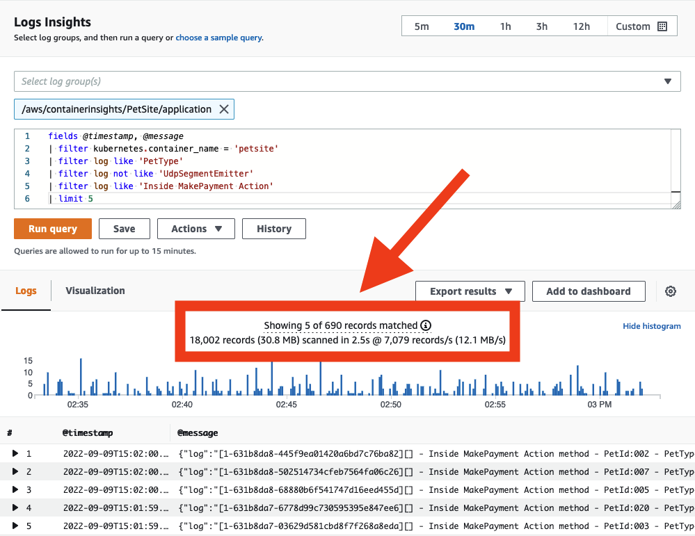

# ログ記録

ログ記録ツールの選択は、データ送信、フィルタリング、保持、キャプチャ、およびデータを生成するアプリケーションとの統合に対する要件によって異なります。
オブザーバビリティのために Amazon Web Services を使用する場合(オンプレミスでホストしているか、別のクラウド環境でホストしているかに関係なく)、[CloudWatch エージェント](https://docs.aws.amazon.com/ja_jp/AmazonCloudWatch/latest/monitoring/Install-CloudWatch-Agent.html) や [Fluentd](https://www.fluentd.org/) などのツールを利用して、分析のためのログデータを送信できます。

ここでは、ログ記録のための CloudWatch エージェントの実装に関するベストプラクティスと、AWS コンソールまたは API での CloudWatch Logs の使用について説明します。

!!! info
	CloudWatch エージェントは、[メトリクスデータ](../../signals/metrics/)を CloudWatch に送信するためにも使用できます。実装の詳細については、[メトリクス](../../tools/metrics/)のページを参照してください。

## CloudWatch エージェントによるログの収集

### 転送

[クラウドファーストのアプローチ](../../faq#what-is-a-cloud-first-approach)でオブザーバビリティを実現する場合、原則として、ログを取得するためにマシンにログインする必要がある場合は、アンチパターンが存在していることになります。ワークロードは、リアルタイムに近い状態でログ解析システムにログデータを外部に送信し、その送信と元のイベントの間のレイテンシは、ワークロードに障害が発生した場合の時点情報の潜在的な損失を表しています。

アーキテクトとして、ログデータの許容損失量を判断し、これに対応するように CloudWatch エージェントの [`force_flush_interval`](https://docs.aws.amazon.com/AmazonCloudWatch/latest/monitoring/CloudWatch-Agent-Configuration-File-Details.html#CloudWatch-Agent-Configuration-File-Logssection) を調整する必要があります。

`force_flush_interval` は、バッファサイズに達した場合を除き、エージェントに一定の間隔でログデータをデータプレーンに送信するよう指示します。その場合、エージェントはすべてのバッファされたログを直ちに送信します。

!!! tip
	エッジデバイスは、低レイテンシーの AWS 内ワークロードとは要件が大きく異なる場合があり、`force_flush_interval` の設定をより長くする必要があるかもしれません。たとえば、低帯域幅のインターネット接続を使用している IoT デバイスの場合、ログのフラッシュは 15 分ごとに実行するだけで十分な場合があります。 

!!! success
	コンテナ化されたステートレスなワークロードや EC2 フリートは、ログフラッシュの要件に特に敏感である可能性があります。いつでもスケールインできるステートレスな Kubernetes アプリケーションや EC2 フリートを考えてみましょう。これらのリソースが突然終了したときにログの損失が発生する可能性があり、将来的にはそれらからログを抽出する方法がなくなります。 `force_flush_interval` の標準設定は、これらのシナリオには通常適していますが、必要に応じて低くすることができます。

### ロググループ

CloudWatch Logs では、アプリケーションに論理的に適用されるログのコレクションは、単一の[ロググループ](https://docs.aws.amazon.com/ja_jp/AmazonCloudWatch/latest/logs/CloudWatchLogsConcepts.html)に配信する必要があります。そのロググループ内では、ログストリームを作成するソースシステム間で*共通性*がある必要があります。

LAMP スタックを考えてみましょう。Apache、MySQL、PHP アプリケーション、ホスティング Linux オペレーティングシステムからのログは、それぞれ別個のロググループに属します。

このグループ化は重要であり、同じ保持期間、暗号化キー、メトリックフィルター、サブスクリプションフィルター、Contributor Insights ルールをグループで扱えるようになります。

!!! success
	ロググループ内のログストリーム数に制限はありません。また、CloudWatch Logs Insights クエリー1つで、アプリケーションのログ全体を検索できます。Kubernetes サービスの各 Pod や、EC2 フリートの各インスタンスごとに個別のログストリームを持つのが一般的なパターンです。
	
!!! success
	ロググループのデフォルトの保持期間は*無期限*です。ベストプラクティスは、ロググループを作成するタイミングで保持期間を設定することです。
	
	これは CloudWatch コンソールでいつでも設定できますが、ベストプラクティスは、インフラストラクチャ as コード(CloudFormation、Cloud Development Kit など)を使用したロググループの作成と同時に、または CloudWatch エージェント構成内の `retention_in_days` 設定を使用して実行することです。
	
	いずれのアプローチも、ログの保持期間をプロアクティブに設定し、プロジェクトのデータ保持要件に合わせて設定できます。
	
!!! success 
	デフォルトでは、ロググループは暗号化されません。ベストプラクティスは、プレーンテキストデータの偶発的な漏洩を防ぐために、ロググループを作成するタイミングで暗号化キーを設定することです。これは、インフラストラクチャ as コード(CloudFormation、Cloud Development Kitなど)を使用して実行できます。
	
	CloudWatch Logs でキーを管理するために AWS Key Management Service を使用するには、追加の構成とユーザーへのキーへのアクセス許可の付与が必要です。 [^1]

### ログのフォーマット

CloudWatch Logs には、インジェスト時に JSON データをインデックス化し、これを使ってアドホッククエリを実行する機能があります。 あらゆる種類のログデータを CloudWatch Logs に配信できますが、このデータの自動インデックス化が行われるのは、適切に構造化されている場合に限られます。

構造化されていないログでも検索は可能ですが、正規表現を使用する必要があります。

!!! success
	CloudWatch Logs を使用する際のログフォーマットのベストプラクティスは次のとおりです。

	1. [Log4j](https://logging.apache.org/log4j/2.x/)、[`python-json-logger`](https://pypi.org/project/python-json-logger/)、フレームワークのネイティブ JSON エミッタなどの構造化ログフォーマッタを使用します。
	1. ログ先にイベントごとに 1 行のログを送信します。

	複数行の JSON ログを送信する場合、各行が 1 つのイベントとして解釈されることに注意してください。

### `stdout` の処理

[ログシグナル](../../signals/logs/#log-to-stdout)のページで説明したように、ベストプラクティスはログシステムを生成アプリケーションから切り離すことです。
ただし、`stdout` からファイルにデータを送信するパターンは、多くのプラットフォームで一般的です。
Kubernetesや[Amazon Elastic Container Service](https://aws.amazon.com/ecs/)などのコンテナオーケストレーションシステムは、この`stdout`からログファイルへの配信を自動的に管理し、各ログをコレクタから収集できるようにします。
その後、CloudWatch エージェントがこのファイルをリアルタイムで読み取り、ロググループに代わってデータを転送します。

!!! success
	できるだけ、`stdout`への簡易アプリケーションログとエージェントによる収集というパターンを利用してください。

### ログのフィルタリング

ログをフィルタリングする理由はさまざまです。個人データの永続的な保存を防ぐことや、特定の[ログレベル](../../logs/#use-log-levels-appropriately)のデータのみをキャプチャすることなどがあります。いずれにせよ、ベストプラクティスは、できるだけ発信元のシステムに近いところでこのフィルタリングを実行することです。CloudWatch の場合、これは分析のために CloudWatch Logs にデータが配信される*前に*意味します。CloudWatch エージェントは、このフィルタリングを実行できます。

!!! success
	[`filters`](https://docs.aws.amazon.com/AmazonCloudWatch/latest/monitoring/CloudWatch-Agent-Configuration-File-Details.html#CloudWatch-Agent-Configuration-File-Logssection) 機能を使用して、必要なログレベルを`include`し、望ましくないパターン(クレジットカード番号、電話番号など)を`exclude`します。
	
!!! tip
	ログに漏れる可能性のある特定の形式の既知のデータをフィルタリングすることは時間がかかり、エラーが発生しやすい場合があります。ただし、特定のタイプの望ましくないデータ(クレジットカード番号、社会保障番号など)を扱うワークロードの場合、これらのレコードのフィルタを持つことで、将来的に潜在的に破壊的なコンプライアンスの問題を防ぐことができます。たとえば、社会保障番号を含むすべてのレコードをドロップするには、次の構成で簡単にできます:

	```
	"filters": [
      {
        "type": "exclude",
        "expression": "\b(?!000|666|9\d{2})([0-8]\d{2}|7([0-6]\d))([-]?|\s{1})(?!00)\d\d\2(?!0000)\d{4}\b"
      }
    ]
    ```

### 複数行ログ

すべてのログ記録におけるベストプラクティスは、ディスクリートなログイベントごとに 1 行が出力される[構造化ログ](../../signals/logs/#structured-logging-is-key-to-success)を使用することです。
ただし、このオプションがないレガシーアプリケーションや ISV サポートアプリケーションが多数あります。
これらのワークロードの場合、マルチライン対応プロトコルを使用して出力されない限り、CloudWatch Logs は各行をユニークなイベントとして解釈します。
CloudWatch エージェントは、[`multi_line_start_pattern`](https://docs.aws.amazon.com/AmazonCloudWatch/latest/monitoring/CloudWatch-Agent-Configuration-File-Details.html#CloudWatch-Agent-Configuration-File-Logssection) ディレクティブを使用してこれを実行できます。

!!! success
	`multi_line_start_pattern` ディレクティブを使用して、マルチラインログを CloudWatch Logs に取り込む負担を軽減します。

## CloudWatch Logs での検索

### クエリのスコープを管理してコストを抑える

CloudWatch Logs にデータが配信されたら、必要に応じて検索できます。CloudWatch Logs はスキャンされたデータ量に応じて課金されることに注意してください。データスキャンを抑える戦略があり、これによってスキャンされるデータ量を減らすことができます。

!!! success
	ログの検索時には、日時の範囲が適切であることを確認してください。CloudWatch Logs では相対的または絶対的な時間範囲をスキャンのために設定できます。*前日のエントリーのみを探している場合、今日のログをスキャンする必要はありません!*

!!! success 
	1 つのクエリで複数のロググループを検索できますが、そうするとスキャンされるデータ量が多くなります。対象とする必要があるロググループを特定したら、クエリのスコープをそれに合わせて縮小してください。

!!! tip
	各クエリが実際にスキャンしたデータ量は、CloudWatch コンソールから直接確認できます。このアプローチにより、効率的なクエリを作成できます。

	

### 他のユーザーとのクエリの共有

[CloudWatch Logs のクエリ構文](https://docs.aws.amazon.com/ja_jp/AmazonCloudWatch/latest/logs/CWL_QuerySyntax.html)は複雑ではありません(コマンドは7つしかありませんが)、一からクエリを書くのに時間がかかることがあります。同じ AWS アカウント内の他のユーザーと、[AWS コンソール内から直接](https://docs.aws.amazon.com/ja_jp/AmazonCloudWatch/latest/logs/CWL_Insights-Saving-Queries.html)または [CloudFormation](https://docs.aws.amazon.com/ja_jp/AWSCloudFormation/latest/UserGuide/aws-resource-logs-querydefinition.html) を使用して、適切に書かれたクエリを共有することができます。これにより、アプリケーションログを調査する必要がある場合の再作業量を減らすことができます。 

!!! success
	頻繁に繰り返し使用されるクエリを CloudWatch Logs に保存することで、ユーザーに対して事前入力された状態で提供できます。

	


[^1]: CloudWatch Logs ロググループの暗号化とアクセス権限の実践的な例については、[How to search through your AWS Systems Manager Session Manager console logs – Part 1](https://aws.amazon.com/blogs/mt/how-to-search-through-your-aws-systems-manager-session-manager-console-logs-part-1/) を参照してください。
