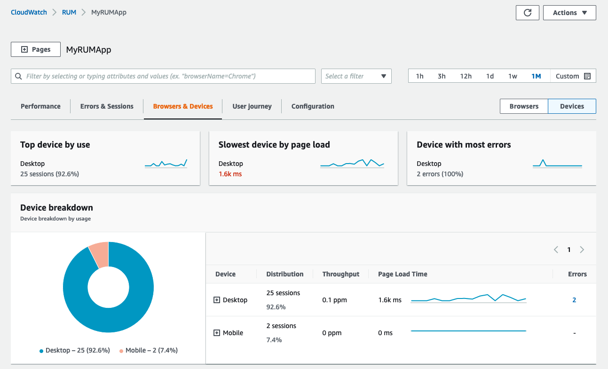

# リアルユーザーモニタリング

CloudWatch RUM を使用すると、リアルユーザーモニタリングを実行して、ウェブアプリケーションのパフォーマンスに関するクライアントサイドのデータを、実際のユーザーセッションからリアルタイムに近い形で収集および表示できます。可視化および分析できるデータには、ページの読み込み時間、クライアントサイドのエラー、ユーザーの動作が含まれます。このデータを表示すると、すべて集計されて表示されるだけでなく、お客様が使用しているブラウザやデバイスごとの内訳でも表示できます。



## Web クライアント

CloudWatch RUM Web クライアントは、Node.js バージョン 16 以降を使用して開発およびビルドされています。コードは GitHub 上で[公開されています](https://github.com/aws-observability/aws-rum-web)。[Angular](https://github.com/aws-observability/aws-rum-web/blob/main/docs/cdn_angular.md) および [React](https://github.com/aws-observability/aws-rum-web/blob/main/docs/cdn_react.md) アプリケーションでこのクライアントを使用できます。

CloudWatch RUM は、アプリケーションのロード時間、パフォーマンス、アンロード時間に知覚できる影響を与えないように設計されています。 

!!! note
    CloudWatch RUM 用に収集するエンドユーザーデータは 30 日間保持され、その後自動的に削除されます。RUM イベントをより長期間保持したい場合は、アプリモニターにアカウントの CloudWatch Logs にイベントのコピーを送信するよう選択できます。
    
!!! tip
    Web アプリケーションで広告ブロッカーによる潜在的な中断を避けることが懸念事項である場合は、Web クライアントを独自のコンテンツデリバリーネットワークでホストするか、独自の Web サイト内にホストすることをお勧めします。独自のオリジンドメインから Web クライアントをホストするためのガイダンスは、GitHub の[ドキュメント](https://github.com/aws-observability/aws-rum-web/blob/main/docs/cdn_installation.md)に記載されています。

## アプリケーションの認証

CloudWatch RUM を使用するには、3 つのオプションのいずれかを使用してアプリケーションを認証する必要があります。

1. すでに設定済みの既存の ID プロバイダーからの認証を使用する
2. 既存の Amazon Cognito ID プールを使用する 
3. CloudWatch RUMにアプリケーションの新しい Amazon Cognito ID プールを作成させる

!!! success
    CloudWatch RUM にアプリケーションの新しい Amazon Cognito ID プールを作成させることは、設定のために最も労力がかからないオプションです。これがデフォルトのオプションです。

!!! tip
    CloudWatch RUM は、認証されていないユーザーと認証されたユーザーを分離するように構成できます。 詳細については、[このブログ記事](https://aws.amazon.com/blogs/mt/how-to-isolate-signed-in-users-from-guest-users-within-amazon-cloudwatch-rum/) を参照してください。

## データ保護とプライバシー

CloudWatch RUM クライアントは、エンドユーザーデータの収集を支援するために Cookie を使用できます。これはユーザージャーニー機能に役立ちますが、必須ではありません。プライバシー関連の詳細については、[詳細なドキュメント](https://docs.aws.amazon.com/ja_jp/AmazonCloudWatch/latest/monitoring/CloudWatch-RUM-privacy.html) をご覧ください。[^1]  

!!! tip
    RUM を使用した Web アプリケーションテレメトリの収集は安全であり、コンソールや CloudWatch Logs を通じて個人を特定できる情報 (PII) は公開されませんが、Web クライアントを通じて[カスタム属性](https://docs.aws.amazon.com/ja_jp/AmazonCloudWatch/latest/monitoring/CloudWatch-RUM-custom-metadata.html) を収集できることに注意してください。このメカニズムを使用して機密データが公開されないように注意してください。

## クライアントコードスニペット

CloudWatch RUM Web クライアントのコードスニペットは自動生成されますが、必要に応じて手動で修正することもできます。

!!! success
    シングルページアプリケーションでクッキーの作成を動的に有効にするには、クッキー同意メカニズムを使用します。詳細は[このブログ記事](https://aws.amazon.com/blogs/mt/how-and-when-to-enable-session-cookies-with-amazon-cloudwatch-rum/)を参照してください。

### URL 収集の無効化

個人情報が含まれる可能性のあるリソース URL の収集を防ぎます。

!!! success
    アプリケーションで個人を特定できる情報 (PII) を含む URL を使用している場合は、コードスニペットの設定で `recordResourceUrl: false` を設定して、アプリケーションに挿入する前にリソース URL の収集を無効にすることを強くおすすめします。

### アクティブトレースを有効にする

Web クライアントで `addXRayTraceIdHeader: true` を設定することで、エンドツーエンドのトレースを有効にします。これにより、CloudWatch RUM Web クライアントが HTTP リクエストに X-Ray トレースヘッダーを追加します。

このオプションの設定を有効にすると、アプリモニターによってサンプリングされたユーザーセッション中に行われた XMLHttpRequest および fetch リクエストがトレースされます。その後、これらのユーザーセッションのトレースとセグメントを、RUM ダッシュボード、CloudWatch ServiceLens コンソール、および X-Ray コンソールで確認できます。

AWS コンソールでアプリケーションモニターを設定するときに、アクティブトレースのチェックボックスをオンにすると、コードスニペットでこの設定が自動的に有効になります。


### スニペットの挿入

前のセクションでコピーまたはダウンロードしたコードスニペットを、アプリケーションの `<head>` 要素の中に挿入します。`<body>` 要素やその他の `<script></script></body></head>

## カスタムメタデータの使用

CloudWatch RUM イベントのデフォルトの[イベントメタデータ](https://docs.aws.amazon.com/ja_jp/AmazonCloudWatch/latest/monitoring/CloudWatch-RUM-datacollected.html#CloudWatch-RUM-datacollected-metadata)に、カスタムメタデータを追加できます。セッション属性は、ユーザーのセッション内のすべてのイベントに追加されます。ページ属性は、指定されたページにのみ追加されます。

!!! success
    カスタム属性のキー名として、[このページ](https://docs.aws.amazon.com/ja_jp/AmazonCloudWatch/latest/monitoring/CloudWatch-RUM-custom-metadata.html#CloudWatch-RUM-custom-metadata-syntax)で注記されている予約語を使用しないでください。

## ページグループの使用

!!! success
    ページグループを使用すると、アプリケーションの異なるページを相互に関連付けて、ページグループの集計アナリティクスを表示できます。たとえば、言語とタイプごとにすべてのページの集計ページロード時間を表示したい場合があります。

    ```
    awsRum.recordPageView({ pageId: '/home', pageTags: ['en', 'landing']})
    ```

## 拡張メトリクスを使用する

CloudWatch RUM によって自動的に収集され、`AWS/RUM` というメトリック名前空間に公開される[デフォルトのメトリクスセット](https://docs.aws.amazon.com/ja_jp/AmazonCloudWatch/latest/monitoring/CloudWatch-RUM-metrics.html)があります。これらは無料の[ベンダーメトリクス](../../tools/metrics/#vended-metrics)で、RUM があなたに代わって作成するものです。

!!! success
    CloudWatch RUM メトリクスのいずれかを、追加のディメンションとともに CloudWatch に送信することで、メトリクスをより詳細な視点で得ることができます。

拡張メトリクスでサポートされているディメンションは以下のとおりです。

- BrowserName
- CountryCode - ISO-3166 フォーマット (2 文字コード)  
- DeviceType
- FileType
- OSName
- PageId

ただし、[このページのガイダンス](https://aws.amazon.com/blogs/mt/create-metrics-and-alarms-for-specific-web-pages-amazon-cloudwatch-rum/)を使用して、独自のメトリクスとアラームを作成できます。このアプローチにより、必要なデータポイント、URI、またはその他のコンポーネントのパフォーマンスを監視できます。

[^1]: CloudWatch RUM で Cookie を使用する際の考慮事項については、[ブログ記事](https://aws.amazon.com/blogs/mt/how-and-when-to-enable-session-cookies-with-amazon-cloudwatch-rum/)を参照してください。
