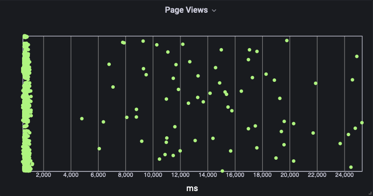

# Percentiles are important

Percentiles are important in monitoring and reporting because they provide a more detailed and accurate view of data distribution compared to just relying on averages. An average can sometimes hide important information, such as outliers or variations in the data, that can significantly impact performance and user experience. Percentiles, on the other hand, can reveal these hidden details and give a better understanding of how the data is distributed.

In [Amazon CloudWatch](https://aws.amazon.com/cloudwatch/), percentiles can be used to monitor and report on various metrics, such as response times, latency, and error rates, across your applications and infrastructure. By setting up alarms on percentiles, you can get alerted when specific percentile values exceed thresholds, allowing you to take action before they impact more customers.

To use [percentiles in CloudWatch](https://docs.aws.amazon.com/AmazonCloudWatch/latest/monitoring/cloudwatch_concepts.html#Percentiles), choose your metric in **All metrics** in the CloudWatch console and use an existing metric and set the **statistic** to **p99**, you can then edit the value after the p to whichever percentile you would like. You can then view percentile graphs, add them to [CloudWatch dashboards](https://docs.aws.amazon.com/AmazonCloudWatch/latest/monitoring/CloudWatch_Dashboards.html) and set alarms on these metrics. For example, you could set an alarm to notify you when the 95th percentile of response times exceeds a certain threshold, indicating that a significant percentage of users are experiencing slow response times.

The histogram below was created in [Amazon Managed Grafana](https://aws.amazon.com/grafana/) using a [CloudWath Logs Insights](https://docs.aws.amazon.com/AmazonCloudWatch/latest/logs/AnalyzingLogData.html) query from [CloudWatch RUM](https://docs.aws.amazon.com/AmazonCloudWatch/latest/monitoring/CloudWatch-RUM.html) logs. The query used was:

```
fields @timestamp, event_details.duration
| filter event_type = "com.amazon.rum.performance_navigation_event"
| sort @timestamp desc
```

The histogram plots the page load time in milliseconds. With this view, it's possible to clearly see the outliers. This data is hidden if average is used.



The same data shown in CloudWatch using the average value indicates that pages are taking under two seconds to load. You can see from the histogram above, that most pages are actually taking less than a second and we have outliers.


Using the same data again with a percentile (p99) indicates that there is an issue, the CloudWatch graph now shows that 99 percent of page loads are taking less than 23 seconds.


To make this easier to visualize, the graphs below compare the average value to the 99th percentile. In this case, the target page load time is two seconds, it is possible to use alternative [CloudWatch statistics](https://docs.aws.amazon.com/AmazonCloudWatch/latest/monitoring/Statistics-definitions.html#Percentile-versus-Trimmed-Mean) and [metric math](https://docs.aws.amazon.com/AmazonCloudWatch/latest/monitoring/using-metric-math.html) to make other calculations. In this case Percentile rank (PR) is used with the statistic **PR(:2000)** to show that 92.7% of page loads are happening within the target of 2000ms.


Using percentiles in CloudWatch can help you gain deeper insights into your system's performance, detect issues early, and improve your customer's experience by identifying outliers that would otherwise be hidden.


