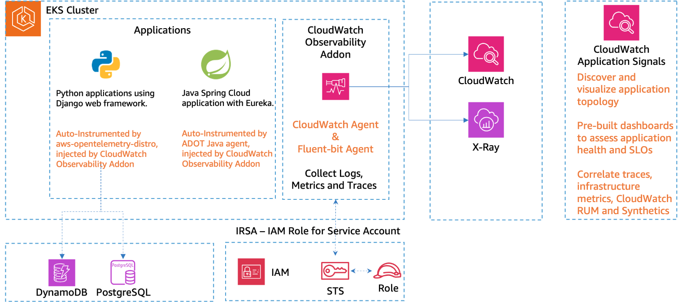

# APM with Application Signals

In the ever-evolving world of modern application development, ensuring optimal performance and meeting service level objectives (SLOs) is crucial for providing a seamless user experience and maintaining business continuity. Amazon CloudWatch Application Signals, an OpenTelemetry (OTel) compatible application performance monitoring (APM) feature, revolutionizes the way organizations monitor and troubleshoot their applications running on AWS.

CloudWatch Application Signals takes a holistic approach to application performance monitoring by seamlessly correlating telemetry data across multiple sources, including metrics, traces, logs, real-user monitoring, and synthetic monitoring. This integrated approach enables organizations to gain comprehensive insights into their applications' performance, pinpoint root causes of issues, and proactively address potential disruptions.

One of the key advantages of CloudWatch Application Signals is its automatic instrumentation and tracking capabilities. With no manual effort or custom code required, Application Signals provides a pre-built, standardized dashboard that displays the most critical metrics for application performance – volume, availability, latency, faults, and errors – for each application running on AWS. This streamlined approach eliminates the need for custom dashboards, enabling service operators to quickly assess application health and performance against their defined SLOs.

*Figure 1: Cloudwatch Application Signals sending metrics, logs and traces*

CloudWatch Application Signals empowers organizations with the following capabilities:

1. **Comprehensive Application Performance Monitoring**: Application Signals provides a unified view of application performance, combining insights from metrics, traces, logs, real-user monitoring, and synthetic monitoring. This holistic approach enables organizations to identify performance bottlenecks, pinpoint root causes, and take proactive measures to ensure optimal application performance.

2. **Automatic Instrumentation and Tracking**: With no manual effort or custom code required, Application Signals automatically instruments and tracks application performance against defined SLOs. This streamlined approach reduces the overhead associated with manual instrumentation and configuration, enabling organizations to focus on application development and optimization.

3. **Standardized Dashboard and Visualization**: Application Signals offers a pre-built, standardized dashboard that displays the most critical metrics for application performance, including volume, availability, latency, faults, and errors. This standardized view enables service operators to quickly assess application health and performance, facilitating informed decision-making and proactive issue resolution.

4. **Seamless Correlation and Troubleshooting**: By correlating telemetry data across multiple sources, Application Signals simplifies the troubleshooting process. Service operators can seamlessly drill down into correlated traces, logs, and metrics to identify the root cause of performance issues or anomalies, reducing the mean time to resolution (MTTR) and minimizing application disruptions.

5. **Integration with Container Insights**: For applications running in containerized environments, CloudWatch Application Signals seamlessly integrates with Container Insights, enabling organizations to identify infrastructure-related issues that may impact application performance, such as memory shortages or high CPU utilization on container pods.

To leverage CloudWatch Application Signals for application performance monitoring, organizations can follow these general steps:

1. **Enable Application Signals**: Enable CloudWatch Application Signals for your applications running on AWS, either through the AWS Management Console, AWS Command Line Interface (CLI), or programmatically using AWS SDKs.

2. **Define Service Level Objectives (SLOs)**: Establish and configure the desired SLOs for your applications, such as target availability, maximum latency, or error thresholds, to align with business requirements and customer expectations.

3. **Monitor and Analyze Performance**: Utilize the pre-built, standardized dashboard provided by Application Signals to monitor application performance against defined SLOs. Analyze metrics, traces, logs, real-user monitoring, and synthetic monitoring data to identify performance issues or anomalies.

4. **Troubleshoot and Resolve Issues**: Leverage the seamless correlation capabilities of Application Signals to drill down into correlated traces, logs, and metrics, enabling rapid identification and resolution of performance issues or root causes.

5. **Integrate with Container Insights (if applicable)**: For containerized applications, integrate CloudWatch Application Signals with Container Insights to identify infrastructure-related issues that may impact application performance.

While CloudWatch Application Signals offers powerful application performance monitoring capabilities, it's important to consider potential challenges such as data volume and cost management. As application complexity and scale increase, the volume of telemetry data generated can grow significantly, potentially impacting performance and incurring additional costs. Implementing data sampling strategies, retention policies, and cost optimization techniques may be necessary to ensure an efficient and cost-effective monitoring solution.

Additionally, ensuring proper access control and data security for your application performance data is crucial. CloudWatch Application Signals leverages AWS Identity and Access Management (IAM) for granular access control, and data encryption is applied to telemetry data at rest and in transit, protecting the confidentiality and integrity of your application performance data.

In conclusion, CloudWatch Application Signals revolutionizes application performance monitoring for applications running on AWS. By providing automatic instrumentation, standardized dashboards, and seamless correlation of telemetry data, Application Signals empowers organizations to proactively monitor application performance, ensure SLO adherence, and rapidly troubleshoot and resolve performance issues. With its integration capabilities and OpenTelemetry compatibility, CloudWatch Application Signals offers a comprehensive and future-proof solution for application performance monitoring in the cloud.