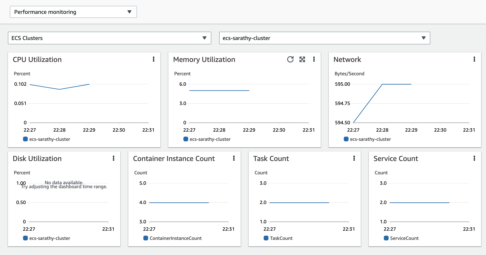

# Container Insights を使用したシステムメトリクスの収集

システムメトリクスは、CPU、メモリ、ディスク、ネットワークインターフェイスなど、サーバー上の物理コンポーネントを含む低レベルのリソースに関連します。

[CloudWatch Container Insights](https://docs.aws.amazon.com/ja_jp/AmazonCloudWatch/latest/monitoring/ContainerInsights.html) を使用して、Amazon ECS にデプロイされたコンテナ化アプリケーションからシステムメトリクスを収集、集約、要約します。Container Insights は、コンテナの再起動失敗などの診断情報も提供し、問題の分離と迅速な解決に役立ちます。これは EC2 と Fargate にデプロイされた Amazon ECS クラスターで利用可能です。

Container Insights は、[埋め込みメトリクスフォーマット](https://docs.aws.amazon.com/ja_jp/AmazonCloudWatch/latest/monitoring/CloudWatch_Embedded_Metric_Format.html) を使用してパフォーマンスログイベントとしてデータを収集します。これらのパフォーマンスログイベントは、高カーディナリティデータを大規模に取り込み、保存できる構造化された JSON スキーマを使用するエントリです。このデータから、CloudWatch はクラスター、ノード、サービス、タスクレベルで集約されたメトリクスを CloudWatch メトリクスとして作成します。

:::note
CloudWatch で Container Insights メトリクスを表示するには、Amazon ECS クラスターで Container Insights を有効にする必要があります。これはアカウントレベルまたは個々のクラスターレベルで行うことができます。アカウントレベルで有効にするには、次の AWS CLI コマンドを使用します：

    ```
    aws ecs put-account-setting --name "containerInsights" --value "enabled
    ```

    個々のクラスターレベルで有効にするには、次の AWS CLI コマンドを使用します：

    ```
    aws ecs update-cluster-settings --cluster $CLUSTER_NAME --settings name=containerInsights,value=enabled
    ```
:::


## クラスターレベルとサービスレベルのメトリクスの収集
デフォルトでは、CloudWatch Container Insights はタスク、サービス、クラスターレベルでメトリクスを収集します。Amazon ECS エージェントは、EC2 コンテナインスタンス上の各タスクについてこれらのメトリクスを収集し（ECS on EC2 と ECS on Fargate の両方で）、パフォーマンスログイベントとして CloudWatch に送信します。クラスターにエージェントをデプロイする必要はありません。メトリクスの抽出元となるこれらのログイベントは、*/aws/ecs/containerinsights/$CLUSTER_NAME/performance* という名前の CloudWatch ロググループに収集されます。これらのイベントから抽出されるメトリクスの完全なリストは[こちらにドキュメント化されています](https://docs.aws.amazon.com/ja_jp/AmazonCloudWatch/latest/monitoring/Container-Insights-metrics-ECS.html)。Container Insights が収集するメトリクスは、CloudWatch コンソールのナビゲーションページから *Container Insights* を選択し、ドロップダウンリストから *パフォーマンスモニタリング* を選択することで、事前に構築されたダッシュボードで簡単に表示できます。また、CloudWatch コンソールの *メトリクス* セクションでも表示できます。



:::note
    Amazon EC2 インスタンス上で Amazon ECS を使用しており、Container Insights からネットワークとストレージのメトリクスを収集したい場合は、Amazon ECS エージェントバージョン 1.29 を含む AMI を使用してそのインスタンスを起動してください。
:::

:::warning
    Container Insights によって収集されるメトリクスはカスタムメトリクスとして課金されます。CloudWatch の料金について詳しくは、[Amazon CloudWatch の料金](https://aws.amazon.com/jp/cloudwatch/pricing/) をご覧ください。
:::


## インスタンスレベルのメトリクスの収集
EC2 上でホストされている Amazon ECS クラスターに CloudWatch エージェントをデプロイすることで、クラスターからインスタンスレベルのメトリクスを収集できます。エージェントはデーモンサービスとしてデプロイされ、クラスター内の各 EC2 コンテナインスタンスからパフォーマンスログイベントとしてインスタンスレベルのメトリクスを送信します。これらのイベントから抽出されるインスタンスレベルのメトリクスの完全なリストは、[こちらにドキュメント化されています](https://docs.aws.amazon.com/ja_jp/AmazonCloudWatch/latest/monitoring/Container-Insights-metrics-ECS.html)。

:::info
    インスタンスレベルのメトリクスを収集するために Amazon ECS クラスターに CloudWatch エージェントをデプロイする手順は、[Amazon CloudWatch ユーザーガイド](https://docs.aws.amazon.com/ja_jp/AmazonCloudWatch/latest/monitoring/deploy-container-insights-ECS-instancelevel.html)に記載されています。なお、この選択肢は Fargate 上でホストされている Amazon ECS クラスターでは利用できません。
:::


## Logs Insights を使用したパフォーマンスログイベントの分析
Container Insights は、埋め込みメトリクス形式のパフォーマンスログイベントを使用してメトリクスを収集します。各ログイベントには、CPU やメモリなどのシステムリソース、またはタスクやサービスなどの ECS リソースで観測されたパフォーマンスデータが含まれる場合があります。Container Insights が Amazon ECS のクラスター、サービス、タスク、コンテナレベルから収集するパフォーマンスログイベントの例は、[こちらにリストされています](https://docs.aws.amazon.com/ja_jp/AmazonCloudWatch/latest/monitoring/Container-Insights-reference-performance-logs-ECS.html)。CloudWatch は、これらのログイベント内の一部のパフォーマンスデータのみに基づいてメトリクスを生成します。しかし、CloudWatch Logs Insights クエリを使用して、これらのログイベントを使用してパフォーマンスデータのより深い分析を行うことができます。

Logs Insights クエリを実行するためのユーザーインターフェースは、CloudWatch コンソールのナビゲーションページから *Logs Insights* を選択することで利用できます。ロググループを選択すると、CloudWatch Logs Insights は自動的にロググループ内のパフォーマンスログイベントのフィールドを検出し、右ペインの *Discovered* フィールドに表示します。クエリ実行の結果は、時間経過に伴うこのロググループ内のログイベントの棒グラフとして表示されます。この棒グラフは、クエリと時間範囲に一致するロググループ内のイベントの分布を示しています。


:::info
    以下は、CPU とメモリ使用量のコンテナレベルのメトリクスを表示するための Logs Insights クエリのサンプルです。
    
    ```
    stats avg(CpuUtilized) as CPU, avg(MemoryUtilized) as Mem by TaskId, ContainerName | sort Mem, CPU desc
    ```
:::
