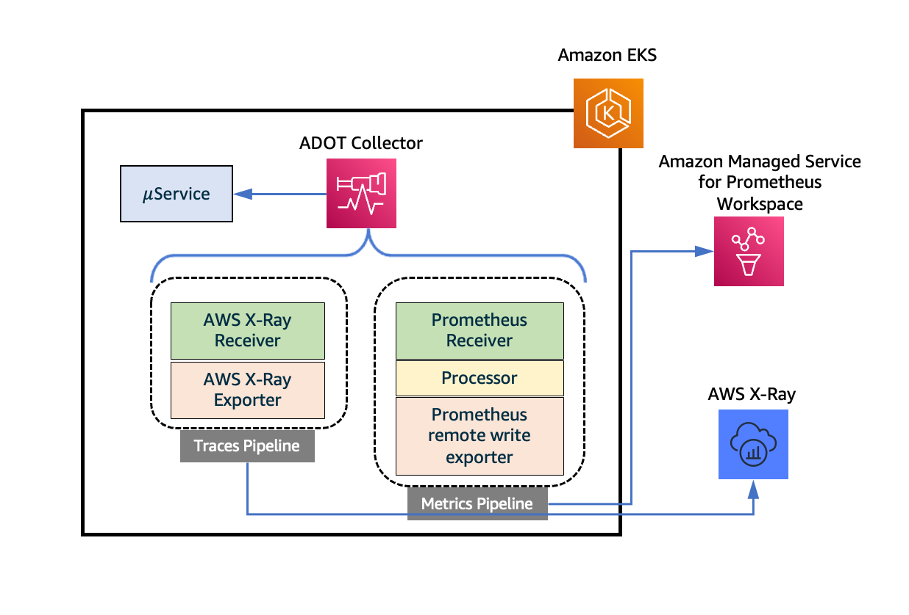
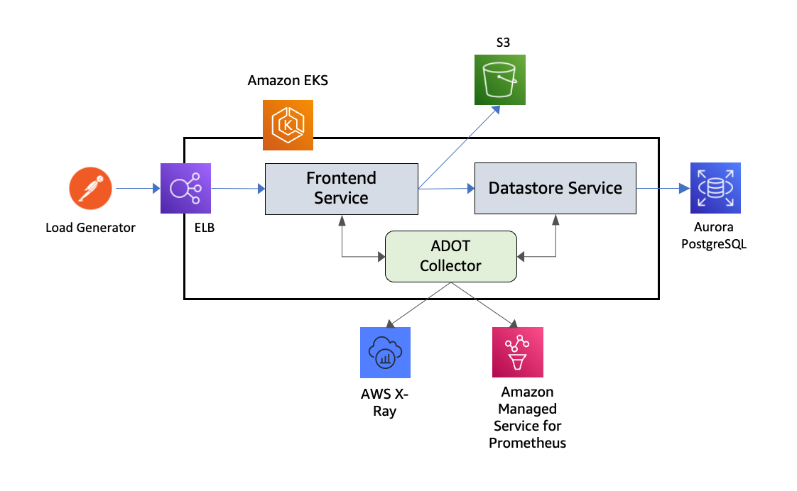

# AWS X-Ray を使用したコンテナトレーシング

Observability ベストプラクティスガイドのこのセクションでは、AWS X-Ray を使用したコンテナトレーシングに関する以下のトピックについて詳しく説明します。

* AWS X-Ray の概要
* AWS Distro for OpenTelemetry の Amazon EKS アドオンを使用したトレース収集
* 結論

### はじめに

[AWS X-Ray](https://docs.aws.amazon.com/ja_jp/xray/latest/devguide/aws-xray.html) は、アプリケーションが処理するリクエストに関するデータを収集し、そのデータを表示、フィルタリング、分析するためのツールを提供するサービスです。アプリケーションに対する追跡対象のリクエストについては、リクエストとレスポンスに関する詳細情報だけでなく、アプリケーションが下流の AWS リソース、マイクロサービス、データベース、Web API に対して行った呼び出しに関する情報も確認できます。

アプリケーションにインストルメンテーションを行うには、受信リクエストと送信リクエスト、およびアプリケーション内の他のイベントに対してトレースデータを送信し、各リクエストに関するメタデータを付与する必要があります。多くのインストルメンテーションシナリオでは、設定変更のみで対応できます。たとえば、Java アプリケーションが受信する HTTP リクエストと、AWS サービスに対する下流の呼び出しをすべて計装できます。X-Ray トレーシングのためにアプリケーションを計装するには、複数の SDK、エージェント、ツールを使用できます。詳細については、[Instrumenting your application](https://docs.aws.amazon.com/ja_jp/xray/latest/devguide/xray-instrumenting-your-app.html) を参照してください。

この実習では、AWS Distro for OpenTelemetry の Amazon EKS アドオンを使用して、Amazon EKS クラスターからトレースを収集することで、コンテナ化されたアプリケーションのトレーシングについて学びます。

### AWS Distro for OpenTelemetry の Amazon EKS アドオンを使用したトレース収集

[AWS X-Ray](https://aws.amazon.com/jp/xray/) はアプリケーショントレーシング機能を提供し、デプロイされたすべてのマイクロサービスに深い洞察を与えます。X-Ray を使用すると、関係するマイクロサービスを通過する各リクエストをトレースできます。これにより、DevOps チームはサービスがどのようにピアと対話するかを理解するための洞察を得られ、問題の分析とデバッグをはるかに速く行えるようになります。

[AWS Distro for OpenTelemetry (ADOT)](https://aws-otel.github.io/docs/introduction) は、OpenTelemetry プロジェクトの安全で AWS がサポートする配布版です。ユーザーは 1 回のインストゥルメンテーションで、ADOT を使用して相関するメトリクスとトレースを複数のモニタリングソリューションに送信できます。Amazon EKS では、クラスターが起動した後いつでも ADOT をアドオンとして有効にできるようになりました。ADOT アドオンには最新のセキュリティパッチとバグ修正が含まれており、AWS によって Amazon EKS との動作が検証されています。

ADOT アドオンは、Kubernetes Operator の実装です。Kubernetes Operator は、カスタムリソースを利用してアプリケーションとそのコンポーネントを管理する Kubernetes の拡張機能です。このアドオンは OpenTelemetryCollector という名前のカスタムリソースを監視し、カスタムリソースで指定された設定に基づいて ADOT Collector のライフサイクルを管理します。

ADOT Collector にはパイプラインの概念があり、Receiver、Processor、Exporter という 3 つの主要なコンポーネントで構成されています。[Receiver](https://opentelemetry.io/docs/collector/configuration/#receivers) はデータが Collector に入る経路で、特定の形式のデータを受け入れ、内部形式に変換し、パイプラインで定義された [Processor](https://opentelemetry.io/docs/collector/configuration/#processors) と [Exporter](https://opentelemetry.io/docs/collector/configuration/#exporters) に渡します。プル型またはプッシュ型のどちらかです。Processor はオプションのコンポーネントで、データを受信してからエクスポートするまでの間にバッチ処理、フィルタリング、変換などのタスクを実行するために使用されます。Exporter は、メトリクス、ログ、トレースの送信先を決定するために使用されます。Collector のアーキテクチャにより、Kubernetes YAML マニフェストを使ってこのようなパイプラインを複数インスタンス設定できます。

次の図は、テレメトリデータを AWS X-Ray に送信するようにトレースパイプラインを設定した ADOT Collector を示しています。このトレースパイプラインは、[AWS X-Ray Receiver](https://github.com/open-telemetry/opentelemetry-collector-contrib/tree/main/receiver/awsxrayreceiver) と [AWS X-Ray Exporter](https://github.com/open-telemetry/opentelemetry-collector-contrib/tree/main/exporter/awsxrayexporter) のインスタンスで構成され、トレースを AWS X-Ray に送信します。



*図: AWS Distro for OpenTelemetry の Amazon EKS アドオンを使用したトレース収集*

次に、EKS クラスターに ADOT アドオンをインストールし、ワークロードからテレメトリデータを収集する詳細を見ていきましょう。ADOT アドオンをインストールする前に必要な前提条件は以下の通りです。

* Kubernetes バージョン 1.19 以降をサポートする EKS クラスター。[こちらの手順](https://docs.aws.amazon.com/ja_jp/eks/latest/userguide/create-cluster.html)のいずれかを使用して EKS クラスターを作成できます。
* クラスターにまだインストールされていない場合は [Certificate Manager](https://cert-manager.io/)。[このドキュメント](https://cert-manager.io/docs/installation/)に従ってデフォルト設定でインストールできます。
* ADOT アドオンをクラスターにインストールするための Kubernetes RBAC 権限。これは、[この YAML ファイル](https://amazon-eks.s3.amazonaws.com/docs/addons-otel-permissions.yaml)の設定をクラスターに適用することで行えます。kubectl などの CLI ツールを使用します。

次のコマンドを使用すると、EKS の各バージョンで有効になっているアドオンのリストを確認できます。

`aws eks describe-addon-versions`

JSON 出力には、以下のように ADOT アドオンが他のアドオンとともにリストされているはずです。EKS クラスターを作成したときは、EKS アドオンがクラスターにアドオンをインストールしていないことに注意してください。

```
{
   "addonName":"adot",
   "type":"observability",
   "addonVersions":[
      {
         "addonVersion":"v0.45.0-eksbuild.1",
         "architecture":[
            "amd64"
         ],
         "compatibilities":[
            {
               "clusterVersion":"1.22",
               "platformVersions":[
                  "*"
               ],
               "defaultVersion":true
            },
            {
               "clusterVersion":"1.21",
               "platformVersions":[
                  "*"
               ],
               "defaultVersion":true
            },
            {
               "clusterVersion":"1.20",
               "platformVersions":[
                  "*"
               ],
               "defaultVersion":true
            },
            {
               "clusterVersion":"1.19",
               "platformVersions":[
                  "*"
               ],
               "defaultVersion":true
            }
         ]
      }
   ]
}
```

次に、以下のコマンドで ADOT アドオンをインストールできます。

`aws eks create-addon --addon-name adot --addon-version v0.45.0-eksbuild.1 --cluster-name $CLUSTER_NAME`

バージョン文字列は、前述の出力の *addonVersion* フィールドの値と一致する必要があります。このコマンドを正常に実行した場合の出力は次のようになります。

```
{
    "addon": {
        "addonName": "adot",
        "clusterName": "k8s-production-cluster",
        "status": "ACTIVE",
        "addonVersion": "v0.45.0-eksbuild.1",
        "health": {
            "issues": []
        },
        "addonArn": "arn:aws:eks:us-east-1:123456789000:addon/k8s-production-cluster/adot/f0bff97c-0647-ef6f-eecf-0b2a13f7491b",
        "createdAt": "2022-04-04T10:36:56.966000+05:30",
        "modifiedAt": "2022-04-04T10:38:09.142000+05:30",
        "tags": {}
    }
}
```

次のステップに進む前に、アドオンのステータスが ACTIVE になるまで待ってください。アドオンのステータスは、次のコマンドで確認できます。

`aws eks describe-addon --addon-name adot --cluster-name $CLUSTER_NAME`

#### ADOT コレクターのデプロイ

ADOT アドオンは、Kubernetes Operator の実装です。Kubernetes Operator は、カスタムリソースを利用してアプリケーションとそのコンポーネントを管理するための Kubernetes の拡張機能です。このアドオンは、OpenTelemetryCollector という名前のカスタムリソースを監視し、そのカスタムリソースで指定された設定に基づいて ADOT コレクターのライフサイクルを管理します。次の図は、この仕組みを示しています。


*図: ADOT コレクターのデプロイ*

次に、ADOT コレクターのデプロイ方法を見ていきましょう。[ここの YAML 設定ファイル](https://github.com/aws-observability/aws-o11y-recipes/blob/main/sandbox/eks-addon-adot/otel-collector-xray-prometheus-complete.yaml) は、OpenTelemetryCollector カスタムリソースを定義しています。この設定を EKS クラスターにデプロイすると、ADOT アドオンが上の最初の図のように、トレースとメトリクスのパイプラインを含む ADOT コレクターをプロビジョニングします。コレクターは `aws-otel-eks` 名前空間に Kubernetes Deployment として `${custom-resource-name}-collector` という名前でデプロイされ、同じ名前の ClusterIP サービスも起動します。このコレクターのパイプラインを構成する個々のコンポーネントを見ていきましょう。

トレースパイプラインの AWS X-Ray Receiver は、[X-Ray セグメント形式](https://docs.aws.amazon.com/ja_jp/xray/latest/devguide/xray-api-segmentdocuments.html)のセグメントまたはスパンを受け入れます。これにより、X-Ray SDK で計装されたマイクロサービスから送信されたセグメントを処理できます。UDP ポート 2000 でトラフィックを受け付けるように設定され、ClusterIP サービスとして公開されています。この設定に従うと、このレシーバーにトレースデータを送信したいワークロードは、環境変数 `AWS_XRAY_DAEMON_ADDRESS` を `observability-collector.aws-otel-eks:2000` に設定する必要があります。エクスポーターは、これらのセグメントを [PutTraceSegments](https://docs.aws.amazon.com/ja_jp/xray/latest/api/API_PutTraceSegments.html) API を使って直接 X-Ray に送信します。

ADOT コレクターは、`aws-otel-collector` という名前の Kubernetes サービスアカウントの ID で起動するように設定されています。このサービスアカウントには、[設定](https://github.com/aws-observability/aws-o11y-recipes/blob/main/sandbox/eks-addon-adot/otel-collector-xray-prometheus-complete.yaml) に示されている ClusterRoleBinding と ClusterRole を使って、これらの権限が付与されています。エクスポーターは、X-Ray にデータを送信するための IAM 権限が必要です。これは、EKS がサポートする [IAM ロールとサービスアカウントの関連付け](https://docs.aws.amazon.com/ja_jp/eks/latest/userguide/iam-roles-for-service-accounts.html)機能を使って、サービスアカウントに IAM ロールを関連付けることで実現されます。IAM ロールには、AWSXRayDaemonWriteAccess などの AWS 管理ポリシーを関連付ける必要があります。[このヘルパースクリプト](https://github.com/aws-observability/aws-o11y-recipes/blob/main/sandbox/eks-addon-adot/adot-irsa.sh)を使えば、CLUSTER_NAME と REGION 変数を設定した後、これらの権限を持つ `EKS-ADOT-ServiceAccount-Role` という名前の IAM ロールを作成し、`aws-otel-collector` サービスアカウントに関連付けることができます。

#### トレース収集のエンド・ツー・エンドテスト

さて、ここまでの内容をすべて組み合わせて、EKS クラスターにデプロイされたワークロードからのトレース収集をテストしましょう。次の図は、このテストで使用されるセットアップを示しています。これは、一連の REST API を公開し、S3 と対話するフロントエンドサービスと、Aurora PostgreSQL データベースのインスタンスと対話するデータストアサービスで構成されています。サービスには X-Ray SDK が組み込まれています。ADOT コレクターは、前のセクションで説明した YAML マニフェストを使用して OpenTelemetryCollector カスタムリソースをデプロイすることで、デプロイメントモードで起動されます。Postman クライアントは、フロントエンドサービスを対象とする外部トラフィックジェネレーターとして使用されます。



*図: トレース収集のエンド・ツー・エンドテスト*

次の画像は、サービスからキャプチャされたセグメントデータを使って X-Ray によって生成されたサービスグラフを示しており、各セグメントの平均レスポンス待ち時間が表示されています。


*図: CloudWatch Service Map コンソール*

トレースパイプラインの OpenTelemetryCollector カスタムリソース定義については、[Traces pipeline with OTLP Receiver and AWS X-Ray Exporter sending traces to AWS X-Ray](https://github.com/aws-observability/aws-otel-community/blob/master/sample-configs/operator/collector-config-xray.yaml) をご覧ください。AWS X-Ray と併せて ADOT コレクターを使用したいお客様は、これらの構成テンプレートから始め、プレースホルダー変数を対象環境に基づく値に置き換え、ADOT の EKS アドオンを使って Amazon EKS クラスターにコレクターを迅速にデプロイすることができます。

### EKS Blueprints を使用して AWS X-Ray でコンテナトレーシングを設定する

[EKS Blueprints](https://aws.amazon.com/jp/blogs/news/bootstrapping-clusters-with-eks-blueprints/) は、アカウントやリージョンを超えて一貫性のある、バッテリー内蔵の EKS クラスターを構成およびデプロイするための Infrastructure as Code (IaC) モジュールのコレクションです。
EKS Blueprints を使用すると、[Amazon EKS アドオン](https://docs.aws.amazon.com/ja_jp/eks/latest/userguide/eks-add-ons.html)だけでなく、Prometheus、Karpenter、Nginx、Traefik、AWS Load Balancer Controller、Container Insights、Fluent Bit、Keda、Argo CD などの幅広いオープンソースアドオンを簡単に EKS クラスターに組み込むことができます。
EKS Blueprints は、[HashiCorp Terraform](https://github.com/aws-ia/terraform-aws-eks-blueprints) と [AWS Cloud Development Kit (AWS CDK)](https://github.com/aws-quickstart/cdk-eks-blueprints) の 2 つの人気の IaC フレームワークで実装されており、インフラストラクチャのデプロイを自動化できます。

EKS Blueprints を使用した Amazon EKS クラスターの作成プロセスの一部として、Day 2 の運用ツールとして AWS X-Ray を設定し、コンテナ化されたアプリケーションやマイクロサービスからメトリクスとログを収集、集約、要約して Amazon CloudWatch コンソールに送信できます。

## 結論

このオブザーバビリティのベストプラクティスガイドのセクションでは、AWS Distro for OpenTelemetry の Amazon EKS アドオンを使用してトレース収集を行うことで、Amazon EKS 上のアプリケーションに対して AWS X-Ray を使用したコンテナトレーシングについて学びました。さらに学習するには、[Amazon Managed Service for Prometheus と Amazon CloudWatch への AWS Distro for OpenTelemetry の Amazon EKS アドオンを使用したメトリクスとトレースの収集](https://aws.amazon.com/jp/blogs/news/metrics-and-traces-collection-using-amazon-eks-add-ons-for-aws-distro-for-opentelemetry/)をご覧ください。最後に、Amazon EKS クラスター作成プロセス中に AWS X-Ray を使用してコンテナトレーシングを設定するための手段として EKS Blueprints を使用する方法について簡単に説明しました。さらに深く学習するには、AWS の [One Observability Workshop](https://catalog.workshops.aws/observability/en-US) の **AWS ネイティブ** オブザーバビリティカテゴリにある X-Ray Traces モジュールを実践することを強くお勧めします。
