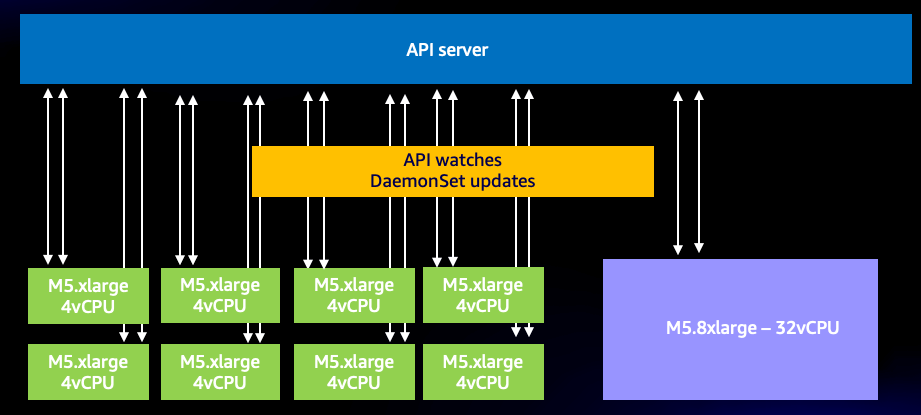

# Amazon EKS API サーバーのモニタリング

オブザーバビリティのベストプラクティスガイドのこのセクションでは、API サーバーのモニタリングに関連する以下のトピックについて詳しく説明します：

* Amazon EKS API サーバーのモニタリングの概要
* API サーバートラブルシューターダッシュボードの設定
* API トラブルシューターダッシュボードを使用した API サーバーの問題の理解
* API サーバーへの無制限のリスト呼び出しの理解
* API サーバーへの不適切な動作の停止
* API の優先順位と公平性
* 最も遅い API 呼び出しと API サーバーのレイテンシー問題の特定

### はじめに

Amazon EKS のマネージドコントロールプレーンのモニタリングは、EKS クラスターの健全性に関する問題を事前に特定するための重要な Day 2 の運用活動です。Amazon EKS コントロールプレーンのモニタリングは、収集されたメトリクスに基づいて事前対策を講じるのに役立ちます。これらのメトリクスは、API サーバーのトラブルシューティングや、問題の根本原因の特定に役立ちます。

このセクションでは、Amazon EKS API サーバーのモニタリングに Amazon Managed Service for Prometheus (AMP) を、メトリクスの可視化に Amazon Managed Grafana (AMG) を使用してデモンストレーションを行います。Prometheus は人気のあるオープンソースのモニタリングツールで、強力なクエリ機能を提供し、さまざまなワークロードに幅広くサポートされています。Amazon Managed Service for Prometheus は、完全マネージド型の Prometheus 互換サービスで、Amazon EKS、[Amazon Elastic Container Service (Amazon ECS)](https://aws.amazon.com/jp/ecs)、[Amazon Elastic Compute Cloud (Amazon EC2)](https://aws.amazon.com/jp/ec2) などの環境を安全かつ確実にモニタリングすることを容易にします。[Amazon Managed Grafana](https://aws.amazon.com/jp/grafana/) は、オープンソースの Grafana 用の完全マネージド型で安全なデータ可視化サービスで、顧客が複数のデータソースからアプリケーションの運用メトリクス、ログ、トレースを即座にクエリ、相関付け、可視化することを可能にします。

まず、Amazon Managed Service for Prometheus と Amazon Managed Grafana を使用してスターターダッシュボードを設定し、Prometheus を使用して [Amazon Elastic Kubernetes Service (Amazon EKS)](https://aws.amazon.com/jp/eks) API サーバーのトラブルシューティングを支援します。続くセクションでは、EKS API サーバーのトラブルシューティング中の問題の理解、API の優先順位と公平性、不適切な動作の停止について詳しく説明します。最後に、最も遅い API 呼び出しと API サーバーのレイテンシーの問題を特定する方法を深く掘り下げ、Amazon EKS クラスターの健全な状態を維持するためのアクションを取るのに役立ちます。

### API サーバーのトラブルシューティング ダッシュボードの設定

AMP を使用して [Amazon Elastic Kubernetes Service (Amazon EKS)](https://aws.amazon.com/jp/eks) API サーバーのトラブルシューティングを支援するスターター ダッシュボードを設定します。これを使用して、本番環境の EKS クラスターのトラブルシューティング時にメトリクスを理解するのに役立てます。さらに、収集されたメトリクスに深く焦点を当て、Amazon EKS クラスターのトラブルシューティング時のその重要性を理解します。

まず、[ADOT コレクターを設定して Amazon EKS クラスターから Amazon Manager Service for Prometheus にメトリクスを収集](https://aws.amazon.com/jp/blogs/news/metrics-and-traces-collection-using-amazon-eks-add-ons-for-aws-distro-for-opentelemetry/)します。このセットアップでは、EKS ADOT アドオンを使用します。これにより、ユーザーは EKS クラスターが稼働した後いつでも ADOT をアドオンとして有効にできます。ADOT アドオンには最新のセキュリティパッチとバグ修正が含まれており、Amazon EKS で動作することが AWS によって検証されています。このセットアップでは、EKS クラスターに ADOT アドオンをインストールし、それを使用してクラスターからメトリクスを収集する方法を示します。

次に、最初のステップで設定したデータソースとして AMP を使用して[メトリクスを可視化するために Amazon Managed Grafana ワークスペースを設定](https://aws.amazon.com/jp/blogs/news/amazon-managed-grafana-getting-started/)します。最後に、[API トラブルシューター ダッシュボード](https://github.com/RiskyAdventure/Troubleshooting-Dashboards/blob/main/api-troubleshooter.json)をダウンロードし、Amazon Managed Grafana に移動して API トラブルシューター ダッシュボードの JSON をアップロードし、さらなるトラブルシューティングのためにメトリクスを可視化します。

### API トラブルシューターダッシュボードを使用して問題を理解する

クラスターにインストールしたい興味深いオープンソースプロジェクトを見つけたとしましょう。そのオペレーターは、クラスターに DaemonSet をデプロイします。この DaemonSet は、不正な形式のリクエストを使用したり、不必要に多くの LIST 呼び出しを行ったり、あるいは 1,000 ノードすべてにある各 DaemonSet が、クラスター上の 50,000 個すべての Pod のステータスを毎分リクエストしたりする可能性があります。

これは本当によく起こることでしょうか？はい、実際によく起こります！このような状況がどのように発生するのか、簡単に見てみましょう。

#### LIST と WATCH の理解

一部のアプリケーションでは、クラスター内のオブジェクトの状態を理解する必要があります。例えば、機械学習 (ML) アプリケーションが、*Completed* ステータスになっていない Pod の数を把握することでジョブのステータスを知りたい場合があります。Kubernetes では、これを行うための適切な方法として WATCH と呼ばれるものがあります。一方で、クラスター上のすべてのオブジェクトをリストアップして Pod の最新ステータスを見つけるという、あまり適切ではない方法もあります。

#### 適切に動作する WATCH

WATCH または単一の長期接続を使用して、プッシュモデルで更新を受け取ることは、Kubernetes で更新を行う最もスケーラブルな方法です。簡単に言えば、システムの完全な状態を要求し、そのオブジェクトに変更が受信されたときにのみキャッシュ内のオブジェクトを更新し、定期的に再同期を実行して更新が見逃されていないことを確認します。

以下の画像では、`apiserver_longrunning_gauge` を使用して、両方の API サーバーにわたるこれらの長期接続の数を把握しています。

*図：`apiserver_longrunning_gauge` メトリクス*

このような効率的なシステムでも、良いものを過剰に持つことがあります。例えば、API サーバーと通信する必要がある 2 つ以上の DaemonSet を使用する非常に小さなノードを多数使用する場合、システム上の WATCH 呼び出しの数を不必要に劇的に増加させることは簡単です。例えば、8 つの xlarge ノードと 1 つの 8xlarge ノードの違いを見てみましょう。ここでは、システム上の WATCH 呼び出しが 8 倍に増加しているのが分かります。

*図：8 つの xlarge ノード間の WATCH 呼び出し*

これらは効率的な呼び出しですが、もし代わりに先ほど言及した不適切な動作をする呼び出しだったらどうでしょうか？1,000 個のノードそれぞれの上記の DaemonSet の 1 つが、クラスター内の合計 50,000 個の Pod それぞれの更新を要求していると想像してください。次のセクションでは、この無制限のリスト呼び出しのアイデアを探ります。

続ける前に注意点を一つ。上記の例のような統合は非常に慎重に行う必要があり、他にも多くの要因を考慮する必要があります。システム上の限られた数の CPU を争う多数のスレッドの遅延、Pod の変更率、ノードが安全に処理できるボリュームアタッチメントの最大数など、すべてが関係します。しかし、私たちの焦点は、問題の発生を防ぐための実行可能な手順につながるメトリクスに置かれます。そして、おそらく私たちの設計に新しい洞察を与えてくれるでしょう。

WATCH メトリクスはシンプルですが、WATCH の数を追跡し、それが問題である場合は削減するために使用できます。以下は、この数を減らすために検討できるいくつかのオプションです：

* Helm が履歴を追跡するために作成する ConfigMap の数を制限する
* WATCH を使用しない不変の ConfigMap と Secret を使用する
* 適切なノードのサイジングと統合

### API サーバーへの無制限のリスト呼び出しを理解する

さて、これまで話してきた LIST 呼び出しについて説明します。リスト呼び出しは、オブジェクトの状態を理解する必要がある度に、Kubernetes オブジェクトの完全な履歴を取得します。今回はキャッシュに何も保存されません。

これはどの程度影響があるのでしょうか？それは、データを要求するエージェントの数、要求の頻度、要求するデータ量によって異なります。クラスター全体のデータを要求しているのか、それとも単一の名前空間だけなのでしょうか？それは毎分、すべてのノードで発生するのでしょうか？ノードから送信されるすべてのログに Kubernetes のメタデータを追加するロギングエージェントの例を使ってみましょう。これは、大規模なクラスターでは膨大な量のデータになる可能性があります。エージェントがリスト呼び出しを通じてそのデータを取得する方法は多数ありますので、いくつか見てみましょう。

以下のリクエストは、特定の名前空間からポッドを要求しています。

`/api/v1/namespaces/my-namespace/pods`

次に、クラスター上の 50,000 個のポッドすべてを要求しますが、一度に 500 個のポッドずつ取得します。

`/api/v1/pods?limit=500`

次の呼び出しが最も破壊的です。クラスター全体の 50,000 個のポッドを一度に取得します。

`/api/v1/pods`

これは現場でよく発生し、ログで確認できます。

### API サーバーへの不適切な動作を停止する

このような不適切な動作からクラスターを保護するにはどうすればよいでしょうか？Kubernetes 1.20 以前では、API サーバーは 1 秒あたりに処理される *インフライト* リクエストの数を制限することで自身を保護していました。etcd は一度に処理できるリクエスト数に限りがあるため、etcd の読み取りと書き込みを適切なレイテンシー範囲内に保つために、1 秒あたりのリクエスト数を制限する必要があります。残念ながら、この記事を書いている時点では、これを動的に行う方法はありません。

以下のチャートでは、読み取りリクエストの内訳を示しています。デフォルトでは API サーバーあたり最大 400 のインフライトリクエストと、最大 200 の同時書き込みリクエストが設定されています。デフォルトの EKS クラスターでは、2 つの API サーバーがあり、合計で 800 の読み取りと 400 の書き込みが可能です。ただし、これらのサーバーは、アップグレード直後などの異なる時間帯で非対称な負荷がかかる可能性があるため、注意が必要です。

*図：読み取りリクエストの内訳を示す Grafana チャート*

上記の方式は完璧ではないことが判明しました。例えば、新しくインストールした不適切な動作をするオペレーターが API サーバーのインフライト書き込みリクエストをすべて占有し、ノードのキープアライブメッセージなどの重要なリクエストを遅延させる可能性があります。これをどのように防ぐことができるでしょうか？

### API の優先順位と公平性

1 秒あたりの読み取り/書き込みリクエスト数を心配するのではなく、キャパシティを 1 つの総数として扱い、クラスター上の各アプリケーションがその最大総数の公平な割合またはシェアを得るとしたらどうでしょうか？

これを効果的に行うには、API サーバーにリクエストを送信した人を特定し、そのリクエストに一種の名前タグを付ける必要があります。この新しい名前タグを使用すると、これらのリクエストがすべて「Chatty」と呼ぶ新しいエージェントから来ていることがわかります。これで、Chatty のすべてのリクエストを *フロー* と呼ばれるものにグループ化し、それらのリクエストが同じ DaemonSet から来ていることを識別できます。この概念により、この悪いエージェントを制限し、クラスター全体を消費しないようにする能力が得られます。

しかし、すべてのリクエストが平等に作成されているわけではありません。クラスターの運用に必要なコントロールプレーントラフィックは、新しいオペレーターよりも優先度が高くあるべきです。ここで優先度レベルの概念が登場します。デフォルトで、重要、高、低優先度のトラフィック用に複数の「バケット」またはキューがあったらどうでしょうか？ おしゃべりなエージェントのフローが重要なトラフィックキューで公平なシェアを得ることは望ましくありません。しかし、そのトラフィックを低優先度キューに入れることで、そのフローが他のおしゃべりなエージェントと競合するようにすることができます。そして、各優先度レベルが API サーバーが処理できる全体の最大値の適切な数のシェアまたは割合を持つようにして、リクエストが過度に遅延しないようにしたいと考えます。

#### 優先順位と公平性の実践

これは比較的新しい機能であるため、多くの既存のダッシュボードでは、最大同時読み取り数と最大同時書き込み数の古いモデルを使用しています。なぜこれが問題になる可能性があるのでしょうか？

kube-system 名前空間内のすべてのものに高優先度の名前タグを付けていたとしても、その重要な名前空間に問題のあるエージェントをインストールしたり、単にその名前空間に多くのアプリケーションをデプロイしすぎたりしたらどうなるでしょうか？避けようとしていた問題と同じ問題が発生する可能性があります！そのため、このような状況には注意を払う必要があります。

このような問題を追跡するために最も興味深いと思われるメトリクスをいくつか挙げてみました。

* 優先度グループのシェアのうち、何パーセントが使用されているか？
* リクエストがキューで待機した最長時間は？
* どのフローが最も多くのシェアを使用しているか？
* システムに予期せぬ遅延はあるか？

#### 使用率

ここでは、クラスター上の異なるデフォルトの優先度グループと、最大値に対する使用率のパーセンテージを確認できます。

*図：クラスター上の優先度グループ*

#### リクエストがキューに入っていた時間

リクエストが処理される前に優先度キューに入っていた時間（秒単位）。

*図：リクエストが優先度キューに入っていた時間。*

#### フローごとの最も実行されたリクエスト

どのフローが最も多くのシェアを占めているでしょうか？

*図：フローごとの最も実行されたリクエスト*

#### リクエスト実行時間

処理に予期せぬ遅延はありませんか？

*図：フロー制御リクエスト実行時間*

### 最も遅い API コールと API サーバーのレイテンシー問題の特定

API のレイテンシーを引き起こす要因を理解したところで、全体像を見てみましょう。ダッシュボードのデザインは、調査すべき問題があるかどうかを素早く把握するためのものであることを覚えておくことが重要です。詳細な分析には、PromQL を使用したアドホッククエリ、あるいはさらに良いのはログクエリを使用します。

高レベルのメトリクスとして、どのようなものを見るべきでしょうか？以下にいくつかのアイデアを示します：

* 完了までに最も時間がかかっている API コールは何か？
    * そのコールは何をしているのか？（オブジェクトのリスト化、削除など）
    * どのオブジェクトに対してその操作を行おうとしているのか？（Pod、Secret、ConfigMap など）
* API サーバー自体にレイテンシーの問題があるか？
    * 優先度キューの1つに遅延があり、リクエストのバックアップを引き起こしているか？
* etcd サーバーがレイテンシーを経験しているために API サーバーが遅く見えるだけなのか？

#### 最も遅い API コール

以下のチャートでは、その期間で完了までに最も時間がかかった API コールを確認しています。この場合、カスタムリソース定義 (CRD) が LIST 関数を呼び出しており、05:40 の時間枠で最も遅延の大きいコールであることがわかります。このデータを基に、CloudWatch Insights を使用して、その時間枠内の監査ログから LIST リクエストを抽出し、どのアプリケーションが関係しているかを確認できます。

*図：最も遅い上位 5 つの API コール。*

#### API リクエスト時間

この API レイテンシーチャートは、リクエストが 1 分のタイムアウト値に近づいているかどうかを理解するのに役立ちます。以下の時系列ヒストグラムは、折れ線グラフでは隠れてしまう外れ値を見ることができるため、私はこの形式が好きです。

*図：API リクエスト時間のヒートマップ。*

バケットにカーソルを合わせるだけで、約 25 ミリ秒かかった呼び出しの正確な数を確認できます。
[Image: Image.jpg]*図：25 ミリ秒を超える呼び出し。*

この概念は、リクエストをキャッシュする他のシステムと連携する際に重要です。キャッシュリクエストは高速であり、これらのリクエストレイテンシーを遅いリクエストと混同したくありません。ここでは、レイテンシーの 2 つの異なるバンドを見ることができます。キャッシュされたリクエストと、されていないリクエストです。

*図：レイテンシー、キャッシュされたリクエスト。*

#### ETCD リクエスト時間

ETCD のレイテンシーは、Kubernetes のパフォーマンスにおいて最も重要な要素の 1 つです。Amazon EKS では、`request_duration_seconds_bucket` メトリクスを確認することで、API サーバーの視点からこのパフォーマンスを見ることができます。

*図：`request_duration_seconds_bucket` メトリクス*

これまで学んだことを組み合わせて、特定のイベントが相関しているかどうかを確認することができます。以下のチャートでは、API サーバーのレイテンシーを確認できますが、このレイテンシーの多くが etcd サーバーから来ていることもわかります。一目で適切な問題領域にすぐに移動できることが、ダッシュボードの強力な点です。

*図：Etcd リクエスト*

## 結論

Observability のベストプラクティスガイドのこのセクションでは、Amazon Managed Service for Prometheus と Amazon Managed Grafana を使用した[スターターダッシュボード](https://github.com/RiskyAdventure/Troubleshooting-Dashboards/blob/main/api-troubleshooter.json)を利用して、[Amazon Elastic Kubernetes Service (Amazon EKS)](https://aws.amazon.com/jp/eks) API サーバーのトラブルシューティングを支援しました。

さらに、EKS API サーバーのトラブルシューティング中の問題の理解、API の優先順位と公平性、不適切な動作の停止について詳しく掘り下げました。

最後に、最も遅い API コールの特定と API サーバーのレイテンシーの問題を深く掘り下げました。これにより、Amazon EKS クラスターの状態を健全に保つためのアクションを取ることができます。

さらに深く掘り下げるには、AWS [One Observability Workshop](https://catalog.workshops.aws/observability/en-US) の AWS ネイティブ Observability カテゴリーにあるアプリケーションモニタリングモジュールを実践することを強くお勧めします。
