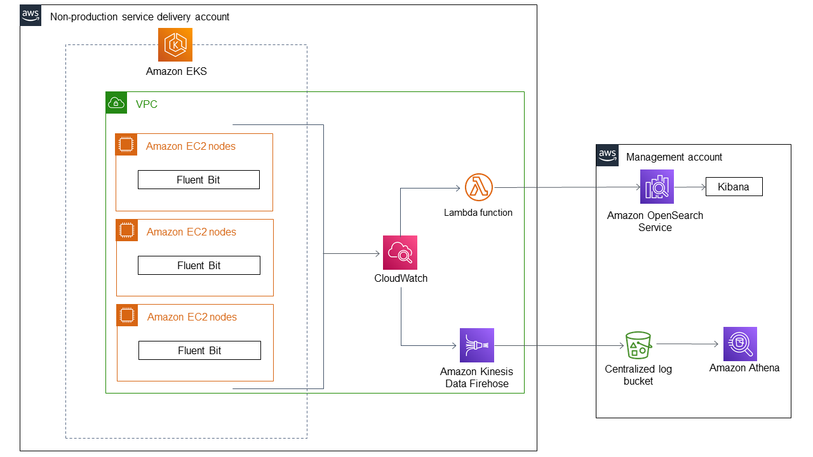
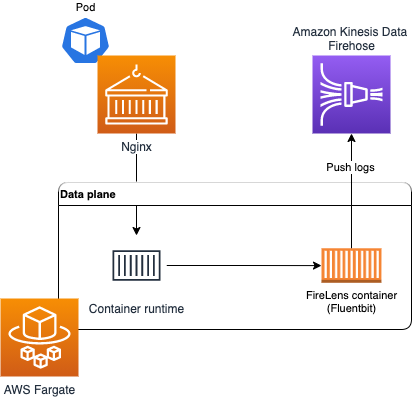
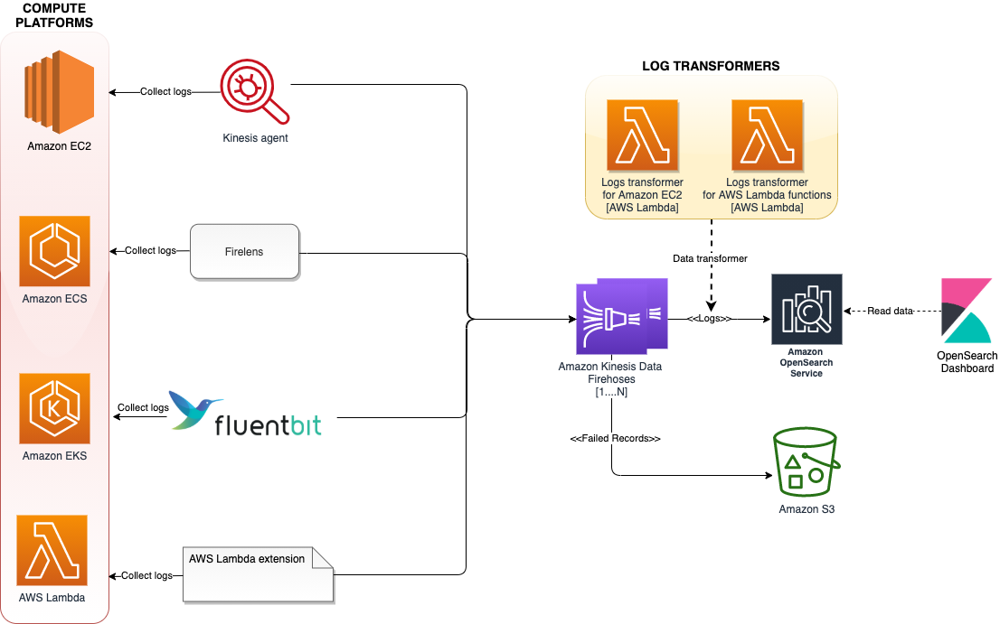

# ログ集約

Observability ベストプラクティスガイドのこのセクションでは、AWS ネイティブサービスを使用した Amazon EKS ロギングに関する以下のトピックについて詳しく説明します。

* AWS EKS ロギングの概要
* Amazon EKS コントロールプレーンのロギング
* Amazon EKS データプレーンのロギング
* Amazon EKS アプリケーションのロギング
* AWS ネイティブサービスを使用した Amazon EKS と他のコンピューティングプラットフォームからの統合ログ集約
* 結論

### はじめに

Amazon EKS のログは、コントロールプレーンのログ、ノードのログ、アプリケーションのログの 3 種類に分けられます。[Kubernetes コントロールプレーン](https://kubernetes.io/docs/concepts/overview/components/#control-plane-components)は、Kubernetes クラスターを管理するコンポーネントの集合体で、監査および診断目的で使用されるログを生成します。Amazon EKS では、[さまざまなコントロールプレーンコンポーネントのログを有効にする](https://docs.aws.amazon.com/ja_jp/eks/latest/userguide/control-plane-logs.html)ことができ、それらを CloudWatch に送信できます。

Kubernetes はまた、`kubelet` や `kube-proxy` などのシステムコンポーネントを、ポッドを実行する各 Kubernetes ノード上で実行します。これらのコンポーネントは各ノード内にログを書き込み、CloudWatch と Container Insights を設定して、各 Amazon EKS ノードのこれらのログをキャプチャできます。

コンテナは Kubernetes クラスター内で [ポッド](https://kubernetes.io/docs/concepts/workloads/pods/) としてグループ化され、Kubernetes ノードで実行されるようスケジューリングされます。ほとんどのコンテナ化されたアプリケーションは標準出力と標準エラーに出力を書き込み、コンテナエンジンがその出力をログドライバに転送します。Kubernetes では、コンテナのログはノード上の `/var/log/pods` ディレクトリにあります。CloudWatch と Container Insights を設定して、Amazon EKS の各ポッドのこれらのログをキャプチャできます。

Kubernetes でコンテナログをキャプチャする一般的な 3 つのアプローチは次のとおりです。

* [Fluentd デーモンセット](https://docs.aws.amazon.com/ja_jp/AmazonCloudWatch/latest/monitoring/Container-Insights-setup-logs.html)などのノードレベルエージェント。これが推奨されるパターンです。
* Fluentd サイドカーコンテナなどのサイドカーコンテナ。
* ログ収集システムへの直接書き込み。このアプローチでは、アプリケーションがログの送信を担当します。Fluentd などのコミュニティビルドソリューションを再利用できないため、最も推奨されないオプションです。このパターンは、ログ実装がアプリケーションから独立していないため、*関心の分離の原則* に反します。ログインフラストラクチャを変更してもアプリケーションに影響を与えずに済むよう、ログ実装をアプリケーションから分離することが重要です。

ここからは、Amazon EKS のログのそれぞれのカテゴリと、Amazon EKS や他のコンピューティングプラットフォームからの統合ログ集約について説明します。

### Amazon EKS コントロールプレーンのログ

Amazon EKS クラスターは、Kubernetes クラスター用の高可用性シングルテナントコントロールプレーンと、コンテナを実行する Amazon EKS ノードで構成されています。コントロールプレーンノードは AWS が管理するアカウントで実行されます。Amazon EKS クラスターのコントロールプレーンノードは CloudWatch と統合されており、特定のコントロールプレーンコンポーネントのログ記録を有効にできます。各 Kubernetes コントロールプレーンコンポーネントインスタンスのログが提供されます。AWS はコントロールプレーンノードの正常性を管理し、Kubernetes エンドポイントに対して [サービスレベル契約 (SLA)](https://aws.amazon.com/jp/eks/sla/) を提供します。

[Amazon EKS コントロールプレーンのログ](https://docs.aws.amazon.com/ja_jp/eks/latest/userguide/control-plane-logs.html) は、以下のクラスターコントロールプレーンログタイプで構成されています。各ログタイプは Kubernetes コントロールプレーンのコンポーネントに対応しています。これらのコンポーネントの詳細については、Kubernetes ドキュメントの [Kubernetes Components](https://kubernetes.io/docs/concepts/overview/components/) を参照してください。

* **API サーバー (`api`)** - クラスターの API サーバーは、Kubernetes API を公開するコントロールプレーンコンポーネントです。クラスター起動時または直後に API サーバーログを有効にすると、API サーバーの起動に使用された API サーバーフラグがログに含まれます。詳細は、Kubernetes ドキュメントの [`kube-apiserver`](https://kubernetes.io/docs/reference/command-line-tools-reference/kube-apiserver/) および [監査ポリシー](https://github.com/kubernetes/kubernetes/blob/master/cluster/gce/gci/configure-helper.sh#L1129-L1255) を参照してください。
* **監査 (`audit`)** - Kubernetes 監査ログは、クラスターに影響を与えた個々のユーザー、管理者、またはシステムコンポーネントの記録を提供します。詳細は、Kubernetes ドキュメントの [Auditing](https://kubernetes.io/docs/tasks/debug-application-cluster/audit/) を参照してください。
* **認証者 (`authenticator`)** - 認証者ログは Amazon EKS 独自のものです。これらのログは、Amazon EKS が IAM 認証情報を使用して Kubernetes の [ロールベースのアクセス制御](https://kubernetes.io/docs/reference/access-authn-authz/rbac/) (RBAC) 認証を行うコントロールプレーンコンポーネントを表します。詳細は、[クラスター管理](https://docs.aws.amazon.com/ja_jp/eks/latest/userguide/eks-managing.html) を参照してください。
* **コントローラーマネージャー (`controllerManager`)** - コントローラーマネージャーは、Kubernetes に同梱されているコアコントロールループを管理します。詳細は、Kubernetes ドキュメントの [kube-controller-manager](https://kubernetes.io/docs/reference/command-line-tools-reference/kube-controller-manager/) を参照してください。
* **スケジューラー (`scheduler`)** - スケジューラーコンポーネントは、クラスター内でポッドを実行する時期と場所を管理します。詳細は、Kubernetes ドキュメントの [kube-scheduler](https://kubernetes.io/docs/reference/command-line-tools-reference/kube-scheduler/) を参照してください。

[コントロールプレーンログの有効化と無効化](https://docs.aws.amazon.com/ja_jp/eks/latest/userguide/control-plane-logs.html,Enabling%20and%20disabling%20control%20plane%20logs,-By%20default%2C%20cluster) のセクションに従って、AWS コンソールまたは AWS CLI を使用してコントロールプレーンログを有効にしてください。

#### CloudWatch コンソールから制御プレーンログを照会する

Amazon EKS クラスターで制御プレーンログを有効にすると、`/aws/eks/cluster-name/cluster` ロググループに EKS 制御プレーンログが表示されます。詳細は、[クラスター制御プレーンログの表示](https://docs.aws.amazon.com/ja_jp/eks/latest/userguide/control-plane-logs.html)を参照してください。`cluster-name` はクラスター名に置き換えてください。

CloudWatch Logs Insights を使用して、EKS 制御プレーンログデータを検索できます。詳細は、[CloudWatch Insights を使用したログデータの分析](https://docs.aws.amazon.com/ja_jp/AmazonCloudWatch/latest/logs/AnalyzingLogData.html)を参照してください。クラスターで制御プレーンログを有効にした後でないと、CloudWatch Logs でログイベントを表示できないことに注意してください。CloudWatch Logs Insights でクエリを実行する時間範囲を選択する前に、制御プレーンログを有効にしたことを確認してください。以下のスクリーンショットは、EKS 制御プレーンログクエリとクエリ出力の例を示しています。


*図: CloudWatch Logs Insights.*

#### EKS の一般的な使用事例に関する CloudWatch Logs Insights のサンプルクエリ

クラスターの作成者を見つけるには、**kubernetes-admin** ユーザーにマップされている IAM エンティティを検索します。

```
fields @logStream, @timestamp, @message| sort @timestamp desc
| filter @logStream like /authenticator/
| filter @message like "username=kubernetes-admin"
| limit 50
```

出力例:

```

@logStream, @timestamp @messageauthenticator-71976 ca11bea5d3083393f7d32dab75b,2021-08-11-10:09:49.020,"time=""2021-08-11T10:09:43Z"" level=info msg=""access granted"" arn=""arn:aws:iam::12345678910:user/awscli"" client=""127.0.0.1:51326"" groups=""[system:masters]"" method=POST path=/authenticate sts=sts.eu-west-1.amazonaws.com uid=""heptio-authenticator-aws:12345678910:ABCDEFGHIJKLMNOP"" username=kubernetes-admin"
```

この出力では、IAM ユーザー **arn:aws:iam::[12345678910](tel:12345678910):user/awscli** がユーザー **kubernetes-admin** にマップされています。

特定のユーザーが実行したリクエストを見つけるには、**kubernetes-admin** ユーザーが実行した操作を検索します。

```

fields @logStream, @timestamp, @message| filter @logStream like /^kube-apiserver-audit/
| filter strcontains(user.username,"kubernetes-admin")
| sort @timestamp desc
| limit 50
```

出力例:

```

@logStream,@timestamp,@messagekube-apiserver-audit-71976ca11bea5d3083393f7d32dab75b,2021-08-11 09:29:13.095,"{...""requestURI"":""/api/v1/namespaces/kube-system/endpoints?limit=500";","string""verb"":""list"",""user"":{""username"":""kubernetes-admin"",""uid"":""heptio-authenticator-aws:12345678910:ABCDEFGHIJKLMNOP"",""groups"":[""system:masters"",""system:authenticated""],""extra"":{""accessKeyId"":[""ABCDEFGHIJKLMNOP""],""arn"":[""arn:aws:iam::12345678910:user/awscli""],""canonicalArn"":[""arn:aws:iam::12345678910:user/awscli""],""sessionName"":[""""]}},""sourceIPs"":[""12.34.56.78""],""userAgent"":""kubectl/v1.22.0 (darwin/amd64) kubernetes/c2b5237"",""objectRef"":{""resource"":""endpoints"",""namespace"":""kube-system"",""apiVersion"":""v1""}...}"
```

特定の userAgent が行った API コールを見つけるには、次の例のクエリを使用できます。

```

fields @logStream, @timestamp, userAgent, verb, requestURI, @message| filter @logStream like /kube-apiserver-audit/
| filter userAgent like /kubectl\/v1.22.0/
| sort @timestamp desc
| filter verb like /(get)/
```

短縮された出力例:

```

@logStream,@timestamp,userAgent,verb,requestURI,@messagekube-apiserver-audit-71976ca11bea5d3083393f7d32dab75b,2021-08-11 14:06:47.068,kubectl/v1.22.0 (darwin/amd64) kubernetes/c2b5237,get,/apis/metrics.k8s.io/v1beta1?timeout=32s,"{""kind"":""Event"",""apiVersion"":""audit.k8s.io/v1"",""level"":""Metadata"",""auditID"":""863d9353-61a2-4255-a243-afaeb9183524"",""stage"":""ResponseComplete"",""requestURI"":""/apis/metrics.k8s.io/v1beta1?timeout=32s"",""verb"":""get"",""user"":{""username"":""kubernetes-admin"",""uid"":""heptio-authenticator-aws:12345678910:AIDAUQGC5HFOHXON7M22F"",""groups"":[""system:masters"",""system:authenticated""],""extra"":{""accessKeyId"":[""ABCDEFGHIJKLMNOP""],""arn"":[""arn:aws:iam::12345678910:user/awscli""],""canonicalArn"":[""arn:aws:iam::12345678910:user/awscli""],""sourceIPs"":[""12.34.56.78""],""userAgent"":""kubectl/v1.22.0 (darwin/amd64) kubernetes/c2b5237""...}"
```

**aws-auth** ConfigMap に対して行われた変更を見つけるには、次の例のクエリを使用できます。

```

fields @logStream, @timestamp, @message| filter @logStream like /^kube-apiserver-audit/
| filter requestURI like /\/api\/v1\/namespaces\/kube-system\/configmaps/
| filter objectRef.name = "aws-auth"
| filter verb like /(create|delete|patch)/
| sort @timestamp desc
| limit 50
```

短縮された出力例:

```

@logStream,@timestamp,@messagekube-apiserver-audit-f01c77ed8078a670a2eb63af6f127163,2021-10-27 05:43:01.850,{""kind"":""Event"",""apiVersion"":""audit.k8s.io/v1"",""level"":""RequestResponse"",""auditID"":""8f9a5a16-f115-4bb8-912f-ee2b1d737ff1"",""stage"":""ResponseComplete"",""requestURI"":""/api/v1/namespaces/kube-system/configmaps/aws-auth?timeout=19s"",""verb"":""patch"",""responseStatus"": {""metadata"": {},""code"": 200 },""requestObject"": {""data"": { contents of aws-auth ConfigMap } },""requestReceivedTimestamp"":""2021-10-27T05:43:01.033516Z"",""stageTimestamp"":""2021-10-27T05:43:01.042364Z"" }
```

拒否されたリクエストを見つけるには、次の例のクエリを使用できます。

```

fields @logStream, @timestamp, @message| filter @logStream like /^authenticator/
| filter @message like "denied"
| sort @timestamp desc
| limit 50
```

出力例:

```

@logStream,@timestamp,@messageauthenticator-8c0c570ea5676c62c44d98da6189a02b,2021-08-08 20:04:46.282,"time=""2021-08-08T20:04:44Z"" level=warning msg=""access denied"" client=""127.0.0.1:52856"" error=""sts getCallerIdentity failed: error from AWS (expected 200, got 403)"" method=POST path=/authenticate"
```

Pod がスケジュールされたノードを見つけるには、**kube-scheduler** ログを照会します。

```

fields @logStream, @timestamp, @message| sort @timestamp desc
| filter @logStream like /kube-scheduler/
| filter @message like "aws-6799fc88d8-jqc2r"
| limit 50
```

出力例:

```

@logStream,@timestamp,@messagekube-scheduler-bb3ea89d63fd2b9735ba06b144377db6,2021-08-15 12:19:43.000,"I0915 12:19:43.933124       1 scheduler.go:604] ""Successfully bound pod to node"" pod=""kube-system/aws-6799fc88d8-jqc2r"" node=""ip-192-168-66-187.eu-west-1.compute.internal"" evaluatedNodes=3 feasibleNodes=2"
```

この出力例では、Pod **aws-6799fc88d8-jqc2r** がノード **ip-192-168-66-187.eu-west-1.compute.internal** にスケジュールされています。

Kubernetes API サーバーリクエストの HTTP 5xx サーバーエラーを見つけるには、次の例のクエリを使用できます。

```

fields @logStream, @timestamp, responseStatus.code, @message| filter @logStream like /^kube-apiserver-audit/
| filter responseStatus.code >= 500
| limit 50
```

短縮された出力例:

```

@logStream,@timestamp,responseStatus.code,@messagekube-apiserver-audit-4d5145b53c40d10c276ad08fa36d1f11,2021-08-04 07:22:06.518,503,"...""requestURI"":""/apis/metrics.k8s.io/v1beta1?timeout=32s"",""verb"":""get"",""user"":{""username"":""system:serviceaccount:kube-system:resourcequota-controller"",""uid"":""36d9c3dd-f1fd-4cae-9266-900d64d6a754"",""groups"":[""system:serviceaccounts"",""system:serviceaccounts:kube-system"",""system:authenticated""]},""sourceIPs"":[""12.34.56.78""],""userAgent"":""kube-controller-manager/v1.21.2 (linux/amd64) kubernetes/d2965f0/system:serviceaccount:kube-system:resourcequota-controller"",""responseStatus"":{""metadata"":{},""code"":503},..."}}"
```

CronJob のアクティベーションをトラブルシューティングするには、**cronjob-controller** が行った API コールを検索します。

```

fields @logStream, @timestamp, @message| filter @logStream like /kube-apiserver-audit/
| filter user.username like "system:serviceaccount:kube-system:cronjob-controller"
| display @logStream, @timestamp, @message, objectRef.namespace, objectRef.name
| sort @timestamp desc
| limit 50
```

短縮された出力例:

```

{ "kind": "Event", "apiVersion": "audit.k8s.io/v1", "objectRef": { "resource": "cronjobs", "namespace": "default", "name": "hello", "apiGroup": "batch", "apiVersion": "v1" }, "responseObject": { "kind": "CronJob", "apiVersion": "batch/v1", "spec": { "schedule": "*/1 * * * *" }, "status": { "lastScheduleTime": "2021-08-09T07:19:00Z" } } }
```

この出力例では、**default** 名前空間の **hello** ジョブは 1 分ごとに実行され、最後にスケジュールされたのは **2021-08-09T07:19:00Z** です。

**replicaset-controller** が行った API コールを見つけるには、次の例のクエリを使用できます。

```

fields @logStream, @timestamp, @message| filter @logStream like /kube-apiserver-audit/
| filter user.username like "system:serviceaccount:kube-system:replicaset-controller"
| display @logStream, @timestamp, requestURI, verb, user.username
| sort @timestamp desc
| limit 50
```

出力例:

```

@logStream,@timestamp,requestURI,verb,user.usernamekube-apiserver-audit-8c0c570ea5676c62c44d98da6189a02b,2021-08-10 17:13:53.281,/api/v1/namespaces/kube-system/pods,create,system:serviceaccount:kube-system:replicaset-controller
kube-apiserver-audit-4d5145b53c40d10c276ad08fa36d1f11,2021-08-04 0718:44.561,/apis/apps/v1/namespaces/kube-system/replicasets/coredns-6496b6c8b9/status,update,system:serviceaccount:kube-system:replicaset-controller
```

Kubernetes リソースに対して行われた操作を見つけるには、次の例のクエリを使用できます。

```

fields @logStream, @timestamp, @message| filter @logStream like /^kube-apiserver-audit/
| filter verb == "delete" and requestURI like "/api/v1/namespaces/default/pods/my-app"
| sort @timestamp desc
| limit 10
```

前述の例のクエリは、**default** 名前空間の Pod **my-app** に対する **delete** API コールをフィルタリングします。
短縮された出力例:

```

@logStream,@timestamp,@messagekube-apiserver-audit-e7b3cb08c0296daf439493a6fc9aff8c,2021-08-11 14:09:47.813,"...""requestURI"":""/api/v1/namespaces/default/pods/my-app"",""verb"":""delete"",""user"":{""username""""kubernetes-admin"",""uid"":""heptio-authenticator-aws:12345678910:ABCDEFGHIJKLMNOP"",""groups"":[""system:masters"",""system:authenticated""],""extra"":{""accessKeyId"":[""ABCDEFGHIJKLMNOP""],""arn"":[""arn:aws:iam::12345678910:user/awscli""],""canonicalArn"":[""arn:aws:iam::12345678910:user/awscli""],""sessionName"":[""""]}},""sourceIPs"":[""12.34.56.78""],""userAgent"":""kubectl/v1.22.0 (darwin/amd64) kubernetes/c2b5237"",""objectRef"":{""resource"":""pods"",""namespace"":""default"",""name"":""my-app"",""apiVersion"":""v1""},""responseStatus"":{""metadata"":{},""code"":200},""requestObject"":{""kind"":""DeleteOptions"",""apiVersion"":""v1"",""propagationPolicy"":""Background""},
..."
```

Kubernetes API サーバーへのコールの HTTP レスポンスコードの数を取得するには、次の例のクエリを使用できます。

```

fields @logStream, @timestamp, @message| filter @logStream like /^kube-apiserver-audit/
| stats count(*) as count by responseStatus.code
| sort count desc
```

出力例:

```

responseStatus.code,count200,35066
201,525
403,125
404,116
101,2
```

**kube-system** 名前空間の DaemonSet/Addon に対して行われた変更を見つけるには、次の例のクエリを使用できます。

```

filter @logStream like /^kube-apiserver-audit/| fields @logStream, @timestamp, @message
| filter verb like /(create|update|delete)/ and strcontains(requestURI,"/apis/apps/v1/namespaces/kube-system/daemonsets")
| sort @timestamp desc
| limit 50
```

出力例:

### Amazon EKS データプレーンのログ収集

Amazon EKS のログとメトリクスを収集するには、[CloudWatch Container Insights](https://docs.aws.amazon.com/ja_jp/AmazonCloudWatch/latest/monitoring/Container-Insights-setup-logs.html) を使用することをおすすめします。[Container Insights](https://docs.aws.amazon.com/ja_jp/AmazonCloudWatch/latest/monitoring/ContainerInsights.html) は、CloudWatch エージェントを使ってクラスター、ノード、Pod レベルのメトリクスを実装し、[Fluent Bit](https://fluentbit.io/) または [Fluentd](https://www.fluentd.org/) を使って CloudWatch へのログ収集を行います。Container Insights には、収集した CloudWatch メトリクスの階層ビューを提供する自動ダッシュボードも用意されています。Container Insights は CloudWatch DaemonSet と Fluent Bit DaemonSet として展開され、すべての Amazon EKS ノードで実行されます。Fargate ノードは AWS によって管理されており DaemonSet をサポートしていないため、Container Insights ではサポートされていません。Amazon EKS の Fargate のログ収集については、このガイドで別途説明します。

次の表は、[Amazon EKS の既定の Fluentd または Fluent Bit のログ収集設定](https://docs.aws.amazon.com/ja_jp/AmazonCloudWatch/latest/monitoring/Container-Insights-setup-logs-FluentBit.html)で収集される CloudWatch ロググループとログを示しています。

|`/aws/containerinsights/Cluster_Name/host`	|`/var/log/dmesg`、`/var/log/secure`、`/var/log/messages` からのログ	|
|---	|---	|
|`/aws/containerinsights/Cluster_Name/dataplane`	|`kubelet.service`、`kubeproxy.service`、`docker.service` の `/var/log/journal` 内のログ	|

Fluent Bit または Fluentd を使った Container Insights によるログ収集を行いたくない場合は、Amazon EKS ノードにインストールした CloudWatch エージェントでノードとコンテナのログを収集できます。Amazon EKS ノードは EC2 インスタンスなので、Amazon EC2 の標準的なシステムレベルのログ収集アプローチに含める必要があります。Distributor と State Manager を使って CloudWatch エージェントをインストールした場合、Amazon EKS ノードも CloudWatch エージェントのインストール、設定、更新の対象になります。次の表は、Fluent Bit または Fluentd を使った Container Insights によるログ収集を行わない場合に収集が必要な、Kubernetes 固有のログを示しています。

|`var/log/aws-routed-eni/ipamd.log``/var/log/aws-routed-eni/plugin.log`	|L-IPAM デーモンのログはここにあります	|
|---	|---	|

データプレーンのログ収集の詳細については、[Amazon EKS ノードのログ収集に関する推奨ガイダンス](https://docs.aws.amazon.com/ja_jp/prescriptive-guidance/latest/implementing-logging-monitoring-cloudwatch/kubernetes-eks-logging.html)を参照してください。

### Amazon EKS アプリケーションのログ収集

Kubernetes 環境でアプリケーションを大規模に実行する際、Amazon EKS アプリケーションのログ収集は避けられません。アプリケーションログを収集するには、[Fluent Bit](https://fluentbit.io/)、[Fluentd](https://www.fluentd.org/)、または [CloudWatch Container Insights](https://docs.aws.amazon.com/ja_jp/AmazonCloudWatch/latest/monitoring/ContainerInsights.html) などのログ集約ツールを Amazon EKS クラスターにインストールする必要があります。

[Fluent Bit](https://fluentbit.io/) は、C++ で記述されたオープンソースのログプロセッサーおよびフォワーダーです。つまり、さまざまなソースからデータを収集し、フィルターで加工し、複数の宛先に送信できます。このガイドのソリューションを使用すると、ログ収集のために `aws-for-fluent-bit` または `fargate-fluentbit` を有効にできます。[Fluentd](https://www.fluentd.org/) は、Ruby で記述されたオープンソースのデータ収集ツールで、統合ログ層として機能します。Fluentd は統合ログ層として、複数のソースからデータを集約し、さまざまな形式のデータを JSON 形式のオブジェクトに統一し、さまざまな出力先にルーティングします。数千台のサーバーを監視する場合、ログ収集ツールの選択は CPU とメモリ使用量に影響するため重要です。複数の Amazon EKS クラスターがある場合は、軽量の Fluent Bit を使ってクラスター内の各ノードからデータを収集し、Fluentd に転送して集約、処理、サポートされている出力先にルーティングすることができます。

ログ収集ツールとして Fluent Bit を使い、アプリケーションとクラスターのログを CloudWatch に送信することをお勧めします。その後、CloudWatch のサブスクリプションフィルターを使って、ログを Amazon OpenSearch Service にストリーミングできます。このオプションは、このセクションのアーキテクチャ図に示されています。



*図: Amazon EKS アプリケーションのログ収集アーキテクチャ。*

この図は、Amazon EKS クラスターからのアプリケーションログを Amazon OpenSearch Service にストリーミングする際のワークフローを示しています。Amazon EKS クラスター内の Fluent Bit サービスがログを CloudWatch にプッシュします。AWS Lambda 関数がサブスクリプションフィルターを使ってログを Amazon OpenSearch Service にストリーミングします。その後、Kibana を使ってログを設定済みのインデックスで可視化できます。Amazon Kinesis Data Firehose を使ってログをストリーミングし、S3 バケットに保存して [Amazon Athena](https://docs.aws.amazon.com/ja_jp/athena/latest/ug/what-is.html) で分析やクエリを行うこともできます。

ほとんどのクラスターでは、Fluentd または Fluent Bit を使ったログ集約にはほとんど最適化の必要がありません。しかし、数千の Pod とノードを持つ大規模クラスターの場合は状況が変わります。私たちは、[数千の Pod を持つクラスターでの Fluentd と Fluent Bit の影響](https://aws.amazon.com/blogs/containers/fluentd-considerations-and-actions-required-at-scale-in-amazon-eks/)を調査した結果を公開しています。さらに学ぶために、*Use_Kubelet* オプションを使って Kubernetes API サーバーへの API 呼び出し量を削減するように設計された [Fluent Bit の機能強化](https://aws.amazon.com/blogs/containers/capturing-logs-at-scale-with-fluent-bit-and-amazon-eks/)についてもチェックすることをお勧めします。この Fluent Bit の `Use_Kubelet` 機能を使うと、Pod のメタデータをホスト上の kubelet から取得できます。この機能を有効にすれば、Amazon EKS のお客様は数万の Pod を実行するクラスターでもログを取り込むことができ、Kubernetes API サーバーの過負荷を防げます。大規模なクラスターを実行していなくても、この機能を有効にすることをお勧めします。

#### Amazon EKS on Fargate のログ

Amazon EKS on Fargate では、Kubernetes ノードを割り当てたり管理したりすることなく Pod をデプロイできます。これにより、Kubernetes ノードのシステムレベルのログをキャプチャする必要がなくなります。Fargate Pod からのログをキャプチャするには、Fluent Bit を使用してログを直接 CloudWatch に転送できます。これにより、さらなる設定やサイドカーコンテナなしで、Amazon EKS on Fargate の Pod からのログを自動的に CloudWatch にルーティングできます。詳細については、Amazon EKS ドキュメントの [Fargate logging](https://docs.aws.amazon.com/ja_jp/eks/latest/userguide/fargate-logging.html) と AWS ブログの [Fluent Bit for Amazon EKS](http://aws.amazon.com/blogs/containers/fluent-bit-for-amazon-eks-on-aws-fargate-is-here/) を参照してください。この解決策では、コンテナからの `STDOUT` と `STDERR` の入出力 (I/O) ストリームをキャプチャし、Fargate の Amazon EKS クラスターに設定された Fluent Bit 設定に基づいて、Fluent Bit を介して CloudWatch に送信します。

Amazon EKS の Fluent Bit サポートにより、Fargate 上で実行されている Amazon EKS Pod からコンテナログをルーティングするためのサイドカーを実行する必要がなくなりました。この新しい組み込みのログサポートを使用すると、レコードを送信する宛先を選択できます。Amazon EKS on Fargate は、AWS が管理する Fluent Bit の AWS 準拠の上流ディストリビューションのバージョンを使用しています。



*図: Amazon EKS on Fargate のログ*

Fluent Bit の Amazon EKS サポートの詳細については、Amazon EKS ドキュメントの [Fargate logging](https://docs.aws.amazon.com/ja_jp/eks/latest/userguide/fargate-logging.html) を参照してください。

AWS Fargate 上で実行される Pod で、サイドカーパターンを使用する必要がある場合があります。Fluentd (または [Fluent Bit](http://fluentbit.io/)) サイドカーコンテナを実行して、アプリケーションが生成するログをキャプチャできます。このオプションでは、アプリケーションがログをファイルシステムに書き込む必要があり、`stdout` や `stderr` には書き込まれません。このアプローチの結果、`kubectl` ログを使用してコンテナログを表示することはできません。`kubectl logs` にログを表示するには、アプリケーションログを `stdout` とファイルシステムの両方に同時に書き込むことができます。

[Fargate の Pod には 20GB の一時ストレージ](https://docs.aws.amazon.com/ja_jp/eks/latest/userguide/fargate-pod-configuration.html)が用意されており、Pod に属するすべてのコンテナでアクセスできます。アプリケーションをローカルファイルシステムにログを書き込むように設定し、Fluentd にログディレクトリ (またはファイル) を監視するように指示できます。Fluentd はログファイルの末尾からイベントを読み取り、イベントを CloudWatch などの宛先に送信します。ログがボリュームを占有しないように、定期的にログのローテーションを行うようにしてください。

AWS Fargate 上の Amazon EKS を使用してアプリケーションログをキャプチャする方法の詳細については、[How to capture application logs when using Amazon EKS on AWS Fargate](https://aws.amazon.com/jp/blogs/news/how-to-capture-application-logs-when-using-amazon-eks-on-aws-fargate/) を参照して、AWS Fargate 上でスケーラブルな Kubernetes アプリケーションを運用および監視してください。このアプローチでは、ファイルと `stdout` の両方に書き込む (`tee` 書き込み) ため、`kubectl logs` でログを確認できます。

### 異なるコンピューティングプラットフォームからの統合ログ集約を AWS ネイティブサービスで実現

最近のお客様は、[Amazon Elastic Kubernetes Service](https://aws.amazon.com/jp/eks/) (Amazon EKS)、[Amazon Elastic Compute Cloud](https://aws.amazon.com/jp/ec2/) (Amazon EC2)、[Amazon Elastic Container Service](https://aws.amazon.com/jp/ecs/) (Amazon ECS)、[Amazon Kinesis Data Firehose](https://aws.amazon.com/jp/kinesis/data-firehose/)、[AWS Lambda](https://aws.amazon.com/jp/lambda/) などの異なるコンピューティングプラットフォームからのログを、エージェント、ログルーター、拡張機能を使って統合・集中化したいと考えています。そして、[Amazon OpenSearch Service](https://aws.amazon.com/jp/opensearch-service/) と OpenSearch Dashboards を使って、異なるコンピューティングプラットフォームから収集したログを可視化・分析し、アプリケーションの洞察を得たいと考えています。

統合された集約ログシステムは、以下のメリットがあります。

* 異なるコンピューティングプラットフォームからのすべてのログに対する単一のアクセスポイント
* [Amazon Simple Storage Service](https://aws.amazon.com/jp/s3) (Amazon S3)、Amazon OpenSearch Service、[Amazon Redshift](https://aws.amazon.com/jp/redshift)、その他のサービスなどの下流システムにログを配信する前の変換処理の定義と標準化に役立つ
* Amazon OpenSearch Service を使ってログを迅速にインデックス化し、OpenSearch Dashboards を使ってルーター、アプリケーション、その他のデバイスからのログを検索・可視化できる

次の図は、[Amazon Elastic Kubernetes Service](https://aws.amazon.com/jp/eks/) (Amazon EKS)、[Amazon Elastic Compute Cloud](https://aws.amazon.com/jp/ec2/) (Amazon EC2)、[Amazon Elastic Container Service](https://aws.amazon.com/jp/ecs/) (Amazon ECS)、[AWS Lambda](https://aws.amazon.com/jp/lambda/) などの異なるコンピューティングプラットフォームからログを集約するアーキテクチャを示しています。



*図: 異なるコンピューティングプラットフォームからのログ集約*

このアーキテクチャでは、ログエージェント、ログルーター、Lambda 拡張機能などのさまざまなログ集約ツールを使って、複数のコンピューティングプラットフォームからログを収集し、Kinesis Data Firehose に配信しています。Kinesis Data Firehose はログを Amazon OpenSearch Service にストリーミングします。Amazon OpenSearch Service に永続化できなかったログレコードは AWS S3 に書き込まれます。このアーキテクチャを拡張するには、各コンピューティングプラットフォームからログを別々の Firehose 配信ストリームにストリーミングし、別々のインデックスに追加し、24 時間ごとに回転させます。

さらに学習するには、[Amazon Elastic Kubernetes Service](https://aws.amazon.com/jp/eks/) (Amazon EKS)、[Amazon Elastic Compute Cloud](https://aws.amazon.com/jp/ec2/) (Amazon EC2)、[Amazon Elastic Container Service](https://aws.amazon.com/jp/ecs/) (Amazon ECS)、[AWS Lambda](https://aws.amazon.com/jp/lambda/) などの異なるコンピューティングプラットフォームからのログを Kinesis Data Firehose と Amazon OpenSearch Service を使って統合・集中化する方法をご確認ください。このアプローチを使えば、異なるサービスごとに異なるプラットフォームを使う代わりに、単一のプラットフォームでログを迅速に分析し、障害の根本原因を特定できます。

## 結論

このオブザーバビリティのベストプラクティスガイドのセクションでは、コントロールプレーンログ、ノードログ、アプリケーションログの 3 種類の Kubernetes ログについて詳しく説明しました。さらに、Kinesis Data Firehose や Amazon OpenSearch Service などの AWS ネイティブサービスを使用して、Amazon EKS や他のコンピューティングプラットフォームからログを統合的に集約する方法を学びました。より深く理解するには、AWS の [One Observability Workshop](https://catalog.workshops.aws/observability/en-US) の AWS ネイティブオブザーバビリティカテゴリにある Logs and Insights モジュールを実践することを強くおすすめします。
