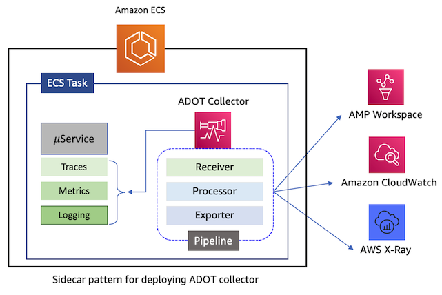
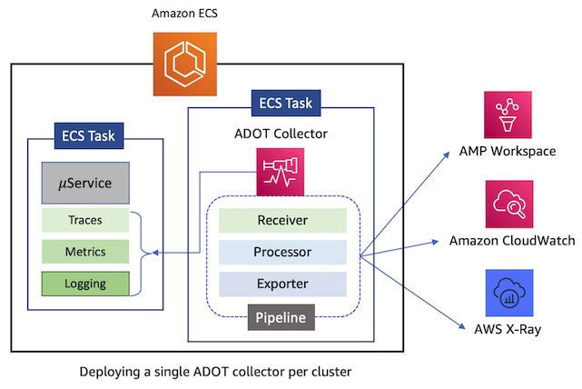

# AWS Distro for OpenTelemetry を使用した ECS クラスターでのシステムメトリクスの収集

[AWS Distro for OpenTelemetry](https://aws-otel.github.io/docs/introduction) (ADOT) は、[OpenTelemetry](https://opentelemetry.io/) プロジェクトの安全で AWS がサポートするディストリビューションです。
ADOT を使用すると、複数のソースからテレメトリデータを収集し、関連付けられたメトリクス、トレース、ログを複数の監視ソリューションに送信できます。
ADOT は Amazon ECS クラスターに 2 つの異なるパターンでデプロイできます。


## ADOT Collector のデプロイパターン
1. サイドカーパターンでは、ADOT コレクターはクラスター内の各タスク内で実行され、そのタスク内のアプリケーションコンテナからのみ収集されたテレメトリデータを処理します。このデプロイパターンは、コレクターが Amazon ECS の [タスクメタデータエンドポイント](https://docs.aws.amazon.com/ja_jp/AmazonECS/latest/developerguide/task-metadata-endpoint.html) からタスクメタデータを読み取り、そこからリソース使用量メトリクス（CPU、メモリ、ネットワーク、ディスクなど）を生成する必要がある場合にのみ必要です。


2. セントラルコレクターパターンでは、ADOT コレクターの単一インスタンスがクラスターにデプロイされ、クラスター上で実行されているすべてのタスクからのテレメトリデータを処理します。これは最も一般的に使用されるデプロイパターンです。コレクターは REPLICA または DAEMON サービススケジューラ戦略を使用してデプロイされます。


ADOT コレクターアーキテクチャにはパイプラインの概念があります。単一のコレクターに複数のパイプラインを含めることができます。各パイプラインは、メトリクス、トレース、ログという 3 種類のテレメトリデータのいずれかを処理することに専念しています。各種類のテレメトリデータに対して複数のパイプラインを設定できます。このような汎用性のあるアーキテクチャにより、単一のコレクターが、そうでなければクラスターにデプロイする必要がある複数のオブザーバビリティエージェントの役割を果たすことができます。これにより、クラスター上のオブザーバビリティエージェントのデプロイメントフットプリントが大幅に削減されます。パイプラインを構成するコレクターの主要コンポーネントは、Receiver、Processor、Exporter の 3 つのカテゴリーにグループ化されています。Extensions と呼ばれる二次的なコンポーネントもあり、これらはコレクターに追加できる機能を提供しますが、パイプラインの一部ではありません。

:::info
    Receivers、Processors、Exporters、Extensions の詳細な説明については、OpenTelemetry の [ドキュメント](https://opentelemetry.io/docs/collector/configuration/#basics) を参照してください。
:::


## ECS タスクメトリクス収集のための ADOT Collector のデプロイ

ECS タスクレベルでリソース使用率メトリクスを収集するには、以下のようなタスク定義を使用して、サイドカーパターンで ADOT コレクターをデプロイする必要があります。コレクターに使用されるコンテナイメージには、複数のパイプライン設定が同梱されています。要件に基づいてそれらの中から 1 つを選択し、コンテナ定義の *command* セクションで設定ファイルのパスを指定できます。この値を `--config=/etc/ecs/container-insights/otel-task-metrics-config.yaml` に設定すると、[パイプライン設定](https://github.com/aws-observability/aws-otel-collector/blob/main/config/ecs/container-insights/otel-task-metrics-config.yaml) が使用され、コレクターと同じタスク内で実行されている他のコンテナからリソース使用率メトリクスとトレースを収集し、Amazon CloudWatch と AWS X-Ray に送信します。具体的には、コレクターは [AWS ECS Container Metrics Receiver](https://github.com/open-telemetry/opentelemetry-collector-contrib/tree/main/receiver/awsecscontainermetricsreceiver) を使用して、[Amazon ECS タスクメタデータエンドポイント](https://docs.aws.amazon.com/ja_jp/AmazonECS/latest/developerguide/task-metadata-endpoint-v4.html) からタスクメタデータと Docker の統計情報を読み取り、それらから CPU、メモリ、ネットワーク、ディスクなどのリソース使用率メトリクスを生成します。

```javascript
{
    "family":"AdotTask",
    "taskRoleArn":"arn:aws:iam::123456789012:role/ECS-ADOT-Task-Role",
    "executionRoleArn":"arn:aws:iam::123456789012:role/ECS-Task-Execution-Role",
    "networkMode":"awsvpc",
    "containerDefinitions":[
       {
          "name":"application-container",
          "image":"..."
       },
       {
          "name":"aws-otel-collector",
          "image":"public.ecr.aws/aws-observability/aws-otel-collector:latest",
          "cpu":512,
          "memory":1024,
          "command": [
            "--config=/etc/ecs/container-insights/otel-task-metrics-config.yaml"
          ],          
          "portMappings":[
             {
                "containerPort":2000,
                "protocol":"udp"
             }
          ],             
          "essential":true
       }
    ],
    "requiresCompatibilities":[
       "EC2"
    ],
    "cpu":"1024",
    "memory":"2048"
 }
```
:::info
    Amazon ECS クラスターにデプロイされる ADOT コレクターが使用する IAM タスクロールとタスク実行ロールの設定の詳細については、[ドキュメント](https://docs.aws.amazon.com/ja_jp/AmazonCloudWatch/latest/monitoring/deploy-container-insights-ECS-adot.html) を参照してください。
:::

:::info
    [AWS ECS Container Metrics Receiver](https://github.com/open-telemetry/opentelemetry-collector-contrib/tree/main/receiver/awsecscontainermetricsreceiver) は ECS タスクメタデータエンドポイント V4 でのみ動作します。プラットフォームバージョン 1.4.0 以降を使用する Fargate 上の Amazon ECS タスク、および Amazon ECS コンテナエージェントのバージョン 1.39.0 以降を実行している Amazon EC2 上の Amazon ECS タスクでこのレシーバーを利用できます。詳細については、[Amazon ECS コンテナエージェントのバージョン](https://docs.aws.amazon.com/ja_jp/AmazonECS/latest/developerguide/ecs-agent-versions.html) を参照してください。
:::

デフォルトの [パイプライン設定](https://github.com/aws-observability/aws-otel-collector/blob/main/config/ecs/container-insights/otel-task-metrics-config.yaml) に示されているように、コレクターのパイプラインはまず [Filter Processor](https://github.com/open-telemetry/opentelemetry-collector-contrib/tree/main/processor/filterprocessor) を使用して、CPU、メモリ、ネットワーク、ディスク使用率に関連する [メトリクスのサブセット](https://github.com/aws-observability/aws-otel-collector/blob/09d59966404c2928aaaf6920f27967a84d898254/config/ecs/container-insights/otel-task-metrics-config.yaml#L25) をフィルタリングします。次に、[Metrics Transform Processor](https://github.com/open-telemetry/opentelemetry-collector-contrib/tree/main/processor/metricstransformprocessor) を使用して、これらのメトリクスの名前を変更し、属性を更新する一連の [変換](https://github.com/aws-observability/aws-otel-collector/blob/09d59966404c2928aaaf6920f27967a84d898254/config/ecs/container-insights/otel-task-metrics-config.yaml#L39) を実行します。最後に、メトリクスは [Amazon CloudWatch EMF Exporter](https://github.com/open-telemetry/opentelemetry-collector-contrib/tree/main/exporter/awsemfexporter) を使用してパフォーマンスログイベントとして CloudWatch に送信されます。このデフォルト設定を使用すると、CloudWatch 名前空間 *ECS/ContainerInsights* の下で以下のリソース使用率メトリクスが収集されます。

- MemoryUtilized
- MemoryReserved
- CpuUtilized
- CpuReserved
- NetworkRxBytes
- NetworkTxBytes
- StorageReadBytes
- StorageWriteBytes

:::info
    これらは [Amazon ECS の Container Insights によって収集されるメトリクス](https://docs.aws.amazon.com/ja_jp/AmazonCloudWatch/latest/monitoring/Container-Insights-metrics-ECS.html) と同じであり、クラスターまたはアカウントレベルで Container Insights を有効にすると CloudWatch ですぐに利用できることに注意してください。したがって、CloudWatch で ECS リソース使用率メトリクスを収集するには、Container Insights を有効にすることが推奨されるアプローチです。
:::

AWS ECS Container Metrics Receiver は、Amazon ECS タスクメタデータエンドポイントから読み取る 52 の固有のメトリクスを出力します。レシーバーによって収集されるメトリクスの完全なリストは [ここにドキュメント化されています](https://github.com/open-telemetry/opentelemetry-collector-contrib/tree/main/receiver/awsecscontainermetricsreceiver#available-metrics)。これらすべてを希望の宛先に送信したくない場合があります。ECS リソース使用率メトリクスをより明示的に制御したい場合は、カスタムパイプライン設定を作成し、選択したプロセッサー/トランスフォーマーを使用して利用可能なメトリクスをフィルタリングおよび変換し、選択したエクスポーターに基づいて宛先に送信できます。ECS タスクレベルのメトリクスを取得するためのパイプライン設定の [追加の例](https://github.com/open-telemetry/opentelemetry-collector-contrib/tree/main/receiver/awsecscontainermetricsreceiver#full-configuration-examples) については、ドキュメントを参照してください。

カスタムパイプライン設定を使用する場合は、以下に示すタスク定義を使用し、サイドカーパターンでコレクターをデプロイできます。ここでは、コレクターパイプラインの設定は AWS SSM パラメータストアの *otel-collector-config* という名前のパラメータから読み込まれます。

:::note
    SSM パラメータストアのパラメータ名は、AOT_CONFIG_CONTENT という名前の環境変数を使用してコレクターに公開する必要があります。
:::

```javascript
{
    "family":"AdotTask",
    "taskRoleArn":"arn:aws:iam::123456789012:role/ECS-ADOT-Task-Role",
    "executionRoleArn":"arn:aws:iam::123456789012:role/ECS-Task-Execution-Role",
    "networkMode":"awsvpc",
    "containerDefinitions":[
       {
          "name":"application-container",
          "image":"..."
       },        
       {
          "name":"aws-otel-collector",
          "image":"public.ecr.aws/aws-observability/aws-otel-collector:latest",
          "cpu":512,
          "memory":1024,
          "secrets":[
             {
                "name":"AOT_CONFIG_CONTENT",
                "valueFrom":"arn:aws:ssm:us-east-1:123456789012:parameter/otel-collector-config"
             }
          ],          
          "portMappings":[
             {
                "containerPort":2000,
                "protocol":"udp"
             }
          ],             
          "essential":true
       }
    ],
    "requiresCompatibilities":[
       "EC2"
    ],
    "cpu":"1024",
    "memory":"2048"
 }
```


## ECS コンテナインスタンスのメトリクス収集のための ADOT Collector のデプロイ

ECS クラスターから EC2 インスタンスレベルのメトリクスを収集するために、ADOT コレクターは以下のようなタスク定義を使用してデプロイできます。デーモンサービススケジューラー戦略を使用してデプロイする必要があります。コンテナイメージにバンドルされたパイプライン設定を選択できます。コンテナ定義の *command* セクションの設定ファイルパスは `--config=/etc/ecs/otel-instance-metrics-config.yaml` に設定する必要があります。コレクターは [AWS Container Insights Receiver](https://github.com/open-telemetry/opentelemetry-collector-contrib/tree/main/receiver/awscontainerinsightreceiver#aws-container-insights-receiver) を使用して、CPU、メモリ、ディスク、ネットワークなど、多くのリソースの EC2 インスタンスレベルのインフラストラクチャメトリクスを収集します。メトリクスは [Amazon CloudWatch EMF Exporter](https://github.com/open-telemetry/opentelemetry-collector-contrib/tree/main/exporter/awsemfexporter) を使用してパフォーマンスログイベントとして CloudWatch に送信されます。この設定でのコレクターの機能は、EC2 でホストされている Amazon ECS クラスターに CloudWatch エージェントをデプロイするのと同等です。

:::info
    EC2 インスタンスレベルのメトリクスを収集するための ADOT Collector のデプロイは、AWS Fargate で実行されている ECS クラスターではサポートされていません。
:::

```javascript
{
    "family":"AdotTask",
    "taskRoleArn":"arn:aws:iam::123456789012:role/ECS-ADOT-Task-Role",
    "executionRoleArn":"arn:aws:iam::123456789012:role/ECS-Task-Execution-Role",
    "networkMode":"awsvpc",
    "containerDefinitions":[
       {
          "name":"application-container",
          "image":"..."
       },
       {
          "name":"aws-otel-collector",
          "image":"public.ecr.aws/aws-observability/aws-otel-collector:latest",
          "cpu":512,
          "memory":1024,
          "command": [
            "--config=/etc/ecs/otel-instance-metrics-config.yaml"
          ],          
          "portMappings":[
             {
                "containerPort":2000,
                "protocol":"udp"
             }
          ],             
          "essential":true
       }
    ],
    "requiresCompatibilities":[
       "EC2"
    ],
    "cpu":"1024",
    "memory":"2048"
 }
```
