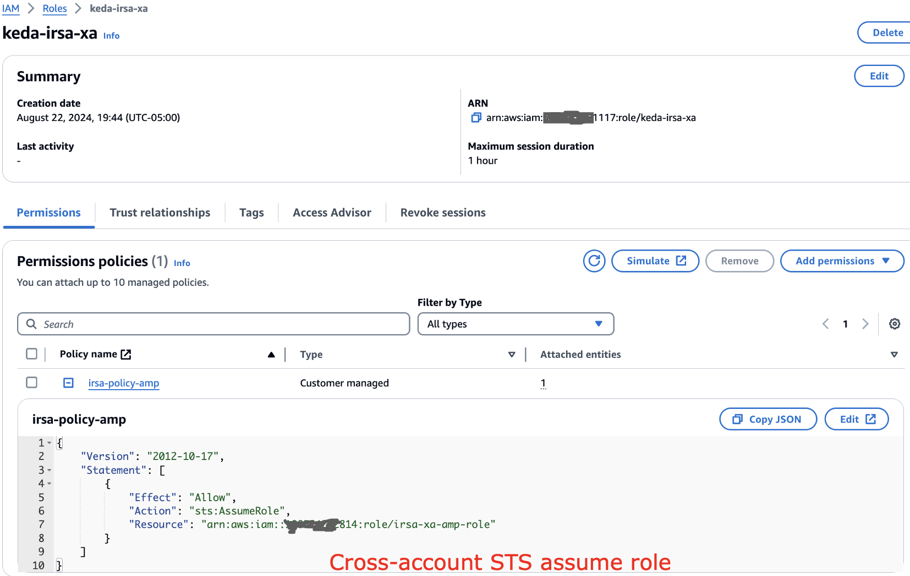
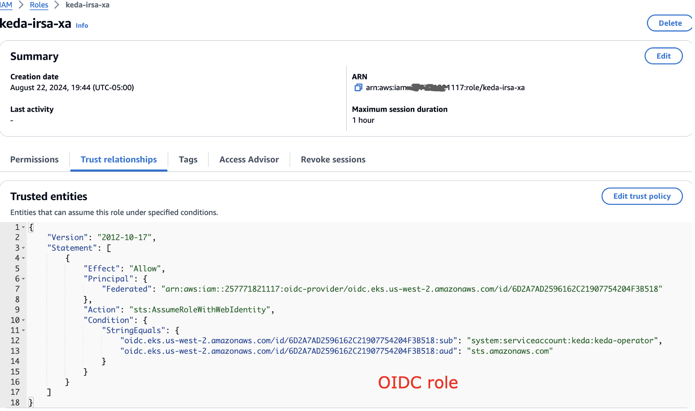
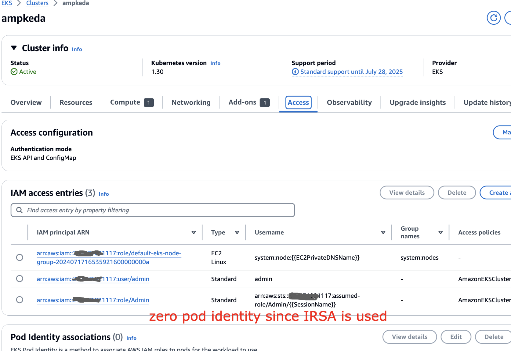
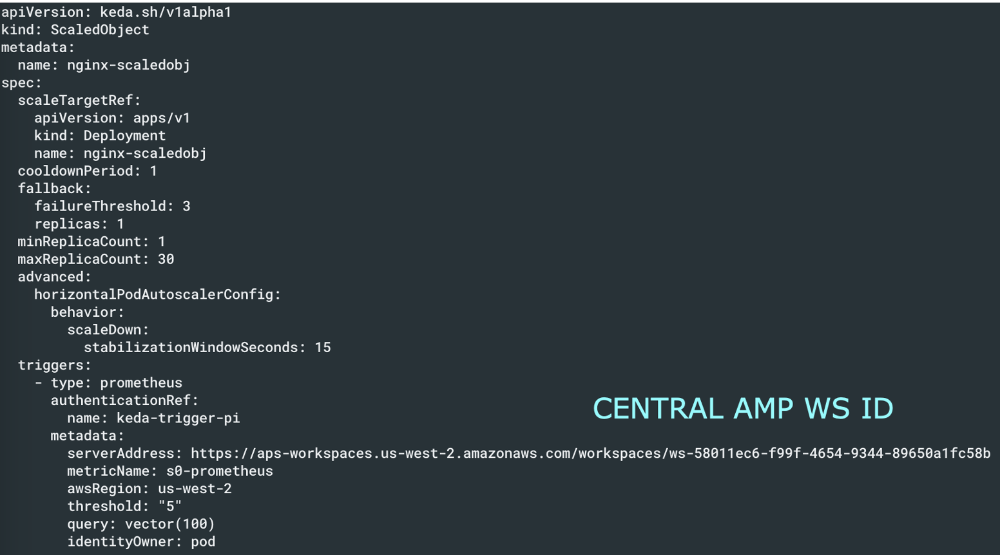

# AMP と EKS 上で KEDA を使用したアプリケーションの自動スケーリング

# 現状の概要

Amazon EKS アプリケーションでのトラフィック増加への対応は課題となっており、手動でのスケーリングは非効率的でエラーが発生しやすい状況です。オートスケーリングはリソース割り当てにおいてより良いソリューションを提供します。KEDA は様々なメトリクスやイベントに基づいて Kubernetes のオートスケーリングを可能にし、一方 Amazon Managed Service for Prometheus は EKS クラスターのセキュアなメトリクス監視を提供します。このソリューションでは、KEDA と Amazon Managed Service for Prometheus を組み合わせ、1 秒あたりのリクエスト数 (RPS) メトリクスに基づくオートスケーリングを実演します。このアプローチにより、ワークロードの需要に合わせた自動スケーリングが実現され、ユーザーは自身の EKS ワークロードに適用できます。Amazon Managed Grafana はスケーリングパターンの監視と可視化に使用され、ユーザーはオートスケーリングの動作に関する洞察を得て、ビジネスイベントと関連付けることができます。

# KEDA を使用した AMP メトリクスに基づくアプリケーションのオートスケーリング

このソリューションは、自動スケーリングパイプラインを作成するための AWS とオープンソースソフトウェアの統合を示しています。
マネージド Kubernetes 用の Amazon EKS、メトリクス収集用の AWS Distro for Open Telemetry (ADOT)、イベント駆動型オートスケーリング用の KEDA、メトリクスストレージ用の Amazon Managed Service for Prometheus、可視化用の Amazon Managed Grafana を組み合わせています。

アーキテクチャには、EKS 上への KEDA のデプロイ、メトリクスをスクレイピングするための ADOT の設定、KEDA ScaledObject によるオートスケーリングルールの定義、スケーリングを監視するための Grafana ダッシュボードの使用が含まれます。

オートスケーリングプロセスは、マイクロサービスへのユーザーリクエストから始まり、ADOT がメトリクスを収集し、Prometheus に送信します。
KEDA は定期的にこれらのメトリクスをクエリし、スケーリングの必要性を判断し、Horizontal Pod Autoscaler (HPA) と連携して Pod のレプリカ数を調整します。

このセットアップにより、Kubernetes マイクロサービスのメトリクス駆動型オートスケーリングが可能になり、さまざまな使用率指標に基づいてスケーリングできる柔軟なクラウドネイティブアーキテクチャを提供します。

# AMP メトリクスを使用した KEDA による EKS アプリケーションのクロスアカウントスケーリング

この例では、KEDA EKS が ID 117 で終わる AWS アカウントで実行されており、中央の AMP アカウント ID が 814 で終わると仮定します。KEDA EKS アカウントで、以下のようにクロスアカウント IAM ロールを設定します：

また、信頼関係を以下のように更新します：

EKS クラスターでは、IRSA が使用されているため、Pod アイデンティティを使用していないことがわかります。

中央の AMP アカウントでは、AMP アクセスを以下のように設定しています。

信頼関係にもアクセスが設定されています。

以下のようにワークスペース ID をメモしておきます。

## KEDA の設定
セットアップが完了したら、以下のように KEDA が実行されていることを確認します。セットアップ手順については、以下に共有されているブログリンクを参照してください。

設定で上記で定義した中央 AMP ロールを使用していることを確認してください。

KEDA スケーラーの設定で、以下のように中央 AMP アカウントを指定します。

これで、Pod が適切にスケールされていることが確認できます。

## ブログ

[https://aws.amazon.com/blogs/mt/autoscaling-kubernetes-workloads-with-keda-using-amazon-managed-service-for-prometheus-metrics/](https://aws.amazon.com/blogs/mt/autoscaling-kubernetes-workloads-with-keda-using-amazon-managed-service-for-prometheus-metrics/)
