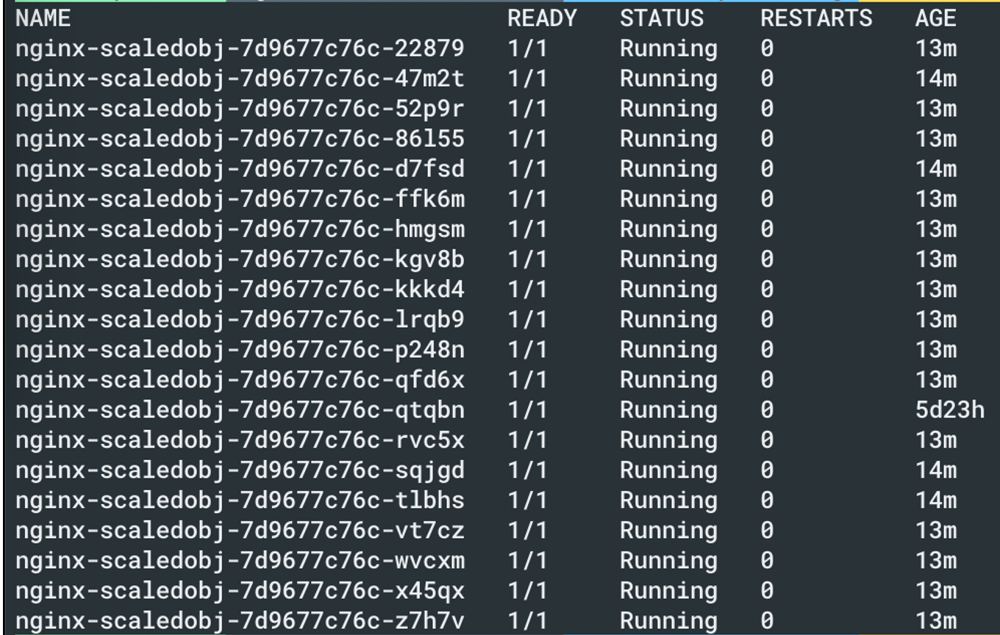

# AMP と EKS で KEDA を使用してアプリケーションを自動スケーリングする

# 現状の課題

Amazon EKS アプリケーションでトラフィックが増加した場合、手動でスケーリングを行うのは非効率で間違いが起こりやすくなります。自動スケーリングは、リソース割り当てにより良い解決策を提供します。KEDA は、さまざまなメトリクスやイベントに基づいて Kubernetes の自動スケーリングを可能にし、Amazon Managed Service for Prometheus は EKS クラスターの安全なメトリクスモニタリングを提供します。このソリューションでは、KEDA と Amazon Managed Service for Prometheus を組み合わせ、Requests Per Second (RPS) メトリクスに基づく自動スケーリングを実現しています。このアプローチにより、ワークロードの需要に合わせた自動スケーリングが可能になり、ユーザーは自身の EKS ワークロードにも適用できます。Amazon Managed Grafana を使用してスケーリングパターンを監視・可視化することで、自動スケーリングの動作を把握し、ビジネスイベントと関連付けることができます。

# AMP メトリクスを使用した KEDA によるアプリケーションの自動スケーリング

このソリューションは、自動スケーリングパイプラインを作成するためのオープンソースソフトウェアと AWS の統合を示しています。マネージド Kubernetes サービスの Amazon EKS、メトリクス収集の AWS Distro for OpenTelemetry (ADOT)、イベント駆動の自動スケーリングの KEDA、メトリクス保存の Amazon Managed Service for Prometheus、可視化の Amazon Managed Grafana を組み合わせています。このアーキテクチャでは、EKS 上に KEDA をデプロイし、ADOT を構成してメトリクスを収集し、KEDA ScaledObject で自動スケーリングルールを定義し、Grafana ダッシュボードを使用してスケーリングを監視します。自動スケーリングプロセスは、マイクロサービスへのユーザーリクエストから始まり、ADOT がメトリクスを収集し、それらを Prometheus に送信します。KEDA は定期的にこれらのメトリクスを照会し、スケーリングの必要性を判断し、Horizontal Pod Autoscaler (HPA) と対話して Pod レプリカを調整します。このセットアップにより、Kubernetes マイクロサービスのメトリクス駆動の自動スケーリングが可能になり、さまざまな利用状況の指標に基づいてスケーリングできる柔軟なクラウドネイティブなアーキテクチャが提供されます。

# AMP メトリクスを使用した KEDA による EKS アプリケーションのクロスアカウントスケーリング
ここでは、KEDA EKS が ID が 117 で終わる AWS アカウントで実行されており、中央の AMP アカウント ID が 814 で終わると想定します。KEDA EKS アカウントで、以下のようにクロスアカウント IAM ロールを設定します。

また、信頼関係を以下のように更新する必要があります。

EKS クラスターでは、ここで IRSA が使用されているため、Pod ID は使用していないことがわかります。

一方、中央の AMP アカウントでは、AMP アクセスが以下のように設定されています。

信頼関係にもアクセスが設定されています。

以下のようにワークスペース ID を控えておきます。

## KEDA の設定
セットアップが完了したら、以下のように KEDA が実行されていることを確認しましょう。セットアップ手順については、下記のブログリンクを参照してください。

設定で上記で定義した中央の AMP ロールを使用することを確認してください。

KEDA スケーラーの設定で、中央の AMP アカウントを以下のように指定します。

そして、今度はポッドが適切にスケーリングされていることがわかります。

## ブログ

[Prometheus メトリクスを使用して KEDA で Kubernetes ワークロードを自動スケーリングする](https://aws.amazon.com/blogs/mt/autoscaling-kubernetes-workloads-with-keda-using-amazon-managed-service-for-prometheus-metrics/)
