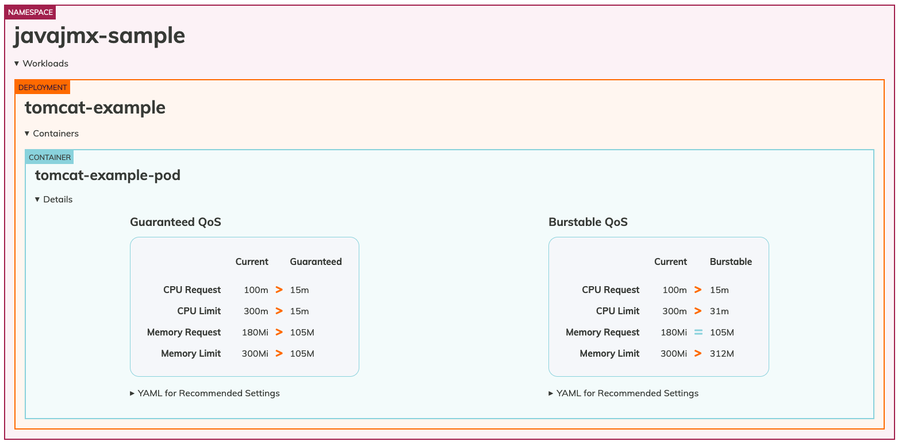

# Kubernetes ワークロードのリソース最適化のベストプラクティス
マイクロサービスベースのアーキテクチャへの移行が進むにつれ、Kubernetes の採用も加速しています。当初の焦点は、アプリケーションをサポートするクラウドネイティブアーキテクチャの設計と構築にありました。環境が拡大するにつれ、お客様からはリソース割り当ての最適化に注目が移ってきています。リソース最適化は、セキュリティに次いで運用チームが最も重要視する課題です。

Kubernetes 環境でのリソース割り当ての最適化とアプリケーションのサイズ調整に関するガイダンスについて説明します。これには、マネージドノードグループ、セルフマネージドノードグループ、AWS Fargate でデプロイされた Amazon EKS 上で実行されるアプリケーションが含まれます。

## Kubernetes 上のアプリケーションのサイズ適正化の理由
Kubernetes では、リソース仕様の設定によってアプリケーションのサイズ適正化が行われます。これらの設定は以下に直接影響します。

* パフォーマンス - 適切なリソース仕様がない場合、Kubernetes アプリケーションはリソースを無秩序に競合します。これによりアプリケーションのパフォーマンスが低下する可能性があります。
* コスト最適化 - 過剰なリソース仕様でデプロイされたアプリケーションは、コストが増加し、インフラストラクチャが十分に活用されません。
* 自動スケーリング - Kubernetes Cluster Autoscaler と Horizontal Pod Autoscaling は機能するためにリソース仕様を必要とします。

Kubernetes で最も一般的なリソース仕様は、[CPU とメモリのリクエストとリミット](https://kubernetes.io/docs/concepts/configuration/manage-resources-containers/#requests-and-limits)です。

## リクエストとリミット

コンテナ化されたアプリケーションは、Kubernetes 上の Pod としてデプロイされます。CPU とメモリのリクエストとリミットは、Pod 定義の任意の部分です。CPU は [Kubernetes CPU](https://kubernetes.io/docs/concepts/configuration/manage-resources-containers/#meaning-of-cpu) 単位で指定され、メモリは通常 [メビバイト (Mi)](https://simple.wikipedia.org/wiki/Mebibyte) としてバイト単位で指定されます。

リクエストとリミットはそれぞれ Kubernetes 内で異なる機能を果たし、スケジューリングとリソース制限に異なる影響を与えます。

## 推奨事項
アプリケーションの所有者は、CPU とメモリのリソース要求に適切な値を選択する必要があります。理想的な方法は、開発環境でアプリケーションの負荷テストを行い、オブザーバビリティツールを使用してリソース使用量を測定することです。これは組織の最も重要なアプリケーションには適していますが、クラスター内で展開されているすべてのコンテナ化されたアプリケーションに対して実施するのは現実的ではありません。ワークロードを最適化し、適切なサイズに調整するのに役立つツールについて説明しましょう。

### Vertical Pod Autoscaler (VPA)
[VPA](https://github.com/kubernetes/autoscaler/tree/master/vertical-pod-autoscaler) は、Autoscaling 特別関心グループ (SIG) が所有する Kubernetes サブプロジェクトです。観測されたアプリケーションのパフォーマンスに基づいて、自動的に Pod のリクエストを設定するように設計されています。VPA はデフォルトで [Kubernetes Metric Server](https://github.com/kubernetes-sigs/metrics-server) を使用してリソース使用量を収集しますが、オプションで Prometheus をデータソースとして使用するように構成できます。

VPA には、アプリケーションのパフォーマンスを測定し、サイズ設定の推奨を行うための推奨エンジンがあります。VPA 推奨エンジンはスタンドアロンでデプロイできるため、VPA は自動スケーリングアクションを実行しません。各アプリケーションに対して VerticalPodAutoscaler カスタムリソースを作成して構成し、VPA がオブジェクトの status フィールドにリソースサイズの推奨を更新します。

クラスター内のすべてのアプリケーションに対して VerticalPodAutoscaler オブジェクトを作成し、JSON 結果を読み解釈することは、大規模な環境では難しい作業です。[Goldilocks](https://github.com/FairwindsOps/goldilocks) はこれを簡単にするオープンソースプロジェクトです。

### Goldilocks
Goldilocks は、Fairwinds のオープンソースプロジェクトで、組織が Kubernetes アプリケーションのリソース要求を「ちょうどよい」状態にするのを支援するように設計されています。Goldilocks のデフォルト設定はオプトインモデルです。監視対象のワークロードを選択するには、名前空間に goldilocks.fairwinds.com/enabled: true ラベルを付けます。


Metrics Server は、ワーカーノードで実行されている Kubelet からリソースメトリクスを収集し、Vertical Pod Autoscaler が使用できるように Metrics API を通してそれらを公開します。Goldilocks コントローラーは goldilocks.fairwinds.com/enabled: true ラベルが付いた名前空間を監視し、それらの名前空間内の各ワークロードに対して VerticalPodAutoscaler オブジェクトを作成します。

リソース推奨を有効にするには、次のコマンドを実行します。

```
kubectl create ns javajmx-sample
kubectl label ns javajmx-sample goldilocks.fairwinds.com/enabled=true
```

Amazon EKS クラスターに Goldilocks をデプロイするには、次のコマンドを実行します。

```
helm repo add fairwinds-stable https://charts.fairwinds.com/stable
helm upgrade --install goldilocks fairwinds-stable/goldilocks --namespace goldilocks --create-namespace --set vpa.enabled=true
```

Goldilocks ダッシュボードはポート 8080 でダッシュボードを公開し、リソース推奨を確認できます。ダッシュボードにアクセスするには、次のコマンドを実行します。

```
kubectl -n goldilocks port-forward svc/goldilocks-dashboard 8080:80
```
次に、ブラウザで http://localhost:8080 を開きます。


サンプルの名前空間を分析して、Goldilocks が提供する推奨を確認しましょう。デプロイメントに対する推奨が表示されるはずです。


javajmx-sample ワークロードの要求と制限の推奨が表示されます。各 Quality of Service (QoS) の Current 列は、現在設定されている CPU とメモリの要求と制限を示しています。Guranteed と Burstable 列は、それぞれの QoS に対する推奨の CPU とメモリの要求と制限を示しています。

リソースをオーバープロビジョニングしており、Goldilocks が CPU とメモリ要求を最適化するための推奨を行っていることがはっきりと分かります。Guranteed QoS の CPU 要求と制限は 15m と 15m に、メモリ要求と制限は 105M と 105M に推奨されています。これは、現在の 100m と 300m、180Mi と 300Mi に比べて大幅に削減されています。
興味のある QoS クラスのマニフェストファイルをコピーし、ライトサイズ化され最適化されたワークロードをデプロイすることができます。

### cAdvisor メトリクスを使用したスロットリングの理解とリソースの適切な設定

制限を設定する際、特定のコンテナ化されたアプリケーションが特定の期間中に実行できる時間をLinuxノードに指示しています。これは、ノード上の他のワークロードが、プロセスの集合から不当に多くのCPUサイクルを取得されるのを防ぐためです。マザーボード上の複数の物理的な「コア」を定義しているわけではありません。しかし、単一コンテナ内のプロセスまたはスレッドのグループが、他のアプリケーションを圧倒しないように一時的にコンテナを一時停止する前に実行できる時間を設定しています。

`container_cpu_cfs_throttled_seconds_total` という便利な cAdvisor メトリクスがあり、スロットリングされたすべての 5 ms スライスを合計し、プロセスがクォータを超えている程度を示します。このメトリクスは秒単位なので、値を 10 で割ると 100 ms になり、これがコンテナに関連する実際の時間になります。

100 ms の時間でトップ 3 の Pod の CPU 使用率を理解するための PromQl クエリ:

```
topk(3, max by (pod, container)(rate(container_cpu_usage_seconds_total{image!="", instance="$instance"}[$__rate_interval]))) / 10
```

400 ms の vCPU 使用量が観測されました。


PromQL は 1 秒あたりのスロットリング値を示しますが、1 秒に 10 期間があります。期間あたりのスロットリングを知るには、10 で割ります。制限設定をどの程度増やせばよいかを知りたい場合は、10 を掛けます (例: 400 ms * 10 = 4000 m)。

上記のツールはリソース最適化の機会を特定する方法を提供しますが、アプリケーションチームは、特定のアプリケーションが CPU/メモリ集約型かどうかを特定し、スロットリング/過剰プロビジョニングを防ぐためにリソースを割り当てる時間を費やす必要があります。
