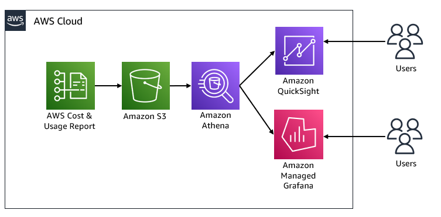

# AWS オブザーバビリティサービスとコスト

オブザーバビリティスタックに投資する際、オブザーバビリティ製品の**コスト**を定期的に監視することが重要です。これにより、必要なコストのみを発生させ、不要なリソースに過剰な支出をしていないことを確認できます。

## コスト最適化のための AWS ツール

多くの組織の主な焦点は、クラウド上で IT インフラストラクチャをスケーリングすることにあります。しかし、通常はそれが制御されておらず、準備不足で、実際のクラウド支出や今後の支出について認識していません。時間の経過とともにコストを追跡、報告、分析するのに役立つように、AWS はいくつかのコスト最適化ツールを提供しています：

[AWS Cost Explorer][cost-explorer] – 時間の経過とともに AWS の支出パターンを確認し、将来のコストを予測し、さらなる調査が必要な領域を特定し、リザーブドインスタンスの使用状況を観察し、リザーブドインスタンスのカバレッジを観察し、リザーブドインスタンスの推奨事項を受け取ることができます。

[AWS コストと使用状況レポート (CUR)][CUR] – アカウント全体の AWS の時間単位の使用状況を詳細に示す生データファイルで、Do-It-Yourself (DIY) 分析に使用されます。AWS コストと使用状況レポートには、使用しているサービスに応じて動的に変化する列があります。

## アーキテクチャの概要：AWS コストと使用状況レポートの可視化

AWS のコストと使用状況のダッシュボードは、Amazon Managed Grafana または Amazon QuickSight で構築できます。以下のアーキテクチャ図は、両方のソリューションを示しています。

*アーキテクチャ図*

## Cloud Intelligence Dashboards

[Cloud Intelligence Dashboards][cid] は、AWS コストと使用状況レポート (CUR) を基に構築された [Amazon QuickSight][quicksight] ダッシュボードのコレクションです。これらのダッシュボードは、独自のコスト管理と最適化 (FinOps) ツールとして機能します。詳細で粒度の高い、推奨事項に基づいたダッシュボードを通じて、AWS の使用状況とコストの詳細なビューを得ることができます。

### 実装

1. [Amazon Athena][amazon-athnea] との統合を有効にした [CUR レポート][cur-report] を作成します。
*初期設定時、AWS が Amazon S3 バケットにレポートの配信を開始するまでに最大 24 時間かかる場合があります。レポートは 1 日 1 回配信されます。Cost and Usage Reports と Athena の統合を効率化および自動化するために、AWS は Athena 統合用に設定したレポートとともにいくつかの主要リソースを含む AWS CloudFormation テンプレートを提供しています。*

2. [AWS CloudFormation テンプレート][cloudformation] をデプロイします。
*このテンプレートには、AWS Glue クローラー、AWS Glue データベース、AWS Lambda イベントが含まれています。この時点で、CUR データは Amazon Athena のテーブルを通じてクエリ可能になります。*

    - [Amazon Athena][athena-query] を使用して CUR データに対して直接クエリを実行します。
*Athena クエリをデータに対して実行するには、まず Athena コンソールを使用して AWS がデータを更新中かどうかを確認し、その後 Athena コンソールでクエリを実行します。*

3. Cloud Intelligence ダッシュボードをデプロイします。
    - 手動デプロイについては、AWS Well-Architected の **[コスト最適化ラボ][cost-optimization-lab]** を参照してください。
    - 自動デプロイについては、[GitHub リポジトリ][GitHub-repo] を参照してください。

Cloud Intelligence ダッシュボードは、財務チーム、経営陣、IT マネージャーにとって優れたツールです。しかし、顧客からよく寄せられる質問の 1 つは、Amazon CloudWatch、AWS X-Ray、Amazon Managed Service for Prometheus、Amazon Managed Grafana などの個々の AWS オブザーバビリティ製品の組織全体のコストについての洞察を得る方法です。

次のセクションでは、これらの各製品のコストと使用状況について詳しく説明します。あらゆる規模の企業が、パフォーマンスへの影響や運用上のオーバーヘッドなしに、このプロアクティブなクラウドコスト最適化戦略を採用し、クラウドコスト分析とデータ駆動型の意思決定を通じてビジネス効率を向上させることができます。

[cost-explorer]: https://docs.aws.amazon.com/ja_jp/awsaccountbilling/latest/aboutv2/ce-what-is.html
[CUR]: https://docs.aws.amazon.com/ja_jp/cur/latest/userguide/what-is-cur.html
[cid]: https://wellarchitectedlabs.com/cost/200_labs/200_cloud_intelligence/
[quicksight]: https://aws.amazon.com/jp/quicksight/
[cur-report]: https://docs.aws.amazon.com/ja_jp/cur/latest/userguide/cur-create.html
[amazon-athnea]: https://aws.amazon.com/jp/athena/
[cloudformation]: https://docs.aws.amazon.com/ja_jp/cur/latest/userguide/use-athena-cf.html
[athena-query]: https://docs.aws.amazon.com/ja_jp/cur/latest/userguide/cur-ate-run.html
[cost-optimization-lab]: https://www.wellarchitectedlabs.com/cost/200_labs/200_cloud_intelligence/
[GitHub-repo]: https://github.com/aws-samples/aws-cudos-framework-deployment
