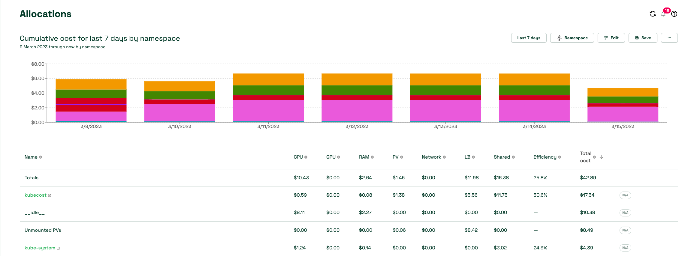
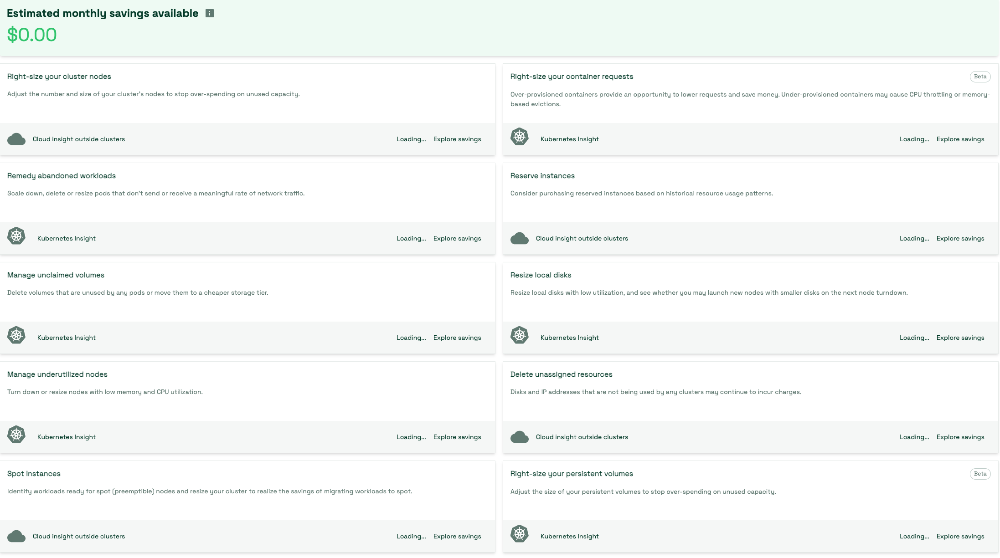

# Kubecost の使用
Kubecost は、Kubernetes 環境での支出とリソース効率の可視化をユーザーに提供します。概して、Amazon EKS のコスト監視は Kubecost とともにデプロイされ、オープンソースのモニタリングシステムおよび時系列データベースである Prometheus が含まれます。Kubecost は Prometheus からメトリクスを読み取り、コスト割り当て計算を実行し、メトリクスを Prometheus に書き戻します。最後に、Kubecost フロントエンドが Prometheus からメトリクスを読み取り、Kubecost ユーザーインターフェイス (UI) に表示します。このアーキテクチャは次の図で示されています。


## Kubecost を使用する理由
お客様がアプリケーションをモダナイズし、Amazon EKS を使用してワークロードをデプロイすると、アプリケーションの実行に必要なコンピューティングリソースを統合することで効率化が図れます。しかし、この利用効率の向上は、アプリケーションコストの測定が困難になるというトレードオフがあります。現在、テナントごとにコストを分配するには、次のいずれかの方法を使用できます。

* ハードマルチテナンシー - 専用の AWS アカウントで個別の EKS クラスターを実行します。
* ソフトマルチテナンシー - 共有 EKS クラスター内で複数のノードグループを実行します。
* 消費ベースの課金 - 共有 EKS クラスター内で発生したコストを、リソース消費量に基づいて計算します。

ハードマルチテナンシーでは、ワークロードが個別の EKS クラスターにデプロイされるため、各テナントの支出を判断するためのレポートを実行することなく、クラスターとその依存関係に発生したコストを特定できます。
ソフトマルチテナンシーでは、[Node Selectors](https://kubernetes.io/docs/concepts/scheduling-eviction/assign-pod-node/#nodeselector) や [Node Affinity](https://kubernetes.io/docs/concepts/scheduling-eviction/assign-pod-node/#affinity-and-anti-affinity) などの Kubernetes 機能を使用して、Kubernetes スケジューラにテナントのワークロードを専用ノードグループ上で実行するよう指示できます。ノードグループの EC2 インスタンスに識別子 (製品名やチーム名など) を付けてタグ付けし、[タグ](https://docs.aws.amazon.com/ja_jp/awsaccountbilling/latest/aboutv2/cost-alloc-tags.html) を使ってコストを分配できます。
上記 2 つのアプローチの欠点は、未使用の容量が発生する可能性があり、密に詰め込まれたクラスターを実行する際に得られるコスト削減のメリットを最大限に活用できない点です。Elastic Load Balancing やネットワーク転送料金などの共有リソースのコストを割り当てる方法も必要です。

マルチテナント Kubernetes クラスターでコストを追跡する最も効率的な方法は、ワークロードが消費したリソースの量に基づいてコストを分配することです。このパターンを使用すると、異なるワークロードがノードを共有できるため、ノード上の Pod 密度を高めることができ、EC2 インスタンスの利用率を最大化できます。しかし、ワークロードやネームスペースごとにコストを計算することは難しい課題です。ワークロードのコスト責任を理解するには、一定期間に消費または予約されたすべてのリソースを集計し、リソースのコストと使用期間に基づいて料金を評価する必要があります。これが、Kubecost が取り組んでいる課題そのものです。

tip
    Kubecost の実践的な経験を得るには、[One Observability ワークショップ](https://catalog.workshops.aws/observability/en-US/aws-managed-oss/amp/ingest-kubecost-metrics) をご覧ください。


## 推奨事項

### コスト割り当て
Kubecost のコスト割り当てダッシュボードを使用すると、namespace、k8s ラベル、サービスなどの Kubernetes ネイティブコンセプト全体にわたる割り当て済み支出と最適化の機会を素早く確認できます。また、チーム、製品/プロジェクト、部門、環境などの組織概念にコストを割り当てることもできます。日付範囲やフィルタを変更して、特定のワークロードに関する洞察を得たり、レポートを保存したりできます。Kubernetes のコストを最適化するには、効率とクラスターのアイドルコストに注目する必要があります。



### 効率性

Pod リソースの効率性は、一定の時間枠内におけるリソース使用量とリソース要求の比率として定義されます。コストで加重されており、次のように表すことができます。

```
(((CPU Usage / CPU Requested) * CPU Cost) + ((RAM Usage / RAM Requested) * RAM Cost)) / (RAM Cost + CPU Cost)
```

ここで、CPU 使用量 = 時間枠内の rate(container_cpu_usage_seconds_total)、RAM 使用量 = 時間枠内の avg(container_memory_working_set_bytes)

AWS では明示的な RAM、CPU、GPU の価格が提供されていないため、Kubecost モデルは基本の CPU、GPU、RAM 価格入力の比率に代わります。これらのパラメータのデフォルト値は、クラウドプロバイダーの限界リソース料金に基づいていますが、Kubecost 内でカスタマイズすることができます。これらの基本リソース (RAM/CPU/GPU) の価格は、プロバイダーの課金レートに基づいて、各コンポーネントの合計がプロビジョニングされたノードの総価格と等しくなるように正規化されています。

各サービスチームは、最大の効率性を目指し、ワークロードを細かく調整してその目標を達成する責任があります。

### アイドルコスト
クラスターのアイドルコストとは、割り当てられたリソースのコストとそれらが実行されるハードウェアのコストの差と定義されます。割り当ては、使用量とリクエストの最大値として定義されます。以下のように表すこともできます。
```
idle_cost = sum(node_cost) - (cpu_allocation_cost + ram_allocation_cost + gpu_allocation_cost)
```
ここで、割り当て = max(リクエスト、使用量)

したがって、アイドルコストは、Kubernetes スケジューラが既存のワークロードを中断することなくポッドをスケジュールできるスペースのコストとも考えられますが、現在はそうなっていません。ワークロード、クラスター、ノードごとに分配できます。設定方法によって異なります。

### ネットワークコスト

Kubecost は、ネットワーク転送コストを生成するワークロードにそのコストを割り当てるためのベストエフォートを行います。ネットワークコストを正確に判断する方法は、[AWS Cloud Integration](https://docs.kubecost.com/install-and-configure/install/cloud-integration/aws-cloud-integrations) と [Network costs daemonset](https://docs.kubecost.com/install-and-configure/advanced-configuration/network-costs-configuration) の組み合わせを使用することです。

効率スコアとアイドルコストを考慮して、ワークロードを微調整し、クラスターを最大限に活用することが重要です。これにより、次のトピックであるクラスターのサイズ調整に移ることができます。

### ワークロードの適正化

Kubecost は、Kubernetes ネイティブのメトリクスに基づいて、ワークロードの適正化に関する推奨事項を提供します。kubecost UI の Savings パネルは、適正化を始めるのに最適な場所です。




Kubecost は以下の点について推奨事項を提供できます。

* コンテナリクエストの過剰プロビジョニングと不足プロビジョニングの両方を考慮したコンテナリクエストの適正化
* 未使用の容量への過剰支出を停止するためのクラスターノードの数とサイズの調整
* 有意な量のトラフィックを送受信しないポッドのスケールダウン、削除、リサイズ
* スポットノードに適したワークロードの特定
* どのポッドからも使用されていないボリュームの特定

Kubecost には、Cluster Controller コンポーネントが有効になっている場合、コンテナリソースリクエストに関する推奨事項を自動的に実装する機能もあります。自動リクエスト適正化を使用すると、過剰な YAML やわずらわしい kubectl コマンドをテストすることなく、クラスター全体でリソース割り当ての最適化を即座に行えます。クラスター内のリソースの過剰割り当てを簡単に排除でき、クラスターの適正化やその他の最適化による大幅な節約の道が開かれます。

### Amazon Managed Service for Prometheus と Kubecost の統合

Kubecost は、オープンソースの Prometheus プロジェクトを時系列データベースとして利用し、Prometheus 内のデータを後処理してコスト割り当て計算を行います。クラスターのサイズやワークロードのスケールによっては、Prometheus サーバーがメトリクスをスクレイピングおよび保存することが過剰な負荷になる可能性があります。そのような場合は、管理対象の Prometheus 互換のモニタリングサービスである Amazon Managed Service for Prometheus を使用して、メトリクスを確実に保存し、大規模な Kubernetes コストを簡単に監視できるようにします。

[Kubecost サービスアカウントの IAM ロール](https://docs.aws.amazon.com/ja_jp/eks/latest/userguide/iam-roles-for-service-accounts.html)をセットアップする必要があります。クラスターの OIDC プロバイダーを使用して、クラスターのサービスアカウントに IAM 権限を付与します。kubecost-cost-analyzer と kubecost-prometheus-server サービスアカウントに適切な権限を付与する必要があります。これらは、ワークスペースからメトリクスを送受信するために使用されます。コマンドラインで次のコマンドを実行します。

```
eksctl create iamserviceaccount \ 
--name kubecost-cost-analyzer \ 
--namespace kubecost \ 
--cluster <CLUSTER_NAME> \
--region <REGION> \ 
--attach-policy-arn arn:aws:iam::aws:policy/AmazonPrometheusQueryAccess \ 
--attach-policy-arn arn:aws:iam::aws:policy/AmazonPrometheusRemoteWriteAccess \ 
--override-existing-serviceaccounts \ 
--approve 

eksctl create iamserviceaccount \ 
--name kubecost-prometheus-server \ 
--namespace kubecost \ 
--cluster <CLUSTER_NAME> --region <REGION> \ 
--attach-policy-arn arn:aws:iam::aws:policy/AmazonPrometheusQueryAccess \ 
--attach-policy-arn arn:aws:iam::aws:policy/AmazonPrometheusRemoteWriteAccess \ 
--override-existing-serviceaccounts \ 
--approve

```
`CLUSTER_NAME` は Kubecost をインストールする Amazon EKS クラスターの名前で、"REGION" は Amazon EKS クラスターのリージョンです。

完了したら、次のように Kubecost の Helm チャートをアップグレードする必要があります。
```
helm upgrade -i kubecost \
oci://public.ecr.aws/kubecost/cost-analyzer --version <$VERSION> \
--namespace kubecost --create-namespace \
-f https://tinyurl.com/kubecost-amazon-eks \
-f https://tinyurl.com/kubecost-amp \
--set global.amp.prometheusServerEndpoint=${QUERYURL} \
--set global.amp.remoteWriteService=${REMOTEWRITEURL}
```
</region></cluster_name></region></cluster_name>

### Kubecost UI へのアクセス

Kubecost には Web ダッシュボードがあり、kubectl port-forward、Ingress、ロードバランサーのいずれかを通じてアクセスできます。Kubecost のエンタープライズ版では、ダッシュボードへのアクセスを [SSO/SAML](https://docs.kubecost.com/install-and-configure/advanced-configuration/user-management-oidc) で制限し、アクセスレベルを変更することもできます。たとえば、チームの閲覧を担当製品のみに制限することができます。

AWS 環境では、Kubecost を公開するために [AWS Load Balancer Controller](https://docs.aws.amazon.com/ja_jp/eks/latest/userguide/aws-load-balancer-controller.html) を使用し、認証、認可、ユーザー管理には [Amazon Cognito](https://aws.amazon.com/jp/cognito/) を使用することを検討してください。詳細は、[How to use Application Load Balancer and Amazon Cognito to authenticate users for your Kubernetes web apps](https://aws.amazon.com/blogs/containers/how-to-use-application-load-balancer-and-amazon-cognito-to-authenticate-users-for-your-kubernetes-web-apps/) をご覧ください。

### マルチクラスタービュー

FinOps チームは、EKS クラスタをレビューし、ビジネスオーナーに推奨事項を共有したいと考えています。大規模に運用する場合、各クラスタにログインして推奨事項を確認するのは困難になります。マルチクラスタを使用すると、グローバルにすべてのクラスタコストを集約したシングルペインのガラスビューを持つことができます。Kubecost では、複数のクラスタ環境に対して、Kubecost Free、Kubecost Business、Kubecost Enterprise の 3 つのオプションをサポートしています。Free モードと Business モードでは、クラウド請求の照合は各クラスタレベルで実行されます。Enterprise モードでは、クラウド請求の照合は、Kubecost UI を提供する主要クラスタと、メトリクスが格納される共有バケットで実行されます。
メトリクスの保持期間が無制限になるのは、Enterprise モードを使用する場合のみであることに注意が必要です。

### 参考資料
* [One Observability ワークショップでの Kubecost ハンズオンエクスペリエンス](https://catalog.workshops.aws/observability/en-US/aws-managed-oss/amp/ingest-kubecost-metrics)
* [ブログ - Kubecost を Amazon Managed Service for Prometheus と統合する](https://aws.amazon.com/blogs/mt/integrating-kubecost-with-amazon-managed-service-for-prometheus/)
