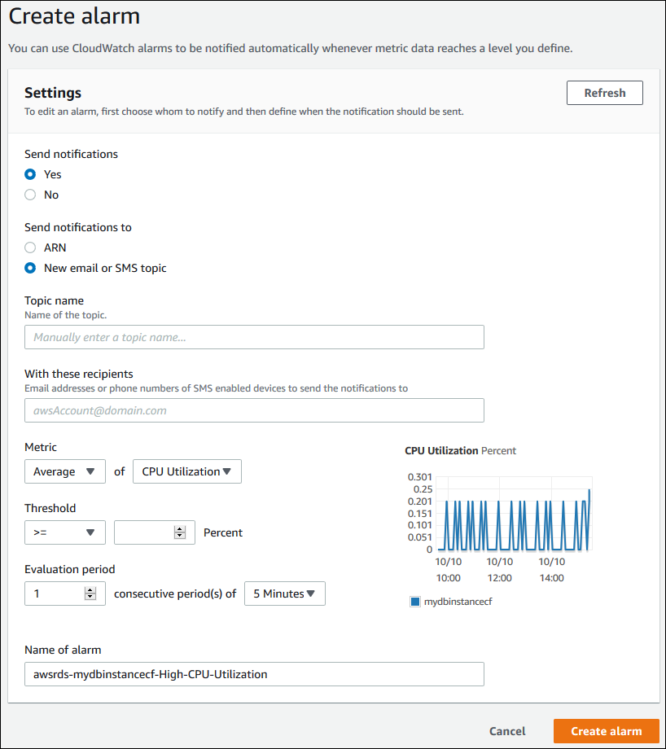
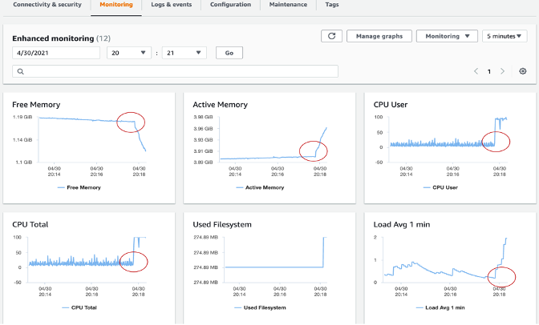
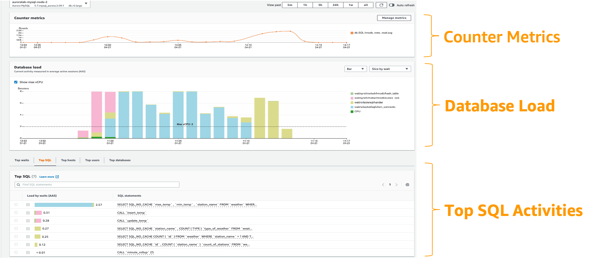

# Amazon RDS と Aurora データベースを監視する

監視は、Amazon RDS と Aurora データベースクラスターの信頼性、可用性、パフォーマンスを維持する上で重要な部分です。AWS では、Amazon RDS と Aurora データベースリソースの正常性を監視し、重大な問題が発生する前に問題を検出し、一貫したユーザーエクスペリエンスを実現するためのパフォーマンスを最適化するためのツールをいくつか提供しています。このガイドでは、データベースが円滑に実行されるようにするための監視のベストプラクティスを紹介します。

## パフォーマンスのガイドライン

ベストプラクティスとして、ワークロードのベースラインパフォーマンスを確立することから始めます。DB インスタンスを設定し、典型的なワークロードを実行したら、すべてのパフォーマンスメトリクスの平均値、最大値、最小値をキャプチャします。これを複数の異なる間隔 (例: 1 時間、24 時間、1 週間、2 週間) で行います。これにより、通常の状態がわかります。ピーク時とオフピーク時の両方の比較を行うと役立ちます。次に、この情報を使って、パフォーマンスが標準レベルを下回っているかどうかを特定できます。

## モニタリングオプション

### Amazon CloudWatch メトリクス

[Amazon CloudWatch](https://docs.aws.amazon.com/ja_jp/AmazonRDS/latest/UserGuide/monitoring-cloudwatch.html) は、[RDS](https://aws.amazon.com/jp/rds/) および [Aurora](https://aws.amazon.com/jp/rds/aurora/) データベースを監視および管理するための重要なツールです。
データベースのパフォーマンスに関する貴重な洞察を提供し、問題を迅速に特定して解決するのに役立ちます。
Amazon RDS と Aurora データベースの両方が、1 分間隔で CloudWatch にメトリクスを送信します。
監視は既定で有効になっており、メトリクスは 15 日間利用できます。
RDS と Aurora は、**AWS/RDS** 名前空間で Amazon CloudWatch にインスタンスレベルのメトリクスを公開します。

CloudWatch メトリクスを使用すると、データベースのパフォーマンスにおける傾向やパターンを特定し、この情報を使用して構成を最適化し、アプリケーションのパフォーマンスを向上させることができます。
監視する主なメトリクスは次のとおりです。

* **CPU 使用率** - 使用されているコンピューティング処理能力の割合。
* **DB 接続数** - DB インスタンスに接続されているクライアントセッションの数。
インスタンスのパフォーマンスとレスポンスタイムの低下と併せて、ユーザー接続数が多い場合は、データベース接続を制限することを検討してください。
DB インスタンスに最適なユーザー接続数は、インスタンスクラスと実行される操作の複雑さによって異なります。
データベース接続数を確認するには、DB インスタンスをパラメータグループに関連付けます。
* **解放可能メモリ** - DB インスタンスで使用可能な RAM の量 (メガバイト単位)。
監視タブのメトリクスでは、CPU、メモリ、ストレージのメトリクスに対して赤線が 75% の位置に引かれています。
インスタンスのメモリ消費がこの線を頻繁に超えている場合は、ワークロードを確認するか、インスタンスをアップグレードする必要があります。
* **ネットワークスループット** - DB インスタンスへの送受信ネットワークトラフィックの速度 (バイト/秒)。
* **読み取り/書き込み待ち時間** - 読み取りまたは書き込み操作の平均時間 (ミリ秒単位)。
* **読み取り/書き込み IOPS** - 1 秒あたりのディスク読み取りまたは書き込み操作の平均数。
* **空きストレージ容量** - DB インスタンスで現在使用されていないディスク容量 (メガバイト単位)。
使用済みディスク容量が全体の 85% 以上を常に占めている場合は、ディスク容量の消費を調査してください。
インスタンスからデータを削除するか、別のシステムにデータをアーカイブして、空き容量を確保できるかどうかを確認します。


パフォーマンス関連の問題のトラブルシューティングでは、最初に最も使用されている高価なクエリを調整します。
調整することでシステムリソースへの負荷が軽減されるかどうかを確認します。
詳細については、[クエリの調整](https://docs.aws.amazon.com/ja_jp/AmazonRDS/latest/UserGuide/CHAP_BestPractices.html) を参照してください。

クエリが調整されていても問題が解決されない場合は、データベースインスタンスクラスをアップグレードすることを検討してください。
リソース (CPU、RAM、ディスク容量、ネットワーク帯域幅、I/O 容量) を増やしたインスタンスにアップグレードできます。

次に、これらのメトリクスが重要なしきい値に達したときに警告を出すアラームを設定し、発生した問題をできるだけ早く解決するための対策を講じることができます。

CloudWatch メトリクスの詳細については、[Amazon RDS の Amazon CloudWatch メトリクス](https://docs.aws.amazon.com/ja_jp/AmazonRDS/latest/UserGuide/rds-metrics.html) および [CloudWatch コンソールと AWS CLI での DB インスタンスメトリクスの表示](https://docs.aws.amazon.com/ja_jp/AmazonRDS/latest/UserGuide/metrics_dimensions.html) を参照してください。

#### CloudWatch Logs Insights

[CloudWatch Logs Insights](https://docs.aws.amazon.com/ja_jp/AmazonCloudWatch/latest/logs/AnalyzingLogData.html) では、Amazon CloudWatch Logs のログデータを対話的に検索および分析できます。
クエリを実行することで、運用上の問題に効率的かつ効果的に対応できます。
問題が発生した場合、CloudWatch Logs Insights を使用して、潜在的な原因を特定し、デプロイされた修正を検証できます。

RDS または Aurora データベースクラスターからログを CloudWatch に公開する方法については、[Publish logs for Amazon RDS or Aurora for MySQL instances to CloudWatch](https://repost.aws/knowledge-center/rds-aurora-mysql-logs-cloudwatch) を参照してください。

RDS または Aurora のログを CloudWatch で監視する詳細については、[Monitoring Amazon RDS log file](https://docs.aws.amazon.com/ja_jp/AmazonRDS/latest/UserGuide/USER_LogAccess.html) を参照してください。

#### CloudWatch アラーム

データベースクラスターのパフォーマンスが低下したときを特定するために、主要なパフォーマンスメトリクスを定期的に監視し、アラートを設定する必要があります。[Amazon CloudWatch アラーム](https://docs.aws.amazon.com/ja_jp/AmazonCloudWatch/latest/monitoring/AlarmThatSendsEmail.html)を使用すると、指定した期間にわたり単一のメトリクスを監視できます。メトリクスが特定のしきい値を超えた場合、Amazon SNS トピックまたは AWS Auto Scaling ポリシーに通知が送信されます。CloudWatch アラームは、特定の状態にあるからといって単純にアクションを呼び出すわけではありません。むしろ、状態が変化し、指定された期間数にわたって維持されている必要があります。アラームはアラームの状態が変化したときのみアクションを呼び出します。アラーム状態にあるだけでは不十分です。

CloudWatch アラームを設定するには:

* AWS マネジメントコンソールに移動し、[https://console.aws.amazon.com/rds/](https://console.aws.amazon.com/rds/) で Amazon RDS コンソールを開きます。
* ナビゲーションペインで [データベース] を選択し、DB インスタンスを選択します。
* [ログとイベント] を選択します。

CloudWatch アラームのセクションで、[アラームの作成] を選択します。



* [通知を送信する] で [はい] を選択し、[通知先] で [新しい電子メールまたは SMS トピック] を選択します。
* [トピック名] に通知の名前を入力し、[受信者] にカンマ区切りのメールアドレスと電話番号のリストを入力します。
* [メトリック] で、アラーム統計とメトリックを設定します。
* [しきい値] で、メトリックがしきい値より大きい、小さい、または等しいかを指定し、しきい値を指定します。
* [評価期間] で、アラームの評価期間を選択します。[連続期間] で、アラームをトリガーするためにしきい値に達している必要がある期間を選択します。
* [アラーム名] にアラームの名前を入力します。
* [アラームの作成] を選択します。

アラームが CloudWatch アラームのセクションに表示されます。

Multi-AZ DB クラスターのレプリカの遅延に対する Amazon CloudWatch アラームを作成する[例](https://docs.aws.amazon.com/ja_jp/AmazonRDS/latest/UserGuide/multi-az-db-cluster-cloudwatch-alarm.html)を参照してください。

#### データベース監査ログ

データベース監査ログは、RDS と Aurora データベースで実行されたすべてのアクションの詳細な記録を提供し、不正アクセス、データ変更、その他の潜在的に有害な活動を監視できるようにします。データベース監査ログを使用する際のベストプラクティスは次のとおりです。

* すべての RDS と Aurora インスタンスでデータベース監査ログを有効にし、関連するすべてのデータをキャプチャするように構成します。
* Amazon CloudWatch Logs や Amazon Kinesis Data Streams などの集中型ログ管理ソリューションを使用して、データベース監査ログを収集および分析します。
* データベース監査ログを定期的に監視し、不審な活動があれば迅速に調査と問題解決を行います。

データベース監査ログの構成方法の詳細については、[Configuring an Audit Log to Capture database activities for Amazon RDS and Aurora](https://aws.amazon.com/blogs/database/configuring-an-audit-log-to-capture-database-activities-for-amazon-rds-for-mysql-and-amazon-aurora-with-mysql-compatibility/) を参照してください。

#### データベースのスロークエリとエラーログ

スロークエリログを使用すると、データベース内のパフォーマンスが遅いクエリを見つけることができ、遅延の原因を調査し、必要に応じてクエリを調整できます。エラーログを使用すると、クエリエラーを見つけることができ、それらのエラーによるアプリケーションの変更を特定できます。

Amazon CloudWatch Logs Insights (Amazon CloudWatch Logs 内のログデータを対話的に検索および分析できるようにするサービス) を使用して CloudWatch ダッシュボードを作成することで、スロークエリログとエラーログを監視できます。

Amazon RDS のエラーログ、スロークエリログ、一般ログを有効化して監視するには、[Manage slow query logs and general logs for RDS MySQL](https://repost.aws/knowledge-center/rds-mysql-logs) を参照してください。Aurora PostgreSQL のスロークエリログを有効化するには、[Enable slow query logs for PostgreSQL](https://catalog.us-east-1.prod.workshops.aws/workshops/31babd91-aa9a-4415-8ebf-ce0a6556a216/en-US/postgresql-logs/enable-slow-query-log) を参照してください。

## Performance Insights と OS メトリクス

#### 拡張モニタリング

[拡張モニタリング](https://docs.aws.amazon.com/ja_jp/AmazonRDS/latest/UserGuide/USER_Monitoring.OS.html)を有効にすると、DB インスタンスが実行されている OS の詳細なメトリクスをリアルタイムで取得できます。

RDS は、拡張モニタリングのメトリクスを Amazon CloudWatch Logs アカウントに配信します。デフォルトでは、これらのメトリクスは 30 日間保存され、Amazon CloudWatch の **RDSOSMetrics** ロググループに格納されます。1 秒から 60 秒の間で粒度を選択できます。CloudWatch Logs から CloudWatch でカスタムメトリクスフィルターを作成し、グラフを CloudWatch ダッシュボードに表示できます。


拡張モニタリングには、OS レベルのプロセスリストも含まれています。現在、拡張モニタリングは次のデータベースエンジンで利用可能です。

* MariaDB
* Microsoft SQL Server
* MySQL
* Oracle
* PostgreSQL

**CloudWatch と拡張モニタリングの違い**
CloudWatch は、DB インスタンスのハイパーバイザーから CPU 使用率のメトリクスを収集します。一方、拡張モニタリングは、DB インスタンス上のエージェントからメトリクスを収集します。ハイパーバイザーは仮想マシン (VM) を作成して実行します。ハイパーバイザーを使用すると、メモリと CPU を仮想的に共有することで、1 つのインスタンスで複数のゲスト VM をサポートできます。ハイパーバイザー層で少し作業が行われるため、CloudWatch と拡張モニタリングの測定値に差が生じる可能性があります。この差は、DB インスタンスが小さいインスタンスクラスを使用している場合に大きくなる可能性があります。この場合、単一の物理インスタンス上でハイパーバイザー層が複数の仮想マシン (VM) を管理している可能性があります。

拡張モニタリングで利用可能なすべてのメトリクスについては、[拡張モニタリングの OS メトリクス](https://docs.aws.amazon.com/ja_jp/AmazonRDS/latest/UserGuide/USER_Monitoring-Available-OS-Metrics.html)を参照してください。



#### Performance Insights

[Amazon RDS Performance Insights](https://aws.amazon.com/jp/rds/performance-insights/) は、データベースのパフォーマンスを調整およびモニタリングする機能で、データベースの負荷を素早く評価し、いつどこで対処すべきかを判断できるようサポートします。Performance Insights ダッシュボードでは、DB クラスターのデータベース負荷を視覚化し、待機、SQL ステートメント、ホスト、ユーザーごとに負荷をフィルタリングできます。これにより、症状を追うのではなく、根本原因を特定できます。Performance Insights は、アプリケーションのパフォーマンスに影響を与えない軽量のデータ収集方法を使用し、どの SQL ステートメントが負荷の原因で、なぜそうなっているかを簡単に確認できます。

Performance Insights は、7 日間の無料のパフォーマンス履歴保持期間を提供し、有料で最大 2 年間まで延長できます。RDS 管理コンソールまたは AWS CLI から Performance Insights を有効にできます。Performance Insights は、お客様やサードパーティーが独自のカスタムツールと統合できるよう、公開 API も提供しています。

note
現在、RDS Performance Insights は、Aurora (PostgreSQL 互換エディションと MySQL 互換エディション)、Amazon RDS for PostgreSQL、MySQL、MariaDB、SQL Server、Oracle でのみ利用可能です。


**DBLoad** は、データベースのアクティブセッション数の平均を表す主要なメトリクスです。Performance Insights では、このデータは **db.load.avg** メトリクスとしてクエリされます。



Aurora で Performance Insights を使用する詳細については、[Monitoring DB load with Performance Insights on Amazon Aurora](https://docs.aws.amazon.com/ja_jp/AmazonRDS/latest/AuroraUserGuide/USER_PerfInsights.html) を参照してください。

## オープンソースのオブザーバビリティツール

#### Amazon Managed Grafana
[Amazon Managed Grafana](https://aws.amazon.com/jp/grafana/) は、RDS と Aurora データベースからのデータを視覚化・分析するのを簡単にするフルマネージドサービスです。

Amazon CloudWatch の **AWS/RDS 名前空間** には、Amazon RDS と Amazon Aurora 上で実行されているデータベースエンティティに適用される主要なメトリクスが含まれています。Amazon Managed Grafana で RDS/Aurora データベースの正常性とパフォーマンスの問題を可視化・追跡するには、CloudWatch データソースを活用できます。


現時点では、CloudWatch に基本的な Performance Insights メトリクスしか利用できず、データベースのパフォーマンス分析やボトルネックの特定には不十分です。Amazon Managed Grafana で RDS Performance Insight メトリクスを可視化し、単一の画面で全体を見渡すには、カスタム Lambda 関数を使用してすべての RDS Performance Insights メトリクスを収集し、カスタム CloudWatch メトリクス名前空間に公開する必要があります。これらのメトリクスが Amazon CloudWatch で利用可能になれば、Amazon Managed Grafana で可視化できます。

RDS Performance Insights メトリクスを収集するカスタム Lambda 関数をデプロイするには、次の GitHub リポジトリをクローンし、install.sh スクリプトを実行します。

```
$ git clone https://github.com/aws-observability/observability-best-practices.git
$ cd sandbox/monitor-aurora-with-grafana

$ chmod +x install.sh
$ ./install.sh
```

上記のスクリプトは AWS CloudFormation を使用して、カスタム Lambda 関数と IAM ロールをデプロイします。Lambda 関数は 10 分ごとに自動的にトリガーされ、RDS Performance Insights API を呼び出し、カスタムメトリクスを Amazon CloudWatch の /AuroraMonitoringGrafana/PerformanceInsights カスタム名前空間に公開します。


カスタム Lambda 関数のデプロイと Grafana ダッシュボードの詳細な手順については、[Performance Insights in Amazon Managed Grafana](https://aws.amazon.com/blogs/mt/monitoring-amazon-rds-and-amazon-aurora-using-amazon-managed-grafana/) を参照してください。

データベースの意図しない変更を素早く特定し、アラートで通知することで、障害を最小限に抑えるアクションを取ることができます。Amazon Managed Grafana は、SNS、Slack、PagerDuty などの複数の通知チャネルをサポートしており、アラート通知を送信できます。Amazon Managed Grafana でのアラート設定の詳細については、[Grafana Alerting](https://docs.aws.amazon.com/ja_jp/grafana/latest/userguide/alerts-overview.html) を参照してください。

## AIOps - 機械学習に基づくパフォーマンスボトルネックの検出

#### Amazon DevOps Guru for RDS

[Amazon DevOps Guru for RDS](https://aws.amazon.com/jp/devops-guru/features/devops-guru-for-rds/) を使用すると、データベースのパフォーマンスボトルネックや運用上の問題をモニタリングできます。Performance Insights メトリクスを使用し、機械学習 (ML) でパフォーマンス問題の分析を行い、データベース固有の分析と修正アクションを推奨します。DevOps Guru for RDS は、ホストリソースの過剰利用、データベースのボトルネック、SQL クエリの異常動作など、さまざまなパフォーマンス関連のデータベース問題を特定して分析できます。問題や異常な動作が検出されると、DevOps Guru for RDS は DevOps Guru コンソールに結果を表示し、[Amazon EventBridge](https://aws.amazon.com/jp/pm/eventbridge) または [Amazon Simple Notification Service (SNS)](https://aws.amazon.com/jp/pm/sns) を使って通知を送信するため、DevOps またはSRE チームは顧客に影響が及ぶ前にパフォーマンスと運用上の問題に対してリアルタイムで対応できます。

DevOps Guru for RDS はデータベースメトリクスのベースラインを確立します。ベースライン化では、一定期間のデータベースパフォーマンスメトリクスを分析して正常な動作を確立します。Amazon DevOps Guru for RDS は、その後 ML を使用して確立されたベースラインに対する異常を検出します。ワークロードパターンが変更された場合、DevOps Guru for RDS は新しい正常動作に対して異常を検出するための新しいベースラインを確立します。

note
	新しいデータベース インスタンスの場合、Amazon DevOps Guru for RDS は、データベース使用パターンの分析と正常な動作の確立に最大 2 日かかります。


開始方法の詳細については、[Amazon DevOps Guru for RDS to Detect, Diagnose, and Resolve Amazon Aurora-Related Issues using ML](https://aws.amazon.com/jp/blogs/news/new-amazon-devops-guru-for-rds-to-detect-diagnose-and-resolve-amazon-aurora-related-issues-using-ml/) をご覧ください。

<!-- blank line -->
<figure class="video_container">
<iframe allow="accelerometer; autoplay; clipboard-write; encrypted-media; gyroscope; picture-in-picture; web-share" allowfullscreen="" frameborder="0" height="315" src="https://www.youtube.com/embed/N3NNYgzYUDA" title="YouTube video player" width="560"></iframe>
</figure>
<!-- blank line -->

## 監査とガバナンス

#### AWS CloudTrail ログ

[AWS CloudTrail](https://docs.aws.amazon.com/ja_jp/awscloudtrail/latest/userguide/cloudtrail-user-guide.html) は、RDS でユーザー、ロール、または AWS サービスによって実行されたアクションの記録を提供します。CloudTrail は、コンソールからの呼び出しやコードから RDS API 操作への呼び出しを含む、RDS に対するすべての API 呼び出しをイベントとしてキャプチャします。CloudTrail によって収集された情報を使用すると、RDS に対して行われた要求、要求が行われた IP アドレス、要求を行った人、要求が行われた時間、その他の詳細を確認できます。詳細については、[AWS CloudTrail での Amazon RDS API 呼び出しのモニタリング](https://docs.aws.amazon.com/ja_jp/AmazonRDS/latest/UserGuide/logging-using-cloudtrail.html) を参照してください。

詳細については、[AWS CloudTrail での Amazon RDS API 呼び出しのモニタリング](https://docs.aws.amazon.com/ja_jp/AmazonRDS/latest/UserGuide/logging-using-cloudtrail.html) を参照してください。

## 詳細情報の参考資料

[ブログ - Amazon Managed Grafana を使用した RDS と Aurora データベースの監視](https://aws.amazon.com/blogs/mt/monitoring-amazon-rds-and-amazon-aurora-using-amazon-managed-grafana/)

[動画 - Amazon Managed Grafana を使用した RDS と Aurora データベースの監視](https://www.youtube.com/watch?v=Uj9UJ1mXwEA)

[ブログ - Amazon CloudWatch を使用した RDS と Aurora データベースの監視](https://aws.amazon.com/blogs/database/creating-an-amazon-cloudwatch-dashboard-to-monitor-amazon-rds-and-amazon-aurora-mysql/)

[ブログ - Amazon CloudWatch Logs、AWS Lambda、Amazon SNS を使用した Amazon RDS のプロアクティブなデータベース監視の構築](https://aws.amazon.com/blogs/database/build-proactive-database-monitoring-for-amazon-rds-with-amazon-cloudwatch-logs-aws-lambda-and-amazon-sns/)

[公式ドキュメント - Amazon Aurora 監視ガイド](https://docs.aws.amazon.com/ja_jp/AmazonRDS/latest/AuroraUserGuide/MonitoringOverview.html)

[ハンズオンワークショップ - Amazon Aurora での SQL パフォーマンス問題の観察と特定](https://catalog.workshops.aws/awsauroramysql/en-US/provisioned/perfobserve)
