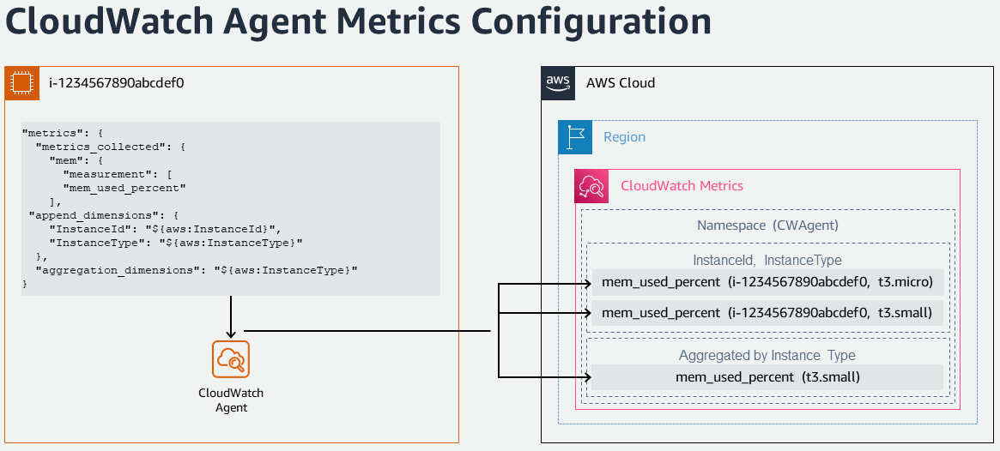
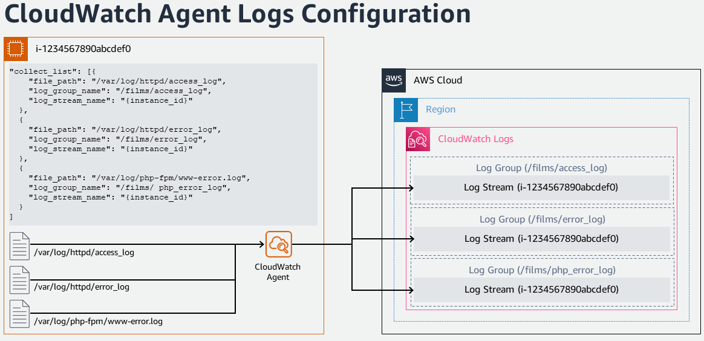
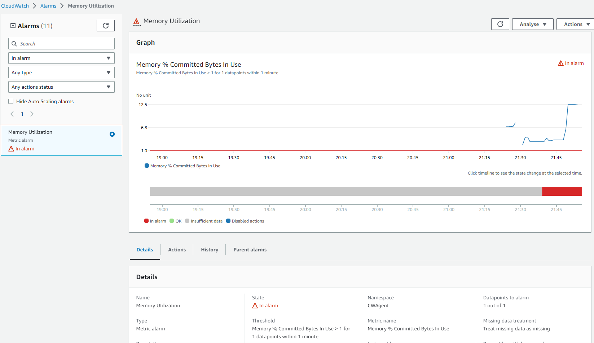
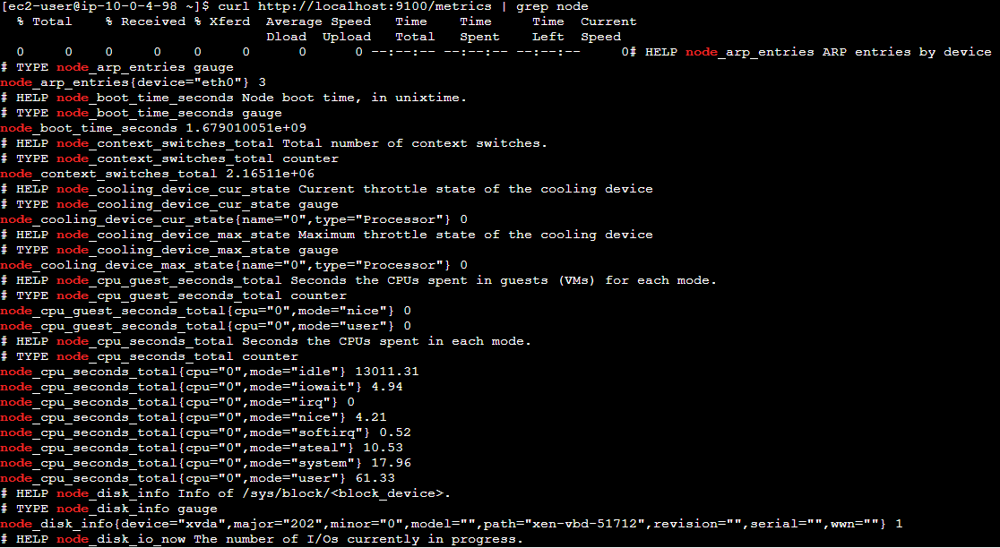
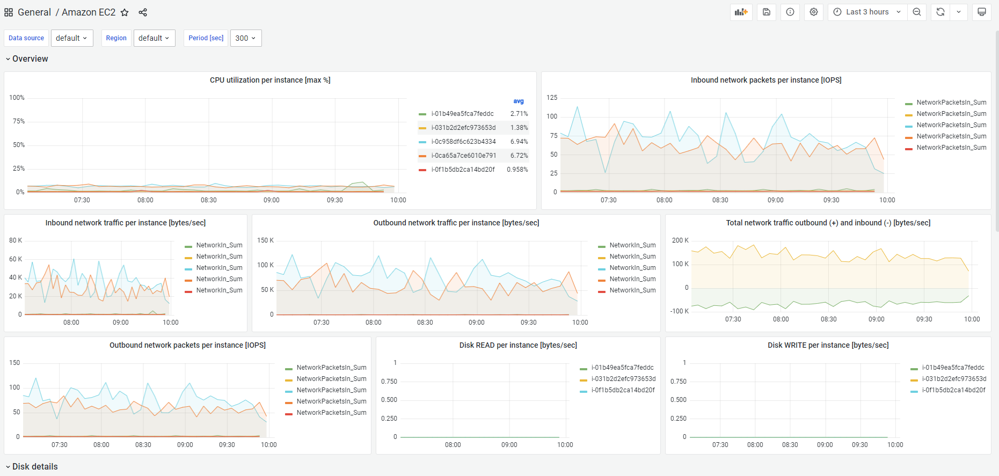

# EC2 のモニタリングとオブザーバビリティ

## はじめに

継続的なモニタリングとオブザーバビリティは、クラウド環境のアジリティを高め、顧客体験を向上させ、リスクを軽減します。Wikipedia によると、[オブザーバビリティ](https://en.wikipedia.org/wiki/Observability) とは、システムの外部出力の知識から、そのシステムの内部状態をどれだけ正確に推測できるかを示す尺度です。オブザーバビリティという用語自体は制御理論の分野に由来し、基本的にはシステムが生成する外部信号や出力を学ぶことで、システム内のコンポーネントの内部状態を推測できることを意味します。

モニタリングとオブザーバビリティの違いは、モニタリングがシステムが機能しているかどうかを示すのに対し、オブザーバビリティはシステムが機能していない理由を示すことです。モニタリングは通常、反応的な措置ですが、オブザーバビリティの目標は、主要業績評価指標 (KPI) を積極的に改善することです。システムは観察されない限り、制御や最適化することはできません。メトリクス、ログ、トレースの収集によってワークロードを計測し、適切なモニタリングとオブザーバビリティツールを使用して意味のある洞察と詳細なコンテキストを得ることで、顧客は環境を制御し最適化することができます。

AWS は、顧客がモニタリングからオブザーバビリティへと移行し、エンドツーエンドのサービスの可視性を完全に得られるようにします。この記事では、Amazon Elastic Compute Cloud (Amazon EC2) に焦点を当て、AWS ネイティブおよびオープンソースツールを通じて AWS クラウド環境でのサービスのモニタリングとオブザーバビリティを改善するためのベストプラクティスについて説明します。

## Amazon EC2

[Amazon Elastic Compute Cloud](https://aws.amazon.com/jp/ec2/) (Amazon EC2) は、Amazon Web Services (AWS) クラウドの高度にスケーラブルなコンピューティングプラットフォームです。Amazon EC2 は、ハードウェアへの初期投資の必要性を排除し、お客様が使用した分だけ支払うことで、より迅速にアプリケーションを開発およびデプロイできるようにします。EC2 が提供する主な機能には、インスタンスと呼ばれる仮想コンピューティング環境、Amazon マシンイメージと呼ばれるインスタンスの事前設定済みテンプレート、インスタンスタイプとして利用可能な CPU、メモリ、ストレージ、ネットワーク容量などのリソースの様々な構成があります。

## AWS ネイティブツールを使用したモニタリングとオブザーバビリティ

### Amazon CloudWatch

[Amazon CloudWatch](https://aws.amazon.com/jp/cloudwatch/) は、AWS、ハイブリッド、およびオンプレミスのアプリケーションとインフラストラクチャリソースのデータと実用的な洞察を提供するモニタリングおよび管理サービスです。CloudWatch は、ログ、メトリクス、イベントの形式でモニタリングおよび運用データを収集します。また、AWS リソース、アプリケーション、および AWS とオンプレミスサーバーで実行されるサービスの統合ビューを提供します。CloudWatch は、リソース使用率、アプリケーションパフォーマンス、および運用の健全性についてシステム全体の可視性を得るのに役立ちます。

### 統合された CloudWatch エージェント

統合された CloudWatch エージェントは、MIT ライセンスのオープンソースソフトウェアで、x86-64 および ARM64 アーキテクチャを使用するほとんどのオペレーティングシステムをサポートしています。CloudWatch エージェントは、オペレーティングシステム全体で Amazon EC2 インスタンスやオンプレミスサーバーからシステムレベルのメトリクスを収集し、アプリケーションやサービスからカスタムメトリクスを取得し、Amazon EC2 インスタンスやオンプレミスサーバーからログを収集するのに役立ちます。

### Amazon EC2 インスタンスへの CloudWatch エージェントのインストール

#### コマンドラインでのインストール

CloudWatch エージェントは[コマンドライン](https://docs.aws.amazon.com/ja_jp/AmazonCloudWatch/latest/monitoring/installing-cloudwatch-agent-commandline.html)を通じてインストールできます。様々なアーキテクチャと様々なオペレーティングシステム用の必要なパッケージが[ダウンロード](https://docs.aws.amazon.com/ja_jp/AmazonCloudWatch/latest/monitoring/download-cloudwatch-agent-commandline.html)可能です。CloudWatch エージェントが Amazon EC2 インスタンスから情報を読み取り、CloudWatch に書き込むための権限を提供する必要な [IAM ロール](https://docs.aws.amazon.com/ja_jp/AmazonCloudWatch/latest/monitoring/create-iam-roles-for-cloudwatch-agent-commandline.html)を作成します。必要な IAM ロールが作成されたら、必要な Amazon EC2 インスタンスで CloudWatch エージェントを[インストールして実行](https://docs.aws.amazon.com/ja_jp/AmazonCloudWatch/latest/monitoring/install-CloudWatch-Agent-commandline-fleet.html)できます。

:::info
    ドキュメント：[コマンドラインを使用した CloudWatch エージェントのインストール](https://docs.aws.amazon.com/ja_jp/AmazonCloudWatch/latest/monitoring/installing-cloudwatch-agent-commandline.html)

    AWS Observability ワークショップ：[CloudWatch エージェントのセットアップとインストール](https://catalog.workshops.aws/observability/en-US/aws-native/ec2-monitoring/install-ec2)
:::

#### AWS Systems Manager を通じたインストール

CloudWatch エージェントは [AWS Systems Manager](https://docs.aws.amazon.com/ja_jp/AmazonCloudWatch/latest/monitoring/installing-cloudwatch-agent-ssm.html) を通じてもインストールできます。
CloudWatch エージェントが Amazon EC2 インスタンスから情報を読み取り、CloudWatch に書き込み、AWS Systems Manager と通信するための権限を提供する必要な IAM ロールを作成します。

EC2 インスタンスに CloudWatch エージェントをインストールする前に、必要な EC2 インスタンスで SSM エージェントを[インストールまたは更新](https://docs.aws.amazon.com/ja_jp/AmazonCloudWatch/latest/monitoring/download-CloudWatch-Agent-on-EC2-Instance-SSM-first.html)します。

CloudWatch エージェントは AWS Systems Manager を通じてダウンロードできます。
収集するメトリクス（カスタムメトリクスを含む）やログを指定するための JSON 設定ファイルを作成できます。

必要な IAM ロールが作成され、設定ファイルが作成されたら、必要な Amazon EC2 インスタンスに CloudWatch エージェントをインストールして実行できます。

:::info
    ドキュメント: [AWS Systems Manager を使用した CloudWatch エージェントのインストール](https://docs.aws.amazon.com/ja_jp/AmazonCloudWatch/latest/monitoring/installing-cloudwatch-agent-ssm.html)

    AWS Observability ワークショップ: [AWS Systems Manager クイックセットアップを使用した CloudWatch エージェントのインストール](https://catalog.workshops.aws/observability/en-US/aws-native/ec2-monitoring/install-ec2/ssm-quicksetup)

    関連ブログ記事: [AWS Systems Manager 統合による Amazon CloudWatch エージェント - Linux & Windows 向けの統合メトリクスおよびログ収集](https://aws.amazon.com/jp/blogs/news/new-amazon-cloudwatch-agent-with-aws-systems-manager-integration-unified-metrics-log-collection-for-linux-windows/)

    YouTube 動画: [CloudWatch エージェントを使用した Amazon EC2 インスタンスからのメトリクスとログの収集](https://www.youtube.com/watch?v=vAnIhIwE5hY)
:::

#### ハイブリッド環境のオンプレミスサーバーへの CloudWatch エージェントのインストール

サーバーがオンプレミスとクラウドの両方に存在するハイブリッド顧客環境では、Amazon CloudWatch で統合されたオブザーバビリティを実現するために同様のアプローチを取ることができます。CloudWatch エージェントは Amazon S3 から直接ダウンロードするか、AWS Systems Manager を通じてダウンロードできます。オンプレミスサーバーが Amazon CloudWatch にデータを送信するための IAM ユーザーを作成します。オンプレミスサーバーにエージェントをインストールして起動します。

:::note
    ドキュメント：[オンプレミスサーバーへの CloudWatch エージェントのインストール](https://docs.aws.amazon.com/ja_jp/AmazonCloudWatch/latest/monitoring/install-CloudWatch-Agent-on-premise.html)
:::

### Amazon CloudWatch を使用した Amazon EC2 インスタンスのモニタリング

Amazon EC2 インスタンスとアプリケーションの信頼性、可用性、パフォーマンスを維持する上で重要な側面は、[継続的なモニタリング](https://catalog.workshops.aws/observability/en-US/aws-native/ec2-monitoring) です。
必要な Amazon EC2 インスタンスに CloudWatch エージェントをインストールすることで、インスタンスの健全性とパフォーマンスをモニタリングし、安定した環境を維持することが可能になります。
ベースラインとして、CPU 使用率、ネットワーク使用率、ディスクパフォーマンス、ディスクの読み書き、メモリ使用率、ディスクスワップ使用率、ディスク容量使用率、ページファイル使用率、EC2 インスタンスのログ収集などの項目が推奨されます。

#### 基本モニタリングと詳細モニタリング

Amazon CloudWatch は、Amazon EC2 から生データを収集し、読みやすいほぼリアルタイムのメトリクスに処理します。
デフォルトでは、Amazon EC2 はインスタンスの基本モニタリングとして、5 分間隔でメトリクスデータを CloudWatch に送信します。
インスタンスのメトリクスデータを 1 分間隔で CloudWatch に送信するには、インスタンスで[詳細モニタリング](https://docs.aws.amazon.com/ja_jp/AWSEC2/latest/UserGuide/using-cloudwatch-new.html)を有効にすることができます。

#### モニタリングのための自動化ツールと手動ツール

AWS は、Amazon EC2 をモニタリングし、問題が発生した際に報告するための自動化ツールと手動ツールの 2 種類を提供しています。これらのツールの一部は少し設定が必要で、いくつかは手動での介入が必要です。

[自動化モニタリングツール](https://docs.aws.amazon.com/ja_jp/AWSEC2/latest/UserGuide/monitoring_automated_manual.html) には、AWS システムステータスチェック、インスタンスステータスチェック、Amazon CloudWatch アラーム、Amazon EventBridge、Amazon CloudWatch Logs、CloudWatch エージェント、AWS Management Pack for Microsoft System Center Operations Manager が含まれます。[手動モニタリング](https://docs.aws.amazon.com/ja_jp/AWSEC2/latest/UserGuide/monitoring_automated_manual.html) ツールにはダッシュボードが含まれており、これについては本記事の後半で詳しく説明します。

:::note
    ドキュメント：[自動化および手動モニタリング](https://docs.aws.amazon.com/ja_jp/AWSEC2/latest/UserGuide/monitoring_automated_manual.html)
:::

### CloudWatch エージェントを使用した Amazon EC2 インスタンスからのメトリクス

メトリクスは CloudWatch の基本的な概念です。メトリクスは、CloudWatch に公開される時系列のデータポイントのセットを表します。メトリクスを監視する変数、データポイントをその変数の時間経過に伴う値と考えてください。例えば、特定の EC2 インスタンスの CPU 使用率は、Amazon EC2 が提供するメトリクスの 1 つです。

#### CloudWatch エージェントを使用したデフォルトメトリクス

Amazon CloudWatch は Amazon EC2 インスタンスからメトリクスを収集し、AWS マネジメントコンソール、AWS CLI、または API を通じて閲覧することができます。利用可能なメトリクスは、基本モニタリングでは 5 分間隔、詳細モニタリング（有効にした場合）では 1 分間隔でカバーされるデータポイントです。

#### CloudWatch エージェントを使用したカスタムメトリクス

お客様は、API または CLI を使用して、標準解像度の 1 分間隔または高解像度の 1 秒間隔まで、独自のカスタムメトリクスを CloudWatch に公開することもできます。統合された CloudWatch エージェントは、[StatsD](https://docs.aws.amazon.com/ja_jp/AmazonCloudWatch/latest/monitoring/CloudWatch-Agent-custom-metrics-statsd.html) と [collectd](https://docs.aws.amazon.com/ja_jp/AmazonCloudWatch/latest/monitoring/CloudWatch-Agent-custom-metrics-collectd.html) を通じてカスタムメトリクスの取得をサポートしています。

アプリケーションやサービスからのカスタムメトリクスは、StatsD プロトコルを使用した CloudWatch エージェントで取得できます。StatsD は、幅広いアプリケーションからメトリクスを収集できる人気のオープンソースソリューションです。StatsD は特に独自のメトリクスを計測するのに便利で、Linux と Windows ベースのサーバーの両方をサポートしています。

アプリケーションやサービスからのカスタムメトリクスは、collectd プロトコルを使用した CloudWatch エージェントでも取得できます。collectd は、Linux サーバーのみでサポートされている人気のオープンソースソリューションで、幅広いアプリケーションのシステム統計を収集できるプラグインを備えています。CloudWatch エージェントがすでに収集できるシステムメトリクスと、collectd からの追加メトリクスを組み合わせることで、システムとアプリケーションのモニタリング、分析、トラブルシューティングをより効果的に行うことができます。

#### CloudWatch エージェントを使用した追加のカスタムメトリクス

CloudWatch エージェントは、EC2 インスタンスからカスタムメトリクスを収集することをサポートしています。いくつかの一般的な例は以下の通りです：

- Elastic Network Adapter (ENA) を使用する Linux 上の EC2 インスタンスのネットワークパフォーマンスメトリクス。
- Linux サーバーからの Nvidia GPU メトリクス。
- procstat プラグインを使用した Linux および Windows サーバー上の個別プロセスからのプロセスメトリクス。

### CloudWatch エージェントを使用した Amazon EC2 インスタンスからのログ

Amazon CloudWatch Logs は、既存のシステム、アプリケーション、カスタムログファイルを使用して、ほぼリアルタイムでシステムとアプリケーションを監視およびトラブルシューティングするのに役立ちます。Amazon EC2 インスタンスやオンプレミスサーバーから CloudWatch にログを収集するには、統合された CloudWatch エージェントをインストールする必要があります。最新の統合 CloudWatch エージェントが推奨されます。これは、ログと高度なメトリクスの両方を収集でき、さまざまなオペレーティングシステムをサポートしているためです。インスタンスがインスタンスメタデータサービスバージョン 2 (IMDSv2) を使用している場合は、統合エージェントが必要です。

統合 CloudWatch エージェントによって収集されたログは、処理されて Amazon CloudWatch Logs に保存されます。Windows サーバーや Linux サーバー、Amazon EC2 およびオンプレミスサーバーの両方からログを収集できます。CloudWatch エージェント設定ウィザードを使用して、CloudWatch エージェントのセットアップを定義する設定 JSON ファイルをセットアップできます。

:::note
    AWS Observability ワークショップ：[ログ](https://catalog.workshops.aws/observability/en-US/aws-native/logs)
:::

### Amazon EC2 インスタンスイベント

イベントは、AWS 環境の変化を示します。AWS リソースとアプリケーションは、状態が変化したときにイベントを生成できます。CloudWatch Events は、AWS リソースとアプリケーションの変更を説明するシステムイベントのほぼリアルタイムのストリームを提供します。例えば、Amazon EC2 は EC2 インスタンスの状態が pending から running に変わったときにイベントを生成します。また、顧客はカスタムのアプリケーションレベルのイベントを生成し、CloudWatch Events に公開することもできます。

顧客は、ステータスチェックと予定されたイベントを表示することで、[Amazon EC2 インスタンスのステータスを監視](https://docs.aws.amazon.com/ja_jp/AWSEC2/latest/UserGuide/monitoring-instances-status-check.html)できます。ステータスチェックは、Amazon EC2 が実行する自動チェックの結果を提供します。これらの自動チェックは、インスタンスに影響を与える特定の問題を検出します。ステータスチェック情報は、Amazon CloudWatch が提供するデータと合わせて、各インスタンスの詳細な運用可視性を提供します。

#### Amazon EC2 インスタンスイベント用の Amazon EventBridge ルール

Amazon CloudWatch Events は Amazon EventBridge を使用して、リソースの変更や問題などのアクションに自動的に対応するためにシステムイベントを自動化できます。Amazon EC2 を含む AWS サービスからのイベントは、ほぼリアルタイムで CloudWatch Events に配信され、顧客はイベントがルールに一致したときに適切なアクションを実行するための EventBridge ルールを作成できます。
アクションには、AWS Lambda 関数の呼び出し、Amazon EC2 Run Command の呼び出し、Amazon Kinesis Data Streams へのイベントの中継、AWS Step Functions ステートマシンのアクティブ化、Amazon SNS トピックへの通知、Amazon SQS キューへの通知、内部または外部のインシデント対応アプリケーションや SIEM ツールへのパイピングなどがあります。

:::note
    AWS Observability ワークショップ：[インシデント対応 - EventBridge ルール](https://catalog.workshops.aws/observability/en-US/aws-native/ec2-monitoring/incident-response/create-eventbridge-rule)
:::

#### Amazon EC2 インスタンス用の Amazon CloudWatch アラーム

Amazon [CloudWatch アラーム](https://docs.aws.amazon.com/ja_jp/AmazonCloudWatch/latest/monitoring/AlarmThatSendsEmail.html) は、指定した期間にわたってメトリクスを監視し、複数の期間にわたってメトリクスの値が指定したしきい値に対して相対的にどうなっているかに基づいて、1 つ以上のアクションを実行できます。アラームは、状態が変化した場合にのみアクションを呼び出します。アクションには、Amazon Simple Notification Service (Amazon SNS) トピックへの通知の送信や Amazon EC2 Auto Scaling の実行、あるいは [EC2 インスタンスの停止、終了、再起動、復旧](https://docs.aws.amazon.com/ja_jp/AmazonCloudWatch/latest/monitoring/UsingAlarmActions.html) などの適切なアクションを取ることができます。

アラームがトリガーされると、アクションとして SNS トピックにメール通知が送信されます。

#### Auto Scaling インスタンスのモニタリング

Amazon EC2 Auto Scaling は、アプリケーションの負荷を処理するために適切な数の Amazon EC2 インスタンスが利用可能であることを確認するのに役立ちます。[Amazon EC2 Auto Scaling メトリクス](https://docs.aws.amazon.com/ja_jp/autoscaling/ec2/userguide/ec2-auto-scaling-cloudwatch-monitoring.html) は Auto Scaling グループに関する情報を収集し、AWS/AutoScaling 名前空間に含まれます。Auto Scaling インスタンスの CPU やその他の使用状況データを表す Amazon EC2 インスタンスメトリクスは、AWS/EC2 名前空間に含まれます。

### CloudWatch でのダッシュボード作成

AWS アカウント内のリソースの詳細な情報、リソースのパフォーマンス、ヘルスチェックを把握することは、安定したリソース管理にとって重要です。[Amazon CloudWatch ダッシュボード](https://docs.aws.amazon.com/ja_jp/AmazonCloudWatch/latest/monitoring/CloudWatch_Dashboards.html) は、CloudWatch コンソールでカスタマイズ可能なホームページであり、異なるリージョンに分散しているリソースであっても、1 つのビューでリソースを監視するために使用できます。利用可能な Amazon EC2 インスタンスの詳細を把握するための良い方法があります。

#### CloudWatch の自動ダッシュボード

自動ダッシュボードは、すべての AWS パブリックリージョンで利用可能で、Amazon EC2 インスタンスを含むすべての AWS リソースの健全性とパフォーマンスの集約ビューを CloudWatch で提供します。これにより、お客様はモニタリングをすぐに開始でき、メトリクスとアラームのリソースベースのビューを得られ、パフォーマンスの問題の根本原因を容易に掘り下げて理解することができます。自動ダッシュボードは AWS サービスが推奨する[ベストプラクティス](https://docs.aws.amazon.com/ja_jp/prescriptive-guidance/latest/implementing-logging-monitoring-cloudwatch/cloudwatch-dashboards-visualizations.html)に基づいて事前に構築されており、リソースを認識し、重要なパフォーマンスメトリクスの最新の状態を動的に更新します。

#### CloudWatch のカスタムダッシュボード

[カスタムダッシュボード](https://docs.aws.amazon.com/ja_jp/AmazonCloudWatch/latest/monitoring/create_dashboard.html) を使用すると、お客様は必要に応じて追加のダッシュボードを作成し、異なるウィジェットを使用してカスタマイズすることができます。ダッシュボードはリージョン間やアカウント間の表示用に設定でき、お気に入りリストに追加することもできます。

#### CloudWatch のリソースヘルスダッシュボード

CloudWatch ServiceLens のリソースヘルスは、お客様がアプリケーション全体の [Amazon EC2 ホストの健全性とパフォーマンス](https://aws.amazon.com/blogs/mt/introducing-cloudwatch-resource-health-monitor-ec2-hosts/) を自動的に発見、管理、可視化するために使用できる、フルマネージドソリューションです。お客様は、CPU やメモリなどのパフォーマンスディメンションによってホストの健全性を可視化し、インスタンスタイプ、インスタンスの状態、セキュリティグループなどのフィルターを使用して、1 つのビューで数百のホストを分析できます。これにより、EC2 ホストのグループを並べて比較し、個々のホストに関する詳細な洞察を提供します。

## オープンソースツールを使用したモニタリングとオブザーバビリティ

### AWS Distro for OpenTelemetry を使用した Amazon EC2 インスタンスのモニタリング

[AWS Distro for OpenTelemetry (ADOT)](https://aws.amazon.com/jp/otel) は、OpenTelemetry プロジェクトの安全で本番環境に対応した AWS がサポートするディストリビューションです。Cloud Native Computing Foundation の一部である OpenTelemetry は、アプリケーションモニタリングのための分散トレースとメトリクスを収集するオープンソースの API、ライブラリ、エージェントを提供します。AWS Distro for OpenTelemetry を使用することで、顧客は一度アプリケーションを計装するだけで、相関のあるメトリクスとトレースを複数の AWS およびパートナーのモニタリングソリューションに送信できます。

AWS Distro for OpenTelemetry (ADOT) は、分散モニタリングフレームワークを提供し、アプリケーションのパフォーマンスと健全性をモニタリングするためのデータを簡単に相関付けることができます。これは、サービスの可視性と保守性を向上させるために重要です。

ADOT の主要コンポーネントは、SDK、自動計装エージェント、コレクター、およびバックエンドサービスにデータを送信するエクスポーターです。

[OpenTelemetry SDK](https://github.com/aws-observability): AWS リソース固有のメタデータの収集を可能にし、X-Ray トレース形式とコンテキストのための OpenTelemetry SDK をサポートします。OpenTelemetry SDK は現在、AWS X-Ray と CloudWatch から取り込まれたトレースとメトリクスデータを相関付けます。

[自動計装エージェント](https://aws-otel.github.io/docs/getting-started/java-sdk/auto-instr): OpenTelemetry Java 自動計装エージェントに AWS SDK と AWS X-Ray トレースデータのサポートが追加されました。

[OpenTelemetry Collector](https://github.com/open-telemetry/opentelemetry-collector): このディストリビューションのコレクターは、アップストリームの OpenTelemetry コレクターを使用して構築されています。アップストリームコレクターに AWS 固有のエクスポーターが追加され、AWS X-Ray、Amazon CloudWatch、Amazon Managed Service for Prometheus などの AWS サービスにデータを送信できます。

#### ADOT Collector と Amazon CloudWatch を通じたメトリクスとトレース

AWS Distro for OpenTelemetry (ADOT) Collector は、CloudWatch エージェントと並行して Amazon EC2 インスタンスにインストールできます。また、OpenTelemetry SDK を使用して、Amazon EC2 インスタンス上で実行されているワークロードからアプリケーションのトレースとメトリクスを収集できます。

Amazon CloudWatch で OpenTelemetry メトリクスをサポートするために、[AWS EMF Exporter for OpenTelemetry Collector](https://github.com/open-telemetry/opentelemetry-collector-contrib/tree/main/exporter/awsemfexporter) は OpenTelemetry 形式のメトリクスを CloudWatch Embedded Metric Format (EMF) に変換します。これにより、OpenTelemetry メトリクスと統合されたアプリケーションが、高カーディナリティのアプリケーションメトリクスを CloudWatch に送信できるようになります。[X-Ray エクスポーター](https://aws-otel.github.io/docs/getting-started/x-ray#configuring-the-aws-x-ray-exporter) を使用すると、OTLP 形式で収集されたトレースを [AWS X-Ray](https://aws.amazon.com/jp/xray/) にエクスポートできます。

Amazon EC2 上の ADOT Collector は、AWS CloudFormation または [AWS Systems Manager Distributor](https://catalog.workshops.aws/observability/en-US/aws-managed-oss/ec2-monitoring/configure-adot-collector) を使用してインストールし、アプリケーションメトリクスを収集できます。

### Prometheus を使用した Amazon EC2 インスタンスのモニタリング

[Prometheus](https://prometheus.io/) は、システムのモニタリングとアラートのための独立したオープンソースプロジェクトで、個別に維持管理されています。Prometheus はメトリクスを時系列データとして収集し保存します。つまり、メトリクス情報は記録された時のタイムスタンプと共に保存され、オプションでラベルと呼ばれるキーバリューペアが付加されます。

Prometheus はコマンドラインフラグを通じて設定され、すべての設定詳細は prometheus.yaml ファイルに保持されます。設定ファイル内の 'scrape_config' セクションは、スクレイピングするターゲットとそのパラメータを指定します。[Prometheus Service Discovery](https://github.com/prometheus/prometheus/tree/main/discovery) (SD) は、メトリクスをスクレイピングするエンドポイントを見つけるための方法論です。Amazon EC2 サービスディスカバリー設定により、AWS EC2 インスタンスからスクレイプターゲットを取得することができ、これは `ec2_sd_config` で設定されます。

#### Prometheus と Amazon CloudWatch を通じたメトリクス

EC2 インスタンス上の CloudWatch エージェントは、Prometheus と共にインストールおよび設定して、CloudWatch でのモニタリング用にメトリクスをスクレイピングすることができます。これは、EC2 上のコンテナワークロードを好み、オープンソースの Prometheus モニタリングと互換性のあるカスタムメトリクスを必要とするお客様にとって役立ちます。CloudWatch エージェントのインストールは、上記の前のセクションで説明されている手順に従って行うことができます。Prometheus モニタリングを行う CloudWatch エージェントには、Prometheus メトリクスをスクレイピングするための 2 つの設定が必要です。1 つは、Prometheus ドキュメントの 'scrape_config' に記載されている標準的な Prometheus 設定です。もう 1 つは、[CloudWatch エージェントの設定](https://docs.aws.amazon.com/ja_jp/AmazonCloudWatch/latest/monitoring/CloudWatch-Agent-PrometheusEC2.html)です。

#### Prometheus と ADOT Collector を通じたメトリクス

お客様は、オブザーバビリティのニーズに対して完全にオープンソースのセットアップを選択できます。そのために、AWS Distro for OpenTelemetry (ADOT) Collector を設定して、Prometheus で計装されたアプリケーションからスクレイピングし、メトリクスを Prometheus サーバーに送信することができます。このフローには 3 つの OpenTelemetry コンポーネントが関与しています。それらは、Prometheus Receiver、Prometheus Remote Write Exporter、および Sigv4 Authentication Extension です。Prometheus Receiver は Prometheus 形式でメトリクスデータを受信します。Prometheus Exporter は Prometheus 形式でデータをエクスポートします。Sigv4 Authenticator 拡張機能は、AWS サービスへのリクエストに Sigv4 認証を提供します。

#### Prometheus Node Exporter

[Prometheus Node Exporter](https://github.com/prometheus/node_exporter) は、クラウド環境向けのオープンソースの時系列モニタリングおよびアラートシステムです。Amazon EC2 インスタンスに Node Exporter をインストールすることで、ノードレベルのメトリクスを時系列データとして収集し、タイムスタンプ付きの情報を記録できます。Node Exporter は Prometheus エクスポーターであり、URL http://localhost:9100/metrics を通じて様々なホストメトリクスを公開できます。

メトリクスが作成されると、[Amazon Managed Prometheus](https://aws.amazon.com/jp/prometheus/) に送信できます。

### Fluent Bit プラグインを使用した Amazon EC2 インスタンスからのログのストリーミング

[Fluent Bit](https://fluentbit.io/) は、オープンソースのマルチプラットフォームログプロセッサツールです。大規模なデータ収集を処理し、さまざまな情報源、多様なデータ形式、データの信頼性、セキュリティ、柔軟なルーティング、複数の送信先に対応する多様なデータを収集および集約します。

Fluent Bit は、Amazon EC2 から AWS サービス（ログの保持と分析のための Amazon CloudWatch を含む）へのログのストリーミングを容易にする拡張ポイントを作成するのに役立ちます。新しくリリースされた [Fluent Bit プラグイン](https://github.com/aws/amazon-cloudwatch-logs-for-fluent-bit#new-higher-performance-core-fluent-bit-plugin) を使用して、ログを Amazon CloudWatch にルーティングできます。

### Amazon Managed Grafana によるダッシュボード作成

[Amazon Managed Grafana](https://aws.amazon.com/jp/grafana/) は、オープンソースの Grafana プロジェクトをベースにした完全マネージド型サービスです。豊富でインタラクティブかつセキュアなデータ可視化機能を提供し、お客様が複数のデータソースにわたるメトリクス、ログ、トレースを即座にクエリ、相関分析、分析、監視、アラーム設定することを支援します。お客様は、インタラクティブなダッシュボードを作成し、自動的にスケールされ、高可用性で企業レベルのセキュリティを備えたサービスを通じて、組織内の誰とでも共有できます。Amazon Managed Grafana を使用することで、お客様は AWS アカウント、AWS リージョン、データソース全体でダッシュボードへのユーザーおよびチームアクセスを管理できます。

Amazon Managed Grafana では、Grafana ワークスペースコンソールの AWS データソース設定オプションを使用して、Amazon CloudWatch をデータソースとして追加できます。この機能により、既存の CloudWatch アカウントを検出し、CloudWatch へのアクセスに必要な認証情報の設定を管理することで、CloudWatch をデータソースとして追加するプロセスが簡素化されます。Amazon Managed Grafana は、[Prometheus データソース](https://docs.aws.amazon.com/ja_jp/grafana/latest/userguide/prometheus-data-source.html) もサポートしており、自己管理型 Prometheus サーバーと Amazon Managed Service for Prometheus ワークスペースの両方をデータソースとして利用できます。

Amazon Managed Grafana には様々なパネルが用意されており、適切なクエリの構築と表示プロパティのカスタマイズが容易になっています。これにより、お客様は必要なダッシュボードを簡単に作成できます。

## 結論

モニタリングは、システムが適切に機能しているかどうかを知らせてくれます。オブザーバビリティは、システムが適切に機能していない理由を理解させてくれます。優れたオブザーバビリティにより、気づく必要があることさえ知らなかった質問に答えることができます。モニタリングとオブザーバビリティは、システムの出力から推測できる内部状態を測定する道を開きます。

クラウド上のマイクロサービス、サーバーレス、非同期アーキテクチャで実行される現代のアプリケーションは、メトリクス、ログ、トレース、イベントの形で大量のデータを生成します。Amazon CloudWatch と、AWS Distro for OpenTelemetry、Amazon Managed Prometheus、Amazon Managed Grafana などのオープンソースツールを組み合わせることで、お客様はこれらのデータを統合プラットフォーム上で収集、アクセス、相関付けることができます。これにより、データサイロを解消し、システム全体の可視性を容易に獲得し、問題を迅速に解決することができます。
