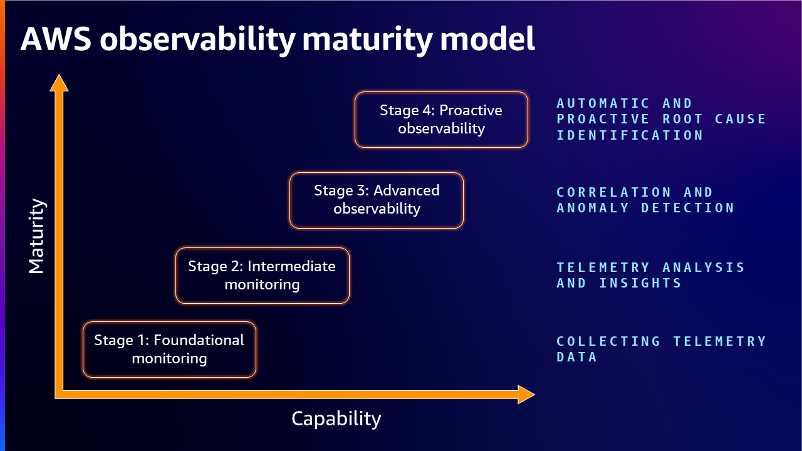

# AWS オブザーバビリティ成熟度モデル

## はじめに

オブザーバビリティの本質は、システムの外部出力を分析することで、システムの内部状態を理解し、洞察を得る能力です。この概念は、事前に定義されたメトリクスやイベントに焦点を当てる従来の監視アプローチから、環境内のさまざまなコンポーネントが生成するデータの収集、分析、可視化を包括するより全体的なアプローチへと進化してきました。システムが観測されない限り、制御や最適化はできません。効果的なオブザーバビリティ戦略により、チームは問題を迅速に特定して解決し、リソースの使用を最適化し、システム全体の健全性に関する洞察を得ることができます。オブザーバビリティは、問題を効率的に検出、調査、修正する能力を提供し、これによりワークロードの全体的な運用可用性と健全性を向上させることができます。

モニタリングとオブザーバビリティの違いは、モニタリングがシステムが機能しているかどうかを示すのに対し、オブザーバビリティはシステムが機能していない理由を示すことです。モニタリングは通常、反応的な措置ですが、オブザーバビリティの目標は、主要業績評価指標 (KPI) を積極的に改善することです。継続的なモニタリングとオブザーバビリティは、クラウド環境における俊敏性を高め、顧客体験を向上させ、リスクを軽減します。

## オブザーバビリティ成熟度モデル

オブザーバビリティ成熟度モデルは、組織がワークロードのオブザーバビリティと管理プロセスを最適化するための重要なフレームワークとして機能します。
このモデルは、企業が現在の能力を評価し、改善が必要な領域を特定し、最適なオブザーバビリティを達成するために適切なツールとプロセスに戦略的に投資するための包括的なロードマップを提供します。

クラウドコンピューティング、マイクロサービス、一時的および分散システムの時代において、オブザーバビリティはデジタルサービスの信頼性とパフォーマンスを確保する上で重要な要素となっています。
オブザーバビリティを改善するための構造化されたアプローチを提供することで、このモデルは組織がシステムをより深く理解し、制御することを可能にし、より回復力があり、効率的で、高性能なビジネスへの道を開きます。

## オブザーバビリティ成熟度モデルの段階

組織がワークロードを拡大するにつれて、オブザーバビリティ成熟度モデルも成熟することが期待されます。しかし、オブザーバビリティの成熟度への道のりは、必ずしもワークロードと共に成長するわけではありません。この意図は、組織の能力を拡大・成長させる際に、必要な成熟度レベルを達成できるよう顧客を支援することです。

1. オブザーバビリティ成熟度モデルの最初の段階では、通常、組織の現状を把握するためのベースラインを確立することが含まれます。これには、既存の監視ツールとプロセスの評価、および可視性や機能性のギャップの特定が含まれます。この段階で、組織は現在の能力を把握し、エンジニアリングサイクルの初期段階から現実的な改善目標を設定することができます。

2. 次の段階では、組織はより高度なオブザーバビリティ戦略とサービスを採用することで、より洗練されたアプローチに移行します。これには、プロアクティブなアラート、分散システム間の相互作用を把握するための分散トレーシングの実装などが含まれる場合があります。これにより、組織は可視性の向上、認知負荷の軽減、より効率的なトラブルシューティングの利点を享受し始めることができます。

3. オブザーバビリティ成熟度モデルの第 3 段階に進むにつれて、企業は自動修復、人工知能、機械学習技術を活用して、異常検出と根本原因分析を自動化するなどの追加機能を活用できます。これらの高度な機能により、組織は問題を検出するだけでなく、エンドユーザーに影響を与えたり、ビジネス運営を混乱させたりする前に是正措置を講じることができます。オブザーバビリティツールをインシデント管理プラットフォームなどの重要なシステムと統合することで、組織はインシデント対応プロセスを合理化し、問題解決にかかる時間を最小限に抑えることができます。

4. オブザーバビリティ成熟度モデルの最終段階では、監視とオブザーバビリティツールによって生成された豊富なデータを活用して、継続的な改善を推進します。これには、高度な分析を使用してワークロードのパフォーマンスのパターンと傾向を特定し、この情報をエンジニアリングと運用プロセスにフィードバックして、リソース割り当て、アーキテクチャ、デプロイ戦略を最適化することが含まれます。

### ステージ 1: 基礎的なモニタリング - テレメトリデータの収集

最低限のものとして採用され、サイロ化して機能する基本的なモニタリングは、組織内のシステムやワークロード全体を監視するために必要なものについて、明確な戦略が定義されていません。多くの場合、アプリケーション所有者、ネットワークオペレーションセンター (NOC)、CloudOps、DevOps チームなど、異なるチームが自身のモニタリングニーズに対して異なるツールを使用するため、このアプローチは環境全体のデバッグや最適化の観点からはほとんど価値がありません。

通常、この段階のお客様は、ワークロードの監視に対して異なるソリューションを持っています。異なるチームが、多くの場合、他のチームとの連携が限られているか全くないため、同じデータを異なる方法で収集しています。チームは、自分たちが取得したデータを使って必要なものを最適化する傾向があります。また、他のチームから取得したデータが異なる形式である可能性があるため、チーム間でデータを使用することができません。重要なワークロードを特定するための計画を作成し、オブザーバビリティのための統一されたソリューションを目指し、メトリクスとログを定義することが、このレベルの重要な側面です。ワークロードが提供する必須の[テレメトリ](https://docs.aws.amazon.com/ja_jp/wellarchitected/latest/operational-excellence-pillar/implement-observability.html)を取得するようにワークロードを設計することは、その内部状態と[ワークロードの健全性](https://docs.aws.amazon.com/ja_jp/wellarchitected/latest/operational-excellence-pillar/utilizing-workload-observability.html)を理解するために必要です。

成熟度レベルを向上させるための基盤を構築するために、メトリクス、ログ、トレースの収集を通じてワークロードを計測し、適切なモニタリングとオブザーバビリティツールを使用して意味のある洞察を得ることで、お客様は環境を制御し最適化することができます。計測とは、ワークロードの動作とパフォーマンスを観察するために使用できる主要なデータを環境から測定、追跡、キャプチャすることを指します。例としては、エラー、成功または失敗したトランザクションなどのアプリケーションメトリクス、CPU やディスクリソースの使用率などのインフラストラクチャメトリクスがあります。

### ステージ 2: 中級モニタリング - テレメトリ分析とインサイト

このステージでは、オンプレミスやクラウドなどの様々な環境からシグナルを収集する点で、組織の状況がより明確になります。
メトリクス、ログ、トレースは、オブザーバビリティの基本構造を形成するため、ワークロードからこれらを収集するメカニズムを考案し、可視化、アラート戦略を作成し、明確に定義された基準に基づいて問題に優先順位をつける能力も持っています。
反応的で推測に頼るのではなく、必要なアクションを呼び起こすワークフローを持ち、関連チームが捕捉された情報と過去の知識に基づいて分析とトラブルシューティングを行うことができます。
このレベルの顧客は、従来型または最新の、高度にスケーラブルで分散型、アジャイル、マイクロサービスアーキテクチャの環境のオブザーバビリティを実現するためのプラクティスの達成に向けて取り組んでいます。

ほとんどの場合、モニタリングはうまく機能しているように見えますが、組織は問題のデバッグにより多くの時間を費やす傾向があり、その結果、全体的な平均解決時間（MTTR）は一定期間にわたって一貫性がなく、意味のある改善が見られません。
また、問題をデバッグするための認知的な時間と労力が予想以上に高くなり、インシデント対応が長引きます。
データ過負荷の状況も発生し、運用も圧倒されがちです。
多くの企業がこのステージに陥っており、次のステップに進むべきかを認識していないことがわかります。
組織を次のレベルに進めるために取れる具体的なアクションは以下の通りです：
1) システムのアーキテクチャ設計を定期的にレビューし、影響とダウンタイムを減らすためのポリシーとプラクティスを導入し、アラートを減らす。
2) アクショナブルな [KPI](https://aws-observability.github.io/observability-best-practices/guides/operational/business/key-performance-indicators/) を定義し、アラートの発見に価値のあるコンテキストを追加し、重大度/緊急度によって分類し、異なるツールやチームに送信してエンジニアが問題をより迅速に解決できるようにすることで、アラート疲れを防ぐ。

これらのアラートを定期的に分析し、一般的に繰り返されるアラートに対する修復を自動化します。
アラートの発見を関連チームと共有・伝達し、運用とプロセスの改善にフィードバックを提供します。

異なるエンティティを相関させ、システムの異なる部分間の依存関係を理解するのに役立つナレッジグラフを徐々に構築する計画を立てます。
これにより、顧客はシステムへの変更の影響を視覚化し、潜在的な問題を予測して軽減することができます。

### ステージ 3: 高度なオブザーバビリティ - 相関関係と異常検知

このステージでは、組織は多くの時間をトラブルシューティングに費やすことなく、問題の根本原因を明確に理解できるようになります。問題が発生した際、アラートは Network Operations Center (NOC)、CloudOps、DevOps チームなどの関連チームに十分な文脈情報を提供します。モニタリングチームはアラートを見て、メトリクス、ログ、トレースなどのシグナルの相関関係を通じて、即座に問題の根本原因を特定できます。トレースは、アプリケーションからリクエストに関して収集されたデータで、ツールを使用して表示、フィルタリング、洞察を得ることができ、問題の特定や最適化の機会を見出すのに役立ちます。アプリケーションのトレースされたリクエストは、リクエストとレスポンスに関する詳細情報だけでなく、アプリケーションが下流の AWS リソース、マイクロサービス、データベース、Web API に対して行う呼び出しに関する情報も提供します。彼らはトレースを見て、対応するログイベントを見つけ（トレースが取得されているため）、インフラストラクチャとアプリケーションからのメトリクスを確認し、状況の 360° ビューを得ることができます。

適切なチームは、問題を解決する修正を提供することですぐに是正措置を取ることができます。このシナリオでは、MTTR は非常に小さく、Service Level Objectives (SLO) は緑色で、エラーバジェットの消費率は許容範囲内です。通常、このレベルの顧客は、モダンで俊敏性が高く、高度にスケーラブルなマイクロサービス環境のオブザーバビリティに関する実践を達成しています。

多くの組織がオブザーバビリティ環境においてこのレベルの洗練度と成熟度を達成しています。このステージは、組織に複雑なインフラストラクチャをサポートし、高可用性でシステムを運用し、アプリケーションに対してより高い Service Level Availability (SLA) を提供し、信頼性の高いインフラストラクチャを提供することでビジネスイノベーションを達成する能力をすでに与えています。顧客はまた、異常検出器を使用して、通常のパターンに一致しない異常や外れ値を監視し、ほぼリアルタイムのアラート機構を持っています。

しかし、そのような組織のチームは常に可能性の限界を超えようとします。チームは繰り返し発生する問題を理解し、将来発生する可能性のある問題を予測するためにシナリオに対してモデル化できる知識ベースを作成したいと考えています。そこで顧客は成熟度モデルの次のステージに移行し、未知のものに対する洞察を得ます。そこに到達するためには、新しいツールが必要であり、また、データの保存と活用に関する新しいスキルと技術を特定する必要があります。過去に収集されたデータを使用して訓練されたモデルに基づいて、シグナルを自動的に相関付け、根本原因を特定し、解決計画を作成するシステムを構築するために、IT 運用のための人工知能（AIOps）を利用することができます。

### ステージ 4: プロアクティブなオブザーバビリティ - 自動的かつ事前の根本原因特定

ここでは、オブザーバビリティデータは問題が発生した「後」だけでなく、問題が発生する「前」にリアルタイムでデータを活用します。
十分に訓練されたモデルを使用することで、問題の特定が事前に行われ、解決がより簡単かつシンプルに達成されます。
収集されたシグナルを分析することで、監視システムは問題に関する洞察を自動的に提供し、問題を解決するための選択肢を提示することができます。

オブザーバビリティソフトウェアベンダーは、この分野での機能を継続的に拡大しており、生成 AI の普及によってさらに加速しています。
そのため、このような成熟度レベルの達成を目指す組織は、容易に実現できるようになっています。
このステージが成熟し形を整えると、オブザーバビリティサービスが動的ダッシュボードを自動的に作成できるようになります。
ダッシュボードには、当面の問題に関連する情報のみを含めることができます。
これにより、実際には重要でないデータのクエリや可視化にかかる時間とコストを節約できます。
生成 AI (GenAI) と機械学習を実行するためのコンピューティングリソースが日々民主化されているため、将来的には現在よりもプロアクティブな監視機能がより一般的になる可能性があります。

AWS ネイティブおよびオープンソースのソリューションを用いた、データ収集、データ処理、データの洞察と分析のための様々なソリューションを含む、オブザーバビリティポートフォリオの全体像を示します。
顧客は、エンドツーエンドのオブザーバビリティニーズに適したソリューションを選択して利用することができます。

## オブザーバビリティのための AWS Well-Architected と Cloud Adoption Framework

組織は [AWS Well-Architected](https://aws.amazon.com/jp/architecture/well-architected/) と [Cloud Adoption Framework](https://docs.aws.amazon.com/ja_jp/whitepapers/latest/aws-caf-operations-perspective/observability.html) を活用して、オブザーバビリティ機能を強化し、クラウド環境を効果的に監視およびトラブルシューティングすることができます。

オブザーバビリティのための AWS Well-Architected と Cloud Adoption Framework は、ワークロードの設計、デプロイ、運用に構造化されたアプローチを提供し、ベストプラクティスに従うことを保証します。これにより、可用性、システムパフォーマンス、スケーラビリティ、信頼性が向上します。これらのフレームワークは、組織に標準化された一連のプラクティスと規範的なガイダンスも提供し、組織全体でのコラボレーション、知識共有、一貫したソリューションの実装を容易にします。

効果的に活用するために、組織は AWS Well-Architected フレームワークの主要コンポーネントである柱（[オペレーショナルエクセレンス](https://docs.aws.amazon.com/ja_jp/wellarchitected/latest/framework/operational-excellence.html)、セキュリティ、[信頼性](https://docs.aws.amazon.com/ja_jp/wellarchitected/latest/framework/reliability.html)、[パフォーマンス効率](https://docs.aws.amazon.com/ja_jp/wellarchitected/latest/framework/performance-efficiency.html)、コスト最適化、持続可能性）を理解する必要があります。これらはクラウド環境の設計と運用に対する包括的なアプローチを提供します。一方、Cloud Adoption Framework は、ビジネス、人材、ガバナンス、プラットフォームなどの領域に焦点を当てた、クラウド導入のための構造化されたアプローチを提供します。これらのコンポーネントをオブザーバビリティ要件と整合させることで、組織は堅牢でスケーラブルなワークロードを構築できます。

オブザーバビリティのための AWS Well-Architected と Cloud Adoption Framework の実装には、いくつかのステップが含まれます。まず、組織は現状を評価し、改善が必要な領域を特定する必要があります。これは、オブザーバビリティ成熟度モデル評価を実施し、これらのフレームワークに対してワークロードを評価することで行えます。レビュー結果に基づいて、組織はオブザーバビリティイニシアチブの優先順位付けと計画を行うことができます。これには、監視とロギングの要件の定義、適切な AWS サービスの選択、必要なインフラストラクチャとツールの実装が含まれます。最後に、組織は継続的な有効性を確保するために、オブザーバビリティソリューションを継続的に監視し最適化する必要があります。

また、顧客は [AWS Well-Architected Tool](https://aws.amazon.com/jp/well-architected-tool/) を利用できます。これは AWS のサービスで、AWS Well-Architected Framework のベストプラクティスを使用してワークロードを文書化し測定するためのものです。このツールは、AWS Well-Architected Framework の柱を通じてワークロードを測定するための一貫したプロセスを提供し、決定事項の文書化を支援し、ワークロードを改善するための推奨事項を提供し、ワークロードをより信頼性が高く、安全で、効率的で、コスト効果的にするためのガイダンスを提供します。

## アセスメント

オブザーバビリティ成熟度モデルのアセスメントは、現在のオブザーバビリティの状態を評価し、改善が必要な領域を特定するために使用できます。
各段階のアセスメントには、異なるチーム間での既存の監視および管理プラクティスの評価、ギャップと改善領域の特定、次の段階への全体的な準備状況の判断が不可欠です。
成熟度アセスメントは、ビジネスプロセスの概要、ワークロードのインベントリとツールの発見、現在の課題の特定、組織の優先事項と目標の理解から始まります。

このアセスメントは、既存のレイアウトのさらなる開発と最適化の基礎となる、ターゲットとなるメトリクスと KPI を特定するのに役立ちます。
オブザーバビリティ成熟度モデルのアセスメントは、ビジネスが現代のシステムの複雑で動的な性質に対処する準備ができていることを確認する上で重要な役割を果たします。
システム障害やパフォーマンスの問題につながる可能性のある盲点や弱点を特定するのに役立ちます。

さらに、定期的なアセスメントにより、ビジネスの俊敏性と適応性が確保されます。
進化するテクノロジーと方法論に遅れを取らないようにし、システムが常に効率性と信頼性のピークにあることを保証します。

このアセスメントは、AWS のベストプラクティスに照らしてオブザーバビリティ戦略の状態を確認し、改善の機会を特定し、時間の経過とともに進捗を追跡するのに役立つように設計されています。
以下の質問は、現在のオブザーバビリティ成熟度レベルを評価するのに役立ちます。
無料で「AWS オブザーバビリティ成熟度モデルアセスメント」ツールを使用したアセスメントを実施するには、AWS アカウントチームにお問い合わせください。

**ログ**

1. ログをどのように収集していますか？
2. ログをどのように使用していますか？
3. ログにどのようにアクセスしていますか？
4. セキュリティと規制コンプライアンスのためのログ保持ポリシーはどのようなものですか？
5. 現在、ML/AI 機能を使用していますか？

**メトリクス**

6. どのタイプのメトリクスを収集していますか？
7. メトリクスをどのように使用していますか？
8. メトリクスにどのようにアクセスしていますか？

**トレース**

9. トレースをどのように収集していますか？
10. トレースをどのように使用していますか？

**ダッシュボードとアラート**

11. アラームをどのように使用していますか？
12. ダッシュボードをどのように使用していますか？

**組織**

13. エンタープライズオブザーバビリティ戦略はありますか？
14. SLO をどのように使用していますか？

## オブザーバビリティ戦略の構築

組織がオブザーバビリティの段階を特定したら、現在のプロセスとツールを最適化し、成熟度を高めるための戦略を構築し始めるべきです。組織は顧客に優れた体験を提供したいと考えているため、まずそれらの顧客要件から始め、そこから逆算して作業を進めます。そして、これらの要件をよく理解しているステークホルダーと協力します。オブザーバビリティ戦略の目標を定めるにあたり、組織はまずオブザーバビリティの目標を定義する必要があります。これらは全体的なビジネス目標と整合している必要があり、組織が戦略を通じて達成しようとしていることを明確に表現し、オブザーバビリティ計画の構築と実施のためのロードマップを提供する必要があります。

次に、組織はシステムのパフォーマンスに関する洞察を提供する主要なメトリクス（KPI）を特定する必要があります。これらは、レイテンシーやエラー率からリソース使用率やトランザクション量まで多岐にわたる可能性があります。メトリクスの選択は、ビジネスの性質と特定のニーズに大きく依存することに注意することが重要です。

主要なメトリクスが特定されたら、組織はデータ収集に必要なツールとテクノロジーを決定できます。ツールの選択は、組織の目標との整合性、既存のシステムとの統合の容易さ、コストの最適化、スケーラビリティの達成、顧客ニーズの満足、全体的な顧客体験の向上に基づいて行われるべきです。

最後に、組織はオブザーバビリティを重視する文化も奨励すべきです。これには、チームメンバーにオブザーバビリティの重要性について教育し、システムのパフォーマンスを積極的に監視するよう促し、継続的な学習と改善の文化を育むことが含まれます。この戦略は、最高の顧客体験を実現するための収集、行動、改善の継続的なプロセスの好循環を生み出します。

要約すると、オブザーバビリティ戦略を構築するには、以下の 3 つの主要な側面を考慮する必要があります：1) 何を収集する必要があるか、2) 観察が必要なすべてのシステムとワークロードは何か、3) 問題が発生した場合にどのように対応し、それらを修正するためにどのようなメカニズムを用意すべきか。

## 結論

オブザーバビリティ成熟度モデルは、組織が現状を評価し、ワークロードとインフラストラクチャの動作を理解、分析、対応する能力を向上させる方法を模索するためのロードマップとして機能します。
現在の能力を評価し、高度な監視技術を採用し、データ駆動型のインサイトを活用するための構造化されたアプローチに従うことで、企業はより高度なオブザーバビリティを達成し、ワークロードとインフラストラクチャについてより適切な意思決定を行うことができます。
このモデルは、組織が異なる成熟度レベルを進むために開発する必要がある主要な能力と実践を概説しており、最終的にはプロアクティブなオブザーバビリティの利点を十分に活用できる状態に到達します。

## 参考リソース

- [効果的なオブザーバビリティ戦略の構築](https://youtu.be/7PQv9eYCJW8?si=gsn0qPyIMhrxU6sy) - AWS re\:Invent 2023
- [AWS オブザーバビリティのベストプラクティス](https://aws-observability.github.io/observability-best-practices/)
- [オブザーバビリティとは何か、なぜ重要なのか？](https://aws.amazon.com/blogs/mt/what-is-observability-and-why-does-it-matter-part-1/)
- [オブザーバビリティ戦略をどのように開発するか？](https://aws.amazon.com/blogs/mt/how-to-develop-an-observability-strategy/)
- [AWS における深層アプリケーションオブザーバビリティのガイダンス](https://aws.amazon.com/jp/solutions/guidance/deep-application-observability-on-aws/)
- [Discovery が AWS オブザーバビリティで運用効率を向上させた方法](https://www.youtube.com/watch?v=zm30JNYmxlY) - AWS re\:Invent 2022
- [オブザーバビリティ戦略の開発](https://www.youtube.com/watch?v=Ub3ATriFapQ) - AWS re\:Invent 2022
- [AWS でクラウドネイティブなオブザーバビリティを探る](https://www.youtube.com/watch?v=UW7aT25Mbng) - AWS バーチャルワークショップ
- [AWS オブザーバビリティソリューションで可用性を向上](https://www.youtube.com/watch?v=_d_9xCfVBTM) - AWS re\:Invent 2020
- [Amazon におけるオブザーバビリティのベストプラクティス](https://www.youtube.com/watch?v=zZPzXEBW4P8) - AWS re\:Invent 2022
- [オブザーバビリティ：最新アプリケーションのベストプラクティス](https://www.youtube.com/watch?v=YiegAlC_yyc) - AWS re\:Invent 2022
- [オープンソースによるオブザーバビリティ](https://www.youtube.com/watch?v=2IJPpdp9xU0) - AWS re\:Invent 2022
- [AIOps でオブザーバビリティ戦略を向上させる](https://www.youtube.com/watch?v=L4b_eDSAwfE)
- [Let's Architect! 大規模な本番システムのモニタリング](https://aws.amazon.com/blogs/architecture/lets-architect-monitoring-production-systems-at-scale/)
- [AWS によるフルスタックオブザーバビリティとアプリケーションモニタリング](https://www.youtube.com/watch?v=or7uFFyHIX0) - AWS Summit SF 2022
