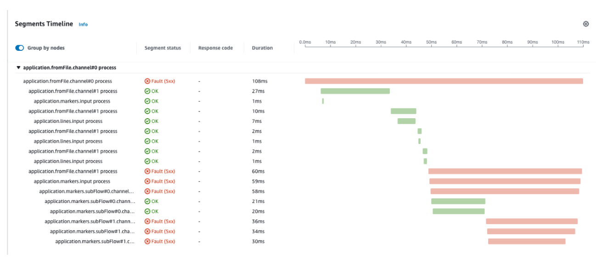

# Java Spring Integration アプリケーションのインストルメンテーション

この記事では、[Open Telemetry](https://opentelemetry.io/) と [X-ray](https://aws.amazon.com/jp/xray/) を利用して [Spring-Integration](https://docs.spring.io/spring-integration/reference/overview.html) アプリケーションを手動でインストルメントする方法について説明します。

Spring-Integration フレームワークは、イベント駆動型アーキテクチャやメッセージング中心のアーキテクチャに典型的な統合ソリューションの開発を可能にするように設計されています。一方で、OpenTelemetry はマイクロサービスアーキテクチャに焦点を当てる傾向があり、サービス間は HTTP リクエストを使って通信と調整を行います。そのため、このガイドでは OpenTelemetry API を使った手動インストルメンテーションにより、Spring-Integration アプリケーションをインストルメントする例を示します。

## 背景情報

### トレーシングとは何ですか?

[OpenTelemetry のドキュメンテーション](https://opentelemetry.io/docs/concepts/signals/traces/)からの次の引用は、トレースの目的を良く概説しています。

note
    トレースは、アプリケーションにリクエストが行われたときに何が起こるかの全体像を示します。アプリケーションがシングルデータベースのモノリシックなものであれ、高度なサービスメッシュであれ、リクエストがアプリケーション内でたどる完全な「経路」を理解するためにはトレースが不可欠です。

トレーシングの主な利点の 1 つがリクエストのエンドツーエンドの可視化であることから、トレースがリクエストの発信元からバックエンドまで適切にリンクされることが重要です。OpenTelemetry でこれを行う一般的な方法は、[ネストされたスパン](https://opentelemetry.io/docs/instrumentation/java/manual/#create-nested-spans)を利用することです。これは、スパンがサービスからサービスに渡され、最終的な宛先に到達するまで続くマイクロサービスアーキテクチャで機能します。Spring Integration アプリケーションでは、リモートとローカルの両方で作成されたスパン間で親子関係を作成する必要があります。

## コンテキスト伝播を利用したトレーシング

コンテキスト伝播を使用したアプローチを示します。この手法は従来、ローカルとリモートの場所で作成されたスパン間の親子関係を作る必要がある場合に使用されていますが、Spring Integration アプリケーションの場合は、コードを簡素化し、アプリケーションのスケーリングを可能にするために使用されます。つまり、メッセージを複数のスレッドで並列処理できるようになり、必要に応じてメッセージを別のホストで処理するためにスケールアウトすることも可能になります。

これを実現するために必要なことの概要は次のとおりです。

- ```ChannelInterceptor``` を作成し、```GlobalChannelInterceptor``` として登録して、すべてのチャネルを介して送信されるメッセージをキャプチャできるようにします。

- ```ChannelInterceptor``` 内で以下を行います。
  - ```preSend``` メソッドでは:
    - 上流で生成された前のメッセージからコンテキストを読み取ろうとします。ここで上流のメッセージからスパンを接続できます。コンテキストが存在しない場合は、新しいトレースが開始されます (これは OpenTelemetry SDK によって行われます)。
    - そのメッセージが処理されるチャネル名など、その操作を特定する一意の名前でスパンを作成します。
    - 現在のコンテキストをメッセージに保存します。
    - コンテキストとスコープをスレッドローカルに格納して、後で閉じられるようにします。
    - コンテキストを下流に送信されるメッセージに注入します。
  - ```afterSendCompletion``` メソッドでは:
    - スレッドローカルからコンテキストとスコープを復元します。
    - コンテキストからスパンを再作成します。
    - メッセージ処理中に発生した例外を登録します。
    - スコープを閉じます。
    - スパンを終了します。

これは行う必要があることの簡略化された説明です。Spring Integration フレームワークを使用する機能サンプルアプリケーションを提供しています。このアプリケーションのコードは[こちら](https://github.com/rapphil/spring-integration-samples/tree/rapphil-5.5.x-otel/applications/file-split-ftp)にあります。

アプリケーションを計装するために行った変更のみを確認するには、この[diff](https://github.com/rapphil/spring-integration-samples/compare/30e01ce9eefd8dae288eca44013810afa8c1a585..6f056a76350340a9658db0cad7fc12dbda505437)を参照してください。

### このサンプルアプリケーションを実行するには、次のコマンドを使用します:

``` bash
# build and run
mvn spring-boot:run
# create sample input file to trigger flow
echo 'testcontent\nline2content\nlastline' > /tmp/in/testfile.txt
```

このサンプルアプリケーションを試すには、アプリケーションと同じマシン上で [ADOT コレクター](https://aws-otel.github.io/docs/getting-started/collector) を次の設定で実行する必要があります。

``` yaml
receivers:
  otlp:
    protocols:
      grpc: 
        endpoint: 0.0.0.0:4317
      http:
        endpoint: 0.0.0.0:4318
processors:
  batch/traces:
    timeout: 1s
    send_batch_size: 50
  batch/metrics:
    timeout: 60s
exporters:
  aws xray: region:us-west-2
  aws emf:
    region: us-west-2
service:
  pipelines:
    traces:
      receivers: [otlp]
      processors: [batch/traces]
      exporters: [awsxray]
    metrics:
      receivers: [otlp]
      processors: [batch/metrics]
      exporters: [awsemf]
```

## 結果

サンプルアプリケーションを実行し、次のコマンドを実行すると、次のような結果が得られます。

``` bash
echo 'foo123\nbar123\nfoo1234' > /tmp/in/testfile.txt
```



上のセグメントがサンプルアプリケーションで説明されたワークフローと一致していることがわかります。一部のメッセージが処理された際に例外が発生することが予期されるため、それらが適切に登録されており、X-Ray でトラブルシューティングできることがわかります。

## FAQ (よくある質問)

### スパンをネストするにはどうすればよいですか?

OpenTelemetry には、スパンを接続するための 3 つのメカニズムがあります。

##### 明示的に

子スパンが作成される場所に親スパンを渡し、次のように両者をリンクする必要があります。

``` java
    Span childSpan = tracer.spanBuilder("child")
    .setParent(Context.current().with(parentSpan)) 
    .startSpan();
```

##### 暗黙的に

スパンコンテキストは、内部的にスレッドローカルに格納されます。
同じスレッドでスパンを作成することが確実な場合、この方法が示されます。

``` java
    void parentTwo() {
        Span parentSpan = tracer.spanBuilder("parent").startSpan(); 
        try(Scope scope = parentSpan.makeCurrent()) {
            childTwo(); 
        } finally {
        parentSpan.end(); 
        }
    }
    void childTwo() {
        Span childSpan = tracer.spanBuilder("child")
            // NOTE: setParent(...) is not required;
            // `Span.current()` is automatically added as the parent 
            .startSpan();
        try(Scope scope = childSpan.makeCurrent()) { 
            // do stuff
        } finally {
            childSpan.end();
        } 
    }
```

##### コンテキスト伝播

この方法では、コンテキストをどこか (HTTP ヘッダーやメッセージ内) に保存し、子スパンが作成される遠隔地に転送できるようにします。遠隔地である必要は厳密にはありません。同じプロセス内でも使用できます。

### OpenTelemetry のプロパティは X-Ray のプロパティにどのように変換されますか?

関係性を確認するには、次の[ガイド](https://opentelemetry.io/docs/instrumentation/java/manual/#context-propagation)を参照してください。
