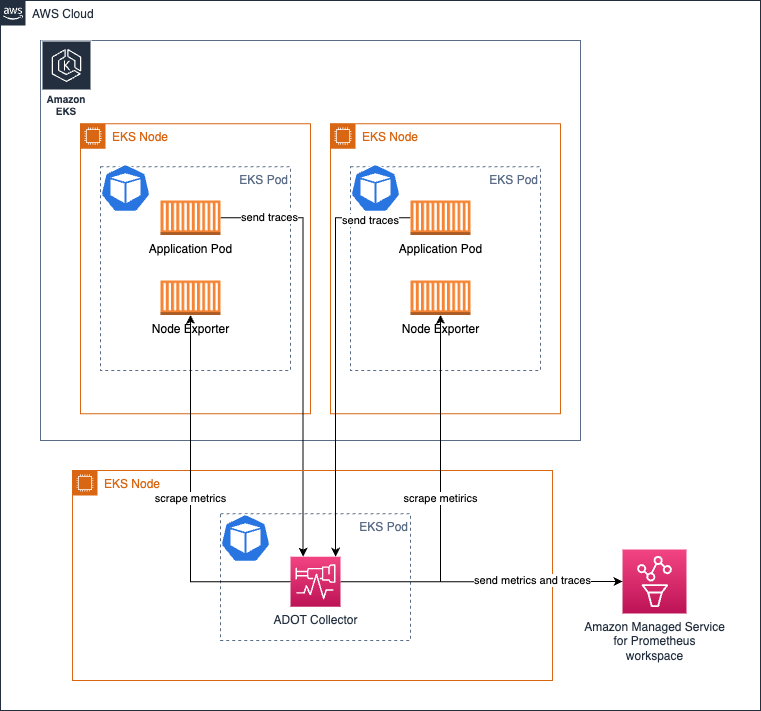
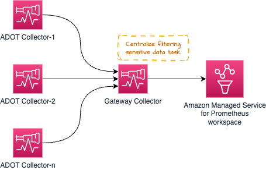
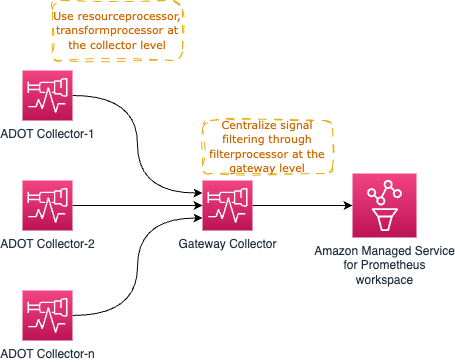

# AWS Distro for OpenTelemetry (ADOT) Collector の運用

[ADOT Collector](https://aws-otel.github.io/) は、[CNCF](https://www.cncf.io/) によるオープンソースの [OpenTelemetry Collector](https://opentelemetry.io/docs/collector/) のダウンストリーム配布版です。

お客様は ADOT Collector を使用して、オンプレミス、AWS、その他のクラウドプロバイダーなど、さまざまな環境からメトリクスやトレースなどのシグナルを収集できます。

実際の環境で ADOT Collector を大規模に運用するためには、オペレーターは Collector の健全性を監視し、必要に応じてスケールする必要があります。このガイドでは、本番環境で ADOT Collector を運用するために取るべきアクションについて学びます。


## デプロイメントアーキテクチャ

要件に応じて、検討すべきいくつかのデプロイメントオプションがあります。

* コレクターなし
* エージェント
* ゲートウェイ


:::tip
    これらの概念に関する追加情報については、[OpenTelemetry のドキュメント](https://opentelemetry.io/docs/collector/deployment/)
    をご確認ください。
:::


### コレクターなし
このオプションは、基本的にコレクターを完全に除外します。ご存知かもしれませんが、OTEL SDK から直接宛先サービスへの API 呼び出しを行い、シグナルを送信することが可能です。例えば、ADOT Collector のようなプロセス外エージェントにスパンを送信する代わりに、アプリケーションプロセスから直接 AWS X-Ray の [PutTraceSegments](https://docs.aws.amazon.com/ja_jp/xray/latest/api/API_PutTraceSegments.html) API を呼び出すことを想像してみてください。

このアプローチに関する AWS 固有の側面はないため、より詳細な情報については、上流のドキュメントの[セクション](https://opentelemetry.io/docs/collector/deployment/no-collector/)を参照することを強くお勧めします。


### エージェント
このアプローチでは、コレクターを分散方式で実行し、シグナルを各送信先に収集します。`No Collector` オプションとは異なり、ここでは関心事を分離し、アプリケーションがリソースを使用してリモート API コールを行う必要性を切り離し、代わりにローカルでアクセス可能なエージェントと通信します。

基本的に、Amazon EKS 環境では以下のように **コレクターを Kubernetes のサイドカーとして実行します：**


上記のアーキテクチャでは、コレクターがアプリケーションコンテナと同じ Pod で実行されているため、`localhost` からターゲットをスクレイピングすることになります。そのため、スクレイプ設定でサービスディスカバリーメカニズムを使用する必要はありません。

同じアーキテクチャはトレースの収集にも適用されます。[ここに示されている](https://aws-otel.github.io/docs/getting-started/x-ray#sample-collector-configuration-putting-it-together)ように、OTEL パイプラインを作成するだけです。


##### メリットとデメリット
* この設計を支持する一つの論点は、ターゲットがローカルホストのソースに限定されているため、Collector が作業を行うために特別に多くのリソース（CPU、メモリ）を割り当てる必要がないことです。

* このアプローチを使用することのデメリットは、Collector Pod の設定の多様性が、クラスター上で実行しているアプリケーションの数に比例することです。
つまり、各 Pod の予想されるワークロードに応じて、CPU、メモリ、その他のリソース割り当てを個別に管理する必要があります。これに注意を払わないと、Collector Pod に対してリソースを過剰に割り当てたり、過少に割り当てたりする可能性があり、その結果、パフォーマンスが低下したり、ノード内の他の Pod が使用できるはずの CPU サイクルやメモリを占有してしまう可能性があります。

また、ニーズに応じて、Deployment、DaemonSet、StatefulSet などの他のモデルで Collector をデプロイすることもできます。


#### Amazon EKS で Collector を Daemonset として実行する

Collector の負荷（メトリクスのスクレイピングと Amazon Managed Service for Prometheus ワークスペースへの送信）を EKS ノード全体に均等に分散させたい場合は、Collector を [Daemonset](https://kubernetes.io/docs/concepts/workloads/controllers/daemonset/) として実行することができます。


Collector が自身のホスト/ノードからのみターゲットをスクレイピングするように、`keep` アクションを設定していることを確認してください。

参考として以下のサンプルをご覧ください。より詳細な設定については[こちら](https://aws-otel.github.io/docs/getting-started/adot-eks-add-on/config-advanced#daemonset-collector-configuration)をご覧ください。

```yaml
scrape_configs:
    - job_name: kubernetes-apiservers
    bearer_token_file: /var/run/secrets/kubernetes.io/serviceaccount/token
    kubernetes_sd_configs:
    - role: endpoints
    relabel_configs:
    - action: keep
        regex: $K8S_NODE_NAME
        source_labels: [__meta_kubernetes_endpoint_node_name]
    scheme: https
    tls_config:
        ca_file: /var/run/secrets/kubernetes.io/serviceaccount/ca.crt
        insecure_skip_verify: true
```

同じアーキテクチャはトレースの収集にも使用できます。この場合、Collector がエンドポイントに接続して Prometheus メトリクスをスクレイピングする代わりに、アプリケーション Pod からトレーススパンが Collector に送信されます。


##### 長所と短所
**利点**

* スケーリングの懸念が最小限
* 高可用性の設定が課題
* 使用中の Collector のコピーが多すぎる
* ログのサポートが容易になる可能性がある

**欠点**

* リソース利用の観点から最適ではない
* リソース割り当てが不均衡


#### Amazon EC2 上でのコレクターの実行

EC2 上でコレクターを実行する場合、サイドカーアプローチはありません。EC2 インスタンス上でエージェントとしてコレクターを実行することになります。以下のような静的なスクレイプ設定を行うことで、インスタンス内のメトリクスをスクレイプするターゲットを発見できます。

以下の設定は、localhost 上のポート `9090` と `8081` のエンドポイントをスクレイプします。

このトピックについて実践的な深い経験を得るには、[One Observability Workshop の EC2 に焦点を当てたモジュール](https://catalog.workshops.aws/observability/en-US/aws-managed-oss/ec2-monitoring)をご覧ください。

```yaml
global:
  scrape_interval: 15s # デフォルトでは、15 秒ごとにターゲットをスクレイプします。

scrape_configs:
- job_name: 'prometheus'
  static_configs:
  - targets: ['localhost:9090', 'localhost:8081']
```


#### Amazon EKS 上で Deployment としてコレクターを実行する

コレクターを Deployment として実行することは、コレクターの高可用性を提供したい場合に特に有用です。ターゲットの数、スクレイプ可能なメトリクスなどに応じて、コレクターのリソースを調整する必要があります。これにより、コレクターがリソース不足に陥り、シグナル収集に問題が生じることを防ぎます。

[このトピックについて、ガイドでさらに詳しく読むことができます。](/observability-best-practices/ja/guides/containers/oss/eks/best-practices-metrics-collection)

以下のアーキテクチャは、メトリクスとトレースを収集するために、ワークロードノードとは別のノードにコレクターがデプロイされる様子を示しています。



メトリクス収集の高可用性をセットアップするには、[詳細な手順を提供するドキュメントをお読みください](https://docs.aws.amazon.com/ja_jp/prometheus/latest/userguide/Send-high-availability-prom-community.html)


#### Amazon ECS でメトリクス収集のためにコレクターを中央タスクとして実行する

[ECS Observer 拡張機能](https://github.com/open-telemetry/opentelemetry-collector-contrib/tree/main/extension/observer/ecsobserver) を使用して、ECS クラスター内または複数のクラスター間で異なるタスクの Prometheus メトリクスを収集できます。


拡張機能のサンプルコレクター設定:

```yaml
extensions:
  ecs_observer:
    refresh_interval: 60s # フォーマットは https://golang.org/pkg/time/#ParseDuration
    cluster_name: 'Cluster-1' # クラスター名は手動で設定する必要があります
    cluster_region: 'us-west-2' # リージョンは直接設定するか、AWS_REGION 環境変数を使用します
    result_file: '/etc/ecs_sd_targets.yaml' # ファイルのディレクトリは既に存在している必要があります
    services:
      - name_pattern: '^retail-.*$'
    docker_labels:
      - port_label: 'ECS_PROMETHEUS_EXPORTER_PORT'
    task_definitions:
      - job_name: 'task_def_1'
        metrics_path: '/metrics'
        metrics_ports:
          - 9113
          - 9090
        arn_pattern: '.*:task-definition/nginx:[0-9]+'
```


##### 長所と短所
* このモデルの利点は、自身で管理するコレクターと設定が少ないことです。
* クラスターが非常に大きく、スクレイピングするターゲットが数千にも及ぶ場合、負荷がコレクター間で均等に分散されるようにアーキテクチャを慎重に設計する必要があります。
* 高可用性の理由から、ほぼ同じコレクターを複数実行する必要がありますが、運用上の問題を避けるために注意深く行う必要があります。


### ゲートウェイ


## コレクターの健全性管理

OTEL コレクターは、その健全性とパフォーマンスを監視するためのいくつかのシグナルを公開しています。以下のような是正措置を講じるために、コレクターの健全性を綿密に監視することが不可欠です。

* コレクターを水平方向にスケーリングする
* コレクターが望ましい機能を発揮できるように追加リソースをプロビジョニングする


### コレクターからのヘルスメトリクスの収集

OTEL コレクターは、`service` パイプラインに `telemetry` セクションを追加するだけで、Prometheus Exposition フォーマットでメトリクスを公開するように設定できます。コレクターは自身のログを標準出力にも公開できます。

テレメトリー設定の詳細については、[OpenTelemetry のドキュメント](https://opentelemetry.io/docs/collector/configuration/#service)をご覧ください。

コレクターのテレメトリー設定のサンプルは以下の通りです。

```yaml
service:
  telemetry:
    logs:
      level: debug
    metrics:
      level: detailed
      address: 0.0.0.0:8888
```

設定が完了すると、コレクターは `http://localhost:8888/metrics` で以下のようなメトリクスのエクスポートを開始します。

```bash


# HELP otelcol_exporter_enqueue_failed_spans 送信キューに追加できなかったスパンの数。


# TYPE otelcol_exporter_enqueue_failed_spans counter
otelcol_exporter_enqueue_failed_spans{exporter="awsxray",service_instance_id="523a2182-539d-47f6-ba3c-13867b60092a",service_name="aws-otel-collector",service_version="v0.25.0"} 0


# HELP otelcol_process_runtime_total_sys_memory_bytes OS から取得したメモリの総バイト数（'go doc runtime.MemStats.Sys' を参照）


# TYPE otelcol_process_runtime_total_sys_memory_bytes gauge
otelcol_process_runtime_total_sys_memory_bytes{service_instance_id="523a2182-539d-47f6-ba3c-13867b60092a",service_name="aws-otel-collector",service_version="v0.25.0"} 2.4462344e+07


# HELP otelcol_process_memory_rss 合計物理メモリ（常駐セットサイズ）


# TYPE otelcol_process_memory_rss gauge
otelcol_process_memory_rss{service_instance_id="523a2182-539d-47f6-ba3c-13867b60092a",service_name="aws-otel-collector",service_version="v0.25.0"} 6.5675264e+07


# HELP otelcol_exporter_enqueue_failed_metric_points 送信キューに追加できなかったメトリクスポイントの数。


# TYPE otelcol_exporter_enqueue_failed_metric_points counter
otelcol_exporter_enqueue_failed_metric_points{exporter="awsxray",service_instance_id="d234b769-dc8a-4b20-8b2b-9c4f342466fe",service_name="aws-otel-collector",service_version="v0.25.0"} 0
otelcol_exporter_enqueue_failed_metric_points{exporter="logging",service_instance_id="d234b769-dc8a-4b20-8b2b-9c4f342466fe",service_name="aws-otel-collector",service_version="v0.25.0"} 0
```

上記のサンプル出力では、コレクターが `otelcol_exporter_enqueue_failed_spans` というメトリクスを公開しているのが分かります。これは送信キューに追加できなかったスパンの数を示しています。このメトリクスは、コレクターが設定された送信先にトレースデータを送信する際に問題が発生しているかどうかを理解するために注視すべきものです。この場合、`exporter` ラベルの値が `awsxray` となっており、使用中のトレース送信先を示しています。

もう 1 つのメトリクス `otelcol_process_runtime_total_sys_memory_bytes` は、コレクターが使用しているメモリ量を理解するための指標です。このメモリ使用量が `otelcol_process_memory_rss` メトリクスの値に近づきすぎると、コレクターがプロセスに割り当てられたメモリを使い果たす寸前であることを示しています。その場合、問題を回避するためにコレクターにより多くのメモリを割り当てるなどの対策を講じる時期かもしれません。

同様に、`otelcol_exporter_enqueue_failed_metric_points` という別のカウンターメトリクスがあります。これはリモート送信先に送信できなかったメトリクスの数を示しています。


#### コレクターのヘルスチェック
コレクターが稼働しているかどうかを確認するために、コレクターはライブネスプローブを公開しています。このエンドポイントを使用して、定期的にコレクターの可用性をチェックすることをお勧めします。

[`healthcheck`](https://github.com/open-telemetry/opentelemetry-collector-contrib/tree/main/extension/healthcheckextension) 拡張機能を使用して、コレクターにエンドポイントを公開させることができます。以下にサンプル設定を示します：

```yaml
extensions:
  health_check:
    endpoint: 0.0.0.0:13133
```

完全な設定オプションについては、[こちらの GitHub リポジトリ](https://github.com/open-telemetry/opentelemetry-collector-contrib/tree/main/extension/healthcheckextension)を参照してください。

```bash
❯ curl -v http://localhost:13133
*   Trying 127.0.0.1:13133...
* Connected to localhost (127.0.0.1) port 13133 (#0)
> GET / HTTP/1.1
> Host: localhost:13133
> User-Agent: curl/7.79.1
> Accept: */*
>
* Mark bundle as not supporting multiuse
< HTTP/1.1 200 OK
< Date: Fri, 24 Feb 2023 19:09:22 GMT
< Content-Length: 0
<
* Connection #0 to host localhost left intact
```


#### 壊滅的な障害を防ぐための制限設定

どの環境でもリソース（CPU、メモリ）には限りがあるため、予期せぬ状況による障害を避けるためにコレクターコンポーネントに制限を設定する必要があります。

特に、Prometheus メトリクスを収集するために ADOT Collector を運用する場合は重要です。
次のシナリオを考えてみましょう。あなたは DevOps チームの一員で、Amazon EKS クラスターに ADOT Collector をデプロイし運用する責任があります。アプリケーションチームは、いつでも自由にアプリケーションの Pod をデプロイでき、それらの Pod から公開されるメトリクスが Amazon Managed Service for Prometheus ワークスペースに収集されることを期待しています。

このパイプラインが問題なく機能することを確保するのはあなたの責任です。この問題を解決するには、大きく分けて 2 つの方法があります：

* コレクターを無限にスケーリングする（必要に応じてクラスターにノードを追加する）ことで、この要件をサポートする
* メトリクス収集に制限を設定し、上限をアプリケーションチームに周知する

どちらのアプローチにもメリットとデメリットがあります。コストやオーバーヘッドを考慮せずに、成長し続けるビジネスニーズを完全にサポートすることを約束するなら、オプション 1 を選択することもできます。無限にスケーラブルなクラウドの観点からは、ビジネスニーズの無限の成長をサポートすることは魅力的に聞こえるかもしれません。しかし、これは多くの運用上のオーバーヘッドをもたらし、無限の時間と人的リソースを投入して継続的な中断のない運用を確保しない限り、より壊滅的な状況につながる可能性があります。これは多くの場合、現実的ではありません。

より実用的で賢明なアプローチは、オプション 2 を選択することです。ここでは、運用の境界を明確にするために、任意の時点で上限を設定し（そして必要に応じて徐々に増やしていく）ます。

以下は、ADOT Collector で Prometheus レシーバーを使用してこれを実現する方法の例です。

Prometheus の [scrape_config](https://prometheus.io/docs/prometheus/latest/configuration/configuration/#relabel_config) では、特定のスクレイプジョブに対していくつかの制限を設定できます。以下のような制限を設定できます：

* スクレイプの総ボディサイズ
* 受け入れるラベルの数を制限する（この制限を超えるとスクレイプは破棄され、コレクターのログで確認できます）
* スクレイプするターゲットの数を制限する
* ...その他

利用可能なすべてのオプションは [Prometheus のドキュメント](https://prometheus.io/docs/prometheus/latest/configuration/configuration/#relabel_config) で確認できます。


##### メモリ使用量の制限
Collector パイプラインは、[`memorylimiterprocessor`](https://github.com/open-telemetry/opentelemetry-collector/tree/main/processor/memorylimiterprocessor) を使用するように設定でき、プロセッサコンポーネントが使用するメモリ量を制限できます。顧客が、大量のメモリと CPU リソースを必要とする複雑な操作を Collector に実行させたいと考えるのはよくあることです。

[`redactionprocessor`](https://github.com/open-telemetry/opentelemetry-collector-contrib/tree/main/processor/redactionprocessor)、[`filterprocessor`](https://github.com/open-telemetry/opentelemetry-collector-contrib/tree/main/processor/filterprocessor)、[`spanprocessor`](https://github.com/open-telemetry/opentelemetry-collector-contrib/tree/main/processor/spanprocessor) などのプロセッサの使用は魅力的で非常に有用ですが、一般的にプロセッサはデータ変換タスクを扱い、タスクを完了するためにデータをメモリ内に保持する必要があることも覚えておく必要があります。これにより、特定のプロセッサが Collector 全体を破壊したり、Collector が自身のヘルスメトリクスを公開するのに十分なメモリを持てなくなる可能性があります。

[`memorylimiterprocessor`](https://github.com/open-telemetry/opentelemetry-collector/tree/main/processor/memorylimiterprocessor) を使用して、Collector が使用できるメモリ量を制限することでこれを回避できます。この推奨事項は、Collector がヘルスメトリクスの公開や他のタスクの実行に使用するためのバッファメモリを提供し、プロセッサが割り当てられたメモリをすべて使用しないようにすることです。

例えば、EKS Pod のメモリ制限が `10Gi` の場合、`memorylimitprocessor` を `10Gi` 未満、例えば `9Gi` に設定し、`1Gi` のバッファをヘルスメトリクスの公開、レシーバーやエクスポーターのタスクなど、他の操作の実行に使用できるようにします。


#### バックプレッシャー管理

以下に示すようなアーキテクチャパターン（ゲートウェイパターン）は、コンプライアンス要件を維持するためにシグナルデータから機密データをフィルタリングするなど（ただしこれに限定されない）、いくつかの運用タスクを一元化するために使用できます。



しかし、ゲートウェイコレクターに多くの_処理_タスクを負わせすぎると問題が発生する可能性があります。推奨されるアプローチは、プロセス/メモリを多く使用するタスクを個々のコレクターとゲートウェイの間で分散させ、ワークロードを共有することです。

例えば、[`resourceprocessor`](https://github.com/open-telemetry/opentelemetry-collector-contrib/tree/main/processor/resourceprocessor) を使用してリソース属性を処理し、[`transformprocessor`](https://github.com/open-telemetry/opentelemetry-collector-contrib/tree/main/processor/transformprocessor) を使用して、シグナル収集が行われるとすぐに個々のコレクター内からシグナルデータを変換することができます。

その後、[`filterprocessor`](https://github.com/open-telemetry/opentelemetry-collector-contrib/tree/main/processor/filterprocessor) を使用してシグナルデータの特定の部分をフィルタリングし、[`redactionprocessor`](https://github.com/open-telemetry/opentelemetry-collector-contrib/tree/main/processor/redactionprocessor) を使用してクレジットカード番号などの機密情報を編集することができます。

高レベルのアーキテクチャ図は以下のようになります：



すでにお気づきかもしれませんが、ゲートウェイコレクターはすぐに単一障害点になる可能性があります。明らかな選択肢の 1 つは、複数のゲートウェイコレクターをスピンアップし、以下に示すように [AWS Application Load Balancer (ALB)](https://aws.amazon.com/jp/elasticloadbalancing/application-load-balancer/) のようなロードバランサーを通じてリクエストをプロキシすることです。


##### Prometheus メトリクス収集における順序外サンプルの処理

以下のアーキテクチャにおけるシナリオを考えてみましょう：


1. Amazon EKS クラスター内の **ADOT Collector-1** からのメトリクスが、**Gateway ADOT Collector-1** に向けられているゲートウェイクラスターに送信されると仮定します。
2. しばらくすると、同じ **ADOT Collector-1** からのメトリクス（同じターゲットを収集しているため、同じメトリクスサンプルが扱われています）が **Gateway ADOT Collector-2** に送信されます。
3. ここで、**Gateway ADOT Collector-2** が先に Amazon Managed Service for Prometheus ワークスペースにメトリクスを送信し、その後で同じメトリクスシリーズの古いサンプルを含む **Gateway ADOT Collector-1** が続いた場合、Amazon Managed Service for Prometheus から `out of order sample` エラーを受け取ることになります。

以下にエラーの例を示します：

```bash
エラーメッセージ：
 2023-03-02T21:18:54.447Z        error   exporterhelper/queued_retry.go:394      エクスポートに失敗しました。このエラーは再試行できません。データを破棄します。    {"kind": "exporter", "data_type": "metrics", "name": "prometheusremotewrite", "error": "永続的なエラー：永続的なエラー：リモート書き込みが HTTP ステータス 400 Bad Request を返しました。エラー = %!w(<nil>): user=820326043460_ws-5f42c3b6-3268-4737-b215-1371b55a9ef2: エラー：順序外のサンプル。タイムスタンプ=2023-03-02T21:17:59.782Z、シリーズ={__name__=\"otelcol_exporter_send_failed_metric_points\", exporter=\"logging\", http_scheme=\"http\", instance=\"10.195.158.91:28888\", ", "dropped_items": 6474}
go.opentelemetry.io/collector/exporter/exporterhelper.(*retrySender).send
        go.opentelemetry.io/collector@v0.66.0/exporter/exporterhelper/queued_retry.go:394
go.opentelemetry.io/collector/exporter/exporterhelper.(*metricsSenderWithObservability).send
        go.opentelemetry.io/collector@v0.66.0/exporter/exporterhelper/metrics.go:135
go.opentelemetry.io/collector/exporter/exporterhelper.(*queuedRetrySender).start.func1
        go.opentelemetry.io/collector@v0.66.0/exporter/exporterhelper/queued_retry.go:205
go.opentelemetry.io/collector/exporter/exporterhelper/internal.(*boundedMemoryQueue).StartConsumers.func1
        go.opentelemetry.io/collector@v0.66.0/exporter/exporterhelper/internal/bounded_memory_queue.go:61
```


###### サンプルの順序エラーの解決

この特定のセットアップでサンプルの順序エラーを解決するには、いくつかの方法があります：

* スティッキーロードバランサーを使用して、特定のソースからのリクエストを IP アドレスに基づいて同じターゲットに向けます。

  詳細については、[こちらのリンク](https://aws.amazon.com/premiumsupport/knowledge-center/elb-route-requests-with-source-ip-alb/)を参照してください。

* 代替オプションとして、Gateway Collectors に外部ラベルを追加して、メトリクスシリーズを区別することができます。これにより、Amazon Managed Service for Prometheus はこれらのメトリクスを個別のメトリクスシリーズとみなし、同じものからのものではないと判断します。

:::warning
        この解決策を使用すると、セットアップ内の Gateway Collectors の数に比例してメトリクスシリーズが増加します。これは、[`アクティブな時系列の制限`](https://docs.aws.amazon.com/ja_jp/prometheus/latest/userguide/AMP_quotas.html) などの一部の制限を超える可能性があることを意味します。
:::

* **ADOT Collector を Daemonset としてデプロイする場合**：`relabel_configs` を使用して、各 ADOT Collector Pod が実行されている同じノードからのサンプルのみを保持するようにしてください。詳細については、以下のリンクを確認してください。
    - [Amazon Managed Prometheus の高度な Collector 設定](https://aws-otel.github.io/docs/getting-started/adot-eks-add-on/config-advanced) - *Click to View* セクションを展開し、以下のような項目を探してください：
        ```yaml
            relabel_configs:
            - action: keep
              regex: $K8S_NODE_NAME
        ```
    - [ADOT アドオンの高度な設定](https://aws-otel.github.io/docs/getting-started/adot-eks-add-on/add-on-configuration) - ADOT アドオンを使用して EKS の高度な設定で ADOT Collector をデプロイする方法を学びます。
    - [ADOT Collector のデプロイ戦略](https://aws-otel.github.io/docs/getting-started/adot-eks-add-on/installation#deploy-the-adot-collector) - ADOT Collector を大規模にデプロイするための異なる選択肢と、各アプローチの利点について詳しく学びます。


#### Open Agent Management Protocol (OpAMP)

OpAMP は、HTTP および WebSocket を介した通信をサポートするクライアント/サーバープロトコルです。OpAMP は OTel Collector に実装されているため、OTel Collector 自体のように OpAMP をサポートする他のエージェントを管理するためのコントロールプレーンの一部としてサーバーとして使用できます。ここでの「管理」とは、Collector の設定を更新したり、健全性を監視したり、さらには Collector をアップグレードしたりする機能を含みます。

このプロトコルの詳細は、[上流の OpenTelemetry ウェブサイトでよく文書化されています。](https://opentelemetry.io/docs/collector/management/)


### 水平スケーリング
ワークロードによっては、ADOT Collector を水平方向にスケーリングする必要が生じる場合があります。水平スケーリングの必要性は、ユースケース、Collector の設定、テレメトリのスループットに完全に依存します。

プラットフォーム固有の水平スケーリング技術は、ステートフル、ステートレス、スクレイパーの Collector コンポーネントを意識しながら、他のアプリケーションと同様に Collector に適用できます。

ほとんどの Collector コンポーネントは `ステートレス` です。つまり、メモリ内に状態を保持せず、保持していてもスケーリングの目的には関係ありません。ステートレスな Collector の追加レプリカは、アプリケーションロードバランサーの背後でスケーリングできます。

`ステートフル` な Collector コンポーネントは、そのコンポーネントの動作に不可欠な情報をメモリ内に保持するコンポーネントです。

ADOT Collector のステートフルコンポーネントの例には、以下のようなものがありますが、これらに限定されません：

* [Tail Sampling Processor](https://github.com/open-telemetry/opentelemetry-collector-contrib/tree/main/processor/tailsamplingprocessor) - 正確なサンプリング決定を行うために、トレースのすべてのスパンを必要とします。高度なサンプリングスケーリング技術は [ADOT 開発者ポータルに文書化されています](https://aws-otel.github.io/docs/getting-started/advanced-sampling)。
* [AWS EMF Exporter](https://github.com/open-telemetry/opentelemetry-collector-contrib/tree/main/exporter/awsemfexporter) - 一部のメトリクスタイプで累積からデルタへの変換を実行します。この変換には、前回のメトリクス値をメモリに保存する必要があります。
* [Cummulative to Delta Processor](https://github.com/open-telemetry/opentelemetry-collector-contrib/tree/main/processor/cumulativetodeltaprocessor#cumulative-to-delta-processor) - 累積からデルタへの変換には、前回のメトリクス値をメモリに保存する必要があります。

`スクレイパー` である Collector コンポーネントは、テレメトリデータを受動的に受け取るのではなく、積極的に取得します。現在、[Prometheus receiver](https://github.com/open-telemetry/opentelemetry-collector-contrib/tree/main/receiver/prometheusreceiver) が ADOT Collector 内で唯一のスクレイパータイプのコンポーネントです。Prometheus receiver を含む Collector 設定を水平方向にスケーリングする場合、2 つの Collector が同じエンドポイントをスクレイプしないように、Collector ごとにスクレイピングジョブを分割する必要があります。これを行わないと、Prometheus のサンプル順序エラーが発生する可能性があります。

Collector のスケーリングのプロセスと技術については、[上流の OpenTelemetry ウェブサイトでより詳細に文書化されています](https://opentelemetry.io/docs/collector/scaling/)。
