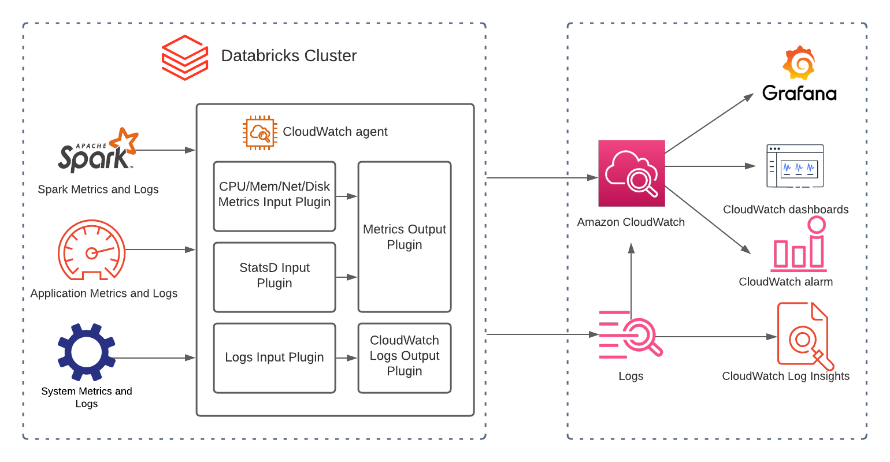

# AWS における Databricks のモニタリングとオブザーバビリティのベストプラクティス

Databricks はデータ分析と AI/ML ワークロードを管理するためのプラットフォームです。このガイドは、[AWS 上の Databricks](https://aws.amazon.com/jp/solutions/partners/databricks/) を実行しているお客様が、オブザーバビリティのための AWS ネイティブサービスまたは OpenSource 管理サービスを使用してこれらのワークロードを監視するのをサポートすることを目的としています。

## Databricks を監視する理由

Databricks クラスターを管理する運用チームは、統合されたカスタマイズ済みのダッシュボードを持つことで、ワークロードのステータス、エラー、パフォーマンスのボトルネックを追跡し、時間の経過に伴う総リソース使用量や、エラーの割合などの望ましくない動作に対するアラートを受け取り、さらにルートコース分析のための集中ロギングや、カスタマイズされた追加のメトリクスを抽出することができます。

## モニタリングすべき対象

Databricks は、クラスターインスタンス内で Apache Spark を実行しています。Apache Spark には、メトリクスを公開するネイティブ機能があります。これらのメトリクスから、ドライバー、ワーカー、およびクラスター内で実行されているワークロードに関する情報が得られます。

Spark を実行しているインスタンスには、ストレージ、CPU、メモリー、ネットワークに関する有用な情報も含まれています。Databricks クラスターのパフォーマンスに影響を与える可能性のある外的要因を理解することが重要です。多数のインスタンスを持つクラスターの場合は、ボトルネックと全体的な健全性を把握することも重要です。

## モニタリングの方法

コレクターとその依存関係をインストールするには、Databricks init スクリプトが必要です。これらは、Databricks クラスターの各インスタンスで起動時に実行されるスクリプトです。

Databricks クラスターには、インスタンスプロファイルを使用してメトリクスとログを送信する権限も必要です。

最後に、Databricks クラスターの Spark 構成でメトリクスの名前空間を設定することが推奨されます。この際、`testApp` を適切なクラスター参照に置き換えてください。

*図 1: メトリクス名前空間の Spark 構成例*

## 優れた Observability ソリューションの主要な部分

**1) メトリクス:** メトリクスは、一定期間で測定された活動や特定のプロセスを表す数値です。Databricks におけるさまざまなメトリクスは以下のとおりです。

- システムリソースレベルのメトリクス (CPU、メモリ、ディスク、ネットワークなど)
- Custom Metrics Source、StreamingQueryListener、QueryExecutionListener を使用したアプリケーションメトリクス
- MetricsSystem によって公開される Spark メトリクス

**2) ログ:** ログは発生したシリアルイベントの表現であり、それらについての直線的なストーリーを伝えます。Databricks におけるさまざまなログは以下のとおりです。

- イベントログ
- 監査ログ
- ドライバーログ: stdout、stderr、log4j カスタムログ (構造化ロギングを有効化)
- エグゼキューターログ: stdout、stderr、log4j カスタムログ (構造化ロギングを有効化)

**3) トレース:** スタックトレースは、エンドツーエンドの可視性を提供し、ステージを通じた全体の流れを示します。これは、エラーやパフォーマンス問題の原因となるステージ/コードを特定するためのデバッグに役立ちます。

**4) ダッシュボード:** ダッシュボードは、アプリケーション/サービスの主要なメトリクスの概要を提供します。

**5) アラート:** アラートは、注意を要する状況をエンジニアに通知します。

## AWS ネイティブなオブザーバビリティオプション

Ganglia UI やログ配信などのネイティブソリューションは、システムメトリクスを収集したり、Apache Spark™ メトリクスを照会したりするのに優れたソリューションです。しかし、改善の余地がある部分もあります。

- Ganglia はアラートに対応していません。
- Ganglia はログから派生したメトリクス (例: ERROR ログの増加率) を作成できません。
- データの正確性、フレッシュ度、エンドツーエンドのレイテンシーに関連する SLO (Service Level Objectives) や SLI (Service Level Indicators) を追跡し、Ganglia で可視化するためのカスタムダッシュボードを使用できません。

[Amazon CloudWatch](https://aws.amazon.com/jp/cloudwatch/) は、AWS 上の Databricks クラスターを監視および管理するための重要なツールです。クラスターのパフォーマンスに関する貴重な洞察を提供し、問題を迅速に特定して解決するのに役立ちます。Databricks と CloudWatch を統合し、構造化ログを有効にすることで、これらの領域を改善できます。CloudWatch Application Insights は、ログに含まれるフィールドを自動的に検出し、CloudWatch Logs Insights は高速なデバッグと分析のためのクエリ言語を提供します。

*図2: Databricks CloudWatch アーキテクチャ*

Databricks を監視するための CloudWatch の使用方法の詳細については、以下を参照してください。
[How to Monitor Databricks with Amazon CloudWatch](https://aws.amazon.com/blogs/mt/how-to-monitor-databricks-with-amazon-cloudwatch/)

## オープンソースソフトウェアのオブザーバビリティオプション

[Amazon Managed Service for Prometheus](https://aws.amazon.com/jp/prometheus/) は、Prometheus 互換のマネージド型サーバーレスモニタリングサービスで、メトリクスの保存とメトリクスに基づくアラートの管理を行います。Prometheus は、Kubernetes に次いで Cloud Native Computing Foundation の第 2 のプロジェクトとして人気のあるオープンソースのモニタリングテクノロジーです。

[Amazon Managed Grafana](https://aws.amazon.com/jp/grafana/) は、Grafana のマネージドサービスです。Grafana は、オブザーバビリティに一般的に使用される時系列データの可視化のためのオープンソーステクノロジーです。Amazon Managed Service for Prometheus、Amazon CloudWatch などさまざまなソースからデータを可視化するために Grafana を使用できます。Databricks のメトリクスとアラートを可視化するために使用されます。

[AWS Distro for OpenTelemetry](https://aws-otel.github.io/) は、トレースとメトリクスを収集するためのオープンソースの標準、ライブラリ、サービスを提供する OpenTelemetry プロジェクトの AWS サポート版です。OpenTelemetry を通じて、Prometheus や StatsD などさまざまなオブザーバビリティデータ形式を収集し、このデータを強化して、CloudWatch や Amazon Managed Service for Prometheus などさまざまな宛先に送信できます。

### ユースケース

AWS ネイティブサービスは Databricks クラスターに必要なオブザーバビリティを提供しますが、オープンソースの管理サービスを使用する方が最適な場合もあります。

Prometheus と Grafana はとても人気のある技術で、多くの企業ですでに使用されています。オブザーバビリティのための AWS オープンソースサービスを利用すれば、運用チームは既存のインフラストラクチャ、同じクエリ言語、既存のダッシュボードやアラートを使って Databricks ワークロードを監視できます。これらのサービスのインフラストラクチャ、スケーラビリティ、パフォーマンスを管理する手間はかかりません。

ADOT は、メトリクスやトレースを CloudWatch や Prometheus など、さまざまな宛先に送信する必要があるチーム、または OTLP や StatsD などさまざまなデータソースを扱う必要があるチームにとって最適な選択肢です。

最後に、Amazon Managed Grafana は CloudWatch や Prometheus を含む多くのデータソースをサポートしており、複数のツールを使用することを決めたチームのデータを相関させることができます。これにより、すべての Databricks クラスターのオブザーバビリティを可能にするテンプレートを作成したり、Infrastructure as Code を通じてプロビジョニングと構成を行うための強力な API を利用できます。

*図 3: Databricks オープンソースオブザーバビリティアーキテクチャ*

AWS 管理オープンソースオブザーバビリティサービスを使って Databricks クラスターのメトリクスを監視するには、メトリクスとアラートの可視化に Amazon Managed Grafana ワークスペース、Amazon Managed Grafana ワークスペースのデータソースとして構成された Amazon Managed Service for Prometheus ワークスペースが必要です。

収集が必要な重要なメトリクスには 2 種類あります。Spark メトリクスとノードメトリクスです。

Spark メトリクスには、クラスター内の現在のワーカー数やエグゼキューター数、処理中にノード間でデータをやり取りする際のシャッフル、RAM からディスクへ、ディスクから RAM へのデータ移動であるスピルなどの情報が含まれます。これらのメトリクスを公開するには、Spark ネイティブの Prometheus (バージョン 3.0 以降で利用可能) を Databricks 管理コンソールで有効化し、`init_script` で構成する必要があります。

ディスク使用量、CPU 時間、メモリ、ストレージパフォーマンスなどのノードメトリクスを追跡するには、`node_exporter` を使用します。`node_exporter` は追加の構成なしで使用できますが、重要なメトリクスのみを公開するようにする必要があります。

ADOT コレクターをクラスターの各ノードにインストールし、Spark と `node_exporter` から公開されたメトリクスをスクレイピングし、これらのメトリクスをフィルタリングし、`cluster_name` などのメタデータを注入し、これらのメトリクスを Prometheus ワークスペースに送信する必要があります。

ADOT コレクターと `node_exporter` の両方を `init_script` を使ってインストールおよび構成する必要があります。

Databricks クラスターには、Prometheus ワークスペースにメトリクスを書き込む権限を持つ IAM ロールを設定する必要があります。

## ベストプラクティス

### 価値のあるメトリクスを優先する

Spark と node_exporter はどちらも多数のメトリクスを公開しており、同じメトリクスに対して複数の形式があります。モニタリングとインシデント対応に役立つメトリクスを選別しないと、問題の検出時間が長くなり、サンプルの保存コストが増加し、価値のある情報を見つけ理解するのが難しくなります。OpenTelemetry の Processors を使用すると、価値のあるメトリクスのみを選択して保持したり、意味のないメトリクスを除外したり、AMP に送信する前にメトリクスを集約して計算したりできます。

### アラート疲れを避ける

価値のあるメトリクスが AMP に取り込まれると、アラートを設定することが不可欠です。ただし、リソース使用量の一時的な増加すべてにアラートを設定すると、アラート疲れを引き起こす可能性があります。つまり、ノイズが多すぎると、アラートの重大度に対する信頼性が低下し、重要なイベントが見逃されてしまいます。AMP のアラートルールのグループ化機能を使用すると、複数の関連するアラートが個別の通知を生成するのを避けられます。また、アラートには適切な重大度を設定し、ビジネスの優先順位を反映させる必要があります。

### Amazon Managed Grafana のダッシュボードを再利用する

Amazon Managed Grafana は、Grafana のネイティブテンプレート機能を活用しています。これにより、既存および新規の Databricks クラスターすべてに対してダッシュボードを作成できます。各クラスターごとに可視化を手動で作成し、維持する必要がなくなります。この機能を使用するには、メトリクスに適切なラベルを付けてメトリクスをクラスターごとにグループ化することが重要です。これも OpenTelemetry の Processors で可能です。

## 参考資料と詳細情報

- [Amazon Managed Service for Prometheus ワークスペースの作成](https://docs.aws.amazon.com/ja_jp/prometheus/latest/userguide/AMP-onboard-create-workspace.html)
- [Amazon Managed Grafana ワークスペースの作成](https://docs.aws.amazon.com/ja_jp/grafana/latest/userguide/Amazon-Managed-Grafana-create-workspace.html)
- [Amazon Managed Service for Prometheus データソースの設定](https://docs.aws.amazon.com/ja_jp/grafana/latest/userguide/prometheus-data-source.html)
- [Databricks Init Scripts](https://docs.databricks.com/clusters/init-scripts.html)
