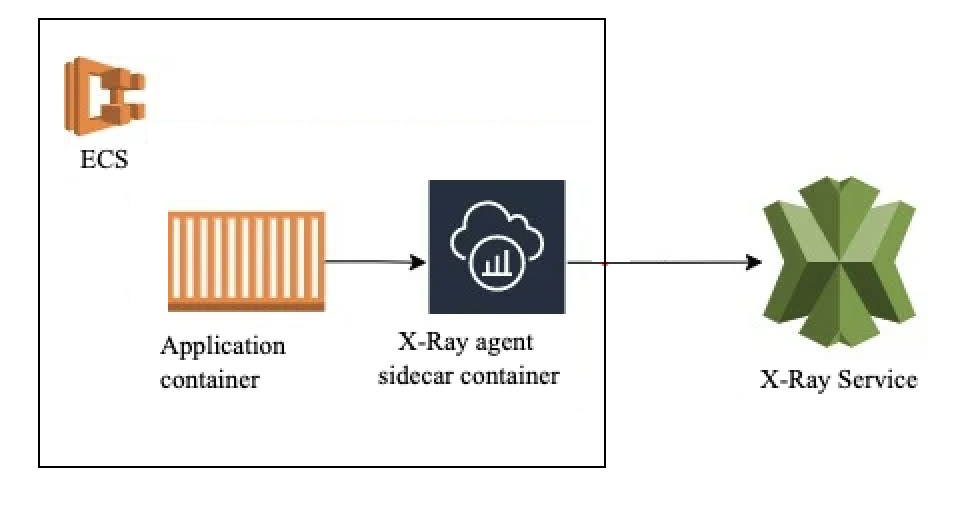

# ECS での AWS X-Ray によるトレーシング

現代のアプリケーション開発の世界では、コンテナ化がアプリケーションのデプロイと管理の事実上の標準となっています。Amazon Elastic Container Service (ECS) は、コンテナ化されたアプリケーションをデプロイおよび管理するための、高度にスケーラブルで信頼性の高いプラットフォームを提供します。しかし、アプリケーションがより分散化され複雑化するにつれ、これらのアプリケーションの信頼性、パフォーマンス、効率を確保するためにオブザーバビリティが不可欠になります。

AWS X-Ray は、ECS 上で実行されるコンテナ化されたアプリケーションのオブザーバビリティを強化する強力な分散トレーシングサービスを提供することで、この課題に対処します。ECS ワークロードと AWS X-Ray を統合することで、アプリケーションの動作とパフォーマンスに関する深い洞察を得ることができる、さまざまな利点と機能を活用できます。

1. **エンドツーエンドの可視性**: AWS X-Ray は、コンテナ化されたアプリケーションと他の AWS サービスを通過するリクエストを追跡し、リクエストのライフサイクル全体のエンドツーエンドビューを提供します。この可視性により、さまざまなマイクロサービス間の相互作用を理解し、潜在的なボトルネックや問題をより効果的に特定できます。

2. **パフォーマンス分析**: X-Ray は、リクエスト待ち時間、エラー率、リソース使用率など、コンテナ化されたアプリケーションの詳細なパフォーマンスメトリクスを収集します。これらのメトリクスを使用して、アプリケーションのパフォーマンスを分析し、パフォーマンスのホットスポットを特定し、リソースの割り当てを最適化できます。

3. **分散トレーシング**: 現代のマイクロサービスアーキテクチャでは、リクエストがしばしば複数のコンテナやサービスを横断します。AWS X-Ray は、これらの分散トレースの統一ビューを提供し、さまざまなコンポーネント間の相互作用を理解し、アプリケーション全体でパフォーマンスデータを相関させることができます。

4. **サービスマップの可視化**: X-Ray は、アプリケーションのコンポーネントとそれらの相互作用を視覚的に表すダイナミックなサービスマップを生成します。これらのサービスマップは、マイクロサービスアーキテクチャの複雑さを理解し、最適化やリファクタリングの可能性のある領域を特定するのに役立ちます。

5. **AWS サービスとの統合**: AWS X-Ray は、AWS Lambda、API Gateway、Amazon ECS、Amazon EKS などの幅広い AWS サービスとシームレスに統合されます。この統合により、複数のサービスを横断してリクエストを追跡し、他の AWS サービスからのログやメトリクスとパフォーマンスデータを相関させることができます。

6. **カスタムインストルメンテーション**: AWS X-Ray は多くの AWS サービスに対してアウトオブボックスのインストルメンテーションを提供しますが、AWS X-Ray SDK を使用してカスタムアプリケーションやサービスにインストルメンテーションを行うこともできます。この機能により、コンテナ化されたアプリケーション内のカスタムコードのパフォーマンスを追跡および分析し、アプリケーションの動作をより包括的に把握できます。

*図1: ECS から X-Ray へのトレーシング送信*

ECS ワークロードのオブザーバビリティ強化のために AWS X-Ray を活用するには、次の一般的な手順に従う必要があります。

1. **カスタムアプリケーションのインストルメンテーション**: AWS X-Ray SDK を使用して、コンテナ化されたアプリケーションにインストルメンテーションを行い、トレースデータを X-Ray に送信します。

2. **インストルメンテーション済みアプリケーションのデプロイ**: インストルメンテーション済みのコンテナ化されたアプリケーションを Amazon ECS クラスターまたはサービスにデプロイします。

3. **トレースデータの分析**: AWS X-Ray コンソールまたは API を使用して、トレースデータを分析し、サービスマップを表示し、コンテナ化されたアプリケーション内のパフォーマンスの問題やボトルネックを調査します。

4. **アラートと通知の設定**: X-Ray メトリクスに基づいて CloudWatch アラームと通知を設定し、ECS ワークロードのパフォーマンス低下や異常を検知したときにアラートを受け取ります。

5. **他のオブザーバビリティツールとの統合**: AWS X-Ray を AWS CloudWatch Logs、Amazon CloudWatch Metrics、AWS Distro for OpenTelemetry などの他のオブザーバビリティツールと組み合わせて、コンテナ化されたアプリケーションのパフォーマンス、ログ、メトリクスを包括的に把握します。

AWS X-Ray は ECS ワークロードに強力なトレーシング機能を提供しますが、トレースデータの量とコスト管理が潜在的な課題となる可能性があることに注意が必要です。コンテナ化されたアプリケーションが拡大し、より多くのトレースデータを生成するようになると、コストを効果的に管理するためにサンプリング戦略を実装したり、トレースデータの保持ポリシーを調整したりする必要が生じる可能性があります。

さらに、トレースデータへのアクセス制御とデータセキュリティを適切に確保することが重要です。AWS X-Ray は、トレースデータの保存時と転送時の暗号化、およびトレースデータの機密性と整合性を保護するための細かいアクセス制御メカニズムを提供しています。

結論として、Amazon ECS ワークロードと AWS X-Ray を統合することは、
