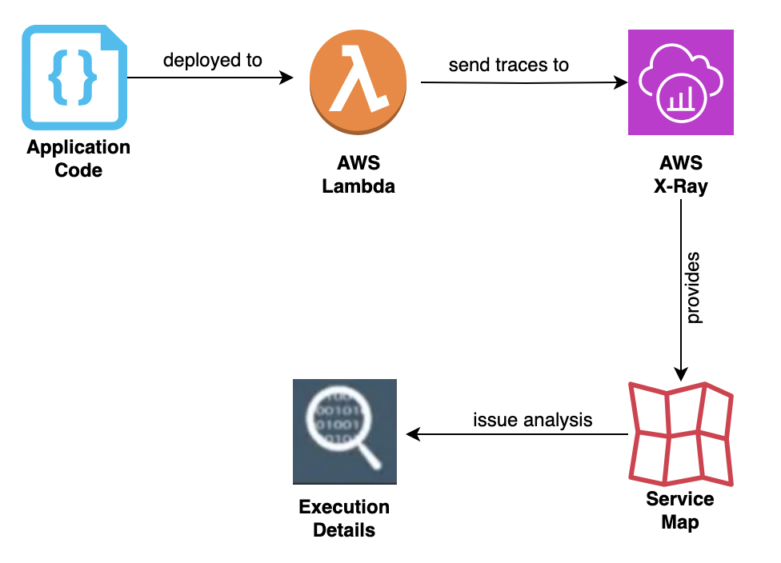

# AWS X-Ray による Lambda のトレーシング

サーバーレスコンピューティングの世界では、アプリケーションの信頼性、パフォーマンス、効率を確保するためにオブザーバビリティが不可欠です。サーバーレスアーキテクチャの中核である AWS Lambda は、基盤となるインフラストラクチャを管理する必要なく、イベント駆動型のコードを実行するための強力でスケーラブルなプラットフォームを提供します。しかし、アプリケーションが分散化・複雑化するにつれ、従来のログ記録とモニタリング手法では、エンドツーエンドのリクエストフローやパフォーマンスを包括的に把握することが困難になります。

AWS X-Ray は、この課題に対処する強力な分散トレーシングサービスで、AWS Lambda で構築されたサーバーレスアプリケーションのオブザーバビリティを強化します。AWS X-Ray を Lambda 関数と統合することで、アプリケーションの動作とパフォーマンスに関する深い洞察を得ることができる様々な利点と機能が得られます。

1. **エンドツーエンドの可視化**: AWS X-Ray は、Lambda 関数や他の AWS サービスを通過するリクエストをトレースし、リクエストのライフサイクル全体をエンドツーエンドで可視化します。この可視化により、コンポーネント間の相互作用を理解し、潜在的なボトルネックや問題を効果的に特定できます。

2. **パフォーマンス分析**: X-Ray は、Lambda 関数の実行時間、コールドスタート時の待ち時間、エラー率などの詳細なパフォーマンスメトリクスを収集します。これらのメトリクスを活用して、サーバーレスアプリケーションのパフォーマンスを分析し、パフォーマンスのホットスポットを特定して、リソース利用を最適化できます。

3. **分散トレーシング**: サーバーレスアーキテクチャでは、リクエストが複数の Lambda 関数や他の AWS サービスを横断することがよくあります。AWS X-Ray は、これらの分散トレースを統一されたビューで提供するため、コンポーネント間の相互作用を理解し、アプリケーション全体でパフォーマンスデータを相関させることができます。

4. **サービスマップの可視化**: X-Ray は、アプリケーションのコンポーネントとそれらの相互作用を視覚的に表現するダイナミックなサービスマップを生成します。これらのサービスマップは、サーバーレスアーキテクチャの複雑さを理解し、最適化やリファクタリングの対象となる可能性のある領域を特定するのに役立ちます。

5. **AWS サービスとの統合**: AWS X-Ray は、AWS Lambda、API Gateway、Amazon DynamoDB、Amazon SQS など、幅広い AWS サービスとシームレスに統合されています。この統合により、複数のサービスにまたがるリクエストをトレースし、他の AWS サービスからのログやメトリクスとパフォーマンスデータを相関させることができます。

6. **カスタムインストルメンテーション**: AWS X-Ray は AWS Lambda 関数に対してアウトオブボックスのインストルメンテーションを提供しますが、AWS X-Ray SDK を使用して Lambda 関数内のカスタムコードをインストルメントすることもできます。この機能により、カスタムロジックのパフォーマンスをトレースおよび分析し、アプリケーションの動作をより包括的に把握できます。

*図1: Lambda から X-Ray にトレースを送信する*

Lambda 関数のオブザーバビリティを強化するために AWS X-Ray を活用するには、以下の一般的な手順に従う必要があります。

1. **X-Ray トレーシングの有効化**: 関数設定を更新するか、AWS Lambda コンソールまたは AWS Serverless Application Model (SAM) を使用して、AWS Lambda 関数でアクティブトレーシングを有効にします。

2. **カスタムコードのインストルメンテーション (オプション)**: Lambda 関数内にカスタムコードがある場合は、AWS X-Ray SDK を使用してコードをインストルメントし、追加のトレースデータを X-Ray に出力できます。

3. **トレースデータの分析**: AWS X-Ray コンソールまたは API を使用して、トレースデータを分析し、サービスマップを表示し、Lambda 関数やサーバーレスアプリケーション内のパフォーマンス問題やボトルネックを調査します。

4. **アラートと通知の設定**: CloudWatch アラームと通知を設定して、Lambda 関数のパフォーマンス低下や異常を検知した際にアラートを受け取ります。

5. **他のオブザーバビリティツールとの統合**: AWS X-Ray を AWS CloudWatch Logs、Amazon CloudWatch Metrics、AWS Lambda Insights などの他のオブザーバビリティツールと組み合わせて、Lambda 関数のパフォーマンス、ログ、メトリクスを包括的に把握します。

AWS X-Ray は Lambda 関数に対して強力なトレーシング機能を提供しますが、トレースデータの量とコスト管理が課題となる可能性があります。サーバーレスアプリケーションが拡大し、より多くのトレースデータが生成されるようになると、コストを効果的に管理するためにサンプリング戦略を実装したり、トレースデータの保持ポリシーを調整したりする必要が生じるかもしれません。

さらに、トレースデータのアクセス制御とデータセキュリティを適切に確保することが重要です。AWS X-Ray は、トレースデータの保存時と転送時の暗号化、および機密性と整合性を保護するための細かいアクセス制御メカニズムを提供しています。

結論として、AWS Lambda 関数に AWS X-Ray を統合することは、サーバーレスアプリケーションのオブザーバビリティを強化するための強力なアプローチです。AWS X-Ray は、リクエストをエンドツーエンドでトレースし、詳細なパフォーマンスメトリクスを提供することで、問題の特定とトラブルシューティング、リソース利用の最適化、サーバーレスアプリケーションの動作とパフォーマンスに関する深い洞察を得ることを可能にします。AWS X-Ray と他の AWS オブザーバビリティサービスを統合することで、クラウド上で高度にオブザーバブルな、信頼性と性能に優れたサーバーレスアプリケーションを構築・維持できます。
