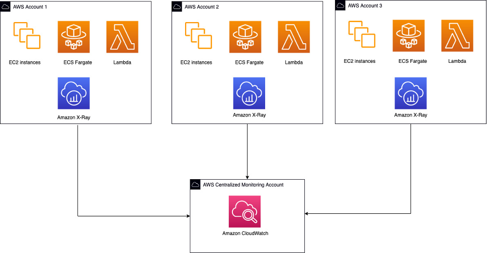

# AWS ネイティブサービスを使用したクロスアカウントモニタリング

現代のクラウド環境の複雑さが増す中、複数の AWS アカウントの管理とモニタリングは、効率的なクラウド運用の重要な側面となっています。AWS のマルチアカウントモニタリングは、複数の AWS アカウントにまたがるリソースのモニタリングと管理を一元化するアプローチを提供し、組織がより良い可視性を獲得し、セキュリティを強化し、運用を効率化することを可能にします。

今日の急速に進化するデジタル環境において、組織は競争力を維持し成長を促進するために常に圧力にさらされています。クラウドコンピューティングは、スケーラビリティ、俊敏性、コスト効率性を提供するゲームチェンジャーとして登場しました。しかし、クラウドの採用が加速し続ける中、これらの環境の管理とモニタリングの複雑さも指数関数的に増加しています。ここで AWS のマルチアカウントモニタリングが重要な役割を果たし、複数の AWS アカウントにまたがるリソースを効率的に管理するための強力なソリューションを提供します。

AWS のマルチアカウントモニタリングは、組織のクラウド運用を大幅に強化できる様々な利点を提供します。主な利点の 1 つは、複数の AWS アカウントからのモニタリングデータを単一のビューに統合する一元化された可視性です。このクラウドインフラストラクチャの包括的なビューにより、組織はリソースの全体像を把握でき、より良い意思決定とリソースの最適化が可能になります。さらに、AWS のマルチアカウントモニタリングは、セキュリティとコンプライアンスの向上に重要な役割を果たします。一貫したセキュリティポリシーを適用し、すべてのアカウントにわたる潜在的な脅威の検出を可能にすることで、組織は脆弱性に積極的に対処し、リスクを軽減できます。また、コンプライアンス要件を効果的にモニタリングし遵守することで、組織が規制フレームワークや業界標準内で運営されることを確保できます。

## 統計：

Gartner によると、2025 年までに新しいデジタルワークロードの 95% 以上がクラウドネイティブプラットフォームにデプロイされると予測されており、堅牢なマルチアカウントモニタリングソリューションの必要性が強調されています。Cloud Conformity の調査によると、25 以上の AWS アカウントを持つ組織は、月平均 223 件の高リスクセキュリティインシデントを経験しており、集中監視とガバナンスの重要性が浮き彫りになっています。Forrester Research は、効果的なクラウドガバナンスとモニタリング戦略を持つ組織は、運用コストを最大 30% 削減できると推定しています。

         *図 1：AWS CloudWatch によるクロスアカウントモニタリング*

## AWS マルチアカウントモニタリングのメリット：

1. **一元化された可視性**：複数の AWS アカウントからのモニタリングデータを単一の画面に統合し、クラウドインフラストラクチャの包括的な視点を提供します。
2. **セキュリティとコンプライアンスの向上**：一貫したセキュリティポリシーを適用し、潜在的な脅威を検出し、すべてのアカウントでコンプライアンスを確保します。
3. **コスト最適化**：未使用または冗長なリソースを特定して排除し、クラウド支出を最適化して無駄を削減します。
4. **効率化された運用**：モニタリングとアラートのプロセスを自動化し、手動の作業を減らして運用効率を向上させます。
5. **スケーラビリティ**：モニタリング機能を損なうことなく、新しい AWS アカウントやリソースを容易にオンボーディングできます。

## AWS マルチアカウントモニタリングのデメリット：

1. **実装の複雑さ**：マルチアカウントモニタリングのセットアップと設定は、特に大規模な環境では困難な場合があります。
2. **データ集約のオーバーヘッド**：複数のアカウントからデータを収集し集約することで、パフォーマンスのオーバーヘッドと遅延が発生する可能性があります。
3. **アクセス管理**：複数のアカウントにまたがるアクセスと権限の管理が複雑になり、エラーが発生しやすくなる可能性があります。
4. **コストへの影響**：適切に行われない場合、包括的なマルチアカウントモニタリングソリューションの実装と維持には追加のコストがかかる可能性があります。

## マルチアカウントモニタリングのための主要な AWS サービスとツール：

1. **AWS Organizations**: 複数の AWS アカウントを一元的に管理・統治し、統合請求、ポリシーベースの管理、アカウントの作成・管理を可能にします。
2. **AWS Config**: リソース構成を継続的に監視・記録し、アカウント間でのコンプライアンス監査と変更追跡を可能にします。
3. **AWS CloudTrail**: セキュリティと運用目的のため、複数の AWS アカウントにわたる API アクティビティとユーザーアクションをログに記録し、監視します。
4. **Amazon CloudWatch**: 一元的なモニタリングとアラートのため、複数のアカウントにわたる様々な AWS リソースからメトリクス、ログ、イベントを監視・収集します。
5. **AWS Security Hub**: 複数の AWS アカウントにわたるセキュリティ所見を一元的に表示・管理し、包括的なセキュリティ監視とコンプライアンス追跡を可能にします。

## 参考文献：

1. AWS ドキュメント：「複数の AWS アカウントのモニタリング」(https://docs.aws.amazon.com/AmazonCloudWatch/latest/monitoring/CloudWatch-Unified-Cross-Account.html)
2. Gartner リサーチ：「2023 年のクラウド採用トレンドと主要な考慮事項」(https://www.gartner.com/en/documents/4009858)
3. Cloud Conformity レポート：「クラウドにおける AWS セキュリティとコンプライアンスの現状」(https://www.trendmicro.com/cloudoneconformity/knowledge-base/aws/)
4. Forrester リサーチ：「AWS クラウドガバナンスソリューションの総経済的影響™」(https://pages.awscloud.com/rs/112-TZM-766/images/GEN_forrester-tei-cloud-ops_May-2022.pdf)
5. Audible が Amazon CloudWatch クロスアカウントオブザーバビリティを使用して重大度チケットをより迅速に解決した方法 (https://aws.amazon.com/blogs/mt/how-audible-used-amazon-cloudwatch-cross-account-observability-to-resolve-severity-tickets-faster/)
